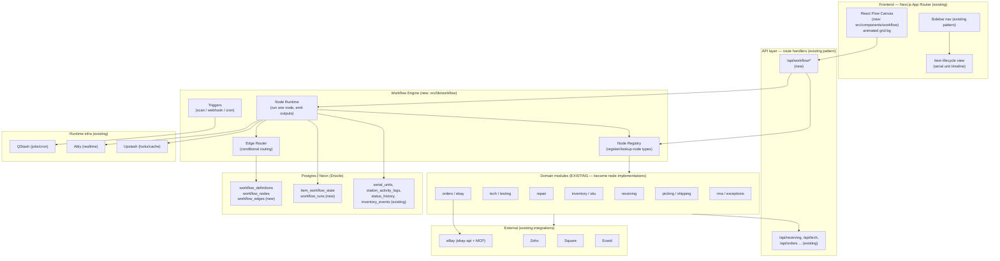
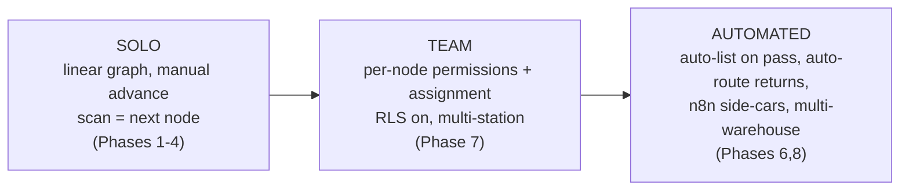

# Node-Based Operations Engine — Reference Architecture

> **Status:** Reference architecture (not yet a build ticket).
> **Scope:** Add a ComfyUI/n8n-style visual workflow layer on top of the **existing** USAV-Orders-Backend (Next.js 16 App Router + Drizzle/Neon), reusing the receiving / tech / repair / inventory / orders / shipping / RMA modules already in `src/lib/*`.
> **Audience:** Solo operator today → small team → automation-heavy later.

---

## 0. The one-paragraph thesis

You do **not** need NestJS, Prisma, Temporal, or a fresh repo. You already have a modular domain layer (`src/lib/receiving`, `tech`, `repair`, `inventory`, `orders`, `ebay`, `picking`, `shipping`, `rma`), a real item state machine (`serial_units` + `station_activity_logs` as the documented source-of-truth, with a JSON `status_history` trail), a job runtime (QStash + Upstash + pm2), realtime (Ably), multi-tenant plumbing (`src/lib/tenancy`), and even a worked example of an engine loop (`src/lib/pipeline/orchestrator.ts`). What is missing is three things, and only three:

1. **A graph definition layer** — data that says "node A connects to node B, and if the *fail* output fires, route to the Repair node." (New tables.)
2. **A uniform node contract** — a thin adapter that lets each existing domain module be *invoked the same way* by the engine. (New `src/lib/workflow/`.)
3. **A canvas UI** — React Flow (xyflow) drawing the graph and an item's live position in it. (New `src/components/workflow/`; React Flow is not yet a dependency.)

Everything else is wiring what you have into that shape. This document specifies those three pieces and the phased path to ship them MVP-first.

---

## 1. High-level architecture



**Reading guide:** the green path (UI → API → Engine → Domain → Data) is the only new vertical. The Domain, Data-core, Infra, and External boxes already exist and are reused as-is.

---

## 2. The Item state machine (you already have it)

The brief's "central Item entity that flows through states" is already real in your schema. The mapping:

| Brief concept | Your implementation |
|---|---|
| **Item** | `serial_units` (one physical unit) + `items` (catalog/SKU-level) |
| **Current state** | `station_activity_logs` (SAL) — documented in `ARCHITECTURE_PLAN.md` as the single source of truth; lifecycle stages like `TECH/SCANNED`, `PACK/READY`, `SHIP/SHIPPED` |
| **State transition history** | `status_history` JSON pattern (`src/lib/neon/status-history.ts`) + `serial_unit_condition_history` + `inventory_events` |
| **Events / side-effects** | `inventory_events`, `realtime:relay` outbox script, Ably |

What the node engine adds is **not a new state store** — it's a *pointer* into the existing one: "which node in the active workflow is this serial unit currently sitting at, and what's its run history." That's the only new state table:

```ts
// src/lib/drizzle/schema.ts  (additions)

export const itemWorkflowState = pgTable('item_workflow_state', {
  id: serial('id').primaryKey(),
  organizationId: uuid('organization_id').notNull(),     // tenancy-ready (RLS hook)
  serialUnitId: integer('serial_unit_id')
    .notNull()
    .references(() => serialUnits.id),
  workflowDefinitionId: integer('workflow_definition_id')
    .notNull()
    .references(() => workflowDefinitions.id),
  currentNodeId: text('current_node_id').notNull(),       // node id within the graph
  status: text('status').notNull().default('active'),     // active | blocked | done | error
  enteredNodeAt: timestamp('entered_node_at').defaultNow(),
  updatedAt: timestamp('updated_at').defaultNow(),
});
```

The state machine is **data-driven**, not code-driven: legal transitions are the *edges* of whichever workflow the operator drew. That is exactly what makes it a node graph rather than a hard-coded `switch`.

---

## 3. The Node Engine (the new core)

Modeled directly on your `src/lib/pipeline/` shape (a registry of stages, a runtime loop, typed results), but generalized so the "stages" are user-defined and connectable.

### 3.1 Folder layout (new)

```
src/lib/workflow/
  contract.ts          # NodeDefinition + NodeContext types (the plugin contract)
  registry.ts          # register() / get() / list() — in-memory node-type registry
  runtime.ts           # runNode(): executes one node, returns outputs
  router.ts            # given outputs + edges, resolve next node(s)
  triggers.ts          # scan / webhook / cron → enqueue workflow advance
  advance.ts           # the durable "move item from node N to node N+1" step
  nodes/               # built-in node implementations (thin adapters over src/lib/*)
    receiving.node.ts
    inspection.node.ts
    repair.node.ts
    listing.node.ts
    pricing.node.ts
    order.node.ts
    pack-ship.node.ts
    returns.node.ts
    conditional.node.ts   # pure routing node (no side effects)
  index.ts             # registerBuiltins() + public API
```

### 3.2 The node contract (this is the plugin system)

```ts
// src/lib/workflow/contract.ts
import type { OrgId } from '@/lib/tenancy/constants';

/** Everything a node can read/use while it runs. */
export interface NodeContext {
  orgId: OrgId;
  serialUnitId: number;
  /** Operator/automation that triggered this advance. */
  actor: { staffId: number | null; source: 'scan' | 'manual' | 'webhook' | 'cron' };
  /** Node config the user set in the canvas (port mappings, thresholds, etc.). */
  config: Record<string, unknown>;
  /** Free-form payload from the trigger (scanned barcode, webhook body…). */
  input: Record<string, unknown>;
  /** Helpers — already exist in your codebase, injected for testability. */
  db: typeof import('@/lib/drizzle/db').db;
  emit: (event: WorkflowEvent) => Promise<void>;   // → Ably + inventory_events
}

export interface NodeResult {
  /** Named output port that fired — drives conditional routing. */
  output: string;                 // e.g. 'pass' | 'fail' | 'done' | 'needs_repair'
  /** Data merged into the item's run context for downstream nodes. */
  data?: Record<string, unknown>;
  /** If true, item parks at this node awaiting a human/event (no auto-advance). */
  await?: boolean;
}

export interface NodeDefinition {
  type: string;                   // 'inspection', 'repair', 'pack_ship'...
  label: string;                  // shown on the canvas
  icon: string;                   // lucide icon name
  category: 'intake' | 'process' | 'fulfill' | 'logic' | 'custom';
  /** Declared output ports — the canvas draws one handle per port. */
  outputs: { id: string; label: string }[];
  /** JSON-schema-ish config the canvas renders as a form. */
  configSchema?: Record<string, unknown>;
  /** The actual work. Thin adapter over an existing src/lib/* module. */
  run(ctx: NodeContext): Promise<NodeResult>;
}

export interface WorkflowEvent {
  serialUnitId: number;
  nodeType: string;
  output: string;
  at: string;
}
```

### 3.3 The registry (register/lookup)

```ts
// src/lib/workflow/registry.ts
import type { NodeDefinition } from './contract';

const registry = new Map<string, NodeDefinition>();

export function registerNode(def: NodeDefinition) {
  if (registry.has(def.type)) throw new Error(`Node type already registered: ${def.type}`);
  registry.set(def.type, def);
}

export function getNode(type: string): NodeDefinition {
  const def = registry.get(type);
  if (!def) throw new Error(`Unknown node type: ${type}`);
  return def;
}

export const listNodes = (): NodeDefinition[] => [...registry.values()];
```

### 3.4 A node implementation = a thin adapter over an existing module

The whole point: nodes do **not** re-implement business logic. They call what you already shipped.

```ts
// src/lib/workflow/nodes/inspection.node.ts
import { registerNode } from '../registry';
import { recordTestResult } from '@/lib/tech';        // <-- your existing module
import type { NodeDefinition } from '../contract';

export const inspectionNode: NodeDefinition = {
  type: 'inspection',
  label: 'Inspection / Test',
  icon: 'ClipboardCheck',
  category: 'process',
  outputs: [
    { id: 'pass', label: 'Passed' },
    { id: 'fail', label: 'Failed → Repair' },
  ],
  configSchema: { passThreshold: { type: 'number', default: 1 } },
  async run(ctx) {
    // Reuse existing testing logic; engine only decides routing.
    const result = await recordTestResult({
      serialUnitId: ctx.serialUnitId,
      staffId: ctx.actor.staffId,
      input: ctx.input,
    });
    await ctx.emit({ serialUnitId: ctx.serialUnitId, nodeType: 'inspection', output: result.passed ? 'pass' : 'fail', at: new Date().toISOString() });
    return { output: result.passed ? 'pass' : 'fail', data: { testId: result.id } };
  },
};

registerNode(inspectionNode);
```

> The brief's "if inspection fails → route to Repair" is now a property of the **graph** (`fail` port → Repair node), not branching code. Re-wire it in the canvas, no deploy.

### 3.5 Runtime + router (the loop, mirroring `pipeline/orchestrator.ts`)

```ts
// src/lib/workflow/advance.ts (sketch)
import { getNode } from './registry';
import { resolveNext } from './router';
import { withTenantConnection } from '@/lib/tenancy/db';

export async function advanceItem(args: {
  orgId: OrgId; serialUnitId: number; trigger: NodeContext['input']; actor: NodeContext['actor'];
}) {
  return withTenantConnection(args.orgId, async () => {
    const state = await loadItemState(args.serialUnitId);          // item_workflow_state
    const node = getNode(state.currentNodeType);

    const result = await node.run(buildContext(args, state));       // do the work
    await appendRunLog(state, node.type, result);                   // workflow_runs

    if (result.await) return markBlocked(state);                    // park for human/event

    const next = resolveNext(state.workflowDefinitionId, state.currentNodeId, result.output);
    if (!next) return markDone(state);                              // terminal node
    return moveToNode(state, next);                                 // update pointer + emit
  });
}
```

`resolveNext` is pure data: look up the edge in `workflow_edges` whose `(sourceNode, sourcePort)` matches `(currentNode, result.output)`. Conditional routing falls out for free.

### 3.6 Graph definition tables (new)

```ts
export const workflowDefinitions = pgTable('workflow_definitions', {
  id: serial('id').primaryKey(),
  organizationId: uuid('organization_id').notNull(),
  name: text('name').notNull(),
  version: integer('version').notNull().default(1),
  isActive: boolean('is_active').notNull().default(false),
  createdAt: timestamp('created_at').defaultNow(),
});

export const workflowNodes = pgTable('workflow_nodes', {
  id: text('id').primaryKey(),                       // canvas node id (uuid)
  workflowDefinitionId: integer('workflow_definition_id').notNull(),
  type: text('type').notNull(),                      // registry key
  positionX: real('position_x').notNull(),           // React Flow coords
  positionY: real('position_y').notNull(),
  config: jsonb('config').notNull().default({}),
});

export const workflowEdges = pgTable('workflow_edges', {
  id: text('id').primaryKey(),
  workflowDefinitionId: integer('workflow_definition_id').notNull(),
  sourceNode: text('source_node').notNull(),
  sourcePort: text('source_port').notNull(),         // output port id → conditional routing
  targetNode: text('target_node').notNull(),
});

export const workflowRuns = pgTable('workflow_runs', {   // observability, mirrors pipeline_cycles
  id: serial('id').primaryKey(),
  organizationId: uuid('organization_id').notNull(),
  serialUnitId: integer('serial_unit_id').notNull(),
  nodeType: text('node_type').notNull(),
  output: text('output'),
  durationMs: integer('duration_ms'),
  error: text('error'),
  createdAt: timestamp('created_at').defaultNow(),
});
```

---

## 4. Frontend — React Flow canvas

React Flow (xyflow) is **not yet installed**. Add it:

```bash
npm i @xyflow/react
```

You already have `framer-motion`, `@dnd-kit`, `lucide-react`, and a design system (`src/design-system/primitives` — note the canonical `Button`). Reuse all of it; only the canvas is new.

```
src/components/workflow/
  WorkflowCanvas.tsx        # <ReactFlow> host + animated grid background
  nodes/OperationNode.tsx   # one component renders ALL node types (driven by registry meta)
  NodePalette.tsx           # draggable sidebar of node types (dnd-kit)
  ItemTracker.tsx           # overlay: live dot showing where a serial unit is on the graph
  useWorkflowGraph.ts       # TanStack Query: load/save workflow_definitions
```

### 4.1 Animated grid background

```tsx
// src/components/workflow/WorkflowCanvas.tsx
'use client';
import { ReactFlow, Background, BackgroundVariant, Controls, MiniMap } from '@xyflow/react';
import '@xyflow/react/dist/style.css';
import { OperationNode } from './nodes/OperationNode';

const nodeTypes = { operation: OperationNode };

export function WorkflowCanvas({ nodes, edges, onConnect, onNodesChange, onEdgesChange }) {
  return (
    <div className="h-full w-full">
      <ReactFlow
        nodes={nodes}
        edges={edges}
        nodeTypes={nodeTypes}
        onConnect={onConnect}
        onNodesChange={onNodesChange}
        onEdgesChange={onEdgesChange}
        fitView
        proOptions={{ hideAttribution: true }}
      >
        {/* Subtle animated 2026 grid: dotted layer + slow-drifting line layer */}
        <Background variant={BackgroundVariant.Dots} gap={24} size={1} className="opacity-40" />
        <Background
          variant={BackgroundVariant.Lines}
          gap={96}
          className="opacity-[0.06] animate-[gridDrift_40s_linear_infinite]"
        />
        <Controls showInteractive={false} />
        <MiniMap pannable zoomable />
      </ReactFlow>
    </div>
  );
}
```

```css
/* globals / tailwind layer */
@keyframes gridDrift { from { transform: translate(0,0); } to { transform: translate(96px,96px); } }
```

### 4.2 One node component, registry-driven (ComfyUI-style: big, icon-forward, minimal text)

```tsx
// src/components/workflow/nodes/OperationNode.tsx
'use client';
import { Handle, Position, type NodeProps } from '@xyflow/react';
import * as Icons from 'lucide-react';

export function OperationNode({ data }: NodeProps) {
  const Icon = (Icons as any)[data.icon] ?? Icons.Box;
  return (
    <div className="rounded-2xl border bg-card shadow-md w-52 overflow-hidden">
      <Handle type="target" position={Position.Left} />
      <div className="flex items-center gap-3 px-4 py-3">
        <Icon className="h-6 w-6 shrink-0" />
        <span className="text-base font-semibold">{data.label}</span>
      </div>
      {/* one source handle per declared output port → conditional routing visible */}
      <div className="border-t">
        {data.outputs.map((p: any, i: number) => (
          <div key={p.id} className="relative px-4 py-2 text-sm text-muted-foreground">
            {p.label}
            <Handle type="source" id={p.id} position={Position.Right}
              style={{ top: 14 + i * 32 }} />
          </div>
        ))}
      </div>
    </div>
  );
}
```

`data.icon`, `data.label`, and `data.outputs` come straight from the server's `listNodes()` registry response — **the canvas never hard-codes node types**, so a new plugin node appears in the palette automatically.

---

## 5. eBay & integrations — keep what you have, Nango optional

The brief recommends Nango.dev. You already run `ebay-api@9.4` plus a full eBay **MCP** server (hundreds of `ebay_*` tools) and existing `src/lib/orders-sync` + `src/lib/zoho` + Square/Ecwid adapters. **Recommendation: do not add Nango for eBay** — you'd be replacing a working, deeper integration with a shallower one and a new moving part.

Where Nango *would* earn its place: when you add the *next* marketplace (Reverb, Mercari, Shopify) and want one OAuth/connection abstraction instead of N bespoke clients. Model it as a node-level concern:

```ts
// src/lib/workflow/nodes/listing.node.ts (sketch)
import { createOrUpdateListing } from '@/lib/ebay';   // existing
export const listingNode: NodeDefinition = {
  type: 'listing', label: 'Create Listing', icon: 'Tag', category: 'fulfill',
  outputs: [{ id: 'listed', label: 'Listed' }, { id: 'error', label: 'Error' }],
  async run(ctx) {
    try { const r = await createOrUpdateListing(ctx.serialUnitId, ctx.config);
      return { output: 'listed', data: { offerId: r.offerId } }; }
    catch (e) { return { output: 'error', data: { message: String(e) } }; }
  },
};
```

The engine treats "list on eBay" and "list on Reverb" as two interchangeable node types behind one port contract — *that* is the modularity the brief wants, achieved without Nango being load-bearing on day one.

---

## 6. Orchestration: don't add Temporal or n8n (yet)

| Option | Verdict for you | Why |
|---|---|---|
| **Custom engine on QStash + Upstash locks** | ✅ **Recommended (MVP → team)** | You already use QStash for scheduling and Upstash for locks/cache; the `pipeline/` orchestrator proves the team can run a loop. Durable enough: each node advance is an idempotent, retryable QStash message keyed on `serialUnitId`. Zero new infra. |
| **BullMQ** | ⚠️ Later, if needed | Adds a Redis-backed queue with richer retry/visibility. Worth it only if QStash's HTTP model becomes a bottleneck (very high node-advance throughput). |
| **n8n (self-hosted)** | ⚠️ Adjacent, not core | Great for *external* glue (Gmail → Sheet → Slack) and for non-devs to automate around the system. **Do not** make your physical-item lifecycle depend on it — you lose typed access to your own domain modules and your DB transactions. Offer it as an optional "automation node" that calls an n8n webhook. |
| **Temporal** | ❌ Overkill now | Operationally heavy (separate cluster). Revisit only at the "automation-heavy, multi-warehouse" stage with long-running, multi-day sagas. |

**Durability model for the custom engine:** every `advanceItem` call is wrapped in `withTenantConnection` (you have this), writes `workflow_runs` before side-effects where possible, and is triggered by a QStash message that QStash will retry on non-2xx. Use an Upstash lock on `serialUnitId` so two scans can't double-advance the same unit.

---

## 7. Phased implementation plan (MVP-first)

Effort is rough dev-days for a solo dev familiar with this codebase.

### Phase 1 — Read-only graph of what already happens (≈3–5 days) ⭐ START HERE
- Add the 4 graph tables + `item_workflow_state` (`db:generate` → `db:migrate`).
- Build `src/lib/workflow/{contract,registry}.ts` and wrap **three** existing modules as nodes: `receiving`, `inspection`, `pack-ship`.
- Install React Flow; render a **hard-coded** linear graph (Receiving → Inspection → Listing → Pack/Ship) with the animated grid.
- **Deliverable:** the canvas *visualizes* your real flow. No editing yet. Immediate "wow," zero risk to operations.

### Phase 2 — Live item tracking (≈3–4 days)
- `ItemTracker` overlay: subscribe to Ably, animate a dot to the node a scanned serial unit just entered.
- Backfill `item_workflow_state` from the latest `station_activity_logs` row per unit.
- **Deliverable:** scan a unit on the floor → watch it move on the board in real time. This alone is a daily-driver tool.

### Phase 3 — Conditional routing engine (≈4–6 days)
- Implement `router.ts` + `advance.ts` + QStash trigger + Upstash lock.
- Wire `inspection.fail → repair`, `repair.done → inspection` (rework loop).
- Add `repair` + `returns` nodes.
- **Deliverable:** the graph now *drives* routing; failing inspection auto-parks the unit at Repair.

### Phase 4 — Editable canvas (≈5–7 days)
- Save/load `workflow_definitions` via `/api/workflow/*`; drag from `NodePalette`; connect ports; per-node config form from `configSchema`.
- Versioning + `isActive` (publish a new graph version without breaking in-flight items — they finish on their old version).
- **Deliverable:** operator rewires the flow with no deploy. This is the ComfyUI moment.

### Phase 5 — Templates & non-tech UX (≈3–4 days)
- Ship 2–3 prebuilt templates ("Standard refurb-and-list", "Test-only consignment", "Returns triage").
- Empty-state onboarding (use the `onboard` skill / existing design system).
- **Deliverable:** a new user picks a template and is running in minutes.

### Phase 6 — Plugin/custom nodes + automation hooks (≈4–6 days)
- Document the `NodeDefinition` contract as the public plugin API; allow registering nodes from a `src/lib/workflow/nodes/custom/` folder.
- Add an `n8n-webhook` node and a `conditional` (pure-logic) node.
- **Deliverable:** extensibility for devs; automation glue for power users.

### Phase 7 — Team mode (≈3–5 days, pull forward if you hire)
- Per-node permissions via existing `permission-registry`; activate the `organization_id`/RLS path that `src/lib/tenancy` already stubs.
- Assignment: which staff/station owns which node (you have `staff_stations`, `work_assignments`).

### Phase 8 — Analytics & compression (≈ongoing)
- Throughput/bottleneck dashboard from `workflow_runs` (time-in-node, fail rates).
- "Compress nodes": merge low-value adjacent nodes; the brief's "introspective, combine as you grow."

---

## 8. Pre-built builder evaluation (Appsmith / ToolJet / Budibase / custom)

| Tool | Self-hosted | Visual node graph | Fit here |
|---|---|---|---|
| **Custom React + React Flow** | ✅ (already your stack) | ✅ purpose-built | ✅ **Recommended for the canvas.** Full control, lives in your repo, typed access to your DB/modules, your design system. |
| Appsmith | ✅ | ❌ (form/CRUD builder, not a graph editor) | Internal admin CRUD screens only. You're already building those via your CRUD initiative — not needed. |
| ToolJet | ✅ | ❌ (similar to Appsmith) | Same as above. |
| Budibase | ✅ | ❌ | Same. |
| n8n | ✅ | ✅ (but for *integration* flows) | **Hybrid:** use as an optional automation node, not the core engine (see §6). |

**Recommendation:** *Custom React + React Flow for the operations canvas; n8n self-hosted as an optional side-car for external automations.* The CRUD-style builders solve a problem you've already solved in-house and don't give you a node graph.

---

## 9. Scaling: solo → team → automated



- **Solo:** one active workflow, mostly manual advance (scan to move). Minimal permissions. Everything visible on one board.
- **Team:** flip on `organization_id` + RLS (plumbing exists), attach `permission-registry` checks per node, assign nodes to stations/staff. Multiple concurrent workflows.
- **Automated:** nodes that self-advance (inspection auto-routes, listing auto-publishes on pass), n8n glue for external systems, analytics-driven node compression. Same engine, more nodes flipped from `await: true` to autonomous.

---

## 10. What you can do with this document right now

Concrete, in priority order:

1. **Decide the engine bet** — confirm "custom engine on QStash/Upstash, React Flow canvas, no NestJS/Temporal/Nango-core." (This doc argues for it; §6 is the crux.)
2. **Phase 1 is a safe spike** — it only *reads* existing data and adds tables nothing else depends on. You can build the visualization board without touching a single operational code path. That's the lowest-risk way to prove the concept on your real floor.
3. **Reuse, don't rebuild** — every node is a ~30-line adapter over an existing `src/lib/*` function. If you find yourself reimplementing receiving/tech/shipping logic inside a node, stop: call the existing module.
4. **The graph is the product** — once Phase 4 lands, the differentiator is that a non-technical owner *rewires their own operation* without you. Optimize the canvas UX (templates, big icons, live item dots) over backend cleverness.

### Open decisions to make before building
- **One workflow or many?** MVP: a single active workflow per org is simplest. Multiple (e.g. "electronics" vs "consignment") is a Phase 4+ generalization the schema already allows.
- **Manual vs auto advance default** — recommend manual (scan-driven) for MVP; it matches how the floor already works and de-risks the engine.
- **Where the canvas lives** — suggest a new `/operations` or `/workflow` route (you have an `src/app/operations` already — likely the natural home).

---

*Generated as a reference architecture for USAV-Orders-Backend. No code in `src/` was modified.*
