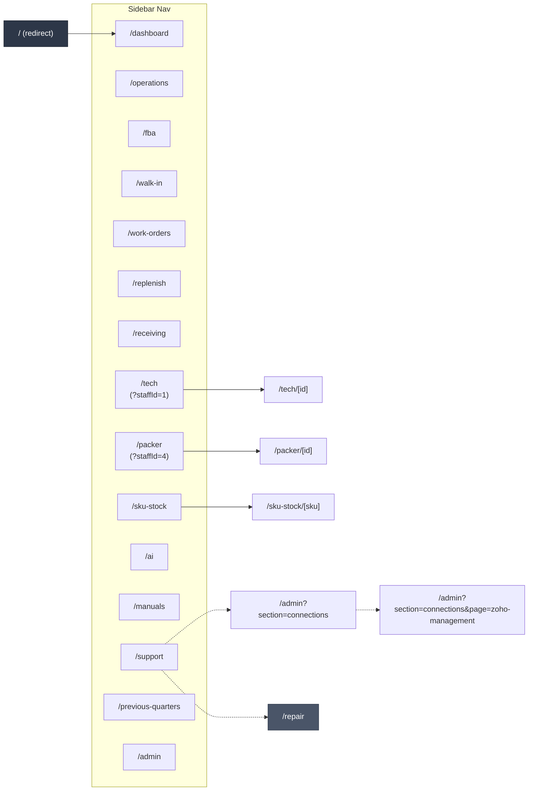

# 01 — Pages & Navigation

All user-facing pages under `src/app/**` and the primary sidebar links that connect them. The root `/` redirects to `/dashboard`.

## Routes at a glance

| Route | File | Dynamic? |
|---|---|---|
| `/` | `src/app/page.tsx` | — |
| `/admin` | `src/app/admin/page.tsx` | query-param driven |
| `/ai` | `src/app/ai/page.tsx` | — |
| `/dashboard` | `src/app/dashboard/page.tsx` | — |
| `/fba` | `src/app/fba/page.tsx` | — |
| `/manuals` | `src/app/manuals/page.tsx` | — |
| `/operations` | `src/app/operations/page.tsx` | — |
| `/packer` | `src/app/packer/page.tsx` | — |
| `/packer/[id]` | `src/app/packer/[id]/page.tsx` | ✓ |
| `/previous-quarters` | `src/app/previous-quarters/page.tsx` | — |
| `/receiving` | `src/app/receiving/page.tsx` | — |
| `/repair` | `src/app/repair/page.tsx` | — |
| `/replenish` | `src/app/replenish/page.tsx` | — |
| `/sku-stock` | `src/app/sku-stock/page.tsx` | — |
| `/sku-stock/[sku]` | `src/app/sku-stock/[sku]/page.tsx` | ✓ |
| `/support` | `src/app/support/page.tsx` | — |
| `/tech` | `src/app/tech/page.tsx` | — |
| `/tech/[id]` | `src/app/tech/[id]/page.tsx` | ✓ |
| `/walk-in` | `src/app/walk-in/page.tsx` | — |
| `/work-orders` | `src/app/work-orders/page.tsx` | — |
