# 02 — API Surface

```mermaid
graph TB
    subgraph ORDERS[Orders 18]
        OA[/"/api/orders (GET)"/]
        OB[/"add · assign · start · skip · delete"/]
        OC[/"recent · next · verify"/]
        OD[/"backfill/{ebay,ecwid}"/]
        OE[/"integrity-check · missing-parts · check-shipped · set-item-number"/]
    end

    subgraph FBA[FBA 36]
        FA[/"/api/fba/board"/]
        FB[/"fnskus · fnskus/bulk · fnskus/search · fnskus/validate"/]
        FC[/"items/{queue,ready,scan,verify}"/]
        FD[/"shipments CRUD + /items + /tracking"/]
        FE[/"shipments/{today,active-with-details,close,mark-shipped,split-for-paired-review}"/]
        FF[/"labels/bind · logs · print-queue · scan-fnsku · stage-counts"/]
    end

    subgraph SKU[SKU & Catalog 27]
        SA[/"/api/sku · sku-stock · sku-manager"/]
        SB[/"sku-catalog CRUD"/]
        SC[/"sku-catalog/{pair,pair-ecwid,pair-suggestions,unpaired,unpaired-ecwid}"/]
        SD[/"sku-catalog/{search,sync-ecwid-products,sync-ecwid-titles}"/]
        SE[/"sku/{by-tracking,lookup,serials-from-code,photos}"/]
    end

    subgraph RECV[Receiving 10]
        RA[/"receiving-entry · lines · logs · photos · tasks"/]
        RB[/"lookup-po · mark-received · match · pending-unboxing · scan-serial · serials"/]
    end

    subgraph TECH[Tech 15]
        TA[/"/api/tech/scan* (sku/tracking/fnsku/repair-station)"/]
        TB[/"serial · add-serial · update-serials · undo-last · delete*"/]
        TC[/"tech-logs · tech-logs/search · tech-logs/update"/]
    end

    subgraph REPAIR[Repair 11]
        RPA[/"repair/{customers,search,issues,submit,square-payment-link}"/]
        RPB[/"repair/{ecwid-categories,ecwid-products}"/]
        RPC[/"repair-service/{next,pickup,repaired,out-of-stock,start,document}"/]
    end

    subgraph AI[AI 8]
        AA[/"/api/ai/openclaw-{chat,session,health}"/]
        AB[/"chat-sessions + /messages"/]
        AC[/"search · tunnel-session · health"/]
    end

    subgraph PACK[Packing 8]
        PA[/"packerlogs · packing-logs"/]
        PB[/"packing-logs/{details,last-order,photos,save-photo,start-session,update}"/]
    end

    subgraph WALKIN[Walk-In 8]
        WA[/"catalog · categories · customers · orders · sales · status · sync"/]
        WB[/"terminal/{checkout,devices}"/]
    end

    subgraph ZOHO[Zoho 11]
        ZA[/"health · oauth/{authorize,callback} · refresh-token"/]
        ZB[/"items/sync · orders/ingest · warehouses"/]
        ZC[/"purchase-orders CRUD + /receive + /sync"/]
        ZD[/"purchase-receives CRUD + /import + /sync"/]
    end

    subgraph EBAY[eBay 5]
        EA[/"accounts · sync · search · refresh-token · refresh-tokens"/]
    end

    subgraph QSTASH[QStash Jobs 10]
        QA[/"cleanup/idempotency"/]
        QB[/"ebay/{sync,refresh-tokens}"/]
        QC[/"google-sheets/transfer-orders"/]
        QD[/"replenishment/sync"/]
        QE[/"shipping/sync-due"/]
        QF[/"staff-goals/history"/]
        QG[/"zoho/{items/sync,orders/ingest}"/]
        QH[/"schedules/bootstrap"/]
    end

    subgraph WEBHOOK[Webhooks 3]
        WH1[/"webhooks/realtime-db"/]
        WH2[/"webhooks/square"/]
        WH3[/"webhooks/ups"/]
    end

    subgraph ADMIN[Admin 9]
        ADA[/"features CRUD"/]
        ADB[/"fba-fnskus CRUD + /upload"/]
        ADC[/"logs · qstash-status · fix-status"/]
    end

    subgraph STAFF[Staff 9]
        STA[/"/api/staff CRUD"/]
        STB[/"availability-rules · availability-today"/]
        STC[/"schedule · schedule/week · schedule/bulk · schedule/week/copy"/]
        STD[/"staff-goals + /history"/]
    end

    subgraph SHIP[Shipped & Tracking 10]
        SH1[/"shipped + /[id] + search + submit + lookup-order + debug"/]
        SH2[/"shipping/track/{[id],register,sync-due,sync-one}"/]
        SH3[/"scan-tracking · check-tracking · debug-tracking"/]
    end

    subgraph MISC[Cross-cutting]
        MA[/"activity/feed"/]
        MB[/"assignments + /next + /sku-search"/]
        MC[/"dashboard/{fba-shipments,operations} · operations/kpi-table"/]
        MD[/"ecwid · ecwid-square · google-sheets"/]
        ME[/"favorites · locations · need-to-order"/]
        MF[/"manuals · manual-server · product-manuals"/]
        MG[/"local-pickups · local-pickup-orders"/]
        MH[/"pipeline/{feedback,promote,status,trigger}"/]
        MI[/"realtime/token · replenish · work-orders"/]
        MJ[/"support/overview · db · setup-db · drizzle-setup · test-db"/]
    end

    WEBHOOK -->|triggers| ORDERS
    WEBHOOK -->|triggers| SHIP
    QSTASH -->|cron drives| ORDERS
    QSTASH -->|cron drives| ZOHO
    QSTASH -->|cron drives| EBAY
    QSTASH -->|cron drives| SHIP
```

All 264 API routes grouped by feature. Methods shown where known. Sub-routes collapsed into representative groups for readability — drill into `src/app/api/<area>/` for full detail.

Total: **264 routes** across ~45 feature areas. File-backed source: `src/app/api/**/route.ts`.
