# 04 — Feature Map

High-level view: each feature area, its pages, and its rough API footprint. Good for architecture conversations and scoping.

```mermaid
graph TB
    subgraph UI[User-facing pages 20]
        direction TB
        P_DASH["/dashboard"]
        P_OPS["/operations"]
        P_FBA["/fba"]
        P_WI["/walk-in"]
        P_WO["/work-orders"]
        P_REPL["/replenish"]
        P_RECV["/receiving"]
        P_TECH["/tech + /tech/[id]"]
        P_PACK["/packer + /packer/[id]"]
        P_SKU["/sku-stock + /sku-stock/[sku]"]
        P_AI["/ai"]
        P_MAN["/manuals"]
        P_REPAIR["/repair"]
        P_SUP["/support"]
        P_PQ["/previous-quarters"]
        P_ADM["/admin"]
    end

    subgraph BACKEND[API feature areas 264 routes]
        direction TB
        A_FBA["FBA<br/>36 routes"]
        A_SKU["SKU & Catalog<br/>27 routes"]
        A_ORD["Orders<br/>18 routes"]
        A_TECH["Tech<br/>15 routes"]
        A_REPAIR["Repair<br/>11 routes"]
        A_ZOHO["Zoho<br/>11 routes"]
        A_SHIP["Shipping<br/>10 routes"]
        A_RECV["Receiving<br/>10 routes"]
        A_QST["QStash (cron)<br/>10 routes"]
        A_STAFF["Staff<br/>9 routes"]
        A_ADM["Admin<br/>9 routes"]
        A_PACK["Packing<br/>8 routes"]
        A_WI["Walk-In<br/>8 routes"]
        A_AI["AI<br/>8 routes"]
        A_EBAY["eBay<br/>5 routes"]
        A_WH["Webhooks<br/>3 routes"]
        A_MISC["Cross-cutting<br/>~56 routes"]
    end

    subgraph EXT[External systems]
        E_NEON[("Neon<br/>Postgres")]
        E_ZOHO[Zoho Inventory]
        E_EBAY[eBay API]
        E_ECWID[Ecwid]
        E_SQUARE[Square]
        E_UPS[UPS]
        E_SHEETS[Google Sheets]
        E_QSTASH[Upstash QStash]
        E_AI[OpenClaw / AI providers]
    end

    P_DASH --> A_ORD
    P_DASH --> A_SHIP
    P_DASH --> A_STAFF
    P_FBA --> A_FBA
    P_FBA --> A_SKU
    P_RECV --> A_RECV
    P_RECV --> A_ZOHO
    P_TECH --> A_TECH
    P_TECH --> A_SKU
    P_PACK --> A_PACK
    P_PACK --> A_ORD
    P_REPAIR --> A_REPAIR
    P_REPL --> A_SHIP
    P_REPL --> A_MISC
    P_SKU --> A_SKU
    P_AI --> A_AI
    P_MAN --> A_SKU
    P_WI --> A_WI
    P_WO --> A_MISC
    P_ADM --> A_ADM
    P_ADM --> A_ZOHO
    P_ADM --> A_EBAY

    A_FBA --> E_NEON
    A_SKU --> E_NEON
    A_ORD --> E_NEON
    A_TECH --> E_NEON
    A_RECV --> E_NEON
    A_PACK --> E_NEON
    A_STAFF --> E_NEON

    A_ZOHO --> E_ZOHO
    A_EBAY --> E_EBAY
    A_REPAIR --> E_ECWID
    A_REPAIR --> E_SQUARE
    A_WI --> E_SQUARE
    A_SHIP --> E_UPS
    A_MISC --> E_SHEETS
    A_AI --> E_AI

    E_QSTASH -.->|schedule| A_QST
    A_QST -.->|calls| A_ORD
    A_QST -.->|calls| A_ZOHO
    A_QST -.->|calls| A_EBAY
    A_QST -.->|calls| A_SHIP

    E_UPS -.->|webhook| A_WH
    E_SQUARE -.->|webhook| A_WH
    E_NEON -.->|realtime| A_WH
```

## Legend

- **Solid arrows** — direct HTTP calls from UI or between route handlers.
- **Dashed arrows** — async / event-driven (cron jobs, webhooks).
- Route counts come from scanning `src/app/api/**/route.ts` on 2026-04-14.
