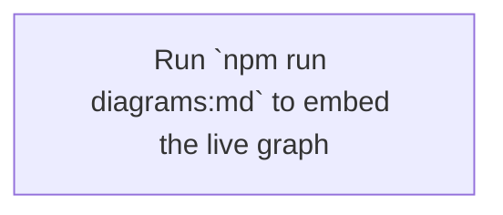

# 05 — Module Dependency Graph (auto-generated)

This diagram is regenerated from the actual import graph under `src/**` by [dependency-cruiser](https://github.com/sverweij/dependency-cruiser). **Do not edit by hand** — it gets overwritten.

- **Source of truth:** `src/**` imports
- **Generated by:** `npm run diagrams:modules` (writes `05-module-graph.mmd`)
- **Config:** `.dependency-cruiser.cjs`
- **Collapsed at:** `src/{app,components,lib,domain,hooks,utils,server,services}/<top-level-folder>` — so you see folder-to-folder edges instead of 1000+ file nodes.

## To view

Paste the contents of [`05-module-graph.mmd`](./05-module-graph.mmd) into <https://mermaid.live>, or include it inline here:

## Refresh commands

| Command | What it does |
|---|---|
| `npm run diagrams` | Alias for `diagrams:modules` |
| `npm run diagrams:modules` | Writes raw Mermaid to `05-module-graph.mmd` |
| `npm run diagrams:md` | Writes Mermaid into a standalone `.md` (GitHub renders inline) |
| `npm run diagrams:archi` | High-level architecture graph (DOT format — render with Graphviz) |
| `npm run diagrams:html` | Interactive clickable HTML report → `dep-report.html` |
| `npm run diagrams:check` | Runs the lint rules (circular deps, orphans, no-test-imports) — exit non-zero on errors |
