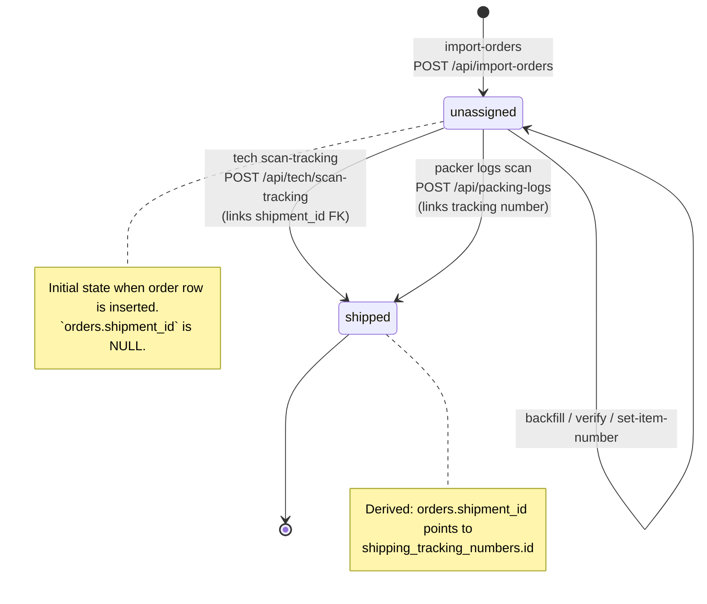
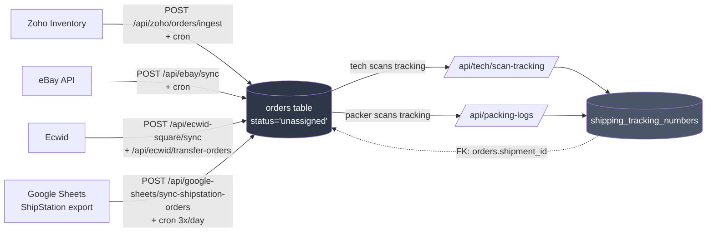

# 06 — Order Lifecycle

How an order moves from import to shipped. Explicit `pending` / `assigned` / `in_progress` states were removed on 2026-02-05 — assignment is now implicit via tech scanning tracking.

## State diagram

## Ingestion sources

## Key transitions (code citations)

| Transition | Endpoint | File |
|---|---|---|
| Insert `unassigned` | `POST /api/import-orders` | `src/app/api/import-orders/route.ts` |
| Link tracking (→ shipped) | `POST /api/tech/scan-tracking` → delegates to `/api/tech/scan` | `src/app/api/tech/scan-tracking/route.ts:1-22` |
| Link tracking (→ shipped) | `POST /api/packing-logs` | `src/app/api/packing-logs/route.ts:126-200+` |
| Deprecated assignment | `POST /api/orders/start` | `src/app/api/orders/start/route.ts:1-37` (no-op) |

## Gotchas

- No enum constraint — `orders.status` is a plain text column. New status strings won't be type-checked.
- `status_history` (jsonb) on `orders` records audit trail, but is not required for transitions to happen.
- An order with a linked `shipment_id` is considered shipped regardless of `status` column value.
