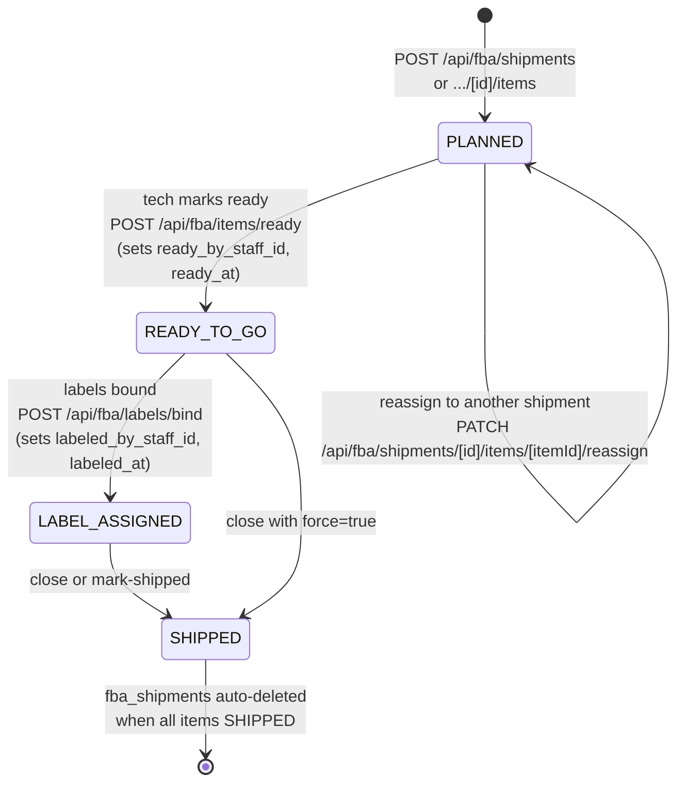
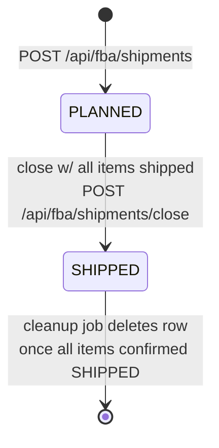
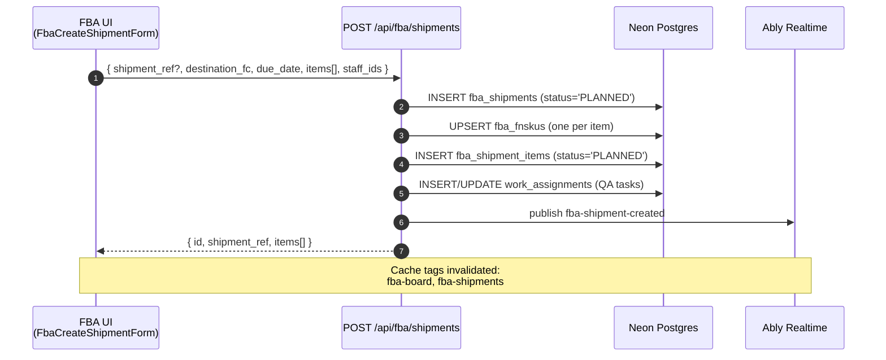
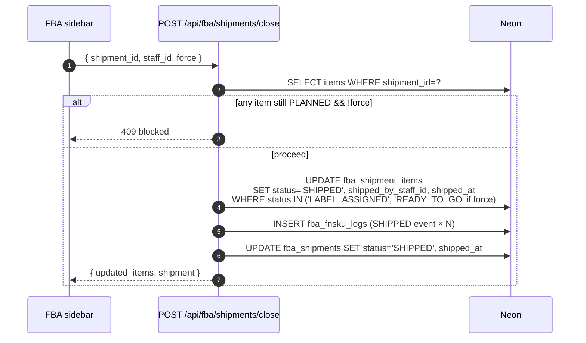
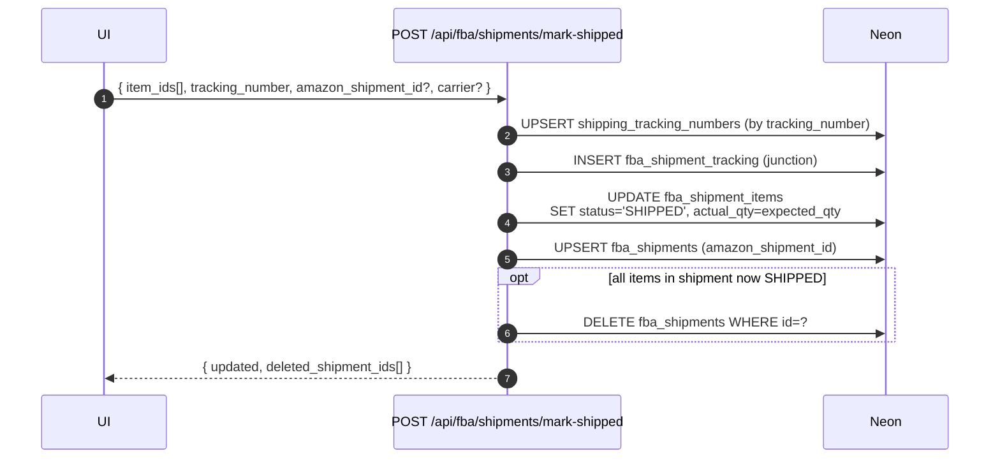

# 07 — FBA Shipment Flow

Creation through close, with item-level state machine. Items and shipments have separate status enums.

## Item state machine (fba_shipment_items.status)

## Shipment state machine (fba_shipments.status)

## Creation sequence

## Close flow

## Mark-shipped flow (bulk + tracking)

## Key files

| Flow | File |
|---|---|
| Create | `src/app/api/fba/shipments/route.ts:163-300+` |
| Close | `src/app/api/fba/shipments/close/route.ts:5-133` |
| Mark shipped | `src/app/api/fba/shipments/mark-shipped/route.ts:25-157` |
| Item reassign | `src/app/api/fba/shipments/[id]/items/[itemId]/reassign/route.ts` |
| Schema | `src/lib/drizzle/schema.ts:879-929` |

## Staff tracking on each item

Every transition records which staff member did it:
- `ready_by_staff_id` → tech who marked READY_TO_GO
- `verified_by_staff_id` → QA verifier
- `labeled_by_staff_id` → person who bound Amazon labels
- `shipped_by_staff_id` → final packer on close
