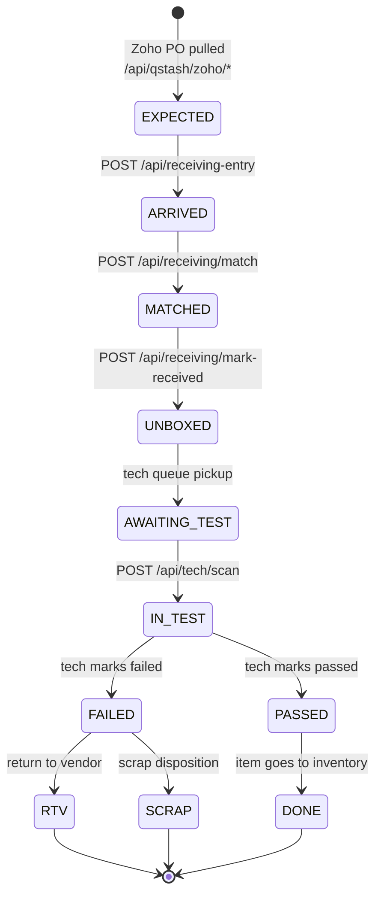
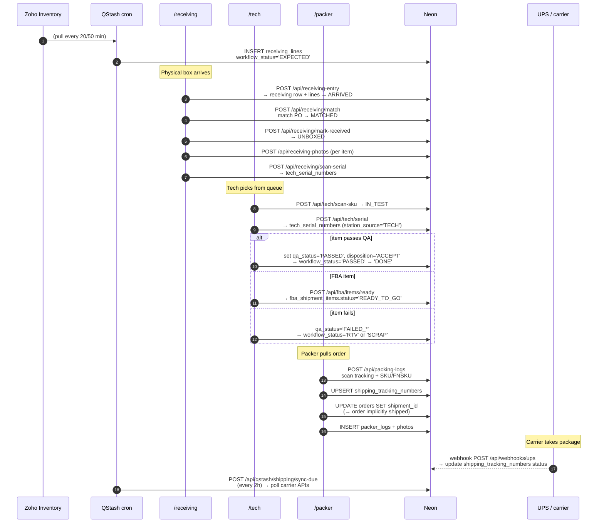
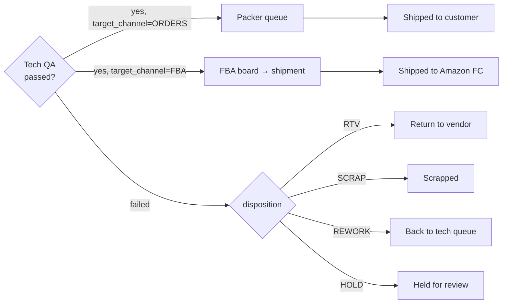

# 08 — Physical Item Pipeline

The end-to-end journey of a physical item through the warehouse: **Receiving → Tech → Packing → Shipped**.

## receiving_lines.workflow_status state machine

## End-to-end sequence

## Enums referenced

| Column | Values |
|---|---|
| `receiving_lines.workflow_status` | EXPECTED, ARRIVED, MATCHED, UNBOXED, AWAITING_TEST, IN_TEST, PASSED, FAILED, RTV, SCRAP, DONE |
| `receiving.qa_status` / `receiving_lines.qa_status` | PENDING, PASSED, FAILED_DAMAGED, FAILED_INCOMPLETE, FAILED_FUNCTIONAL, HOLD |
| `disposition_code` | ACCEPT, HOLD, RTV, SCRAP, REWORK |
| `condition_grade` | BRAND_NEW, USED_A, USED_B, USED_C, PARTS |
| `return_platform` | AMZ, EBAY_DRAGONH, EBAY_USAV, EBAY_MK, FBA, WALMART, ECWID |
| `target_channel` | ORDERS, FBA |
| `work_assignments.status` | OPEN, ASSIGNED, IN_PROGRESS, DONE, CANCELED |
| `work_assignments.entity_type` | ORDER, REPAIR, FBA_SHIPMENT, RECEIVING, SKU_STOCK |
| `work_assignments.work_type` | TEST, PACK, REPAIR, QA, RECEIVE, STOCK_REPLENISH |

## Fork points

The physical item can branch into three destinations after tech testing:

## Key files

| Stage | File |
|---|---|
| Receiving entry | `src/app/api/receiving-entry/route.ts` |
| Match PO | `src/app/api/receiving/match/route.ts` |
| Mark received | `src/app/api/receiving/mark-received/route.ts:7-131` |
| Scan serial | `src/app/api/receiving/scan-serial/route.ts` |
| Tech scan | `src/app/api/tech/scan/route.ts` (hub), `src/app/api/tech/scan-tracking/route.ts:1-22` |
| FBA ready | `src/app/api/fba/items/ready/route.ts` |
| Packing log | `src/app/api/packing-logs/route.ts:126-200+` |
| Carrier sync | `src/app/api/qstash/shipping/sync-due/route.ts` |
