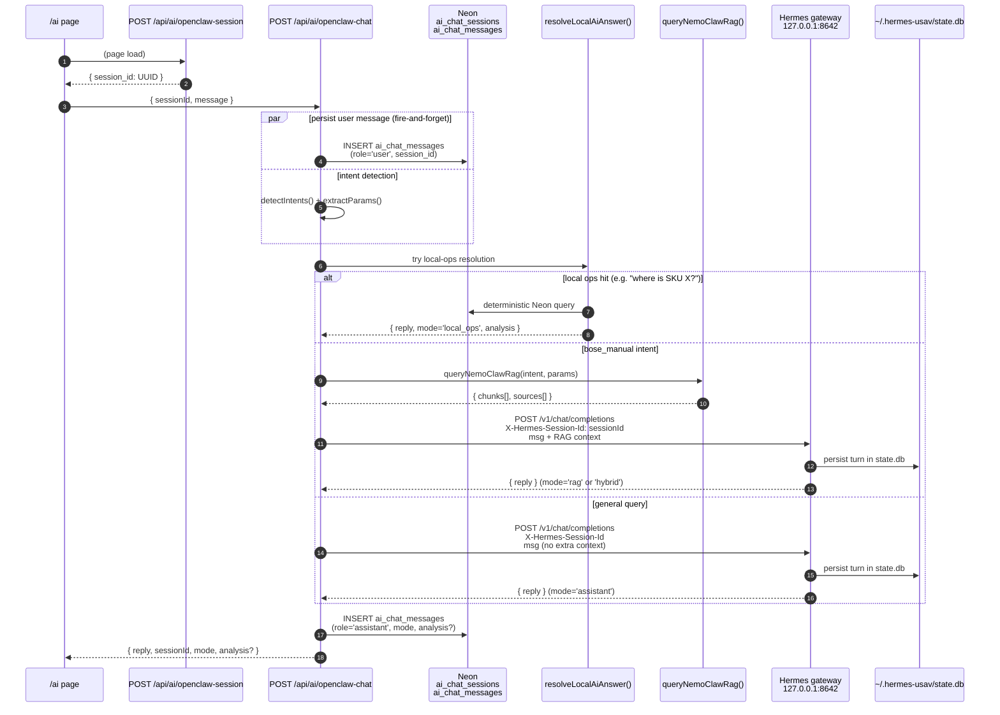
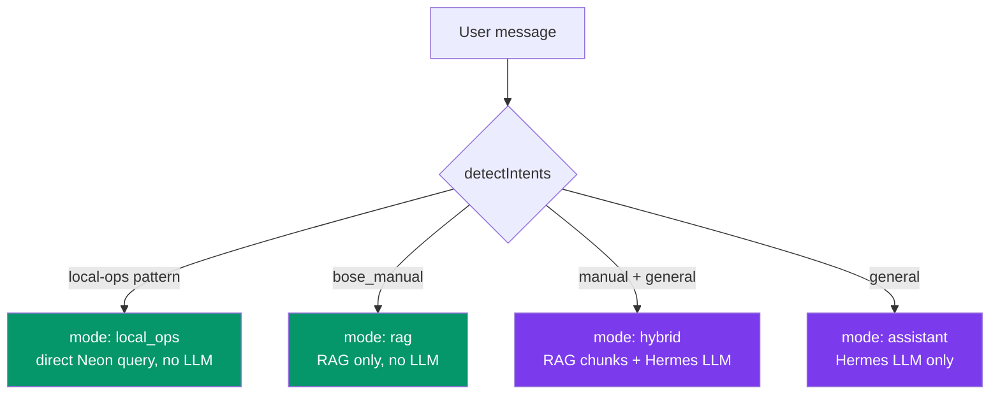

# 09 — AI Chat Flow (Hermes-backed)

The `/ai` page talks to a local Hermes gateway at `127.0.0.1:8642`. Three resolution paths — local-ops → NemoClaw RAG → Hermes LLM — are tried in sequence.

## End-to-end sequence



## Resolution modes (returned as `mode` field)



Green = no LLM round-trip (fastest). Purple = Hermes invoked.

## Rate limiting & config

- **Rate limit:** 25 requests / 60s per IP. Env override: `AI_CHAT_RATE_LIMIT`.
- **Hermes endpoint:** `HERMES_URL` env (default `http://127.0.0.1:8642/v1/chat/completions`).
- **Session header:** `X-Hermes-Session-Id` — Hermes uses this to key its own conversation cache in `state.db`.
- **Model:** `hermes-agent` (NousResearch's Hermes, OpenAI-compatible server).

## Persistence

| Store | Purpose |
|---|---|
| `ai_chat_sessions` (Neon) | Session index — id (text, client UUID), title, timestamps |
| `ai_chat_messages` (Neon) | Full transcript — role, content, mode, analysis (jsonb) |
| `~/.hermes-usav/state.db` (SQLite, local) | Hermes's own short-term conversational memory keyed by session_id |

Dual persistence is intentional: Neon is the **system of record** (survives restarts, queryable from UI). Hermes's state.db is an **ephemeral cache** so the LLM keeps context across turns without re-reading Neon.

## Fetching history

```mermaid
graph LR
    UI[/ai sidebar]
    UI -->|list recent| L[GET /api/ai/chat-sessions<br/>returns 30 most recent]
    UI -->|open session| M[GET /api/ai/chat-sessions/&#91;sessionId&#93;/messages<br/>ordered by createdAt ASC]
    UI -->|delete| D[DELETE /api/ai/chat-sessions?id=...]
```

## Deprecated

`POST /api/ai/tunnel-session` — route retained for compatibility only. Hermes replaced the tunnel model. Comment: `src/app/api/ai/openclaw-chat/route.ts:1-5`.

## Key files

| Area | File |
|---|---|
| Chat orchestrator | `src/app/api/ai/openclaw-chat/route.ts:27-229` |
| Session create | `src/app/api/ai/openclaw-session/route.ts:11-13` |
| Schema | `src/lib/drizzle/schema.ts:1278-1298` |
| Session list/delete | `src/app/api/ai/chat-sessions/route.ts` |
| Session messages | `src/app/api/ai/chat-sessions/[sessionId]/messages/route.ts` |
