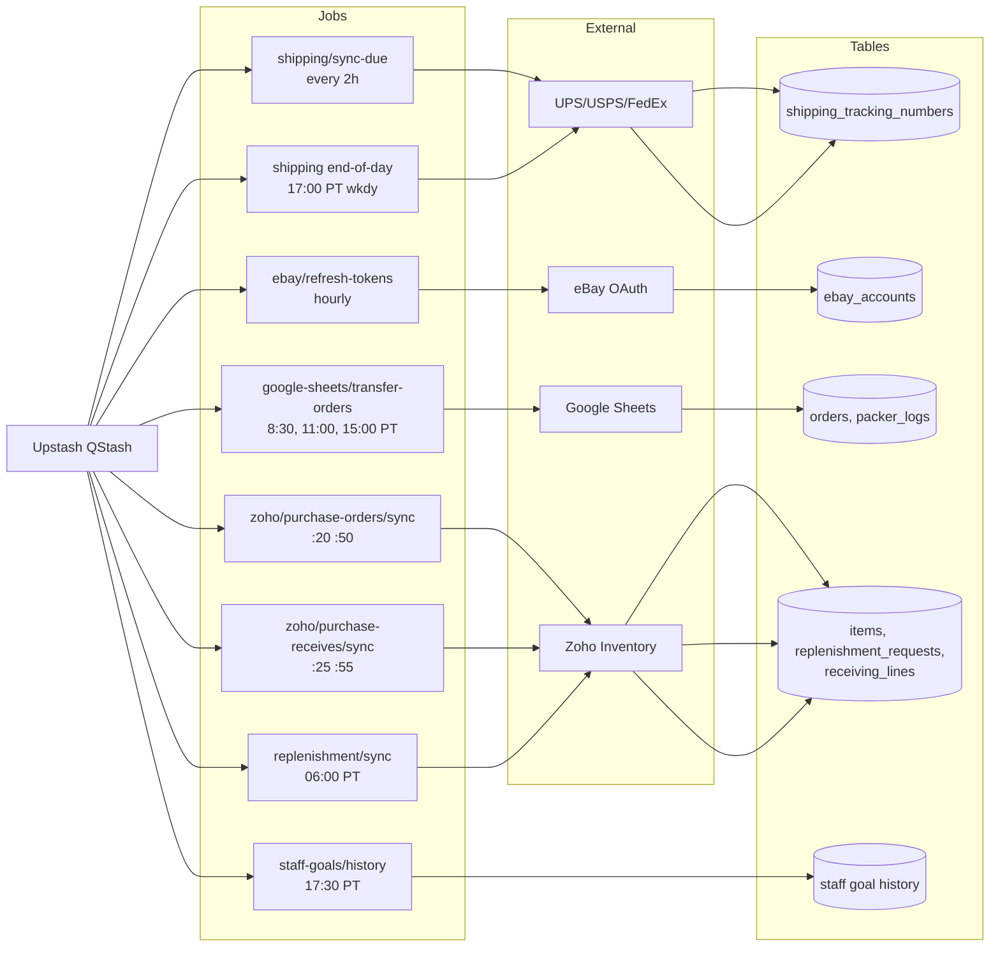
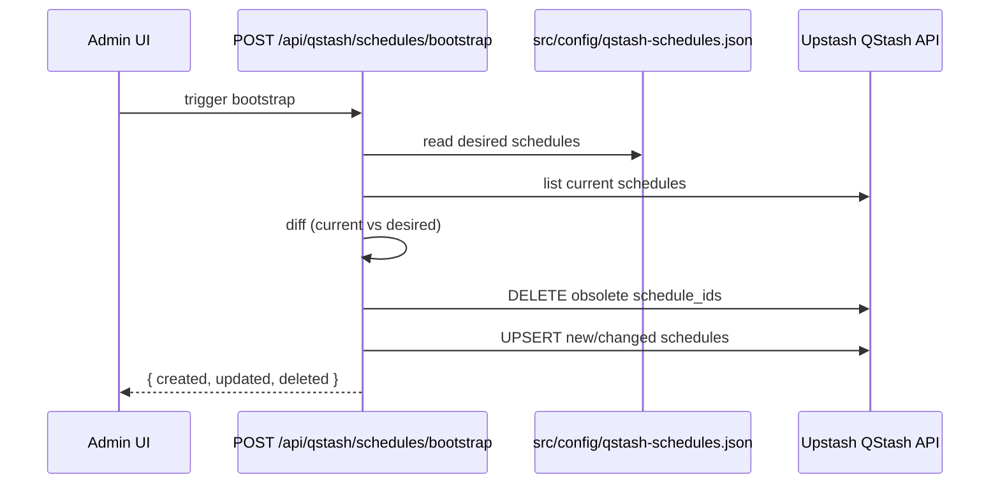

# 10 — QStash Cron Jobs

10 scheduled jobs driven by Upstash QStash. All schedules are declared in `src/config/qstash-schedules.json` and reconciled via `POST /api/qstash/schedules/bootstrap`.

## Schedule overview

```mermaid
gantt
    title QStash Daily Timeline (Pacific)
    dateFormat HH:mm
    axisFormat %H:%M

    section Shipping
    sync-due (every 2h)           :active, 00:00, 1440m
    full carrier sync (weekdays)  :crit, 17:00, 30m

    section eBay
    refresh tokens (hourly)       :active, 00:00, 1440m

    section Zoho
    POs (×2 / hour at :20 :50)    :active, 00:20, 1440m
    Receives (×2 / hr at :25 :55) :active, 00:25, 1440m

    section Staff
    goal history snapshot         :crit, 17:30, 5m

    section Replenishment
    daily low-stock scan          :crit, 06:00, 30m

    section Sheets
    transfer orders (8:30)        :crit, 08:30, 10m
    transfer orders (11:00)       :crit, 11:00, 10m
    transfer orders (15:00)       :crit, 15:00, 10m
```

## Jobs → data flow

## Full schedule table

| Name | Cron | Route | Timeout | Retries | Notes |
|---|---|---|---|---|---|
| shipping-sync-due-every-2h | `0 */2 * * *` | `/api/qstash/shipping/sync-due` | 180s | 3 | UPS/USPS/FedEx delta poll |
| ebay-refresh-tokens-hourly | `0 * * * *` | `/api/qstash/ebay/refresh-tokens` | 60s | 3 | OAuth token refresh |
| google-sheets-transfer-orders-0830-pt | `30 8 * * 1-5` (PT) | `/api/qstash/google-sheets/transfer-orders` | 300s | 3 | ShipStation → orders sync |
| google-sheets-transfer-orders-1100-pt | `0 11 * * 1-5` (PT) | same | 300s | 3 | Midday run |
| google-sheets-transfer-orders-1500-pt | `0 15 * * 1-5` (PT) | same | 300s | 3 | Afternoon run |
| zoho-purchase-orders-half-hour | `20,50 * * * *` | `/api/zoho/purchase-orders/sync` | 300s | 3 | Pull POs 2 days back |
| zoho-purchase-receives-half-hour | `25,55 * * * *` | `/api/zoho/purchase-receives/sync` | 300s | 3 | Pull receipts |
| staff-goal-history-nightly-pt | `30 17 * * *` (PT) | `/api/qstash/staff-goals/history` | 120s | 3 | Daily snapshot |
| replenishment-sync-daily-6am-pt | `0 6 * * *` (PT) | `/api/qstash/replenishment/sync` | 300s | 3 | Detect low stock, plan POs |
| shipping-sync-all-5pm-weekdays-pt | `0 17 * * 1-5` (PT) | `/api/qstash/shipping/sync-due` | 300s | 3 | EOD full sweep, concurrency=8 |

## Bootstrap flow

## Key files

| File | Purpose |
|---|---|
| `src/config/qstash-schedules.json` | Source of truth for schedule config |
| `src/app/api/qstash/schedules/bootstrap/route.ts:22-61` | Reconciles config with QStash |
| `scripts/sync-qstash-schedules.js` | CLI equivalent (`npm run qstash:sync`) |
| `src/app/api/qstash/*/route.ts` | Individual job handlers |
