# 11 — Entity Relationship (Core Business Tables)

Drizzle schema at `src/lib/drizzle/schema.ts`. Only the core business tables are shown — auth, cache, feature-flag, and audit tables are omitted for readability.

```mermaid
erDiagram
    staff ||--o{ orders : "imports/handles"
    staff ||--o{ fba_shipments : "created_by, assigned_tech, assigned_packer"
    staff ||--o{ fba_shipment_items : "ready_by, verified_by, labeled_by, shipped_by"
    staff ||--o{ packer_logs : "packed_by"
    staff ||--o{ tech_serial_numbers : "tested_by"
    staff ||--o{ receiving : "received_by, unboxed_by, assigned_tech_id"
    staff ||--o{ receiving_lines : "assigned_tech_id"
    staff ||--o{ work_assignments : "assigned / completed"

    customers ||--o{ orders : "has"
    customers ||--o{ receiving : "(optional) returns from"

    sku_catalog ||--o{ orders : "categorizes"
    sku_catalog ||--o{ fba_fnskus : "maps to"

    orders ||--o| shipping_tracking_numbers : "shipment_id"
    orders ||--o{ orders_exceptions : "has exceptions"

    shipping_tracking_numbers ||--o{ packer_logs : "scan_ref match"
    shipping_tracking_numbers ||--o{ tech_serial_numbers : "shipment_id"
    shipping_tracking_numbers ||--o{ fba_shipment_tracking : "links to"

    fba_fnskus ||--o{ fba_shipment_items : "fnsku FK"
    fba_fnskus ||--o{ tech_serial_numbers : "fnsku FK"

    fba_shipments ||--o{ fba_shipment_items : "contains"
    fba_shipments ||--o{ fba_shipment_tracking : "links to tracking"
    fba_shipments ||--o{ tech_serial_numbers : "fba_shipment_id"
    fba_shipment_items ||--o{ tech_serial_numbers : "fba_shipment_item_id"

    receiving ||--o{ receiving_lines : "contains"
    receiving_lines ||--o{ tech_serial_numbers : "receiving_line_id"
    receiving ||--o{ receiving_photos : "has photos"

    ai_chat_sessions ||--o{ ai_chat_messages : "has messages"

    orders_exceptions ||--o{ tech_serial_numbers : "orders_exception_id"

    staff {
        int id PK
        text name
        text role
        text employee_id
        bool active
    }

    orders {
        int id PK
        int customer_id FK
        int sku_catalog_id FK
        int shipment_id FK
        text status "unassigned | shipped"
        text order_id
        text sku
        text product_title
        int quantity
        jsonb status_history
        timestamp order_date
    }

    sku_catalog {
        int id PK
        text sku UK
        text product_title
        text category
        text upc
        text ean
        bool is_active
    }

    fba_fnskus {
        text fnsku PK
        int sku_catalog_id FK
        text product_title
        text asin
        text sku
        bool is_active
        timestamp last_seen_at
    }

    fba_shipments {
        int id PK
        int created_by_staff_id FK
        int assigned_tech_id FK
        int assigned_packer_id FK
        text status "PLANNED | SHIPPED"
        text shipment_ref
        text amazon_shipment_id
        text destination_fc
        date due_date
        timestamp shipped_at
    }

    fba_shipment_items {
        int id PK
        int shipment_id FK
        text fnsku FK
        int ready_by_staff_id FK
        int verified_by_staff_id FK
        int labeled_by_staff_id FK
        int shipped_by_staff_id FK
        text status "PLANNED | READY_TO_GO | LABEL_ASSIGNED | SHIPPED"
        int expected_qty
        int actual_qty
    }

    receiving {
        int id PK
        int received_by FK
        int unboxed_by FK
        int assigned_tech_id FK
        int customer_id FK
        text qa_status "PENDING | PASSED | FAILED_* | HOLD"
        text disposition_code "ACCEPT | HOLD | RTV | SCRAP | REWORK"
        text condition_grade "BRAND_NEW | USED_A-C | PARTS"
        text return_platform "AMZ | EBAY_* | FBA | WALMART | ECWID"
        text target_channel "ORDERS | FBA"
    }

    receiving_lines {
        int id PK
        int receiving_id FK
        int assigned_tech_id FK
        text workflow_status "EXPECTED..DONE"
        text qa_status
        text disposition_code
        text condition_grade
        text zoho_item_id
        text sku
        int quantity_received
        int quantity_expected
        bool needs_test
    }

    tech_serial_numbers {
        int id PK
        int shipment_id FK
        int source_sku_id FK
        int orders_exception_id FK
        int receiving_line_id FK
        int tested_by FK
        text fnsku FK
        int fba_shipment_id FK
        int fba_shipment_item_id FK
        text serial_number
        varchar serial_type "SERIAL | FNSKU | ..."
        text station_source "TECH (default)"
    }

    packer_logs {
        int id PK
        int shipment_id FK
        int packed_by FK
        text scan_ref
        varchar tracking_type
    }

    work_assignments {
        int id PK
        int assigned_tech_id FK
        int assigned_packer_id FK
        text entity_type "ORDER | REPAIR | FBA_SHIPMENT | RECEIVING | SKU_STOCK"
        int entity_id
        text work_type "TEST | PACK | REPAIR | QA | RECEIVE | STOCK_REPLENISH"
        text status "OPEN | ASSIGNED | IN_PROGRESS | DONE | CANCELED"
        int priority
        timestamp deadline_at
    }

    shipping_tracking_numbers {
        int id PK
        text tracking_number UK
        text carrier
        text latest_status_code
        text latest_status_description
        bool is_delivered
        bool is_in_transit
        bool has_exception
        timestamp latest_event_at
    }

    ai_chat_sessions {
        text id PK "client UUID"
        text title
        timestamp created_at
        timestamp updated_at
    }

    ai_chat_messages {
        int id PK
        text session_id FK
        text role "user | assistant"
        text content
        text mode "local_ops | rag | hybrid | assistant"
        jsonb analysis
        text error
    }
```

## Polymorphic table note

`work_assignments` uses `(entity_type, entity_id)` as a polymorphic join — there's no FK constraint in the DB. Integrity depends on application code. Possible `entity_type` → table mappings:

| entity_type | entity_id references |
|---|---|
| ORDER | `orders.id` |
| REPAIR | `repair_service.id` |
| FBA_SHIPMENT | `fba_shipments.id` |
| RECEIVING | `receiving.id` |
| SKU_STOCK | `sku.id` or `sku_catalog.id` |

## Key files

| Area | File |
|---|---|
| All schemas | `src/lib/drizzle/schema.ts` |
| Staff / customers / SKU | `schema.ts:19-26`, `1217-1228` |
| Orders | `schema.ts:573-594` |
| FBA | `schema.ts:879-929` |
| Receiving | `schema.ts:664-767` |
| Tech / packer logs | `schema.ts:616-626`, `982-1011` |
| Work assignments | `schema.ts:783-809` |
| AI chat | `schema.ts:1278-1298` |
