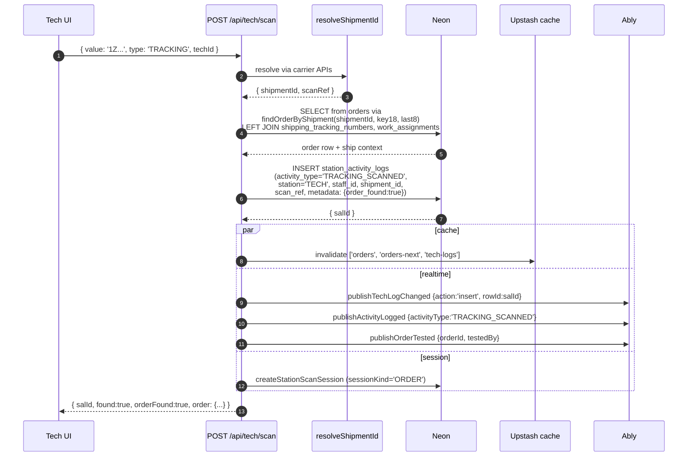
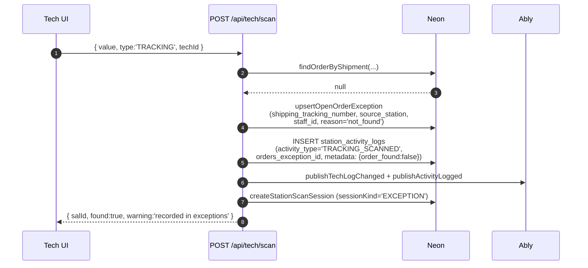
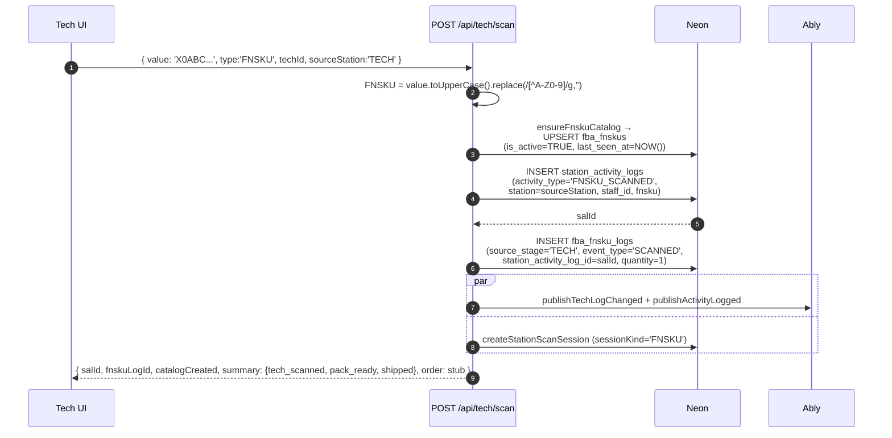
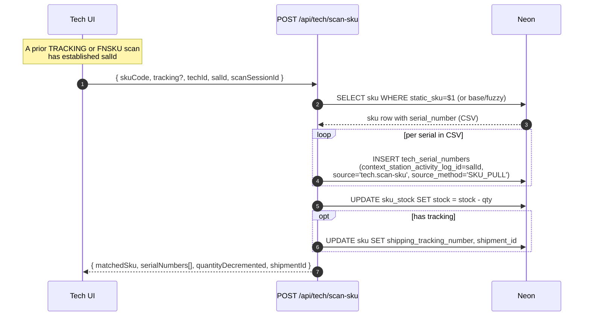
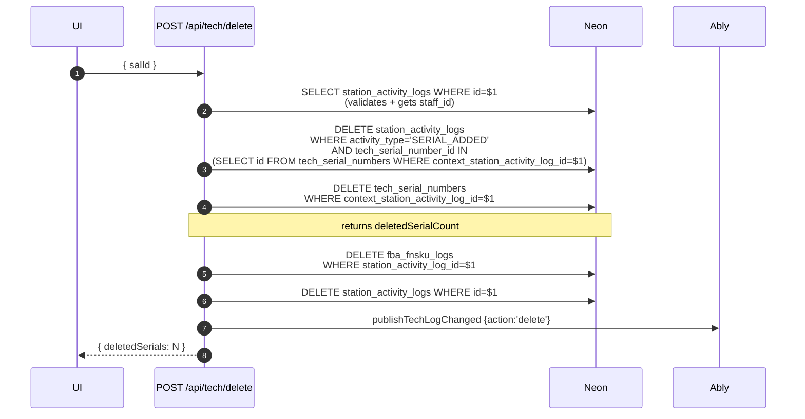

# 12 — Tech Station Trace

Every tech-station endpoint routes through the **scan hub** at `POST /api/tech/scan`. Thin wrappers convert legacy request shapes and delegate.

## Hub dispatcher

```mermaid
graph TB
    START[Request arrives at tech endpoint]
    HUB[POST /api/tech/scan<br/>src/app/api/tech/scan/route.ts:237]

    SCAN_T[POST /tech/scan-tracking] -->|{type:'TRACKING'}| HUB
    SCAN_F[GET /tech/scan-fnsku] -->|{type:'FNSKU'}| HUB
    SCAN_S[POST /tech/scan-sku] -.runs separately.-> HUB
    SCAN_R[POST /tech/scan-repair-station] -.separate flow.-> REPAIR_FLOW

    START --> HUB
    HUB --> DETECT{looksLikeFnsku&#40;value&#41;?}
    DETECT -->|yes| PATH_FNSKU[FNSKU path<br/>lines 257-350]
    DETECT -->|no| PATH_TRACK[TRACKING path<br/>lines 352-475]

    PATH_TRACK --> RESOLVE{order found?}
    RESOLVE -->|yes| ORDER_OK[record + Ably publishOrderTested]
    RESOLVE -->|no| EXCEPTION[upsert orders_exceptions<br/>reason='not_found']

    REPAIR_FLOW[appendRepairStatusHistory<br/>→ publishRepairChanged]

    classDef hub fill:#2d3748,color:#fff
    classDef wrapper fill:#4a5568,color:#fff
    class HUB hub
    class SCAN_T,SCAN_F,SCAN_S,SCAN_R wrapper
```

## TRACKING scan trace (order found)



## TRACKING scan trace (not found → exception)



## FNSKU scan trace



## SKU pull trace (separate endpoint)

`POST /api/tech/scan-sku` is **not** routed through the hub — it requires an existing `salId` as context.



## Serial management action map

`POST /api/tech/serial` is a sub-hub for serial CRUD. Every other serial endpoint eventually calls it.

```mermaid
graph LR
    ADD[POST /tech/add-serial]
    ADD_LAST[POST /tech/add-serial-to-last]
    UPDATE[POST /tech/update-serials]
    UNDO[POST /tech/undo-last]

    SERIAL[POST /tech/serial<br/>action: add&#124;remove&#124;update&#124;undo]

    ADD -->|resolves latest SAL| SERIAL
    ADD_LAST -->|latest TECH SAL| SERIAL
    UPDATE -->|via fnskuLogId| SERIAL
    UNDO -->|latest SAL| SERIAL

    SERIAL --> ACTION{action?}
    ACTION -->|add| A_INS[INSERT tech_serial_numbers<br/>+ publishTechLogChanged:insert]
    ACTION -->|remove| A_DEL[DELETE SAL 'SERIAL_ADDED'<br/>+ DELETE tech_serial_numbers]
    ACTION -->|update| A_UPD[DELETE removed + INSERT new]
    ACTION -->|undo| A_UNDO[DELETE last serial DESC]
```



## Delete trace (cascade)

`POST /api/tech/delete` removes a full SAL "anchor" and everything referencing it.



`POST /api/tech/delete-tracking` is a thin wrapper that resolves a `salId` from either `sourceKind='fba_scan' | 'tech_scan' | 'tech_serial'` and delegates to `/api/tech/delete`.

## Activity log vocabulary (tech-originated)

| activity_type | Written when |
|---|---|
| `TRACKING_SCANNED` | Order tracking barcode scanned |
| `FNSKU_SCANNED` | FBA FNSKU scanned at tech station |
| `SERIAL_ADDED` | A serial number tied to an anchor SAL |

## Cache tags invalidated (tech writes)

- `tech-logs` — always on tech write
- `orders-next` — always on tech write
- `orders` — on tracking scan success
- `shipped` — on tech delete
- `fba-stage-counts` — on FNSKU scan at FBA source station

## Endpoint cheat sheet

| Endpoint | Role | Delegates to |
|---|---|---|
| `POST /api/tech/scan` | Hub — auto-detects FNSKU vs tracking | — |
| `POST /api/tech/scan-tracking` | Legacy wrapper | scan (type:TRACKING) |
| `GET /api/tech/scan-fnsku` | Legacy wrapper | scan (type:FNSKU) |
| `POST /api/tech/scan-sku` | Standalone — pulls serials from SKU CSV | — (needs salId) |
| `POST /api/tech/scan-repair-station` | Standalone — repair ticket status | appendRepairStatusHistory |
| `POST /api/tech/serial` | Serial CRUD hub | — |
| `POST /api/tech/add-serial` | Resolves latest SAL → serial (add) | serial |
| `POST /api/tech/add-serial-to-last` | Same, filtered to TECH SALs | serial |
| `POST /api/tech/update-serials` | Resolves via fnskuLogId → serial (update) | serial |
| `POST /api/tech/undo-last` | Latest SAL → serial (undo) | serial |
| `POST /api/tech/delete` | Cascade delete an SAL | — |
| `POST /api/tech/delete-tracking` | Resolves salId → delete | delete |
| `GET /api/tech/orders-without-manual` | Query: orders tech tested, no product manual | — |
| `GET /api/tech-logs` | Query: unified tech log view | — |

## Key files

| File | Role |
|---|---|
| `src/app/api/tech/scan/route.ts:237-475` | Hub dispatcher |
| `src/app/api/tech/scan-sku/route.ts:19-269` | SKU pull with serial CSV |
| `src/app/api/tech/serial/route.ts:14-180` | Serial CRUD |
| `src/app/api/tech/delete/route.ts:10-82` | Cascade delete |
| `src/app/api/tech/logs/route.ts:11-215` | Unified read |
| `src/lib/station-activity.ts:18-64` | createStationActivityLog |
| `src/lib/fba/createFbaLog.ts:37-63` | createFbaLog |
| `src/lib/tech/insertTechSerialForSalContext.ts` | Serial INSERT with context |
| `src/lib/realtime/publish.ts` | Ably publishers |
