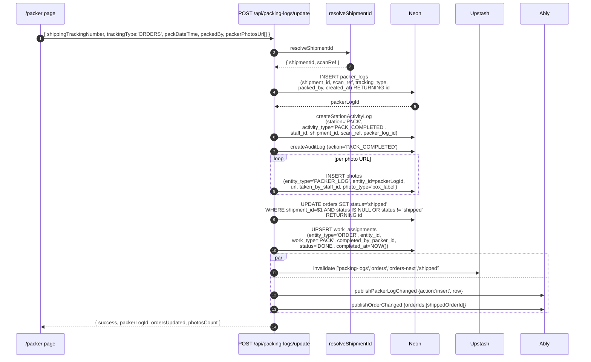
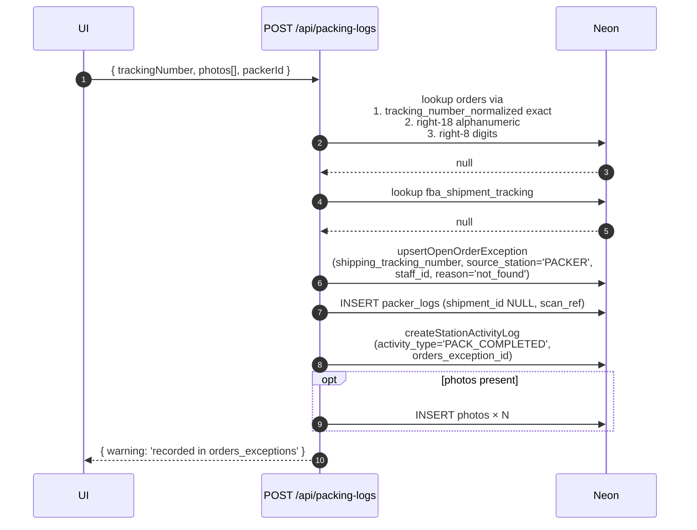
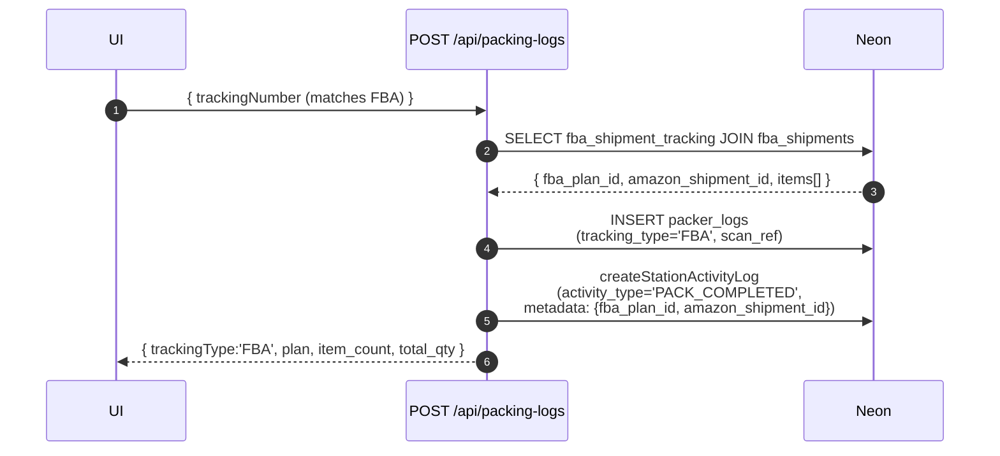
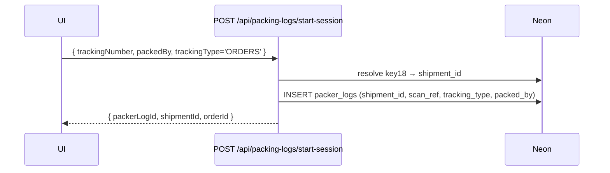
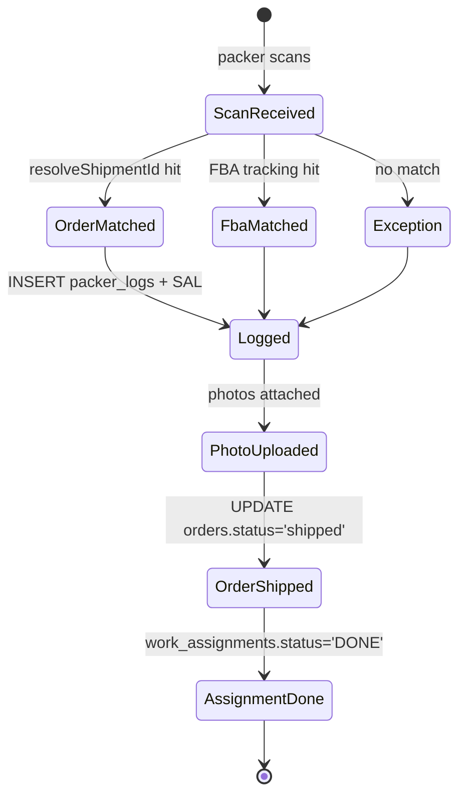

# 13 — Packer Station Trace

A packer "session" is informal — it's just one or more rows in `packer_logs` linked by `packed_by`. Each scan is an independent event with photos, a `shipment_id` (when resolvable), and a `station_activity_logs` anchor.

## Scan dispatch

```mermaid
graph TB
    SCAN[Packer scans barcode]
    CLASSIFY[classifyScan&#40;input&#41;]
    SCAN --> CLASSIFY
    CLASSIFY --> T{trackingType?}
    T -->|ORDERS| ORDER_PATH[Order tracking path]
    T -->|FBA| FBA_PATH[FBA tracking path]
    T -->|SKU| SKU_PATH[SKU pull path]
    T -->|FNSKU| FNSKU_PATH[FNSKU path]

    ORDER_PATH --> LOOKUP{order found?}
    LOOKUP -->|yes| OK[pack + mark shipped]
    LOOKUP -->|no| EX[upsert orders_exceptions]

    FBA_PATH --> FBA_LINK[link to fba_shipment_tracking]

    classDef path fill:#2d3748,color:#fff
    class ORDER_PATH,FBA_PATH,SKU_PATH,FNSKU_PATH path
```



## Order scan (main success path)



## Order scan (not found → exception)



## FBA tracking scan



## Start session (lightweight helper)



> **Note:** `start-session` creates the packer_logs row early (before photos) so the client has an id to attach photos to via `save-photo`. `update` then wraps up the full flow in one shot. Most current UI uses `update`.

## Read endpoints

```mermaid
graph LR
    UI[/packer page]
    UI -->|recent list| L[GET /api/packing-logs<br/>by packerId, limit/offset]
    UI -->|v4 unified view| V[GET /api/packerlogs<br/>with photos + serials + orders + tech data]
    UI -->|last order| LAST[GET /api/packing-logs/last-order<br/>→ last row + photos]
    UI -->|tracking detail| D[GET /api/packing-logs/details<br/>right-8 match against orders]
    UI -->|photo list| PH[GET /api/packing-logs/photos]
```

## Tracking types observed in `packer_logs.tracking_type`

| Value | Scan source |
|---|---|
| `ORDERS` | Carrier tracking barcode for a customer order |
| `FBA` | Carrier tracking tied to an FBA shipment |
| `FNSKU` | Amazon FNSKU scan |
| `SKU` | Internal SKU pull scan |

## Photos

Polymorphic via `(entity_type='PACKER_LOG', entity_id=packer_logs.id)`. Uploaded via `POST /api/packing-logs/save-photo` (pre-session) or inline with `update`.

## Activity log vocabulary (packer-originated)

| activity_type | Written when |
|---|---|
| `PACK_COMPLETED` | Order tracking scanned successfully (or exception recorded) |
| `PACK_SCAN` | SKU/FBA scan at pack station (not full order completion) |
| `FBA_READY` | Packer marks FNSKU ready at PACK station (see FBA trace) |

## Cache tags invalidated (packer writes)

- `packing-logs`
- `orders`
- `orders-next`
- `shipped`

## Session lifecycle (informal)



## Key files

| File | Role |
|---|---|
| `src/app/api/packing-logs/route.ts:75-450+` | Main scan handler (POST) + list (GET) |
| `src/app/api/packing-logs/update/route.ts:30-257` | Full flow: log + SAL + photos + order status + assignment |
| `src/app/api/packing-logs/start-session/route.ts:20-87` | Early log creation for photo attachment |
| `src/app/api/packerlogs/route.ts:13-431` | v4 unified read + simple insert |
| `src/app/api/packing-logs/last-order/route.ts:10-85` | Last-packed view |
| `src/lib/station-activity.ts` | createStationActivityLog + createAuditLog |
