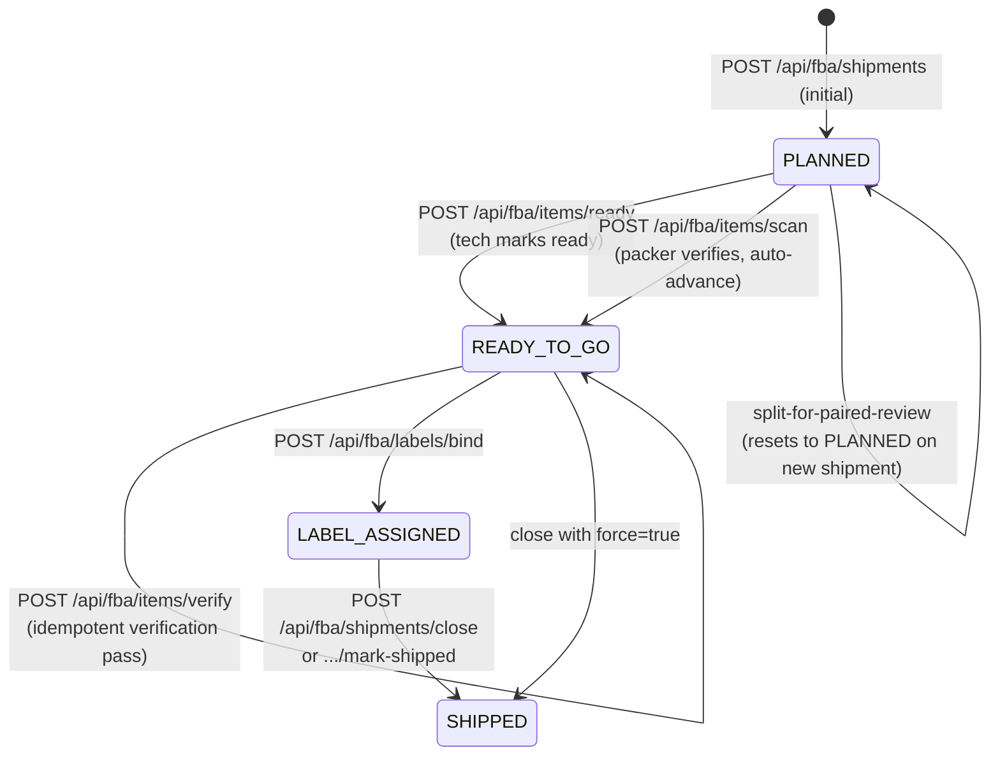
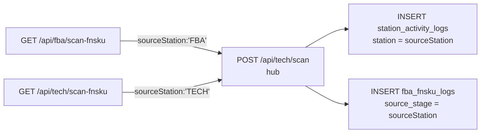
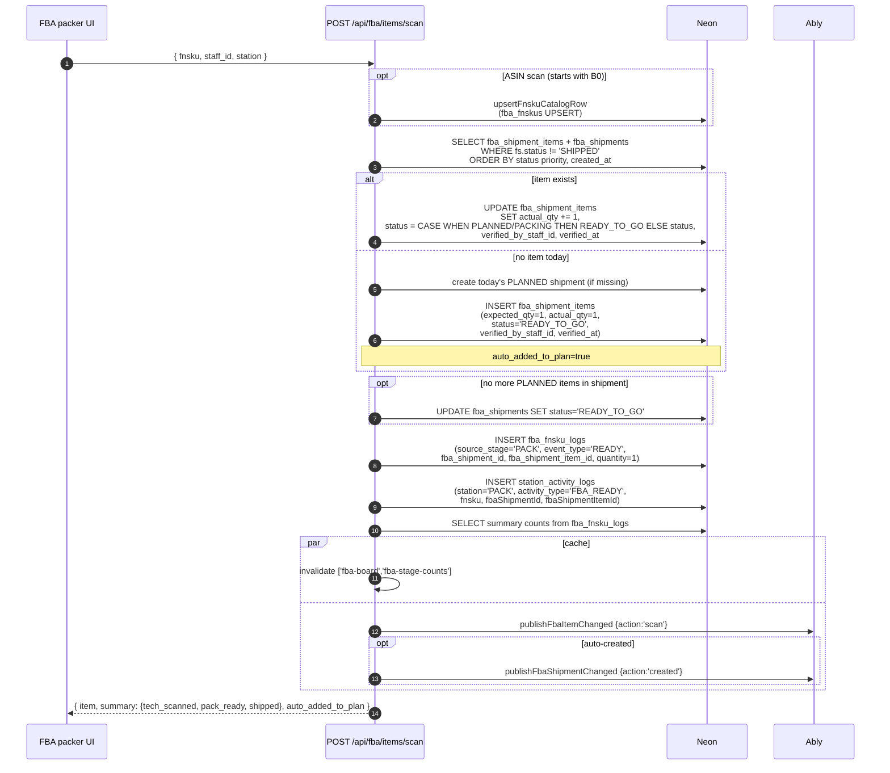
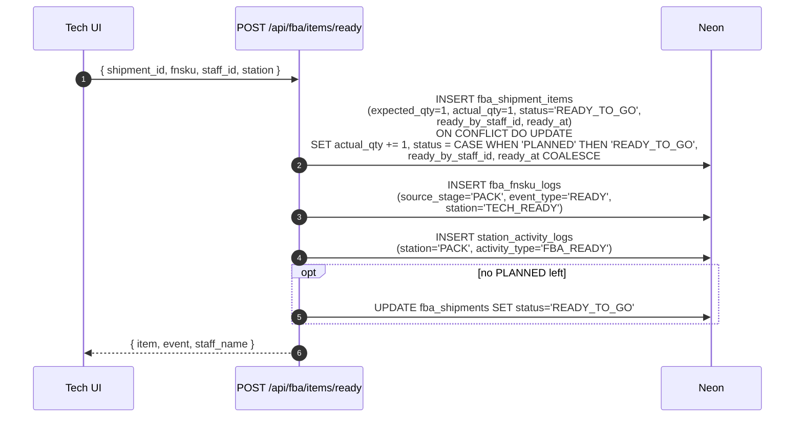
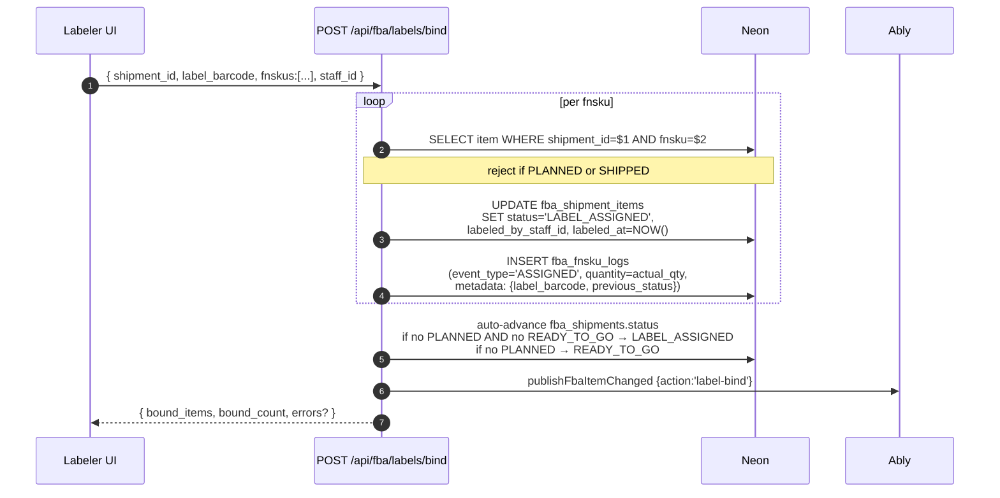
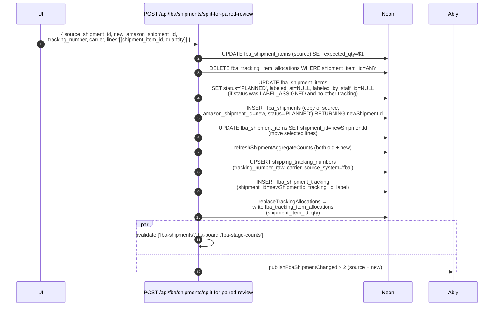
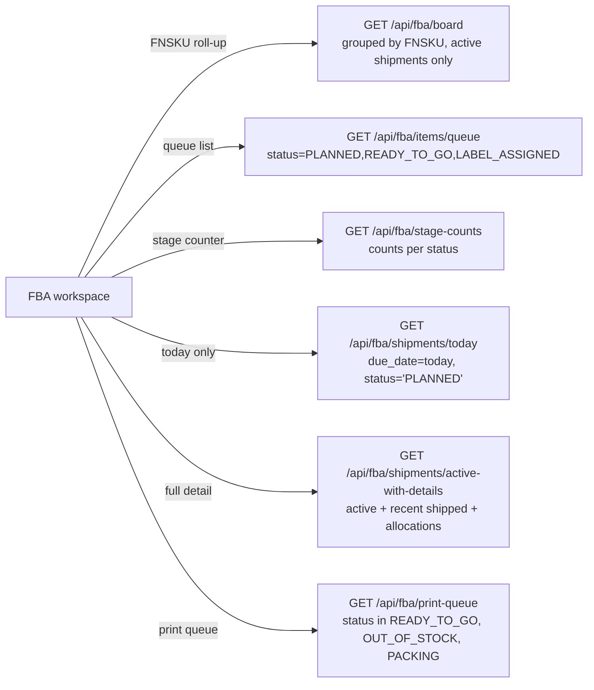
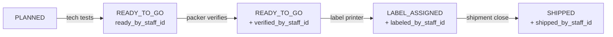

# 14 — FBA Station Trace

Tech and packer both participate in FBA. State transitions on `fba_shipment_items.status` are driven by four distinct endpoints — don't mix them up.

## Item status → endpoint map

> **key distinction:** `items/ready` = tech says "I've tested and it's good". `items/scan` = packer scans an FNSKU at the pack station (increments actual_qty, auto-advances status). `items/verify` = optional QA verification (doesn't change status, just stamps `verified_at`).

## Two FNSKU scan routes (important)

Both write the same tables — the difference is the `station` / `source_stage` field. This matters for reporting (which workspace did the scan come from).

## Pack-station FNSKU scan (items/scan)

## Tech "ready" trace

## Label bind trace

## Split-for-paired-review (advanced)

Splits a shipment: selected items are pulled into a brand-new shipment with new tracking + amazon_shipment_id. Used when half a shipment ships UPS and half ships on an Amazon pallet.

## Read endpoints (dashboards)

## Triggers per transition

| Transition | Endpoint | Writes to |
|---|---|---|
| `—` → `PLANNED` | `POST /api/fba/shipments` or `.../[id]/items` | fba_shipment_items (INSERT) |
| `PLANNED` → `READY_TO_GO` (tech) | `POST /api/fba/items/ready` | ready_by_staff_id, ready_at |
| `PLANNED` → `READY_TO_GO` (packer auto) | `POST /api/fba/items/scan` | verified_by_staff_id, verified_at, actual_qty++ |
| `READY_TO_GO` → `READY_TO_GO` (idempotent) | `POST /api/fba/items/verify` | verified_at stamp (COALESCE) |
| `READY_TO_GO` → `LABEL_ASSIGNED` | `POST /api/fba/labels/bind` | labeled_by_staff_id, labeled_at |
| `LABEL_ASSIGNED` → `SHIPPED` | `POST /api/fba/shipments/close` | shipped_by_staff_id, shipped_at |
| any (bulk) → `SHIPPED` | `POST /api/fba/shipments/mark-shipped` | shipped_at, actual_qty=expected_qty |
| `LABEL_ASSIGNED` → `PLANNED` (new shipment) | `POST /api/fba/shipments/split-for-paired-review` | moves row, clears labeled_* fields |

## Staff attribution chain

Each transition stamps a different staff column — this gives you full forensics per item:

## Activity log vocabulary (FBA-originated)

| activity_type | Station | Written when |
|---|---|---|
| `FNSKU_SCANNED` | TECH or FBA | FNSKU scanned at workspace |
| `FBA_READY` | PACK | Packer marks ready via scan or tech via `/items/ready` |

## fba_fnsku_logs `event_type` values

| event_type | When |
|---|---|
| `SCANNED` | Tech/FBA FNSKU scan |
| `READY` | `/items/ready` or `/items/scan` |
| `VERIFIED` | `/items/verify` (quantity=0) |
| `ASSIGNED` | `/labels/bind` (quantity=actual_qty) |
| `SHIPPED` | `/shipments/close` or `/mark-shipped` |

## Cache tags invalidated

- `fba-board` — any item or shipment write
- `fba-stage-counts` — scan, ready, label, close, split
- `fba-shipments` — create, split, close

## Key files

| Endpoint | File |
|---|---|
| Board roll-up | `src/app/api/fba/board/route.ts:14-143` |
| FBA scan-fnsku | `src/app/api/fba/scan-fnsku/route.ts:8-28` |
| Items scan (packer) | `src/app/api/fba/items/scan/route.ts:12-277` |
| Items ready (tech) | `src/app/api/fba/items/ready/route.ts:13-144` |
| Items verify | `src/app/api/fba/items/verify/route.ts:13-119` |
| Labels bind | `src/app/api/fba/labels/bind/route.ts:12-165` |
| Print queue | `src/app/api/fba/print-queue/route.ts:19-120` |
| Queue | `src/app/api/fba/items/queue/route.ts:9-78` |
| Today | `src/app/api/fba/shipments/today/route.ts:16-94` |
| Stage counts | `src/app/api/fba/stage-counts/route.ts:21-49` |
| Active + details | `src/app/api/fba/shipments/active-with-details/route.ts:18-184` |
| Split | `src/app/api/fba/shipments/split-for-paired-review/route.ts:32-200+` |
| FBA log helper | `src/lib/fba/createFbaLog.ts:37-63` |
| Catalog upsert | `src/lib/fba/upsert-fnsku-catalog.ts` |
| Allocation writer | `src/lib/fba/replace-tracking-allocations.ts` |
