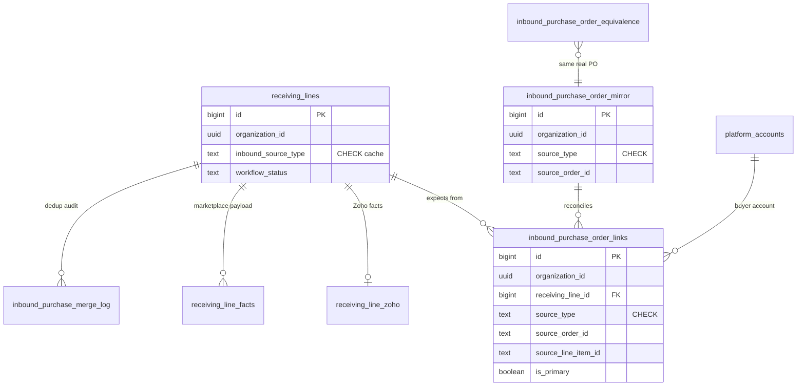

# Universal Incoming Purchase Orders — Plan

> **Status:** PLAN (2026-07-01). No implementation started.
>
> **Goal:** Make `receiving_lines` the **universal Incoming spine** with **polymorphic
> purchase identity** (`inbound_purchase_order_links`, mirror, equivalence graph) so
> every source — Zoho, eBay buyer purchases, future channels — shares one queue and
> one dedup model. Close the gap between **“bought on eBay”** and **“shows in
> Incoming”**, merging into a single row when purchasing later creates the same PO in Zoho.
>
> **Architecture constraint:** This is a **multi-tenant** product where each org
> customizes its floor process in **Operations Studio** (`workflow_nodes`,
> `station_definitions`) without deploys. The universal incoming model must plug
> into that composable stack — not hardcode a USAV-only Zoho→eBay path.

**Related docs**

- [receiving-triage-streamline-plan.md](./receiving-triage-streamline-plan.md) — physical vs Zoho lifecycle decoupling
- [incoming-tracking-todo-plan.md](./todo/incoming-tracking-todo-plan.md) — attach-tracking to-do composition
- [ebay-connect.md](./integrations/ebay-connect.md) — seller OAuth (buyer is an extension)
- [polymorphic-tables-database-refactor-plan.md](./todo/polymorphic-tables-database-refactor-plan.md) — long-term facts extraction (compatible, not blocking)
- [platform-account-type-catalog-plan.md](./todo/platform-account-type-catalog-plan.md) — account chips on display rows
- [operations-studio/station-builder-ui-plan.md](./operations-studio/station-builder-ui-plan.md) — composable stations (data sources + actions)
- [operations-studio/NODE_WORKFLOW_ARCHITECTURE.md](./operations-studio/NODE_WORKFLOW_ARCHITECTURE.md) — tenant workflow graph
- [todo/ops-events-station-workflow-unification-plan.md](./todo/ops-events-station-workflow-unification-plan.md) — `workflow_node_id` on activity events

---

## 1. Problem

### 1.1 The gap

Incoming (`/receiving?mode=incoming`) is **Zoho-only** today. Rows appear only when:

```sql
rl.workflow_status = 'EXPECTED'
AND COALESCE(rl.quantity_received, 0) = 0
AND rl.zoho_purchaseorder_id IS NOT NULL
```

**What breaks in production**

| Real-world event | Today | Operator pain |
|---|---|---|
| Buyer pays on eBay; PO not yet in Zoho | Nothing in Incoming | Blind spot until someone creates Zoho PO |
| eBay order ships; tracking only on eBay | `AWAITING_TRACKING` never fires | No row to attach tracking to |
| Purchasing creates Zoho PO **after** eBay buy | Duplicate risk if both sync | Two rows for one physical shipment |
| Multiple eBay buyer accounts | No per-account feed | Can't tell which account bought it |

eBay integration today is **seller/outbound** (`sell.fulfillment` scopes, exception-tracking
reconciliation into `orders`). It does not ingest **purchases you made as a buyer**.

### 1.2 The real workflow (why dedup matters)

Purchasing's actual flow:

```
eBay purchase  →  (days later)  →  Zoho PO created with same order#/tracking
```

The Zoho PO is the accounting source of truth **eventually**, but the warehouse needs
visibility **at payment/shipment**, not when accounting catches up. When Zoho PO
arrives, the system must **merge** the eBay-originated `receiving_lines` row into the
Zoho-backed row — not show two Incoming lines for one box.

- [todo/ops-events-station-workflow-unification-plan.md](./todo/ops-events-station-workflow-unification-plan.md) — `workflow_node_id` on activity events
- [.claude/rules/polymorphic-tables.md](../.claude/rules/polymorphic-tables.md) — **ratified contract** for every new polymorphic / typed-fact table

---

## 2. Design principle — one spine, polymorphic purchase identity

### 2.1 Three layers (aligned with receiving polymorphic refactor)

| Layer | Table(s) | Role |
|---|---|---|
| **Spine (queue)** | `receiving_lines` | One row per expected inbound SKU — **the operator Incoming queue** |
| **Polymorphic purchase links** | `inbound_purchase_order_links` | `(source_type, source_order_id, source_line_item_id)` per line — **identity SoT** |
| **Polymorphic mirrors** | `inbound_purchase_order_mirror` (+ legacy `zoho_po_mirror` during transition) | Read-only upstream reconcile; **never** a second queue |
| **Typed facts** | `receiving_line_zoho`, `receiving_line_facts` | Source-specific payload; validated `fact_kind` registry |
| **Cross-source equivalence** | `inbound_purchase_order_equivalence` | eBay order ↔ Zoho PO dedup graph (replaces ad-hoc merge columns) |
| **Physical** | `receiving` | Carton scanned at dock |

**Rule:** Sync adapters UPSERT the **spine** + **polymorphic link row** + **mirror row** + **typed facts** in one
transaction. No per-channel queue tables (`ebay_purchase_order_mirror` as a standalone design is **rejected**).

### 2.2 Why polymorphic links, not wide spine columns

Today `receiving_lines` already accreted ~51 columns (Zoho cluster, marketplace fields, testing, …). This plan
**does not add another permanent Zoho+eBay column cluster**. Instead:

1. **Spine** keeps universal operational facts (`workflow_status`, `sku`, `quantity_expected`, `platform_account_id`).
2. **`inbound_purchase_order_links`** holds every external purchase identity (1:N per line after merge).
3. **`receiving_line_zoho`** (already shipped, `2026-06-29c`) holds Zoho accounting facts when linked.
4. **`receiving_line_facts`** (`fact_kind = 'ebay_purchase' | 'amazon_purchase' | …`) holds marketplace purchase
   payload (seller, legacy order id, listing URL) — schema per kind in `src/lib/receiving/facts/registry.ts`.

During transition, dual-write denormalized cache columns on `receiving_lines` (`inbound_source_type`,
`source_order_id`, `zoho_purchaseorder_id`) so existing readers stay green; cut over Incoming street readers to
join the link table, then drop caches (same strangler as `2026-06-29e` facts dual-write).

### 2.3 Polymorphic contract (mandatory)

Every **new** table in this initiative must satisfy
[`.claude/rules/polymorphic-tables.md`](../.claude/rules/polymorphic-tables.md):

1. **Named CHECK** on every discriminator (`source_type`, not free text).
2. **Org-led uniques** — `(organization_id, source_type, source_order_id, …)` never global.
3. **Tenant-from-birth** — `organization_id UUID NOT NULL` (no default in raw DDL) +
   `enforce_tenant_isolation('<table>')` in the same migration.
4. **Parent-delete integrity** — real FK `ON DELETE CASCADE` where parent is non-polymorphic
   (`receiving_line_id` → `receiving_lines`).
5. **Drizzle model** in the same PR as the migration.
6. **App-side existence validation** in domain helpers (`Deps`-injected), not DB triggers.

**Extensibility:** new sources (Amazon Business, …) extend the CHECK via migration **and** register in
`src/lib/inbound/source-registry.ts` + `receiving_line_facts` schema — same rhythm as adding a
`workflow_nodes.type`.

### 2.4 Denormalized cache on spine (transition only)

| Column (cache) | Purpose | Long-term home |
|---|---|---|
| `inbound_source_type` | Primary source for Incoming filter/badge | `inbound_purchase_order_links` where `is_primary` |
| `source_order_id` | Primary external order id | link row |
| `source_line_item_id` | Primary line id | link row |
| `zoho_purchaseorder_id` | Zoho PO (legacy readers) | link row `source_type='zoho'` + `receiving_line_zoho` |

`inbound_source_type` uses a **named CHECK** (not unconstrained text):

```sql
CONSTRAINT receiving_lines_inbound_source_type_chk
  CHECK (inbound_source_type IS NULL OR inbound_source_type IN ('zoho', 'ebay', 'amazon', 'manual'))
```

Extend the CHECK when a new source ships — deliberate, reviewed migration.

### 2.5 Long-term alignment with `receiving_line_facts` (already live)

Shipped foundation (`2026-06-29c` + `src/lib/receiving/facts/registry.ts`):

- Register `fact_kind = 'ebay_purchase'` with Zod schema: `{ legacyOrderId, sellerUsername, purchaseOrderStatus, listingUrl, rawStatus }`.
- Register `fact_kind = 'amazon_purchase'` when Amazon inbound lands — **no new table**.
- Zoho line facts stay in `receiving_line_zoho` (narrow 1:1 table — correct for high-volume queryable cols).

### 2.6 Studio & workflow compatibility checklist

Every PR in this initiative must pass:

- [ ] New feeds exposed as **station data sources**, not bespoke sidebar panels
- [ ] New mutations exposed as **station actions** wrapping existing routes
- [ ] No new hardcoded `mode=incoming` UI that Studio cannot replace
- [ ] `inbound_source_type` values in code registry **and** DB CHECK stay in sync
- [ ] Cron/sync uses `forEachOrgWithProvider` + per-org feature flag
- [ ] Merge/link emits audit (+ `ops_events` when unification plan lands)

---

## 3. Polymorphic database design

All DDL below follows the canonical skeleton in
[`.claude/rules/polymorphic-tables.md`](../.claude/rules/polymorphic-tables.md). Each migration ends with
`enforce_tenant_isolation(...)` and adds matching `pgTable` definitions in `src/lib/drizzle/schema.ts`.

### 3.1 Entity-relationship overview



### 3.2 `inbound_purchase_order_links` — polymorphic identity (NEW, SoT)

One row per `(receiving_line, external purchase order line)`. A merged eBay+Zoho purchase
has **two link rows** on the same `receiving_line_id` (ebay primary + zoho secondary), not two spine rows.

```sql
CREATE TABLE IF NOT EXISTS inbound_purchase_order_links (
  id                   BIGSERIAL PRIMARY KEY,
  organization_id      UUID NOT NULL,
  receiving_line_id    INTEGER NOT NULL REFERENCES receiving_lines(id) ON DELETE CASCADE,
  source_type          TEXT NOT NULL,
  source_order_id      TEXT NOT NULL,
  source_line_item_id  TEXT,
  is_primary           BOOLEAN NOT NULL DEFAULT false,
  platform_account_id  BIGINT REFERENCES platform_accounts(id) ON DELETE SET NULL,
  linked_at            TIMESTAMPTZ NOT NULL DEFAULT now(),
  created_at           TIMESTAMPTZ NOT NULL DEFAULT now(),
  updated_at           TIMESTAMPTZ NOT NULL DEFAULT now()
);

DO $$ BEGIN
  ALTER TABLE inbound_purchase_order_links
    ADD CONSTRAINT inbound_purchase_order_links_source_type_chk
    CHECK (source_type IN ('zoho', 'ebay', 'amazon', 'manual'));
EXCEPTION WHEN duplicate_object THEN NULL; END $$;

CREATE UNIQUE INDEX IF NOT EXISTS ux_inbound_po_links_natural
  ON inbound_purchase_order_links (
    organization_id, receiving_line_id, source_type, source_order_id,
    COALESCE(source_line_item_id, '')
  );

CREATE INDEX IF NOT EXISTS idx_inbound_po_links_source_lookup
  ON inbound_purchase_order_links (organization_id, source_type, source_order_id);

CREATE INDEX IF NOT EXISTS idx_inbound_po_links_line
  ON inbound_purchase_order_links (organization_id, receiving_line_id);
```

Writer: `src/lib/inbound/purchase-links.ts` — validates parent line exists, source registered,
upserts link + dual-writes spine cache + facts in one `withTenantTransaction`.

### 3.3 `inbound_purchase_order_mirror` — polymorphic reconcile mirror (NEW)

**One mirror for all inbound sources** (not a separate `ebay_purchase_order_mirror`). Legacy
`zoho_po_mirror` continues during transition; Zoho sync **dual-writes** both until readers cut over.

```sql
CREATE TABLE IF NOT EXISTS inbound_purchase_order_mirror (
  id                      BIGSERIAL PRIMARY KEY,
  organization_id         UUID NOT NULL,
  source_type             TEXT NOT NULL,
  source_order_id         TEXT NOT NULL,
  platform_account_id     BIGINT REFERENCES platform_accounts(id) ON DELETE SET NULL,
  order_number            TEXT,
  vendor_or_seller_name   TEXT,
  status                  TEXT,
  payment_status          TEXT,
  po_date                 DATE,
  expected_delivery_date  DATE,
  tracking_number         TEXT,
  carrier_code            TEXT,
  line_items              JSONB NOT NULL DEFAULT '[]'::jsonb,
  raw_payload             JSONB,
  last_modified_at        TIMESTAMPTZ,
  synced_at               TIMESTAMPTZ NOT NULL DEFAULT now(),
  created_at              TIMESTAMPTZ NOT NULL DEFAULT now(),
  updated_at              TIMESTAMPTZ NOT NULL DEFAULT now()
);

DO $$ BEGIN
  ALTER TABLE inbound_purchase_order_mirror
    ADD CONSTRAINT inbound_purchase_order_mirror_source_type_chk
    CHECK (source_type IN ('zoho', 'ebay', 'amazon', 'manual'));
EXCEPTION WHEN duplicate_object THEN NULL; END $$;

CREATE UNIQUE INDEX IF NOT EXISTS ux_inbound_po_mirror_natural
  ON inbound_purchase_order_mirror (organization_id, source_type, source_order_id);
```

Queryable business fields are **real columns**; vendor-specific tail stays in `raw_payload` jsonb
(Appendix C taxonomy from schema-wide polymorphic plan).

### 3.4 `inbound_purchase_order_equivalence` — cross-source dedup graph (NEW)

When eBay purchase and Zoho PO are the same real-world order, record equivalence **once** —
merge algorithm consults this before touching spine rows.

```sql
CREATE TABLE IF NOT EXISTS inbound_purchase_order_equivalence (
  id                BIGSERIAL PRIMARY KEY,
  organization_id   UUID NOT NULL,
  source_type_a     TEXT NOT NULL,
  source_order_id_a TEXT NOT NULL,
  source_type_b     TEXT NOT NULL,
  source_order_id_b TEXT NOT NULL,
  link_reason       TEXT NOT NULL,
  linked_at         TIMESTAMPTZ NOT NULL DEFAULT now(),
  linked_by_staff_id INTEGER REFERENCES staff(id) ON DELETE SET NULL
);

DO $$ BEGIN
  ALTER TABLE inbound_purchase_order_equivalence
    ADD CONSTRAINT inbound_purchase_order_equivalence_type_a_chk
    CHECK (source_type_a IN ('zoho', 'ebay', 'amazon', 'manual'));
  ALTER TABLE inbound_purchase_order_equivalence
    ADD CONSTRAINT inbound_purchase_order_equivalence_type_b_chk
    CHECK (source_type_b IN ('zoho', 'ebay', 'amazon', 'manual'));
EXCEPTION WHEN duplicate_object THEN NULL; END $$;

CREATE UNIQUE INDEX IF NOT EXISTS ux_inbound_po_equivalence_pair
  ON inbound_purchase_order_equivalence (
    organization_id,
    LEAST(source_type_a, source_type_b),
    LEAST(source_order_id_a, source_order_id_b),
    GREATEST(source_type_a, source_type_b),
    GREATEST(source_order_id_a, source_order_id_b)
  );
```

Canonical pair ordering in the writer prevents duplicate `(ebay, zoho)` / `(zoho, ebay)` rows.

### 3.5 `inbound_purchase_merge_log` — dedup audit (polymorphic refs)

```sql
CREATE TABLE IF NOT EXISTS inbound_purchase_merge_log (
  id                    BIGSERIAL PRIMARY KEY,
  organization_id       UUID NOT NULL,
  winner_line_id        INTEGER NOT NULL REFERENCES receiving_lines(id) ON DELETE CASCADE,
  loser_line_id         INTEGER REFERENCES receiving_lines(id) ON DELETE SET NULL,
  merge_reason          TEXT NOT NULL,
  primary_source_type   TEXT NOT NULL,
  primary_source_order_id TEXT NOT NULL,
  secondary_source_type TEXT,
  secondary_source_order_id TEXT,
  merged_at             TIMESTAMPTZ NOT NULL DEFAULT now(),
  merged_by_staff_id    INTEGER REFERENCES staff(id) ON DELETE SET NULL
);

DO $$ BEGIN
  ALTER TABLE inbound_purchase_merge_log
    ADD CONSTRAINT inbound_purchase_merge_log_primary_type_chk
    CHECK (primary_source_type IN ('zoho', 'ebay', 'amazon', 'manual'));
EXCEPTION WHEN duplicate_object THEN NULL; END $$;
```

### 3.6 `receiving_lines` — spine cache columns (transition)

```sql
ALTER TABLE receiving_lines
  ADD COLUMN IF NOT EXISTS inbound_source_type text,
  ADD COLUMN IF NOT EXISTS source_line_item_id text,
  ADD COLUMN IF NOT EXISTS platform_account_id bigint
    REFERENCES platform_accounts(id) ON DELETE SET NULL;

DO $$ BEGIN
  ALTER TABLE receiving_lines
    ADD CONSTRAINT receiving_lines_inbound_source_type_chk
    CHECK (inbound_source_type IS NULL OR inbound_source_type IN ('zoho', 'ebay', 'amazon', 'manual'));
EXCEPTION WHEN duplicate_object THEN NULL; END $$;

-- Backfill: primary link = Zoho PO
UPDATE receiving_lines rl
   SET inbound_source_type = 'zoho',
       source_system = COALESCE(source_system, 'zoho'),
       source_order_id = COALESCE(source_order_id, zoho_purchaseorder_id),
       source_line_item_id = COALESCE(source_line_item_id, zoho_line_item_id)
 WHERE zoho_purchaseorder_id IS NOT NULL
   AND inbound_source_type IS NULL;

-- Backfill link rows from existing Zoho lines (idempotent)
INSERT INTO inbound_purchase_order_links (
  organization_id, receiving_line_id, source_type, source_order_id,
  source_line_item_id, is_primary
)
SELECT organization_id, id, 'zoho', zoho_purchaseorder_id, zoho_line_item_id, true
  FROM receiving_lines
 WHERE zoho_purchaseorder_id IS NOT NULL
   AND NOT EXISTS (
     SELECT 1 FROM inbound_purchase_order_links l
      WHERE l.receiving_line_id = receiving_lines.id
        AND l.source_type = 'zoho'
        AND l.source_order_id = receiving_lines.zoho_purchaseorder_id
   );
```

Relax `zoho_item_id NOT NULL` for marketplace-only lines (`inbound_source_type IN ('ebay','amazon')`).

Org-led incoming identity unique (replaces per-source partial indexes):

```sql
CREATE UNIQUE INDEX IF NOT EXISTS ux_receiving_lines_inbound_identity
  ON receiving_lines (
    organization_id, inbound_source_type, source_order_id,
    COALESCE(source_line_item_id, '')
  )
  WHERE inbound_source_type IS NOT NULL
    AND source_order_id IS NOT NULL;
```

Prefer **`ux_inbound_po_links_natural`** as the long-term dedup key; drop spine unique when link table is SoT.

### 3.7 `receiving_line_facts` — marketplace purchase payload

Register in `src/lib/receiving/facts/registry.ts` (no new table):

```ts
// fact_kind = 'ebay_purchase'
export const ebayPurchaseSchema = z.object({
  legacyOrderId: z.string().optional(),
  sellerUsername: z.string().optional(),
  purchaseOrderStatus: z.string().optional(),
  paymentStatus: z.string().optional(),
  listingUrl: z.string().optional(),
});
```

Writer path: `upsertReceivingLineFacts(lineId, 'ebay_purchase', payload)` inside sync transaction.

### 3.8 `ebay_accounts` — buyer role (non-polymorphic extension)

```sql
ALTER TABLE ebay_accounts
  ADD COLUMN IF NOT EXISTS account_role text NOT NULL DEFAULT 'seller';

DO $$ BEGIN
  ALTER TABLE ebay_accounts
    ADD CONSTRAINT ebay_accounts_account_role_chk
    CHECK (account_role IN ('seller', 'buyer'));
EXCEPTION WHEN duplicate_object THEN NULL; END $$;
```

### 3.9 Legacy `zoho_po_mirror` — migration path

| Phase | Behavior |
|---|---|
| **Now** | Zoho sync continues writing `zoho_po_mirror` (existing readers) |
| **Dual-write** | Same sync also UPSERTs `inbound_purchase_order_mirror` where `source_type='zoho'` |
| **Reader cutover** | Incoming `NOT_ZOHO_RECEIVED_PREDICATE` joins polymorphic mirror |
| **Retire** | Drop `zoho_po_mirror` when no reader references it (separate migration) |

Do **not** fork reconcile logic per source — one mirror query interface in `src/lib/inbound/mirror.ts`.

---

## 4. Deduplication — one row when eBay and Zoho are the same PO

### 4.1 Match signals (priority order)

| Priority | Signal | Normalization |
|---|---|---|
| 1 | Tracking number | `normalizeTracking()` → `shipping_tracking_numbers` join |
| 2 | eBay legacy order id ↔ Zoho PO notes / custom field / PO# | `normalizeOrderNumber()` (same as `po-gmail/reconcile.ts`) |
| 3 | SKU + qty + vendor/seller + date window (±7d) | Fuzzy; log for review, never auto-merge silently |

### 4.2 Merge algorithm (polymorphic — one spine row, multiple links)

When Zoho incoming sync imports a PO **or** operator links via UI:

```
find eBay link row WHERE
  source_type = 'ebay'
  AND receiving_line.workflow_status = 'EXPECTED'
  AND (tracking match OR order# match)
  AND NOT EXISTS (link row source_type = 'zoho' on same line)

IF found (eBay line exists) AND Zoho sync creates duplicate spine row:
  winner ← existing eBay receiving_line (earliest created_at)
  loser  ← newly inserted Zoho-only spine row

  ON winner:
    INSERT inbound_purchase_order_links (source_type='zoho', is_primary=false, ...)
    INSERT inbound_purchase_order_equivalence (ebay↔zoho, link_reason)
    UPSERT receiving_line_zoho facts
    UPDATE spine cache: zoho_purchaseorder_id, inbound_source_type stays 'ebay'

  DELETE loser spine row (CASCADE deletes loser's links)

  UPSERT inbound_purchase_order_mirror for both source_types
  INSERT inbound_purchase_merge_log (primary_source_type='ebay', secondary='zoho', ...)
```

**If Zoho line exists first:** augment with eBay link row + equivalence — **no second spine row**.

**Invariant:** Incoming shows **one spine row** with:

- Primary link: eBay (`is_primary=true`) — account chip, seller, listing URL in `receiving_line_facts`
- Secondary link: Zoho — PO#, sync, receive-in-Zoho via `receiving_line_zoho`
- Equivalence row: `(ebay, orderId) ↔ (zoho, poId)` for reconcile queries

### 4.3 When Zoho sync runs first (less common)

If Zoho PO exists before eBay sync sees the purchase:

- eBay sync finds spine row via `inbound_purchase_order_links` where `source_type='zoho'`
- **Add** eBay link row + `receiving_line_facts` — do not insert a second spine row
- Record equivalence when both mirrors exist

### 4.4 Idempotency guards (match Zoho sync rules)

Never overwrite on sync when operator has advanced the row:

- `quantity_received > 0` → skip quantity fields
- `workflow_status` not in (`EXPECTED`, `ARRIVED`) → skip status regression
- Advisory lock per `(organization_id, source_type, source_order_id)` during merge
- Link upsert is idempotent on `ux_inbound_po_links_natural`

---

## 5. eBay purchasing — account connect & sync

### 5.1 API gate

eBay **Buy Order API** (`getPurchaseOrder`) requires `buy.order.readonly` scope and
**eBay business approval** (restricted API). Plan two tracks:

| Track | When | Behavior |
|---|---|---|
| **A — API** | After scope approval | Poll purchase orders per buyer account |
| **B — Bridge** | Immediately | Manual import + email triage → same `receiving_lines` UPSERT |

Both tracks write the **same row shape**; Track B rows upgrade when API sync finds them.

### 5.2 OAuth connect (Settings → Integrations)

Extend existing eBay card — **do not** add a second provider key:

```
┌─ eBay ────────────────────────────────────────┐
│ Selling accounts                              │
│   USAV-Main              ● Connected          │
│   [+ Connect selling account]                 │
│                                               │
│ Purchasing accounts                           │
│   USAV-Buyer             ● Connected          │
│   CycleForge-Buyer        ○ Not connected     │
│   [+ Connect purchasing account]              │
└───────────────────────────────────────────────┘
```

- Connect: `GET /api/ebay/connect?accountName=<label>&role=buyer`
- Callback: `account_role = 'buyer'`, buyer scopes from `ebayBuyerScopes()` in
  `oauth-config.ts` (separate from seller scopes; refresh must request same set)
- Permission: `integrations.ebay` (or `integrations.ebay.purchasing` if split later)
- Seeds `platform_accounts` with `integration_scope = account_name`

### 5.3 Sync module

New: `src/lib/inbound/sync-ebay-purchases.ts` (or `src/lib/ebay/purchase-sync.ts`)

```
syncEbayPurchasesToReceiving(orgId)
  FOR EACH ebay_accounts WHERE account_role='buyer' AND is_active
    paginate purchase orders (delta cursor: ebay_purchases:{accountName})
    UPSERT inbound_purchase_order_mirror (source_type='ebay', ...)
    FOR EACH open line:
      UPSERT receiving_lines (spine)
      UPSERT inbound_purchase_order_links (source_type='ebay', is_primary=true)
      UPSERT receiving_line_facts (fact_kind='ebay_purchase', ...)
      register tracking → shipping_tracking_numbers
      run mergeIfZohoEquivalentExists()  -- equivalence + secondary zoho link
```

Cron: `GET /api/cron/ebay/purchase-sync` (30–60 min), registered in `vercel.json`.

### 5.4 Zoho sync hook

At end of `importZohoPurchaseOrderToReceiving` / `syncPurchaseOrderLines`:

```ts
await mergeEbayLinesIntoZohoPo(orgId, { zohoPurchaseOrderId, poNumber, tracking, lineItems });
```

---

## 6. Incoming query — universal filter

### 6.1 Replace Zoho-only predicate

**Before** (`view=incoming`):

```sql
rl.zoho_purchaseorder_id IS NOT NULL
AND ${NOT_ZOHO_RECEIVED_PREDICATE}
```

**After:**

```sql
EXISTS (
  SELECT 1 FROM inbound_purchase_order_links l
   WHERE l.receiving_line_id = rl.id
     AND l.organization_id = rl.organization_id
)
AND rl.workflow_status = 'EXPECTED'
AND COALESCE(rl.quantity_received, 0) = 0
AND (
  -- Zoho link: hide when mirror says received/closed
  (EXISTS (SELECT 1 FROM inbound_purchase_order_links lz
            WHERE lz.receiving_line_id = rl.id AND lz.source_type = 'zoho')
   AND ${NOT_INBOUND_MIRROR_TERMINAL_PREDICATE('zoho')})
  OR
  -- eBay-only link: hide when ebay mirror terminal
  (EXISTS (SELECT 1 FROM inbound_purchase_order_links le
            WHERE le.receiving_line_id = rl.id AND le.source_type = 'ebay')
   AND NOT EXISTS (SELECT 1 FROM inbound_purchase_order_links lz
                    WHERE lz.receiving_line_id = rl.id AND lz.source_type = 'zoho')
   AND ${NOT_INBOUND_MIRROR_TERMINAL_PREDICATE('ebay')})
  OR
  -- Merged (ebay + zoho links): Zoho mirror governs accounting closure
  (EXISTS (SELECT 1 FROM inbound_purchase_order_links le
            WHERE le.receiving_line_id = rl.id AND le.source_type = 'ebay')
   AND EXISTS (SELECT 1 FROM inbound_purchase_order_links lz
                WHERE lz.receiving_line_id = rl.id AND lz.source_type = 'zoho')
   AND ${NOT_INBOUND_MIRROR_TERMINAL_PREDICATE('zoho')})
)
AND NOT ${SHIPMENT_SCANNED_PREDICATE}
```

During transition, fall back to `rl.inbound_source_type` cache when link table empty.
`NOT_INBOUND_MIRROR_TERMINAL_PREDICATE` joins `inbound_purchase_order_mirror` polymorphically
(single helper in `src/lib/inbound/mirror.ts`).

### 6.2 Summary chips & facets

| Facet | Param | Notes |
|---|---|---|
| All sources | *(default)* | |
| Zoho only | `?inbound=zoho` | Current behavior |
| eBay only | `?inbound=ebay` | New |
| Awaiting Zoho link | `?inbound=ebay&link=zoho_pending` | eBay link row with no zoho link on same line |
| Awaiting tracking | `?state=AWAITING_TRACKING` | Unchanged, source-agnostic |

Update `incoming/summary/route.ts` counts to use universal predicate.

### 6.3 Display join — account chip

```sql
LEFT JOIN platform_accounts pa ON pa.id = rl.platform_account_id
```

Row anatomy (Incoming table):

```
[Order# or PO#]  ·  SellerName  ·  [eBay · USAV-Buyer]  ·  [IN_TRANSIT]
SKU-12345  Sony WH-1000XM5  qty 1
[inbound_source_type badge: Zoho | eBay | eBay→Zoho]
```

Join primary link for filters: `inbound_purchase_order_links pl ON pl.receiving_line_id = rl.id AND pl.is_primary`.

---

## 7. Link button — unified PO linking UI

### 7.1 Extend existing `PoLinkTab`

Today `PoLinkTab` searches Zoho POs and POSTs to `/api/receiving/relink` with
`zoho_purchaseorder_id`. Extend for **bidirectional** linking:

| Row state | Tab label | Action |
|---|---|---|
| Unmatched carton, no PO | **Link PO** | Search Zoho POs (existing) |
| eBay Incoming line, no Zoho | **Link to Zoho PO** | Search Zoho POs → merge |
| Zoho Incoming line, has eBay order# in notes | **Link eBay order** | Search eBay mirror / paste order# |
| eBay + Zoho merged | **PO linked** ✓ | Show both ids; unlink action |

### 7.2 New API: `POST /api/receiving/inbound/link`

Single chokepoint for manual link + merge (permission: `receiving.mark_received` or
`receiving.edit`):

```json
{
  "receiving_line_id": 12345,
  "target": {
    "system": "zoho",
    "purchase_order_id": "4812345678901234",
    "purchase_order_number": "PO-00421"
  },
  "merge_strategy": "augment_winner"   // default; server runs §4.2
}
```

Response: `{ winner_line_id, merged: boolean, zoho_purchaseorder_id, source_order_id }`

Audit: `recordAudit()` action `RECEIVING_INBOUND_LINKED`, entity `receiving_line`.

### 7.3 Incoming details slide-over

Extend `IncomingDetailsPanel` (`/api/receiving-lines/incoming/details`):

| Tab | Zoho row | eBay row | Merged row |
|---|---|---|---|
| PO | Zoho vendor, lines, sync | — | Zoho section |
| eBay order | — | Seller, status, account | eBay section |
| Shipment | Tracking (shared) | Tracking (shared) | Tracking (shared) |
| **Link** | — | **Link to Zoho PO** button | Shows link status |

Sync button: **Refresh** re-pulls from Zoho **and** eBay for that line's sources.

### 7.4 Attach tracking — source-agnostic

`IncomingAttachTrackingPopover` already posts to `attach-box` with `poId`. Extend
`attach-box` to resolve PO id from:

1. `zoho_purchaseorder_id` from link row or cache
2. Else `source_order_id` from primary link where `source_type = 'ebay'`

So eBay-only rows get the same row-anchored **Add tracking** affordance from
[incoming-tracking-todo-plan.md](./todo/incoming-tracking-todo-plan.md).

---

## 8. Main display wiring

### 8.1 Where accounts connect

| Surface | What |
|---|---|
| **Settings → Integrations → eBay** | Connect purchasing accounts (primary) |
| **Settings → Catalog → Platform Accounts** | Rename/hide buyer account labels |
| **`platform_accounts.integration_scope`** | Resolves credentials for sync + chip |

### 8.2 Where purchases appear

| Surface | Change |
|---|---|
| `/receiving?mode=incoming` table | Universal query; source + account chips |
| Incoming sidebar summary | `ebay_pending`, `zoho_pending` counts |
| `IncomingViewBand` | Optional third pill: **Needs Zoho link (n)** |
| Email Triage | Tier 0 only when **no** row in `receiving_lines` for that order# |

### 8.3 Feature flag (per-org)

Use `organization_feature_flags(flag='incoming_universal')` with env fallback
(`src/lib/feature-flags.ts` pattern, same as `studio`). Tenants on legacy Zoho-only
Incoming keep working; enable per org as they connect buyer accounts. Studio publish
of an incoming station that binds eBay sources should require the flag (validate at
`POST /api/stations/publish`).

---

## 9. Multi-tenant & Operations Studio — long-term integration

This section is the **non-negotiable** constraint for every implementation choice
above. The incoming queue is not a fixed USAV screen — it is a **data spine** that
tenant-composed stations, workflow nodes, and future connectors all read from.

### 9.1 Tenancy invariants (every write path)

| Invariant | Where enforced | This plan |
|---|---|---|
| `organization_id` on every row | `orgIdCol()` default + explicit stamp | All new tables (`ebay_purchase_order_mirror`, merge log) carry `organization_id NOT NULL` |
| Reads/writes via tenant GUC | `withTenantTransaction(orgId, …)` | Sync, merge, link API — never `pool.query` without org scope on tenant tables |
| Org-led unique keys | `ux_receiving_line_zoho_org_po_line` precedent | `(organization_id, inbound_source, source_order_id, source_line_item_id)` |
| Per-org integrations | `ebay_accounts`, `organization_integrations` | Buyer tokens per org; `forEachOrgWithProvider` in cron |
| Per-org catalog | `platforms`, `platform_accounts`, `types` | Buyer account chips are org-defined labels, not hardcoded |
| Audit | `recordAudit()` with constants | `RECEIVING_INBOUND_LINKED`, `INTEGRATIONS_EBAY_PURCHASE_SYNCED` |
| Idempotency | `clientEventId` on mutations | Link API + manual import |

**Never** branch on a hardcoded org id in sync or merge logic. Org-specific match rules
(e.g. which Zoho custom field holds the eBay order#) belong in
`organizations.settings.inbound` (JSON), resolved by `src/lib/settings/resolve.ts` —
not `if (orgId === USAV)`.

### 9.2 The three-layer model (how Studio consumes incoming)

```
┌─────────────────────────────────────────────────────────────────┐
│ Layer 4 — Workflow graph (tenant DATA)                          │
│   workflow_nodes / workflow_edges — "receive" step, SLA, routes │
│   Unit advances via tapWorkflow() after domain mutation           │
├─────────────────────────────────────────────────────────────────┤
│ Layer 2 — Station builder (tenant DATA)                         │
│   station_definitions.config — blocks + sources + actions       │
│   e.g. ('receiving','incoming') or ('studio-node', nodeId)      │
├─────────────────────────────────────────────────────────────────┤
│ Layer 0 — Universal incoming spine (tenant DATA, code sync)     │
│   receiving_lines (EXPECTED) + inbound_purchase_order_links     │
│   + inbound_purchase_order_mirror + equivalence graph           │
└─────────────────────────────────────────────────────────────────┘
```

**Code owns behavior; Studio owns composition.** Blocks (`checklist`, `rail_feed`) do
not know about eBay or Zoho. Integrations register **data sources** and **actions**;
tenants drag them into `station_definitions.config` and publish — zero deploy.

### 9.3 Station data sources to register (CODE)

Extend `src/lib/stations/data-sources.ts`. Each source wraps an **existing GET route**
(see `/station-block` skill). Tenants bind these in Studio Config Sheet filters.

| Source id | Label | Endpoint | Filters (Config Sheet) |
|---|---|---|---|
| `receiving.incoming_all` | Incoming POs (all sources) | `GET /api/receiving-lines?view=incoming` | `inbound`, `state`, `account_id`, `limit` |
| `receiving.incoming_zoho` | Incoming POs (Zoho) | same + `inbound=zoho` | `state`, `limit` |
| `receiving.incoming_ebay` | Incoming purchases (eBay) | same + `inbound=ebay` | `link` (`zoho_pending`), `account_id`, `state` |
| `receiving.awaiting_tracking_pos` | POs awaiting tracking | existing — **update parse** | `inbound` (default `all`) |
| `receiving.awaiting_zoho_link` | eBay purchases needing Zoho PO | same + `inbound=ebay&link=zoho_pending` | `account_id`, `limit` |

**Field shape** (semantic kinds — drives renderers + action matching):

| Field key | Kind | Notes |
|---|---|---|
| `po_number` | `po_ref` | Zoho PO# or eBay order# |
| `po_id` | `text` | Internal id for mutations (`zoho_purchaseorder_id` or `source_order_id`) |
| `inbound_source` | `source_platform` | Badge via `inbound_source_type` / primary link |
| `account_label` | `text` | From `platform_accounts.label` |
| `vendor_name` / `seller_name` | `text` | |
| `sku` | `sku_ref` | |
| `tracking_number` | `tracking_ref` | |
| `po_date` | `timestamp` | |

Update `receiving.awaiting_tracking_pos` parse to resolve `po_id` from
`zoho_purchaseorder_id ?? source_order_id` so attach-tracking works for eBay-only rows
without a Zoho id yet.

### 9.4 Station actions to register (CODE)

Extend `src/lib/stations/actions.ts`. Each wraps an **existing mutation route**.

| Action id | Label | Route | `appliesTo` |
|---|---|---|---|
| `incoming.attach_tracking` | Attach tracking | existing `attach-box` | `po_ref`, `tracking_ref` |
| `incoming.link_zoho_po` | Link to Zoho PO | `POST /api/receiving/inbound/link` | `po_ref`, `order_ref` |
| `incoming.refresh_inbound` | Refresh from sources | `POST /api/receiving-lines/incoming/refresh` | integration: `receiving` |
| `incoming.import_ebay_order` | Import eBay order# | `POST /api/receiving/inbound/import-ebay` | `order_ref` |

Tenants compose checklists like:

```jsonc
// station_definitions.config — tenant-owned, versioned, publishable
{
  "slots": {
    "queue": [
      {
        "block": "checklist",
        "source": {
          "id": "receiving.awaiting_zoho_link",
          "filters": { "account_id": "42", "limit": "50" },
          "fields": { "title": "po_number", "ref": "seller_name", "meta": "account_label" }
        },
        "actions": ["incoming.link_zoho_po"],
        "done_when": "incoming.link_zoho_po"
      },
      {
        "block": "checklist",
        "source": {
          "id": "receiving.awaiting_tracking_pos",
          "filters": { "inbound": "all" }
        },
        "actions": ["incoming.attach_tracking"],
        "done_when": "incoming.attach_tracking"
      }
    ]
  }
}
```

A growing tenant adds a third checklist for Amazon Business **by publishing config** —
not by waiting for a frontend deploy.

### 9.5 Workflow graph integration

The `receiving` station node (`src/lib/workflow/nodes/station-node.ts`) already
event-gates on domain mutations. Incoming work is **pre-physical** (no serial unit yet),
so workflow taps fire at **link** and **dock scan** boundaries — not at EXPECTED sync.

| Event | When | Workflow effect |
|---|---|---|
| `inbound.purchase.synced` | eBay/Zoho sync creates EXPECTED line | Optional: emit `ops_events` for monitor lens |
| `inbound.purchase.linked_to_zoho` | Merge / manual link | Audit + optional notification node |
| `receiving.tracking.attached` | attach-box | Existing — advances toward carrier sync |
| `receiving.scanned` | Door scan | Unit/carton enters graph (existing) |

Bind composed incoming stations to workflow nodes via
`station_definitions.workflow_node_id` (seed pattern in
`2026-06-22b_seed_node_bound_station_receiving.sql`). Studio zoom L2 on a "Receive"
node shows the tenant's incoming checklist — Zoho-only, eBay-only, or multi-source.

Thread `workflow_node_id` on link/attach audit + `ops_events` when
[ops-events-station-workflow-unification-plan.md](./todo/ops-events-station-workflow-unification-plan.md)
lands — so activity on a **tenant-defined** receive step is attributable, not hardcoded
to `RECEIVING`.

### 9.6 Per-org settings (tenant-tunable without code)

Store in `organizations.settings.inbound` (resolved via settings framework):

```ts
interface InboundOrgSettings {
  /** After eBay→Zoho merge, which badge wins in Incoming UI */
  displaySourceAfterMerge: 'ebay' | 'zoho' | 'both';
  /** Zoho PO field paths to scan for eBay order# (org-specific Zoho layout) */
  zohoOrderNumberFields: string[];  // default: ['reference_number', 'notes']
  /** Auto-merge: tracking only, or also order# */
  autoMergeSignals: Array<'tracking' | 'order_number'>;
  /** Require manual confirm before fuzzy SKU merge */
  fuzzyMergeRequiresReview: boolean;  // default true
  /** Inbound sources enabled for this org (subset of source-registry) */
  enabledSources: string[];  // default ['zoho', 'ebay']
}
```

Studio station publish validates: bound sources ⊆ `enabledSources`.

### 9.7 Onboarding & templates (new tenants)

When a new org is provisioned (`seedOrgCatalog`):

1. Seed `platforms` + default `platform_accounts` (existing).
2. Seed `station_definitions` for `('receiving','incoming')` with a **template config**
   that uses `receiving.incoming_all` + `receiving.awaiting_tracking_pos` (Zoho-only
   default; eBay checklists inactive until buyer account connected + flag on).
3. Optionally clone from `workflow_templates` graph that includes a `receiving` node.

Templates are global blueprints; published `station_definitions` / `workflow_definitions`
rows are **per-org data**.

### 9.8 Future connectors (Amazon Business, manual, email)

Adding a source never forks the queue:

1. Extend `source_type` CHECK on links, mirror, equivalence (migration).
2. Register slug in `src/lib/inbound/source-registry.ts` + `receiving_line_facts` Zod schema.
3. Add sync adapter under `src/lib/inbound/sync-<source>.ts` (dual-write mirror + links).
4. Register `receiving.incoming_<source>` data source + actions.
5. Extend merge matcher + equivalence writer if the source also feeds Zoho later.

No change to `station_definitions` schema, block palette, or Incoming table component —
tenants opt in via Config Sheet source picker.

### 9.9 What we explicitly do NOT do

| Anti-pattern | Why |
|---|---|
| Hardcode eBay/Zoho branches in `ReceivingLinesTable` | Breaks Studio composition — use field kinds + source filters |
| Per-channel mirror tables (`ebay_po_mirror`, …) | Violates polymorphic mirror; use `inbound_purchase_order_mirror` |
| Unconstrained `source_type` text | Violates `.claude/rules/polymorphic-tables.md` — named CHECK required |
| Per-channel incoming queue tables | Violates one-spine principle |
| Studio blocks that call eBay API directly | Integrations → sources → blocks (layering law) |
| Global unique keys on external ids | Cross-tenant collision; org-led keys only |
| Storing merge as wide columns on spine only | Use `inbound_purchase_order_equivalence` + link rows |

---

## 10. Phased rollout

### Phase 0 — Discovery (parallel, 1–2 weeks)

- [ ] Request eBay `buy.order.readonly` approval
- [ ] Inventory buyer accounts per org
- [ ] Confirm Zoho PO# / notes field carries eBay order# today (for matcher tuning)

### Phase 1 — Polymorphic schema + backfill (1–2 weeks)

- [ ] Migration: `inbound_purchase_order_links`, `inbound_purchase_order_mirror`,
  `inbound_purchase_order_equivalence`, `inbound_purchase_merge_log`
- [ ] Migration: spine cache columns + CHECK constraints + `ebay_accounts.account_role`
- [ ] Backfill Zoho link rows from existing `receiving_lines`
- [ ] `enforce_tenant_isolation()` on all new tables; Drizzle models same PR
- [ ] Register `fact_kind = 'ebay_purchase'` in facts registry
- [ ] `src/lib/inbound/{purchase-links,mirror,equivalence}.ts` writers with `Deps`
- [ ] Relax `zoho_item_id NOT NULL` for marketplace-only lines

### Phase 2 — Buyer connect + bridge import (1 week)

- [ ] `ebayBuyerScopes()` + connect `?role=buyer`
- [ ] Settings card: purchasing section
- [ ] Manual import: `POST /api/receiving/inbound/import-ebay` (order#, account, tracking, SKU)
- [ ] Bridge rows use same UPSERT as API sync will

### Phase 3 — eBay API sync + Zoho merge (1–2 weeks)

- [ ] `syncEbayPurchasesToReceiving` + cron
- [ ] `mergeEbayLinesIntoZohoPo` hook in Zoho receiving sync
- [ ] Universal Incoming query + summary counts (behind flag)

### Phase 4 — Link UI + dedup polish (1 week)

- [ ] `POST /api/receiving/inbound/link`
- [ ] Extend `PoLinkTab` → **InboundLinkTab** (Zoho search + merge)
- [ ] Incoming details: eBay tab + Link button
- [ ] Attach-tracking for eBay-only rows

### Phase 5 — Studio registry + tenant templates (1 week)

- [ ] `src/lib/inbound/source-registry.ts` — inbound source SoT
- [ ] Register data sources: `receiving.incoming_*`, update `awaiting_tracking_pos` parse
- [ ] Register actions: `incoming.link_zoho_po`, `incoming.refresh_inbound`
- [ ] `organizations.settings.inbound` schema + resolver
- [ ] `organization_feature_flags('incoming_universal')`
- [ ] Seed default `station_definitions` incoming template for new orgs
- [ ] Publish validation: eBay sources require flag + connected buyer account

### Phase 6 — Hardening

- [ ] Unit tests: merge algorithm, UPSERT idempotency (`Deps` injection)
- [ ] `audit-route-auth:check` for new routes
- [ ] Neon cost review on cron interval
- [ ] E2E: eBay purchase → Incoming → Zoho PO created → single deduped row

---

## 11. Files map

| Area | File | Change |
|---|---|---|
| Schema | `src/lib/migrations/YYYY-MM-DD_inbound_polymorphic_purchase.sql` | All polymorphic tables |
| Link writer | `src/lib/inbound/purchase-links.ts` | UPSERT links + spine cache |
| Mirror SoT | `src/lib/inbound/mirror.ts` | Polymorphic mirror read/write |
| Equivalence | `src/lib/inbound/equivalence.ts` | Dedup graph |
| Facts | `src/lib/receiving/facts/registry.ts` | `ebay_purchase` fact_kind |
| Source SoT | `src/lib/inbound/source-registry.ts` | CHECK + code registry sync |
| Merge SoT | `src/lib/inbound/merge-purchase-lines.ts` | Uses equivalence + links |
| Drizzle | `src/lib/drizzle/schema.ts` | All new tables |
| Org settings | `src/lib/settings/types.ts` + resolver | `organizations.settings.inbound` |
| OAuth | `src/lib/ebay/oauth-config.ts` | `ebayBuyerScopes()` |
| Connect | `src/app/api/ebay/connect/route.ts`, `callback/route.ts` | `role=buyer` |
| eBay sync | `src/lib/ebay/purchase-sync.ts` | New |
| Zoho sync | `src/lib/zoho-receiving-sync.ts` | Call merge helper |
| Incoming GET | `src/app/api/receiving-lines/route.ts` | Universal `view=incoming` + `inbound` param |
| Summary | `src/app/api/receiving-lines/incoming/summary/route.ts` | Source-aware counts |
| Details | `src/app/api/receiving-lines/incoming/details/route.ts` | eBay branch |
| Link API | `src/app/api/receiving/inbound/link/route.ts` | New |
| Link UI | `src/components/receiving/workspace/line-edit/PoLinkTab.tsx` | Extend → InboundLinkTab |
| Incoming panel | `src/components/sidebar/receiving/IncomingDetailsPanel.tsx` | eBay tab + link |
| Settings | `src/app/settings/integrations/page.tsx` | Purchasing section |
| Catalog seed | `src/lib/neon/catalog-queries.ts` | Buyer `platform_accounts` |
| Cron | `src/app/api/cron/ebay/purchase-sync/route.ts` | New |
| **Studio sources** | `src/lib/stations/data-sources.ts` | `receiving.incoming_*`, parse update |
| **Studio actions** | `src/lib/stations/actions.ts` | `incoming.link_zoho_po`, etc. |
| **Station seed** | migration or `seedOrgCatalog` | Default incoming `station_definitions` |
| Feature flag | `src/lib/feature-flags.ts` | `incoming_universal` per org |

---

## 12. Decisions log

| Decision | Choice | Rationale |
|---|---|---|
| Queue table | **`receiving_lines` spine only** | Operational unit; identity in polymorphic links |
| Mirror table | **`inbound_purchase_order_mirror`** (polymorphic) | One reconcile table per `source_type`; retire `zoho_po_mirror` later |
| Dedup graph | **`inbound_purchase_order_equivalence`** | Cross-source identity; not ad-hoc columns |
| Marketplace payload | **`receiving_line_facts`** (`ebay_purchase`) | Typed jsonb per fact_kind registry |
| Zoho accounting facts | **`receiving_line_zoho`** (exists) | Narrow 1:1 table for queryable Zoho cols |
| `source_type` discriminator | **TEXT + named CHECK** | Per polymorphic-tables.md; extend via migration |
| After merge display | **Primary link stays `ebay`** | Configurable in `organizations.settings.inbound` |
| eBay integration key | **Same `ebay` provider**, `account_role` discriminator | One OAuth app; buyer vs seller tokens |
| Auto-create Zoho PO from eBay | **No v1** | Purchasing keeps manual Zoho entry; link/merge only |
| Drop from Incoming when | **Physical scan** (not Zoho received) | Aligns with triage-streamline plan §3.3 |
| `inbound_source` storage | **Polymorphic links + CHECK cache** | Links are SoT; spine cache is transition |
| Station UI for incoming | **Composed from sources/actions** | Tenants upgrade flow in Studio, not via deploy |
| Per-org merge rules | **`organizations.settings.inbound`** | Zoho field layout varies per tenant |
| Activity attribution | **`workflow_node_id` on ops_events** (future) | Tenant-defined receive steps, not hardcoded station names |

---

## 13. Risks

| Risk | Mitigation |
|---|---|
| eBay denies `buy.order.readonly` | Phase 2 bridge (manual + email) |
| Duplicate rows | Equivalence graph + `ux_inbound_po_links_natural` + merge deletes loser spine |
| Wrong auto-merge | Fuzzy tier requires staff review; tracking#/order# only auto-merge |
| Query regression | Feature flag per org; Zoho-only path preserved when off |
| Scope downgrade on token refresh | Buyer/seller scopes in separate oauth-config functions; never mix on refresh |
| Studio bypass / drift | Publish validation + source registry; blocks can't fetch integrations directly |
| Tenant A config breaks Tenant B | All station config is org-scoped; no shared `station_definitions` rows |

---

## Summary

1. **`receiving_lines` is the universal Incoming spine** — one row per expected SKU; external
   purchase identity lives in **`inbound_purchase_order_links`** (`source_type` + CHECK).
2. **Polymorphic mirror** — `inbound_purchase_order_mirror` for all sources; dual-write from
   Zoho sync until `zoho_po_mirror` retires.
3. **Dedup** — `inbound_purchase_order_equivalence` links eBay↔Zoho; merge keeps one spine row
   with multiple link rows + `receiving_line_zoho` / `receiving_line_facts`.
4. **eBay purchasing** — buyer accounts sync into links + facts; bridge import uses same writers.
5. **Link button** → `/api/receiving/inbound/link` writes equivalence + secondary zoho link;
   exposed as Studio action `incoming.link_zoho_po`.
6. **Operations Studio** — data sources join link/mirror tables; tenants compose checklists without deploys.
7. **All new tables** follow [`.claude/rules/polymorphic-tables.md`](../.claude/rules/polymorphic-tables.md)
   (CHECK discriminators, org-led keys, tenant-from-birth, Drizzle same PR).
