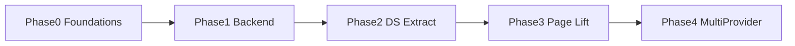
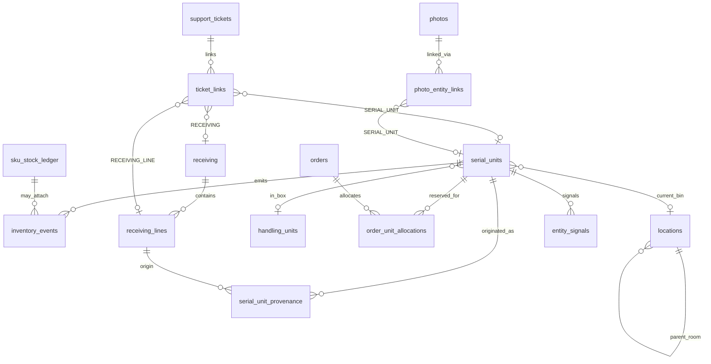
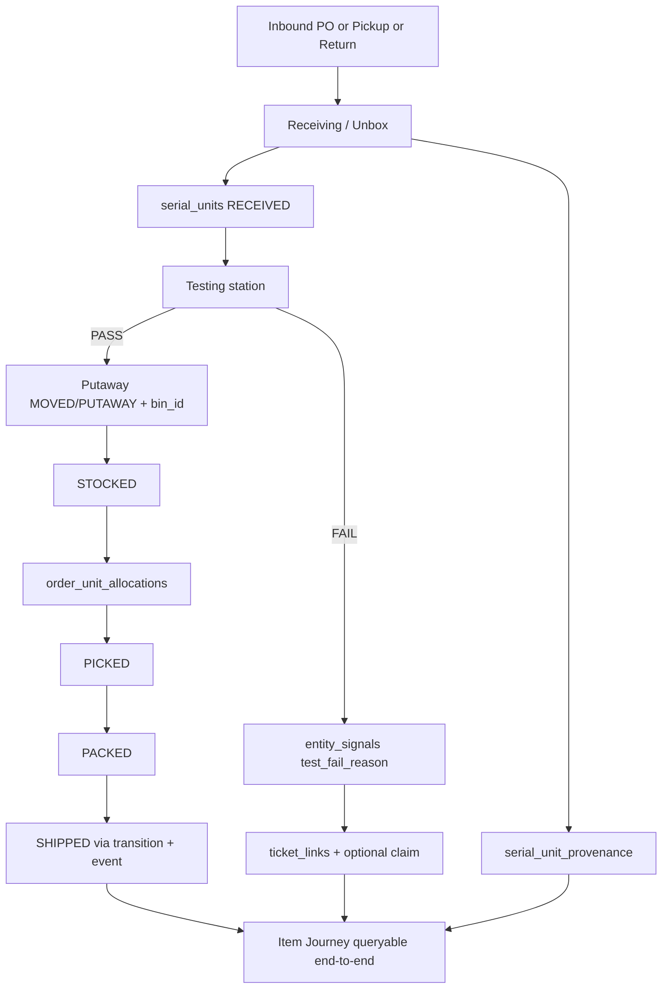
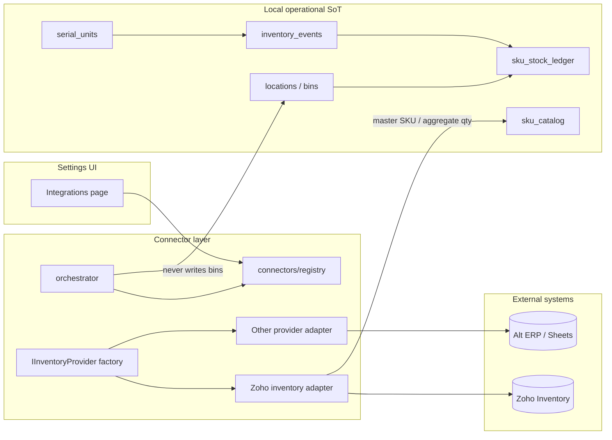

# Master Connections & Refactor Index

> **Status:** Living SoT — created 2026-07-10  
> **Scope:** Cross-feature interconnection, reuse, design-system lift, external inventory adapters  
> **Audience:** Every engineer and agent authoring a feature plan, route, or domain module  
> **Staff / 1-on-1 upgrade counterpart:** [`staff/INDEX.md`](./staff/INDEX.md) · [Hub README](./README.md)

This document is the **technical living index** that ties together feature plans, pages, user flows, API endpoints, data models, and design-system components. It does not replace domain plans — it **indexes and constrains** them so new work connects through shared spines instead of siloed modules.

**Dual-layer rule:** Human-readable “now vs change” plans live under [`staff/`](./staff/). This file is the engineering blueprint. Keep both in sync — see [§0](#0-staff--technical-dual-index) and [§10](#10-maintenance--governance).

---

## Table of Contents

0. [Staff ↔ Technical Dual Index](#0-staff--technical-dual-index)
1. [Executive Summary, Goals & How to Use](#1-executive-summary-goals--how-to-use)
2. [Current State Analysis & Pain Points](#2-current-state-analysis--pain-points)
3. [Core Architectural Principles](#3-core-architectural-principles)
4. [Proposed Data Architecture](#4-proposed-data-architecture)
5. [Integration Architecture (External Providers)](#5-integration-architecture-external-providers)
6. [Design System Rules, Shared Inventory & Page Lift](#6-design-system-rules-shared-inventory--page-lift)
7. [Cross-Feature Connection Map & Link Type Catalog](#7-cross-feature-connection-map--link-type-catalog)
8. [Phased Implementation Roadmap](#8-phased-implementation-roadmap)
9. [Recommended Folder / File Structure](#9-recommended-folder--file-structure)
10. [Maintenance & Governance](#10-maintenance--governance)
11. [Appendices](#11-appendices)

---

## 0. Staff ↔ Technical Dual Index

| Staff plan (1-on-1 upgrade / editable) | Technical sections (this file) |
|--------------------------------------|--------------------------------|
| [staff/INDEX.md](./staff/INDEX.md) — 1-on-1 upgrade hub | Entire index |
| [00 How to use](./staff/00-how-to-use-these-docs.md) | [Hub README](./README.md), §10 |
| [01 Big picture](./staff/01-big-picture.md) | §1, §3 |
| [02 Inventory & locations](./staff/02-inventory-and-locations.md) | §2.2 Inventory, §4.2 |
| [03 Testing & tickets](./staff/03-testing-and-support-tickets.md) | §2.2 Testing, §4.5 |
| [04 Item Journey](./staff/04-item-journey.md) | §2.2 Journey, §4.3–§4.4 |
| [05 External inventory (Zoho)](./staff/05-external-inventory-zoho.md) | §5 |
| [06 Local pickup](./staff/06-local-pickup.md) | §2.2 Pickup, §5.5 |
| [07 Pages & design](./staff/07-pages-and-design.md) | §6 |
| [08 Roadmap & phases](./staff/08-roadmap-and-phases.md) | §8 |

When staff wording or priority changes, update the staff plan first, then adjust checkboxes / matrix here. When implementation detail changes, update this file first, then refresh the staff “Now” column if behavior shipped.

---

## 1. Executive Summary, Goals & How to Use

### Verdict

Cycle Forge already has the right **domain spines** — `serial_units` + `transition()`, `inventory_events`, polymorphic hubs (`ticket_links`, `photo_entity_links`, `serial_unit_provenance`, `part_links`, `ops_events`, `entity_signals`), and an `IntegrationConnector` contract. The silos are not missing tables; they are **incomplete wiring, parallel writers, UI surfaces that don't share journey/ticket/location panels, and Zoho facts leaking into core tables**. This index makes those spines mandatory reuse targets and maps every feature through them.

### Goals

| Goal | Outcome |
|------|---------|
| **Interconnect** | Every operational entity answers “where has this been and what happened?” via one **Item Journey** query path |
| **Reuse** | New features compose existing hubs, shells, rails, and domain helpers — never fork status/event/ticket writers |
| **Design-system lift** | All pages meet archetype + linear-scaffold standards; shared journey/link UI is extracted once |
| **Adapter-swappable inventory** | External master SKU/stock (Zoho today) is a tenant-selected provider; local bin/test/pack/pickup remain SoT |

### How to use this living index

1. **Running a 1-on-1 staff upgrade?** Start at [`staff/INDEX.md`](./staff/INDEX.md), not this file.
2. **Before writing a feature plan** — read the matching staff plan for intent, then §3 principles, §7 matrix, and the link catalog here.
3. **While designing** — pick reuse targets from §6; do not invent parallel event/status/ticket tables.
4. **Before merge** — update §7 matrix + link catalog **and** the staff plan’s Now/Change/Done if operator-visible behavior changed.
5. **When stuck on “how do these relate?”** — use Appendix C (Item Lifecycle) and Appendix D (How to add a connected feature).

### Related SoT (do not duplicate)

| Concern | Canonical file |
|---------|----------------|
| **Staff 1-on-1 upgrade layer** | [`staff/INDEX.md`](./staff/INDEX.md) |
| Polymorphic table contract | [`.claude/rules/polymorphic-tables.md`](../../.claude/rules/polymorphic-tables.md) |
| Backend route / transition / audit | [`.claude/rules/backend-patterns.md`](../../.claude/rules/backend-patterns.md) |
| UI / archetypes | [`.claude/rules/ui-design-system.md`](../../.claude/rules/ui-design-system.md), [`.claude/rules/contextual-display.md`](../../.claude/rules/contextual-display.md) |
| Schema-wide polymorphic plan | [`docs/todo/schema-wide-polymorphic-refactor-plan.md`](../todo/schema-wide-polymorphic-refactor-plan.md) |
| Inventory upgrade | [`context/inventory_system_upgrade_plan.md`](../../context/inventory_system_upgrade_plan.md) |
| Operator surfaces / nav | [`docs/todo/studio-driven-operator-surfaces-refactor-plan.md`](../todo/studio-driven-operator-surfaces-refactor-plan.md) |
| Integrations | [`docs/integrations/`](../integrations/), [`src/lib/integrations/connectors/types.ts`](../../src/lib/integrations/connectors/types.ts) |

---

## 2. Current State Analysis & Pain Points

### 2.1 What is already strong

| Spine | Path | Role |
|-------|------|------|
| Unit status | `src/lib/inventory/state-machine.ts` → `transition()` | Sole writer for `serial_units.current_status` |
| Unified transition + workflow | `src/lib/workflow/applyTransition.ts` | `transition()` + `tapWorkflow()` |
| Unit event façade | `src/lib/inventory/unit-events.ts` → `recordUnitEvent()` | Upsert unit + lineage + optional ledger + status |
| Qty ledger | `src/lib/inventory/write-ledger-delta.ts` | Sole qty write → `sku_stock_ledger` |
| Lifecycle timeline | `src/lib/inventory/events.ts`, `src/lib/audit-log/inventory-spine.ts` | Append-only `inventory_events` + batched reads |
| Locations | `src/lib/neon/location-queries.ts`, `locations` + `bin_contents` | Room parent + bin children; take/put/set/count |
| Provenance | `serial_unit_provenance` + `v_serial_unit_origins` | Typed origin edges |
| Support registry | `src/lib/support/tickets.ts`, `ticket_links` | Provider-agnostic tickets + polymorphic entity links |
| Connector contract | `src/lib/integrations/connectors/types.ts` | `IntegrationConnector` + vault + orchestrator |
| Inbound anti-corruption | `src/lib/inbound/mirror.ts`, `source-registry.ts` | Multi-source PO mirror (Zoho \| eBay \| Amazon \| manual) |
| Polymorphic contract | `.claude/rules/polymorphic-tables.md` | Ratified 2026-07-01 |

### 2.2 Pain points (domain gaps this index solves)

#### Inventory — incomplete location context

- **Exists:** Rooms and bins in one `locations` table; `bin_role` (PICK_FACE, RESERVE, STAGING, …); printer addressing (`A-01-01-1-01`); `inventory_events` with `bin_id` / `prev_bin_id`; transfers API.
- **Gaps:**
  - **Rack is not a first-class entity** — encoded in barcode segments (`RackSegments` in `src/lib/barcode-routing.ts`) only.
  - `serial_units.current_location` is **TEXT**, not FK to `locations.id` (events already use `bin_id`).
  - Legacy `location_transfers` uses text location names — weaker than `MOVED` events.
  - Post-test vs post-pack placement is policy-scattered (`putaway-placement.ts`) rather than a single journey-visible placement story.
  - Multi-warehouse columns exist (`warehouse_id`) but writers are not fully stamped.

#### Testing & Receiving ↔ Support Tickets

- **Exists:** `support_tickets` + `ticket_links`; `getPrimarySupportTicketForReceiving` waterfall (RECEIVING / RECEIVING_LINE → SHIPMENT → photo ZENDESK_TICKET); `TestingTicketReplyCard` reuses claim reply; schema allows `SERIAL_UNIT` on `ticket_links`.
- **Gaps:**
  - No `getPrimarySupportTicketForSerialUnit` / entity-generic resolver — tests resolve tickets via carton/line only.
  - **Test FAIL does not auto-create or auto-link a ticket** — only emits `inventory_events` + `entity_signals` (`test_fail_reason`).
  - Bidirectional nav (ticket → unit → location → test) is incomplete; `LinkedTicketsPanel` is packing/receiving-heavy.

#### Relationship threads — Item Journey (not “drift”)

> **Terminology:** In this codebase, **drift** means ledger integrity mismatch (`v_sku_stock_drift`, `/api/cron/inventory/drift-check`). The operator question “Where has this serial been?” is **Item Journey / provenance thread**. Never overload “drift” for journey.

- **Exists:** `readInventorySpine`, `GET /api/operations/journey`, `SerialProvenanceHeader`, `serial-journey.ts`, `inventoryEventsToTimeline`, `ops_events`, `entity_signals`.
- **Gaps:** No single façade that merges events + tickets + provenance + photos + locations into one queryable thread; no shared `EntityJourneyPanel` on inventory / support / serial deep-links.

#### Zoho SKU / external inventory — coupled, not adapter-first

- **Exists:** Deep Zoho client (`src/lib/zoho/*`), PO sync, fulfillment sync, vault credentials, connector `validate()` for Zoho, inbound mirror started.
- **Gaps:**
  - Zoho connector has **no `sync()` / `pushInventory()` wired** — sync lives in ad-hoc crons/routes.
  - `zoho_*` columns still on core receiving tables; dual mirrors during cutover.
  - Tenants cannot swap inventory providers without core changes — channel connector framework planned (`docs/roadmap/gap-closure-plan.md`) but incomplete.
  - Local operational truth (bin, test, pack, pickup) is correct in principle but writeback paths still assume Zoho shapes.

#### Local pickup — dual models

- **Exists:** `local_pickup_orders` + finalize → Zoho `LCPU-*` PO + receiving link; receiving mode `pickup`; `fulfillment-mode.ts` detection.
- **Gaps:** Legacy `local_pickup_items` / `/api/local-pickups` coexist; Zoho-synced LCPU path **skips `receiving_lines`**; hardcoded vendor name “LOCAL PICKUP SELLER”; not registered as first-class inbound source type.

### 2.3 Silo symptoms (UI / nav)

| Symptom | Evidence |
|---------|----------|
| Parallel status writers | Routes still bypassing `transition()` (called out in `state-machine.ts` header) |
| Thin inventory wrappers | `/inventory/skus`, `/bins`, `/units`, … mount `InventoryShell` but don't share journey panel |
| Admin outside workbench | `/admin/**` standalone `min-h-screen` tables |
| Dual nav ID systems | `SidebarRouteKey` vs `SurfaceKey` — migration in progress |
| “Connections” naming collision | Admin `ConnectionsManagementTab` = **integrations**, not polymorphic entity links |

---

## 3. Core Architectural Principles

### P1 — Polymorphic hubs, not a Connection god-table

Every cross-entity relationship uses a **typed hub** under [`.claude/rules/polymorphic-tables.md`](../../.claude/rules/polymorphic-tables.md):

- Discriminator: named CHECK on `entity_type` (or domain-specific `origin_type`)
- Id: `BIGINT` `entity_id` (unless parent PK is genuinely UUID)
- Naming: `entity_type` / `entity_id` (never new `owner_*`)
- Org-led indexes; tenant-from-birth; parent-delete integrity; Drizzle model in same PR

**Do not** create a single `connections` table that absorbs tickets, photos, provenance, and parts. A thin **`src/lib/connections/` façade** *queries across* hubs.

### P2 — Event-sourced unit provenance (Item Journey)

- Status changes: **only** `transition()` / `applyTransition()`
- Qty changes: **only** `writeLedgerDelta()`
- Composite unit writes: prefer `recordUnitEvent()`
- Timeline reads: `readInventorySpine` / `recordInventoryEvent` + merge with `ops_events`, tickets, photos

Idempotency: thread `clientEventId` → `UNIQUE(client_event_id)` on `inventory_events`.

### P3 — Adapter pattern for external master data

- External systems supply **master SKU / aggregate stock / channel listings**
- Local DB supplies **bin placement, test history, packing, local pickups, serial identity**
- Tenant selects provider via `organization_integrations` + connector registry
- Zoho is **one adapter**, never “the inventory system”

### P4 — Strict design-system archetypes

Pick one archetype per region via [`.claude/rules/contextual-display.md`](../../.claude/rules/contextual-display.md):

| Archetype | Input | Examples |
|-----------|-------|----------|
| Station | Scan → crossfade → display | `/unbox`, `/test`, `/pack`, `/outbound` |
| Workbench | List → select → detail → update | `/inventory`, `/products`, `/support` (tickets) |
| Monitor | Observe / read-only | `/operations`, `/receiving/history` |
| Canvas | Node graph / semantic zoom | `/studio`, `/inventory/graph` |

Never blend two archetypes in one region. Compose `SidebarRailShell` / `RecentActivityRailBase`; linear scaffold; semantic colors only; `HoverTooltip` not `title=`.

### P5 — Radical DRY / reuse

Before adding a file, answer: **which existing hub, shell, rail, timeline, or domain helper already owns this?** If one exists, extend it. Forking list infrastructure, status writers, or ticket resolvers is a governance violation (see §10).

---

## 4. Proposed Data Architecture

### 4.1 Core entities (aggregate roots & facts)

| Entity | Table / module | Notes |
|--------|----------------|-------|
| **SerialUnit** | `serial_units` | Aggregate root for physical unit identity + status |
| **InventoryEvent** | `inventory_events` | Append-only lifecycle spine |
| **Location** | `locations` | Hierarchical: room (parent) → bin (child); rack = barcode segments |
| **BinContents** | `bin_contents` | SKU qty projection per bin (ledger-maintained) |
| **HandlingUnit** | `handling_units` | LPN / box; `serial_units.handling_unit_id` |
| **ProvenanceEdge** | `serial_unit_provenance` | `(origin_type, origin_id)` |
| **Receiving / Line** | `receiving`, `receiving_lines` + kind fact tables | Intake carton + lines |
| **Order** | `orders` (+ allocations) | Fulfillment; `order_unit_allocations` |
| **SupportTicket** | `support_tickets` + `ticket_links` | Provider-agnostic + polymorphic links |
| **Photo** | `photos` + `photo_entity_links` | Hub, not inline FKs |
| **OpsEvent / Signal** | `ops_events`, `entity_signals` | Station ops timeline + structured “why” |
| **PartLink** | `part_links` | Logical part → parent item |
| **External master** | provider adapter → `sku_catalog` / mirrors | Never own local bin/test truth |

### 4.2 Location hierarchy (prescriptive)

```
Warehouse (warehouses — schema ready)
  └── Room (locations row: parent, zone_letter, room label)
        └── Bin (locations child: barcode, bin_role, row/col or aisle/bay/level/position)
              └── [Rack] — NOT a table; encoded when position=0 / RackSegments
```

**Rules:**

1. Keep single `locations` table — do not normalize room/rack/bin into three tables without a dedicated migration plan.
2. Prefer **`bin_id` on `inventory_events`** for movement history (already present).
3. Harden unit current placement: add / use `current_bin_id` FK (or resolve TEXT → bin) so journey UI can deep-link to `/inventory/location/[barcode]`.
4. After testing and after packing, placement must emit `MOVED` / `PUTAWAY` / `PACKED` events with `bin_id` so journey is complete.
5. Deprecate new writes to text-only `location_transfers`; read path may remain for history.

### 4.3 Connection façade (query layer — not a new hub table)

Proposed module: `src/lib/connections/`

```ts
/** Stable entity reference used across hubs and UI chips. */
export type EntityRef = {
  entityType: string; // CHECK-constrained per hub
  entityId: bigint | number;
  organizationId: string;
};

/** One hop in the Item Journey (normalized for UI). */
export type JourneyHop = {
  at: Date;
  kind: 'INVENTORY_EVENT' | 'OPS_EVENT' | 'TICKET' | 'PROVENANCE' | 'PHOTO' | 'SIGNAL' | 'ALLOCATION';
  title: string;
  subtitle?: string;
  entityRef?: EntityRef;
  binId?: number | null;
  payload?: unknown;
  href?: string;
};

export interface ConnectionsFacade {
  /** Merge spines for “where has this serial been?” */
  getItemJourney(orgId: string, serialUnitId: number): Promise<JourneyHop[]>;

  /** All polymorphic links touching an entity (tickets, photos, parts, …). */
  resolveEntityLinks(ref: EntityRef): Promise<{
    tickets: unknown[];
    photos: unknown[];
    provenance: unknown[];
    parts: unknown[];
    signals: unknown[];
  }>;

  /** Primary support ticket waterfall — receiving today; serial/order next. */
  getPrimarySupportTicket(ref: EntityRef): Promise<unknown | null>;

  /** Ensure ticket_links row (idempotent). */
  linkTicket(ref: EntityRef, supportTicketId: number): Promise<void>;
}
```

**Implementation strategy:** compose existing readers — do not re-query raw SQL in every page:

- `readInventorySpine` / `inventoryEventsToTimeline`
- `getPrimarySupportTicketForReceiving` → generalize to `getPrimarySupportTicket(ref)`
- `serial_unit_provenance` / `v_serial_unit_origins`
- `photo_entity_links` queries
- `entity_signals` / `ops_events` readers
- `LinkedTicketsPanel` data path (`order-linkage.ts`)

### 4.4 Item Journey = merged provenance thread

```
Item Journey(serial_unit_id) =
    serial_unit_provenance edges
  ∪ inventory_events (by serial_unit_id)
  ∪ ops_events (entity SERIAL_UNIT | related RECEIVING_LINE)
  ∪ entity_signals (test_fail_reason, …)
  ∪ ticket_links (SERIAL_UNIT + waterfall via receiving/shipment)
  ∪ photo_entity_links
  ∪ order_unit_allocations + shipment_links
  ∪ handling_unit membership changes
```

Operator surfaces that **must** mount the shared journey panel (Phase 3):

- `/serial/[id]`, inventory unit detail, testing workspace, support ticket detail, operations history drill-in

### 4.5 Testing ↔ ticket integration pattern

| Trigger | Write | Link | UI |
|---------|-------|------|-----|
| Test FAIL / exception | `recordTestVerdict` + `entity_signals` (`test_fail_reason`) | Optional auto `ticket_links` (`SERIAL_UNIT` + `RECEIVING_LINE`) | `TestingTicketReplyCard` + deep link to ticket |
| Manual claim | Existing `zendesk-claim` flow | `claimTicketLinkEntity()` | Claim modal |
| Ticket open | — | Resolve unit via `ticket_links` + journey | `EntityJourneyPanel` on support workbench |

**Do not** invent a second ticket table. Extend:

- `src/lib/support/tickets.ts`
- `src/hooks/useEntitySupportTicket.ts`
- `GET /api/support/tickets/by-entity`

### 4.6 Stock drift vs Item Journey (keep separate)

| Concept | Mechanism | UI |
|---------|-----------|-----|
| **Stock drift** | `v_sku_stock_drift` + cron → `stock_alerts` type DRIFT | Inventory alerts |
| **Item Journey** | Connections façade merge | Journey panel / Operations History |

---

## 5. Integration Architecture (External Providers)

### 5.1 Current contract (keep)

[`IntegrationConnector`](../../src/lib/integrations/connectors/types.ts) already defines:

- `authKind`, `capabilities` (`orders` \| `inventory` \| `tracking` \| `payments` \| `voice`)
- `validate`, `sync`, `pushInventory`, `reconcile`
- Tenant vault: `organization_integrations` via `src/lib/integrations/credentials.ts`
- Orchestrator: `src/lib/integrations/connectors/orchestrator.ts`
- Registry: `src/lib/integrations/connectors/registry.ts`

### 5.2 Proposed `IInventoryProvider` specialization

External **inventory master** behavior should be an explicit capability surface (implemented by connectors that declare `capabilities: ['inventory', …]`), not Zoho-shaped calls from domain code.

Proposed path: `src/lib/integrations/connectors/inventory/types.ts`

```ts
import type { OrgId } from '@/lib/tenancy/constants';

/** Master SKU row as Cycle Forge understands it (provider-agnostic). */
export type ExternalSkuMaster = {
  externalRef: string;
  sku: string;
  name: string;
  gtin?: string | null;
  quantityOnHand?: number | null;
  quantityAvailable?: number | null;
  raw?: unknown; // provider payload — never leak into core columns
};

export type ExternalStockLevel = {
  externalRef: string;
  sku: string;
  locationExternalRef?: string | null; // provider warehouse/bin — NOT local locations.id
  quantityOnHand: number;
  quantityAvailable?: number;
};

export interface IInventoryProvider {
  providerId: string;

  /** Pull / upsert into local sku_catalog + provider mirror tables only. */
  pullSkuMaster(orgId: OrgId, opts?: { full?: boolean; cursor?: unknown }): Promise<{
    upserted: number;
    cursor?: unknown;
  }>;

  /** Aggregate stock from provider — never overwrites local bin_contents. */
  pullStockLevels(orgId: OrgId, opts?: { skus?: string[] }): Promise<ExternalStockLevel[]>;

  /** Push local authoritative qty decisions outbound (listings / ERP). */
  pushInventory(
    orgId: OrgId,
    updates: { sku: string; quantity: number; externalRefId?: string }[],
  ): Promise<{ pushed: number; failed: number }>;

  /** Reconcile provider aggregate vs local ledger totals (not bin-level). */
  reconcile(orgId: OrgId, opts?: { since?: Date }): Promise<{
    inSync: number;
    inboundFixed: number;
    outboundFixed: number;
  }>;
}
```

**Factory:** resolve via connector registry + org vault:

```ts
// Conceptual — wire in connectors/inventory/factory.ts
function getInventoryProvider(orgId: OrgId): Promise<IInventoryProvider | null>
```

Zoho adapter wraps existing `src/lib/zoho/*` + `zoho-receiving-sync.ts` **without** new Zoho columns on `receiving_lines`. Inbound POs continue through `inbound_purchase_order_mirror`.

### 5.3 Separation of concerns

| Concern | Owner | Must not |
|---------|-------|----------|
| Master SKU name / GTIN / ERP qty | `IInventoryProvider` → catalog/mirrors | Write `serial_units.current_status` or bin qty |
| Bin / room placement | `locations` + `writeLedgerDelta` / MOVED events | Call Zoho Inventory as SoT for bin |
| Test / pack / wipe history | `inventory_events` + station writers | Store only in Zoho notes |
| Local pickup intake | `local_pickup_orders` + receiving kind `PICKUP` | Hardcode Zoho vendor forever |
| Channel listings qty push | `pushInventory` on marketplace connectors | Bypass ledger |

### 5.4 Tenant configuration

1. Settings → Integrations (`src/app/settings/integrations/`) — connect provider
2. Org vault row in `organization_integrations`
3. Optional org setting: `inventory.primaryProvider` (default `zoho` for dogfood)
4. All Zoho HTTP must use `withZohoOrg(orgId, …)` — pattern for every provider context helper

### 5.5 Local pickup under the adapter model

- Intake kind `PICKUP` remains **local SoT**
- Finalize may *optionally* push a PO to the active inventory provider (Zoho LCPU today) via adapter method — not inline Zoho client in the finalize route long-term
- Register pickup in inbound source registry for Incoming visibility
- Consolidate `local_pickup_orders` as sole model; retire legacy list path

### 5.6 Immediate Zoho wiring (roadmap item)

Wire Zoho connector `sync()` to existing PO/receiving sync so Settings “Sync now” and cron share one path (`orchestrator.syncConnection`). Keep `pushInventory` / `reconcile` as follow-on.

---

## 6. Design System Rules, Shared Inventory & Page Lift

### 6.1 Hard rules (summary)

Full detail: [`.claude/rules/ui-design-system.md`](../../.claude/rules/ui-design-system.md).

1. **Pick archetype first** — station / workbench / monitor / canvas; never blend in one region.
2. **Compose rails** — `SidebarRailShell`, `RecentActivityRailBase`; supply renderers only.
3. **Linear scaffold** — `space-y-*` / `divide-y`; `flex-1 overflow-y-auto` body; `border-t` dividers.
4. **One row anatomy** — title → meta eyebrow → chips; selection = `bg-blue-50 ring-1 ring-inset ring-blue-400` only.
5. **Contextual info** — `HoverTooltip` (body-portal); status = small dot + tooltip.
6. **Icons** — `@/components/Icons`; structural & paired.
7. **Color** — only `src/design-system/tokens/colors/semantic.ts`; chips `bg-x-50 text-x-700 ring-x-200`.

### 6.2 Shared components / hooks to reuse (mandatory)

| Need | Reuse (exact path) | Do not |
|------|-------------------|--------|
| Unit status change | `src/lib/inventory/state-machine.ts` | Raw `UPDATE … current_status` |
| Unit + event write | `src/lib/inventory/unit-events.ts` | Parallel insert paths |
| Qty change | `src/lib/inventory/write-ledger-delta.ts` | Touch `sku_stock` directly |
| Timeline read | `src/lib/audit-log/inventory-spine.ts`, `src/lib/timeline/inventory-events.ts` | Ad-hoc event SQL per page |
| Timeline UI | `src/components/ui/EventTimeline.tsx` | New timeline widgets |
| Location ops | `src/lib/neon/location-queries.ts` | New location engines |
| Ticket by entity | `src/hooks/useEntitySupportTicket.ts`, `src/lib/support/tickets.ts` | Zendesk-only one-offs |
| Ticket list on entity | `src/components/linkage/LinkedTicketsPanel.tsx` | Fork ticket chips |
| Claim / reply | Receiving claim + `TestingTicketReplyCard` | New reply composers |
| Provenance header | `src/components/operations/SerialProvenanceHeader.tsx` | Duplicate origin cards |
| Inventory workbench | `src/components/inventory/InventoryShell` + panels | New inventory chrome |
| Station scan | `src/components/station/scan-bar/StationScanBar` + `SurfaceGate` | Fork scan bars |
| Sidebar list | `layout/SidebarShell` + `SidebarContextPanel` | Embed search outside shell |
| Recent activity | `RecentActivityRailBase` | New feed lists |
| Receiving line core | `useReceivingLineCore` | Fork line identity/audit |
| Testing controller | `useTestingLineController` | Bypass receiving core |
| Detail overlays | `detail-stacks/GlobalDetailStackHost` | One-off modals for entity drill |
| Integrations UI | `sidebar/connections-panel/` | Confuse with entity links |

### 6.3 Proposed extractions (new shared paths)

| Path | Responsibility |
|------|----------------|
| `src/lib/connections/index.ts` | Façade exports |
| `src/lib/connections/journey.ts` | `getItemJourney` merge |
| `src/lib/connections/resolve-links.ts` | Cross-hub link resolution |
| `src/lib/connections/support-ticket.ts` | Entity-generic primary ticket waterfall |
| `src/lib/connections/link-types.ts` | Living TypeScript catalog mirroring §7.2 |
| `src/components/connections/EntityJourneyPanel.tsx` | Shared journey UI (workbench + station detail) |
| `src/components/connections/EntityLinkChips.tsx` | Order # / serial / bin / ticket chips with deep links |
| `src/lib/integrations/connectors/inventory/` | `IInventoryProvider` + Zoho adapter |

### 6.4 Page lifting standards

Every production page must:

1. Declare archetype (comment or surface registry).
2. Use sidebar shell + mode via `?mode=` where applicable.
3. Mount journey / link chips when the primary entity is a serial, order, receiving line, or ticket.
4. Use semantic tokens and `HoverTooltip`.
5. Route mutations through domain helpers (`transition`, ledger, ticket registry).

### 6.5 Lift priority

| Priority | Area | Issue | Target |
|----------|------|-------|--------|
| P0 | Pack / ship path | Incomplete SHIPPED events / status | Emit via `transition` + events |
| P0 | Test FAIL → ticket | Manual only | Auto-link + optional create |
| P0 | Journey façade | Fragmented readers | `src/lib/connections/journey.ts` |
| P1 | Serial ticket resolver | Receiving-only waterfall | Entity-generic |
| P1 | Inventory sub-routes | Thin wrappers | `/inventory` + modes + shared panels |
| P1 | Location FK hygiene | TEXT `current_location` | Prefer `bin_id` / FK |
| P2 | FBA sidebar | Older shape | Align to MasterNav / SidebarShell |
| P2 | Admin tables | Outside workbench | RouteShell / monitor pattern |
| P2 | Reports | Not in sidebar registry | Fold into Operations or register |
| P2 | Pickup dual model | Legacy + new | `local_pickup_orders` only |
| P3 | Zoho as `IInventoryProvider` | Ad-hoc sync | Connector sync + adapter |
| P3 | Core `zoho_*` columns | Leakage | Mirror / typed facts only |

---

## 7. Cross-Feature Connection Map & Link Type Catalog

### 7.1 Connection matrix

Legend: **M** = shared model/table, **C** = shared component/hook, **E** = shared endpoint/domain helper, **L** = required polymorphic / journey link

|  | Inventory | Receiving | Testing | Tickets | Orders | Pickup | Pack | Ext. Inv. |
|--|-----------|-----------|---------|---------|--------|--------|------|-----------|
| **Inventory** | — | M/E/L | M/E/L | L | M/E/L | M/L | M/E/L | E (adapter) |
| **Receiving** | | — | M/C/E | M/C/E/L | L | M/C/E | L | E (PO sync) |
| **Testing** | | | — | C/E/L | L | — | C (photos) | — |
| **Tickets** | | | | — | L | L | L | Provider (Zendesk) |
| **Orders** | | | | | — | — | M/E/L | E (fulfillment) |
| **Pickup** | | | | | | — | — | E (optional PO push) |
| **Pack** | | | | | | | — | E (ship writeback) |
| **Ext. Inv.** | | | | | | | | — |

#### Concrete shared assets (by pair)

| Pair | Shared models | Shared components | Shared endpoints / helpers | Required connections |
|------|---------------|-------------------|----------------------------|----------------------|
| Inventory ↔ Receiving | `serial_units`, `inventory_events`, `receiving_lines` | `InventoryShell` panels, receiving putaway UI | `recordUnitEvent`, putaway routes, `transitionReceivingLine` | Provenance `RECEIVING_LINE`; MOVED/PUTAWAY events with `bin_id` |
| Inventory ↔ Testing | `serial_units`, events, checklists | `TechSurfacePage`, unit detail | `POST /api/serial-units/[id]/test`, `recordTestVerdict` | TEST_* events; signals; journey |
| Testing ↔ Tickets | `ticket_links`, `support_tickets` | `TestingTicketReplyCard`, `useEntitySupportTicket` | `/api/support/tickets/by-entity`, zendesk-claim | `ticket_links` on `SERIAL_UNIT` + `RECEIVING_LINE`; FAIL auto-link |
| Orders ↔ Inventory | `order_unit_allocations`, events | Allocation UI, unit chips | allocate/release, pick scan | Allocation rows; PICKED/SHIPPED events |
| Orders ↔ Tickets | `ticket_links`, shipment bridge | `LinkedTicketsPanel` | `order-linkage.ts` | SHIPMENT / ORDER links |
| Pickup ↔ Receiving | `local_pickup_orders`, `receiving` | `LocalPickupReviewPanel`, sidebar pickup mode | finalize, `fulfillment-mode.ts` | `receiving.source=local_pickup`; intake kind PICKUP |
| Pack ↔ Inventory | `serial_units`, events, handling units | Pack station, photo gallery | pack/ship APIs | PACKED/SHIPPED via `transition` |
| Ext. Inv. ↔ Inventory | catalog mirrors, ledger totals | Settings integrations | `IInventoryProvider`, orchestrator | Never bin-level SoT externally |
| Ext. Inv. ↔ Receiving | inbound mirror | Incoming board | `zoho-receiving-sync` → mirror | Provider-agnostic inbound rows |

### 7.2 Living Polymorphic Link Type Catalog

Update this table whenever a CHECK gains a value or a new hub is born.

#### `ticket_links.entity_type`

| Value | Parent | Primary resolver today | Target |
|-------|--------|------------------------|--------|
| `RECEIVING` | `receiving` | Yes (waterfall step 1) | Keep |
| `RECEIVING_LINE` | `receiving_lines` | Yes | Keep |
| `SHIPMENT` | shipping tracking / STN | Yes (step 2) | Keep |
| `SERIAL_UNIT` | `serial_units` | Schema yes; resolver weak | **Required** for testing journey |
| `ORDER` | `orders` | Partial via linkage | Strengthen |
| `REPAIR` | repair domain | Partial | Keep |
| `WARRANTY_CLAIM` | warranty | Partial | Keep |
| `FBA_SHIPMENT` | FBA | Partial | Keep |

#### `serial_unit_provenance.origin_type`

`RECEIVING_LINE` \| `TECH_SERIAL` \| `SKU_IMPORT` \| `RETURN` \| `FBA` \| `MANUAL` \| `LEGACY`

#### `photo_entity_links.entity_type` (+ `link_role` second axis)

Common: `RECEIVING`, `RECEIVING_LINE`, `SERIAL_UNIT`, order/shipment contexts — always use hub, never inline photo FKs on new entities.

#### `entity_signals` / `feed_memberships` / related CHECKs

Shared set (representative):  
`RECEIVING` \| `RECEIVING_LINE` \| `SERIAL_UNIT` \| `ORDER` \| `FBA_SHIPMENT` \| `REPAIR` \| `WARRANTY_CLAIM`

Signal kinds of note: `test_fail_reason`, …

#### `part_links`

Typed fact with real FK on `parent_item_id` — template for SaaS-owned M:N links.

#### `ops_events.entity_type`

Station ops timeline — compose into Item Journey; do not collapse into a single-pair if multi-anchor context is required (see `station_activity_logs` decision: leave multi-FK ledger as-is).

#### `shipment_links` (legacy naming)

Uses `owner_type` / `owner_id` — **do not reuse** for new tables; do not rename in place without a dedicated plan.

#### Integration “connections” (different word)

Admin/settings **Connections** = `organization_integrations` / connector registry — external systems, not polymorphic entity links. Prefer “integration connection” in UI copy when ambiguous.

### 7.3 API endpoints that form the connection surface

| Endpoint | Role |
|----------|------|
| `GET /api/inventory-events` | Filtered lifecycle timeline |
| `GET /api/operations/journey` | Multi-spine merge (evolve toward connections façade) |
| `GET /api/serial-units/[id]` | Unit detail |
| `GET /api/support/tickets/by-entity` | Ticket resolution |
| `GET /api/audit/bin/[id]`, `/api/audit/sku/[sku]` | Location/SKU audit |
| `POST /api/serial-units/[id]/move` | Unit move + MOVED |
| `POST /api/serial-units/[id]/test` | Verdict |
| `POST /api/transfers` | Bin-to-bin |
| `POST /api/receiving/zendesk-claim*` | Claim / link / thread |
| Connector orchestrator + `/api/cron/integrations/*` | External sync |

---

## 8. Phased Implementation Roadmap

### Phase 0 — Foundations (this document + façade skeleton)

- [x] Publish this index
- [ ] Add `src/lib/connections/` with journey + link-types stubs composing existing readers
- [ ] Point `docs/todo/README.md` + `context/INDEX.md` here
- [ ] Freeze rule: no new polymorphic hub without catalog update

### Phase 1 — Backend wiring

- [ ] Generalize support ticket waterfall → `getPrimarySupportTicket(EntityRef)` including `SERIAL_UNIT`
- [ ] On test FAIL: write `ticket_links` (and optional claim) — feature-flagged
- [ ] Pack/ship: emit SHIPPED / status via `transition()` + `inventory_events`
- [ ] Location hygiene: prefer `bin_id` on all moves; plan `current_bin_id` FK
- [ ] Wire Zoho `sync()` on connector → orchestrator
- [ ] Consolidate pickup to `local_pickup_orders` + inbound registry

### Phase 2 — Design-system extraction

- [ ] `EntityJourneyPanel` + `EntityLinkChips`
- [ ] Mount on serial deep-link, inventory unit panel, testing workspace, support ticket detail
- [ ] Standardize timeline via `EventTimeline` + `inventoryEventsToTimeline` only

### Phase 3 — Page lifting

- [ ] Inventory modes consolidated; shared panels everywhere
- [ ] Support workbench bidirectional nav (ticket ↔ unit ↔ bin ↔ test)
- [ ] Admin / reports lift or explicit monitor registration
- [ ] FBA sidebar alignment

### Phase 4 — Advanced / multi-provider

- [ ] `IInventoryProvider` + Zoho adapter
- [ ] Second provider stub (e.g. Sheets or “local-only”)
- [ ] Retire core `zoho_*` leakage in favor of mirror + typed facts
- [ ] Tenant `inventory.primaryProvider` setting
- [ ] Provider reconcile cron using adapter `reconcile()`



---

## 9. Recommended Folder / File Structure

```
docs/master-connections-and-refactor/
  README.md                     # dual-layer hub
  master-index-plan.md          # THIS FILE — technical living SoT
  staff/                        # human-readable / 1-on-1 upgrade plans
    INDEX.md                    # staff 1-on-1 upgrade hub + catalog
    00-how-to-use-these-docs.md
    01-big-picture.md … 08-roadmap-and-phases.md

src/lib/connections/            # NEW — compose hubs; do not own domain writes
  index.ts
  journey.ts
  resolve-links.ts
  support-ticket.ts
  link-types.ts

src/lib/integrations/connectors/
  types.ts                      # existing IntegrationConnector
  registry.ts
  orchestrator.ts
  inventory/                    # NEW
    types.ts                    # IInventoryProvider
    factory.ts
    zoho-inventory-provider.ts  # adapter wrapping src/lib/zoho/*

src/components/connections/     # NEW — shared UI
  EntityJourneyPanel.tsx
  EntityLinkChips.tsx

# EXISTING domains — keep owning writes
src/lib/inventory/              # transition, events, ledger, hold, allocate
src/lib/receiving/              # line SM, kinds, putaway, scan
src/lib/support/                # tickets registry
src/lib/inbound/                # provider-agnostic PO mirror
src/components/inventory/
src/components/receiving/
src/components/tech/
src/components/linkage/         # LinkedTicketsPanel — may re-export from connections/
```

**Rule:** `connections/` **reads and links**; `inventory/` / `receiving/` / `support/` **write**. Never put `transition()` inside the façade.

---

## 10. Maintenance & Governance

### 10.1 Mandatory updates

Every future feature plan **must**:

1. Link to this index **and** the matching [`staff/`](./staff/) plan in its header.
2. Update **§7.1 matrix** if it introduces a new cross-domain dependency.
3. Update **§7.2 link catalog** if it adds a discriminator value or hub.
4. List **reuse targets** from §6.2 (exact paths) — “build new X” requires justification that no existing X fits.
5. Declare **archetype** for each new UI region.
6. If operator-visible: update the staff plan’s **Now / Change / Done** and the status row on [`staff/INDEX.md`](./staff/INDEX.md).

### 10.2 Forbidden patterns

| Forbidden | Required instead |
|-----------|------------------|
| Raw `UPDATE serial_units SET current_status` | `transition()` / `applyTransition()` |
| Direct `sku_stock` mutation | `writeLedgerDelta()` |
| New `owner_type`/`owner_id` columns | `entity_type`/`entity_id` per contract |
| New photo FK columns on entities | `photo_entity_links` |
| Zoho client calls from unrelated domain modules | `IInventoryProvider` / inbound mirror / `withZohoOrg` inside Zoho adapter only |
| New sidebar list + search outside shell | `SidebarShell` + panel registry |
| Native `title=` tooltips | `HoverTooltip` |
| Parallel ticket tables | `support_tickets` + `ticket_links` |
| Calling stock-ledger mismatch “journey” or journey “drift” | Use correct term |

### 10.3 Review checklist (PR)

- [ ] Status / qty / ticket writes go through SoT helpers
- [ ] New polymorphic table matches `.claude/rules/polymorphic-tables.md`
- [ ] §7 catalog updated if discriminators changed
- [ ] UI uses archetype + shared journey/link components when entity-centric
- [ ] No new Zoho-shaped columns on core ops tables
- [ ] Tests cover domain helper (DB-free via `Deps` where applicable)

### 10.4 Ownership

- **This index** — platform / architecture; updated by any engineer who changes cross-feature links
- **Hub tables** — domain owners (inventory, support, photos, receiving)
- **Connector adapters** — integrations owners

---

## 11. Appendices

### Appendix A — Glossary

| Term | Meaning |
|------|---------|
| **Item Journey** | Queryable timeline of a serial unit: movements, tests, tickets, photos, allocations, provenance |
| **Drift** | Ledger integrity mismatch (`sku_stock` vs `sku_stock_ledger`); also schema-drift CI — **not** journey |
| **Provenance** | Origin edge(s) on `serial_unit_provenance` (how the unit entered the system) |
| **Polymorphic hub** | Table linking to multiple parents via `entity_type` + `entity_id` |
| **Connection façade** | `src/lib/connections/` read/link API across hubs |
| **Integration connection** | Tenant’s link to an external provider (`organization_integrations`) |
| **IInventoryProvider** | Adapter interface for external master SKU/stock |
| **Local SoT** | Bin placement, test/pack history, serial identity, local pickup intake |
| **External master** | Provider-owned catalog/aggregate qty |
| **Station / Workbench / Monitor / Canvas** | Display archetypes |
| **SurfaceKey** | Operator job key (`unbox`, `test`, `pack`, …) |
| **SidebarRouteKey** | Panel dispatch key (migrating toward surfaces) |

### Appendix B — ERD (conceptual)



### Appendix C — Item lifecycle flow



### Appendix D — Adapter architecture



### Appendix E — How to add a new connected feature (quick reference)

1. **Name the entities** you touch (serial, order, line, ticket, bin, …).
2. **Read §7 matrix** for those pairs — list existing M/C/E/L assets.
3. **Writes:** route through `transition` / `recordUnitEvent` / `writeLedgerDelta` / `support/tickets` / receiving SM as appropriate.
4. **Links:** add `ticket_links` / `photo_entity_links` / provenance / `entity_signals` rows — never new FK soup.
5. **Reads:** prefer `getItemJourney` / `resolveEntityLinks` once façade exists; until then compose spine readers.
6. **UI:** pick archetype; compose shell/rail; mount `EntityJourneyPanel` / link chips if entity-centric.
7. **External data:** go through connector / `IInventoryProvider` / inbound mirror — no new provider columns on core tables.
8. **Update this index** §7 + link your plan.
9. **Tests:** domain unit tests with injected `Deps`; e2e only for station flows that need them.
10. **Feature flag** any auto-ticket or provider cutover.

### Appendix F — Key file cheat sheet

| Concern | Path |
|---------|------|
| Status SM | `src/lib/inventory/state-machine.ts` |
| Apply + workflow | `src/lib/workflow/applyTransition.ts` |
| Unit events | `src/lib/inventory/unit-events.ts` |
| Ledger | `src/lib/inventory/write-ledger-delta.ts` |
| Events R/W | `src/lib/inventory/events.ts` |
| Spine read | `src/lib/audit-log/inventory-spine.ts` |
| Locations | `src/lib/neon/location-queries.ts` |
| Barcode / rack encode | `src/lib/barcode-routing.ts` |
| Receiving SM | `src/lib/receiving/state-machine.ts` |
| Test verdict | `src/lib/tech/recordTestVerdict.ts` |
| Support tickets | `src/lib/support/tickets.ts` |
| Order ↔ ticket linkage | `src/lib/order-linkage.ts` |
| Connector types | `src/lib/integrations/connectors/types.ts` |
| Inbound mirror | `src/lib/inbound/mirror.ts` |
| Polymorphic contract | `.claude/rules/polymorphic-tables.md` |
| Surface keys | `src/lib/stations/surface-keys.ts` |
| Sidebar nav SoT | `src/lib/sidebar-navigation.ts` |
| Drift cron | `src/app/api/cron/inventory/drift-check/route.ts` |
| Journey API | `src/app/api/operations/journey/route.ts` |

---

*End of Master Connections & Refactor Index. Treat edits as platform changes: update the catalog, keep terminology precise, and refuse parallel spines.*
