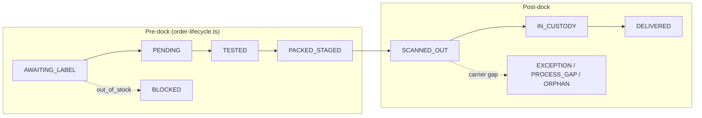
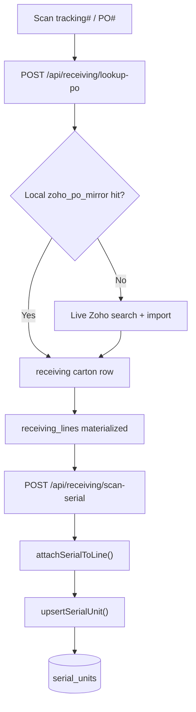
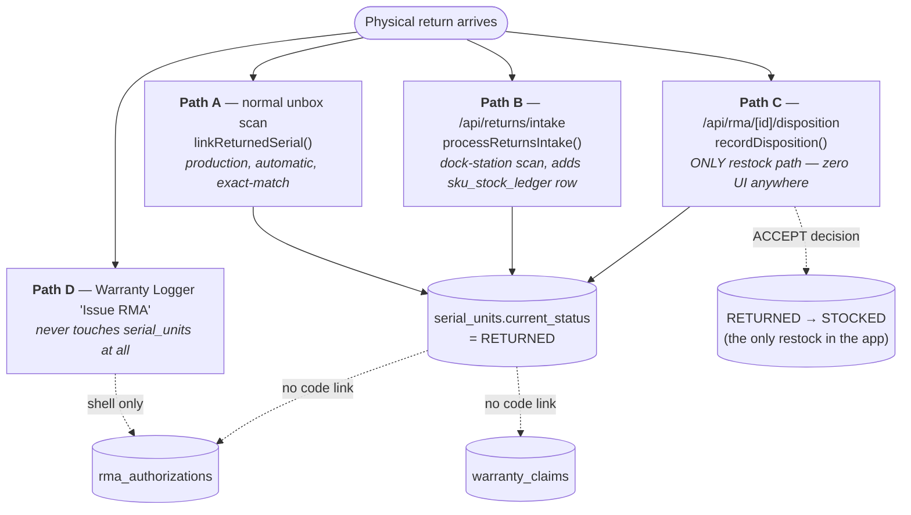
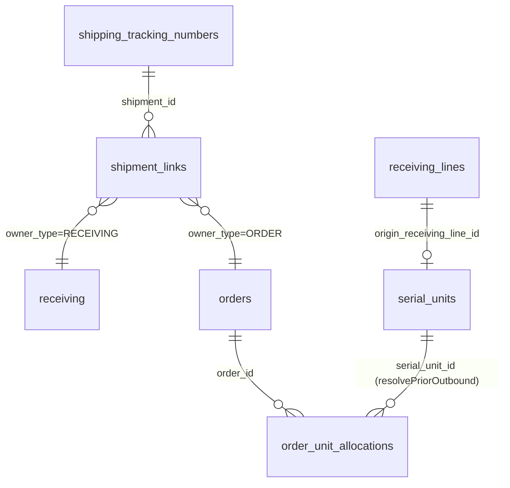

# Returns ↔ Receiving ↔ Sales-Order Unification — Research & Plan

**Status as of 2026-07-01:**
- ✅ Phase 0 — Current State Mapping: **COMPLETE** (this doc)
- ✅ Stakeholder clarifying Q&A: **COMPLETE** (decisions locked in below)
- ✅ Bug fix (§2 / §5): **COMPLETE** — root cause was neither of the two originally-suspected functions; see §5.
- ✅ Phase 1 — Gap Analysis (formal): **COMPLETE** — see §6.
- ✅ Phase 2 — Proposed Architecture (Studio-node-first): **COMPLETE** — see §7.
- ✅ Phase 3 — Simplification Strategy: **COMPLETE** — see §8.
- ✅ Phase 4 — Phased Implementation Roadmap: **COMPLETE** — see §9.
- ✅ Roadmap Stage 0 (bug fix) + Stage 1 (mechanical gaps #3/#7/#8/#15): **COMPLETE** — see §9. Gap #13 confirmed still gated on Stage 2.
- ✅ Roadmap Stage 2 (Studio-node wiring, the centerpiece): **COMPLETE** — see §9. `return_received` trigger live end-to-end (Paths A/B/C tapped, Path D can see prior returns), the `returns` node's rtv/scrap dead-ends closed (plus a second pre-existing one found while verifying), and Path C's disposition UI shipped at `/warehouse/rma/disposition`. Both migrations (`2026-07-01h` permission backfill, `2026-07-01i` template terminals) applied via `/db-migrate`.
- ✅ Roadmap Stage 3 (embedded round-trip timeline): **COMPLETE** — see §9. Both halves of the §1 success metric are now answerable from `SerialJourneySection`: ship/return counts (new) + per-scan staff attribution (mostly pre-existing, warranty spine fixed). Gap #11 (`ops_events` adapter) also closed opportunistically. **One disclosed verification gap**: the new UI could not be visually confirmed live (no browser auth session, no credentials this session) — verified via typecheck/lint/unit tests instead; also confirmed via live DB query that no serial has return history yet, so there's nothing to screenshot regardless.
- ✅ Roadmap Stage 4 (disposition backlog worklist + rollback/perf notes): **COMPLETE** — see §9. The "surface the backlog once Stage 2's UI ships" recommendation from the original Stage 4 notes is now built: `listDispositionBacklog()` + `GET /api/rma/backlog` + a Workbench-style list on `/warehouse/rma` that deep-links into the Station via `?serial=`. Rollback/perf notes updated to cover everything shipped across Stages 2–4, not just the original Stage 2 scope. Carried-forward gaps (disposition idempotency, already-cloned org drafts, warranty `alreadyReturned` UI) remain open — tracked, not silently dropped.

**Purpose of this doc:** this initiative required an exhaustive, code-grounded scan across 7 subsystems (sales orders, receiving, serial-scan/inventory state machine, returns/RMA/warranty, cross-entity linking, audit/timeline, Studio node engine) before any design work could start safely. That scan is expensive to redo. This document persists the findings + the decisions the user made in response, so a future session (or a future phase of this same initiative) does not need to re-run the scan. **Read this doc before touching any code in this initiative.**

Read order for a future session: §1 (decisions) → §2/§5 (bug + fix) → §3 (mapping) → §6 (gap analysis) → §7 (architecture) → §8 (simplification) → §9 (roadmap).

---

## 1. Decisions Locked In (stakeholder Q&A, 2026-07-01)

| Topic | Decision |
|---|---|
| **Matching strategy** | Exact-serial autolink (`linkReturnedSerial`, already live, flag `RECEIVING_RETURN_AUTOLINK`) stays the automatic backbone — **do not build a fuzzy SKU+date-window matcher**. The manual fallback for un-scanned/no-serial returns should search/pair by **sales order record** (not just PO#) — conceptually an extension of the existing Package Pairing "Link a PO" tab to also search sales orders. **This specific UI extension is explicitly OUT OF SCOPE for now** (deferred) — do not build it yet, just keep the architecture open to it. |
| **Priority trade-off** | **Balanced, pragmatic.** Don't rebuild a heavyweight compliance model on day one; don't just bolt on the cheapest hack either. Incrementally consolidate the 4 existing disconnected return mechanisms (see §3.4). |
| **Studio-node commitment** | **Yes — model new returns/receiving logic as new Studio node types**, even though current engine adoption is partial (only 3/11 node types have live unconditional taps; `applyTransition()` is used at only 2/~26 status-mutation call sites). This is a deliberate bet on the node-graph architecture, not a reaction to how proven it already is. |
| **Timeline UI scope** | **Embedded only.** Extend the existing per-record Journey sections (`SerialJourneySection`, `OrderTimelineSection`, the Master Operations Journey at `/api/operations/journey`) — do **not** build a standalone cross-entity Monitor page in this phase, even though the dormant `readJourneyBrowse`/`buildBrowseQuery` org-wide query exists and could support one later. |
| **Framing / bias for the architecture phase** | The user's mental model: **"when all the information is in the backend, just need to expose it."** Treat this as the default hypothesis for every gap: first ask "does the data/logic already exist and just isn't surfaced?" before proposing new backend mechanisms. (Caveat: the scan found real cases where the backend genuinely does NOT have the capability yet — e.g. no restock UI exists at all, `warranty_claims.serial_unit_id` is a dead FK with zero writers — so this bias should inform sequencing/effort, not be treated as universally true without re-checking per gap.) |
| **Hard constraints** | **None specified.** Explicitly optimize for whatever is architecturally best for the long-term SaaS, not for preserving any particular legacy quirk or table. |
| **Success metric (concrete, user-specified)** | A complete timeline that shows, for a given serial number: **how many times it has been returned and shipped out, and which staff ID performed each scan.** This is the acceptance bar for the Timeline UI work — it must answer "how many round-trips has this unit made, and who touched it each time" from one view. |

---

## 2. Confirmed Bug To Fix (reported by user, not yet located in code)

**Symptom:** On a return/PO scan, the UI currently displays the **first** PO/receiving record the product was ever associated with, when it should display the **most recent** serial-number scan/update for receiving and PO.

**Likely location (needs verification in Phase 1/2, not yet pinpointed to a file:line):**
- `src/lib/receiving/carton-source-link.ts` (`recomputeCartonSourceLink`) — this is the function that derives a carton's "representative" Zoho PO/order# from its lines; if it picks the earliest-linked line/PO rather than the most-recently-touched one, this is the bug.
- Alternatively, the receiving triage carton display (`TriagePanel.tsx` / `CartonContextCard.tsx`) or the serial-level display (`SerialCard.tsx`) may be reading a stale/first-write column instead of joining against the latest `inventory_events`/`receiving_scans` row for that serial.
- Also worth checking `resolvePriorOutbound()` / `findShippedOrderForSerialUnit()` (`src/lib/neon/serial-units-queries.ts`) — its tiebreak order (`state='SHIPPED' DESC, allocated_at DESC, o.id ASC`) was already flagged in the serial-scan scan as a possible source of "returns a stale/wrong order when a unit has been shipped-returned-reshipped multiple times" — this may be the same root cause described from the operator's side.

**Action:** locate and fix this as an early, concrete Phase 1 item — it's a good low-risk warm-up before the larger architecture work, and it directly serves the success metric in §1 (the timeline needs the *correct* most-recent event, not just *a* historical one).

---

## 3. Current State Mapping (full findings from the 7-domain scan)

### 3.0 Method & Confidence Note
Three domain scans (**Sales Orders**, **Receiving**, **Serial-Scan**) had live read-only access to the connected Neon Postgres and confirmed live row counts + `schema_migrations` applied status directly. Four scans (**Returns/RMA/Warranty**, **Cross-Entity Linking**, **Audit/Timeline**, **Studio Engine**) are static-code-only — migration-applied status for anything they cite is *asserted by doc comments or code behavior, not independently verified*. Row counts below are live-verified where stated.

### 3.1 Table Inventory

#### Sales Orders & Fulfillment
| Table | Purpose | Live rows | Key columns / constraints | Relationships |
|---|---|---|---|---|
| **`orders`** | THE operational sales-order/line-item table (one row per SKU line, not header+lines). PK literally named `shipped_pkey` — pre-dates all tracked migrations, originally called `shipped`. | **2,948** (single org; 2,322 `status='shipped'`) | `order_id`, `sku`, `condition`, `quantity`, `shipment_id`, `status` (free text), `out_of_stock`, `sale_amount`, `type_id`; `idx_orders_unique_account_order` UNIQUE(order_id, account_source) — **not org-scoped**, pre-dates migration history | 1:N `order_unit_allocations`/`order_unit_amendments`/`shipment_links`(owner_type=ORDER); N:1 `shipping_tracking_numbers`, `sku_catalog`, `customers` |
| **`order_unit_allocations`** | Reservation of a serialized unit to an order line — the per-serial fulfillment ledger (Phase 4/5). | **1** | `state` CHECK(ALLOCATED\|PICKED\|PACKED\|SHIPPED\|RETURNED\|RELEASED); `idx_oua_open_unit` UNIQUE partial (serial_unit_id) WHERE state NOT IN (RELEASED,RETURNED) | N:1 `orders`, `serial_units`; read by `resolvePriorOutbound()` for the returns loop |
| **`order_unit_amendments`** | Ordered-vs-fulfilled substitution audit record. | **0** | `reason_code`, `raised_at_node`, `status`, `client_event_id` idempotency | N:1 `orders` (CASCADE), `serial_units` |
| **`shipment_links`** | Unified polymorphic owner↔tracking table (`owner_type` RECEIVING\|ORDER), replaced `receiving_shipments`+`order_shipment_links`+`shipment_orders` (all dropped). | **4,433** | `owner_type`, `owner_id` (no FK, polymorphic), `shipment_id`, `is_primary`, `direction`, `role` | N:1 `shipping_tracking_numbers`; polymorphic → `orders.id` / `receiving.id` |
| **`shipping_tracking_numbers`** (STN) | Single global carrier-tracking master for both inbound and outbound. | — | `tracking_number_normalized` UNIQUE, custody milestone booleans/timestamps | 1:N `orders.shipment_id`, `shipment_links`, `shipment_tracking_events` |
| **`order_ingest_queue`** | DB-backed outbox for Zoho order webhook → drain cron. | **0** ever queued | `channel_order_id` UNIQUE | Feeds `OrderSyncService` → `sales_orders` |
| **`sales_orders` / `packages` / `invoices` / `credit_notes`** | Separate "Zoho-domain-mirror" order representation (2026-03-17). | **0 rows in all four** | `reference_number` (join key = `orders.order_id`, no FK), `return_status` (never read/written by anything) | Dormant — no dashboard reads FROM these |
| **`shipment_orders`** | Pre-STN Zoho-shipment mirror. | **DROPPED** (2026-06-28q, confirmed 0 rows before drop) | — | — |
| **`zoho_fulfillment_sync`** | Idempotency/audit ledger for shipped-order→Zoho accounting push. | **281** | `reference_number` UNIQUE, `stage`, `status` | keyed by `orders.order_id` (string, no FK) |
| **`work_assignments`** | Polymorphic tech/packer assignment + deadline (replaced `orders.tester_id`/`packer_id`/`ship_by_date`). | — | `ux_...active_entity` UNIQUE partial (entity_type,entity_id,work_type) WHERE status open | polymorphic → `orders.id` |

#### Receiving / PO Intake
| Table | Purpose | Live rows | Key columns / constraints | Relationships |
|---|---|---|---|---|
| **`receiving`** | The physical carton/PO-header row; pre-migration-era (39 live cols). | — | `is_return`, `return_platform`, `intake_type`, `priority_tier`, `source` CHECK(zoho_po\|unmatched) | 1:N `receiving_lines`, `shipment_links`(owner_type=RECEIVING) |
| **`receiving_lines`** | One row per PO/carton line — the workflow_status/testing/putaway unit (grew 8→50 cols via 20+ migrations). | — | `workflow_status` (`inbound_workflow_status_enum`), `receiving_type`, `source_order_id`, `zendesk_ticket` | FK `receiving_id`, `shipment_id`, `sku_catalog_id`; referenced by `serial_units.origin_receiving_line_id` |
| **`zoho_po_mirror`** | Read-only mirror of Zoho POs, used only by the email-PO reconciler + Incoming check. | **3,718** | `zoho_purchaseorder_number_norm` (generated) | joined by `receiving_lines.zoho_purchaseorder_id` |
| **`email_missing_purchase_orders`** | Gmail PO-confirmation self-healing worklist. | — | UNIQUE(org, gmail_msg_id) | matched against `zoho_po_mirror`/`receiving_lines` |
| **`handling_units`** | H-#### LPN box/tray grouping, decoupled from the 1:1 carton. | **0** | `code` (auto H-{id}), `status` OPEN→CLOSED | 1:N `serial_units.handling_unit_id` |
| **`receiving_line_zoho`/`_testing`/`_return`/`_putaway`** | Polymorphic-refactor typed 1:1 "facts" tables, dual-written via trigger, **not yet the read SoT** (receiving_lines wide columns still are). | **1224 / 1235 / 2 / 0** | `receiving_line_return.rma_ref` — schema exists, **0 non-null rows ever** | 1:1 with `receiving_lines` |
| **`receiving_line_facts`** | Long-tail org-custom facts registry (fact_kind + jsonb payload). | **17** (marketplace_listing=4, repair_service=2, sourcing_import=11) | UNIQUE(org, line, fact_kind) | FK `receiving_lines` |
| **`receiving_exceptions`** | New line-level OS&D exception table — writers not yet landed per its own migration comment. | **0** | — | FK `receiving_lines`, `receiving` |
| **`receiving_scans`** | Per-carton tracking-scan audit trail. | — | UNIQUE(tracking_number, receiving_id) | FK `receiving` |
| **`receiving_line_views`** | Per-staff "recently viewed" lines (server-backed). | — | UNIQUE(org, staff, line) | FK `receiving_lines`, `staff` |

#### Serial-Unit Lifecycle & Inventory Events
| Table | Purpose | Key columns / constraints | Relationships |
|---|---|---|---|
| **`serial_units`** | Aggregate-root registry, cradle-to-grave (26 cols). | `current_status` (`serial_status_enum`, 21 states); `ux_serial_units_org_normalized_serial` UNIQUE (re-scoped from global 2026-06-19); org default is **loud-fail** (NULLIF) unlike most tables | FK `receiving_lines`, `sku_catalog`, `handling_units`; 1:N `inventory_events`, `order_unit_allocations`, `serial_unit_condition_history`, `return_dispositions` |
| **`inventory_events`** | Append-only lifecycle spine tied to serial_units. | `client_event_id` UNIQUE (idempotency); org default is **USAV-fallback** (COALESCE) — inconsistent with serial_units' loud-fail default | FK `serial_units`, `receiving_lines`, `locations`, `sku_stock_ledger` |
| **`serial_unit_condition_history`** | Append-only per-unit grade timeline. | CHECK(prev≠new grade) | FK `serial_units`, `inventory_events` |

**Critical finding:** two independent writers mutate `serial_units.current_status` — the guarded `transition()`/`guard()` chokepoint (`src/lib/inventory/state-machine.ts`), and `upsertSerialUnit()` (`src/lib/neon/serial-units-queries.ts`), which writes status via its **own local `resolveTransition()`, entirely bypassing `guard()`/`TRANSITIONS`**. This second path is exactly the one that detects `SHIPPED→RETURNED` — the single most safety-relevant gap for a returns-matching redesign, and possibly related to the confirmed bug in §2.

#### Returns / RMA / Warranty
| Table | Purpose | Key columns / constraints | Relationships |
|---|---|---|---|
| **`warranty_claims`** | First-class claim record. | `serial_unit_id` FK — **real FK, but populated by zero code paths** (claim links to a unit only via a free-text `serial_number` string); `rma_id`, `repair_service_id` | FK `serial_units`(dead), `orders`, `customers`, `rma_authorizations`, `repair_service`, `reason_codes` |
| **`warranty_claim_events`** / **`warranty_repair_attempts`** / **`warranty_quotes`** | Per-claim timeline / repair log / post-warranty quote. | — | all FK `warranty_claims` |
| **`rma_authorizations`** | First-class RMA object (customer return or vendor RTV). | `rma_number` UNIQUE; **no `organization_id` column** — the only table in this domain relying purely on RLS/GUC | FK `orders`, `customers`; 1:N `return_dispositions` |
| **`return_dispositions`** | Per-unit disposition decision after an RMA. | `disposition_code` (ACCEPT\|HOLD\|RTV\|SCRAP\|REWORK) | FK `rma_authorizations`, `serial_units`, `inventory_events` |
| **`unit_repairs`** | Per-serial repair history (condition-grading QC), **independent of `warranty_repair_attempts`**. | — | FK `serial_units`, `rma_authorizations`, `repair_service`, `repair_failure_resolutions` |
| **`unit_quality_scores`** | Compute-and-display-only quality-score cache. Explicitly "no live eBay push." | PK `serial_unit_id` | recomputed on grade/repair/checklist edits — **never** after an RMA restock or returns-intake |
| **`repair_service`** | Legacy paid customer repair-shop ticket table, reused as a generic "repair ticket" by both `warranty_claims` and `unit_repairs`. | — | no CREATE TABLE in tracked migrations — pre-dates migration history |

#### Cross-Entity Linking
| Table | Purpose | Key columns / constraints |
|---|---|---|
| **`shipment_links`** | (see above) — the one genuinely unified polymorphic linkage table. | — |
| **`sku_relationships`** | Directed parent→child SKU BOM graph over `sku_catalog` ids. Cycle-prevention is **application-layer only**, not a DB constraint. | UNIQUE(parent,child) — not org-qualified |
| **`sku_catalog`** vs **`items`** | Two **independent SKU numbering schemes** — `items.sku` has no uniqueness constraint at all; `sku_catalog.sku` is UNIQUE. Never join on the raw string. | guarded resolver: `src/app/api/get-title-by-sku/route.ts` |
| **`sku_pairing_suggestions`** / **`sku_pairing_audit`** / **`sku_platform_ids`** | The **only genuinely fuzzy/automatic matching engine in the codebase** — nightly pg_trgm trigram similarity + weighted bonuses, but every pairing still requires an explicit human "Save"; no auto-pair even at confidence 100. Operates in the catalog↔listing domain, **not** order↔receiving. | — |
| **`fba_tracking_item_allocations`** | FBA's own separate tracking↔item junction against the same STN master — **not** folded into `shipment_links` (flagged in memory as a future fold-in, not done). | — |
| **`external_links`** | **Does not exist.** A prior "External Linkages" JSONB column + route + hook + migration was built, then **deliberately deleted** (confirmed by exhaustive repo-wide grep, zero hits). Replaced by the Email-PO tab reusing the relink write path. | — |

#### Audit / Event-Log / Timeline
| Table | Purpose | Writer discipline |
|---|---|---|
| **`audit_logs`** | Field-level before/after edit log, app-wide. | Only via `recordAudit()` |
| **`inventory_events`** | Per-serial lifecycle spine. | Only via `transition()`/`applyTransition()`/`recordInventoryEvent()` |
| **`station_activity_logs`** (SAL) | Physical scan ledger (tech/pack/ship-confirm). | Written directly by station routes — **no shared writer helper** |
| **`ops_events`** (new, 2026-06-30) | 4th polymorphic "SAL-style" spine for receiving-rail ordering. | `recordOpsEvent()`, fail-open on missing table (suggests uncertain rollout). **No `*ToTimeline` adapter — invisible to every existing timeline surface.** |

4 event-log tables, 3 independent multi-spine merge implementations (order-scoped 3-spine `OrderTimelineSection`; entity-scoped 5-spine Master Operations Journey; 2-3-spine `AuditTimeline` for bin/SKU), **each gated to exactly one entity**. A fully-built, unit-tested **org-wide cross-entity UNION query exists (`readJourneyBrowse`/`buildBrowseQuery`) but is wired to zero routes/hooks/components** — dormant code. (Per §1, standalone Monitor UI on this is explicitly deferred — but the query itself is a candidate to reuse for the embedded "how many times has this serial round-tripped" view the success metric asks for.)

#### Studio Workflow Engine
| Table | Purpose | Notes |
|---|---|---|
| **`workflow_definitions`** | One named, versioned graph per org; publish flips `is_active`. | UNIQUE(org,name,version) |
| **`workflow_nodes`** / **`workflow_edges`** | Canvas nodes (`type` = registry key) and port→node edges. | **No `organization_id`** — scope inherited from parent definition |
| **`item_workflow_state`** | Where a unit *currently sits* in the graph — **explicitly not domain state**; `serial_units.current_status` remains the real SoT. | UNIQUE(serial_unit_id) — one active position per unit |
| **`workflow_runs`** | Append-only per-node-execution observability log. | feeds Flow² lens |
| **`workflow_node_stats`** | Daily WIP/throughput snapshot (cron). | — |
| **`workflow_templates`** | Global, org-agnostic seed blueprints (e.g. `electronics-av-refurb`). | Cloned into an org's definitions; **bypasses the publish diagnostics gate entirely** on new-org auto-seed |
| **`station_definitions`** | L2 station-builder composition bound to a workflow node. | — |

### 3.2 Data Flow Diagrams

**Sales order lifecycle** (pure computed projection — `order-lifecycle.ts`, never a stored column):

Two execution tracks run in parallel today: the **legacy** track (packer_logs/station_activity_logs, carries ~2,947 of 2,948 orders) and the **new v2** track (`order_unit_allocations`, 1 live row) — bridged by `sync-legacy-pack.ts`, which mirrors a legacy PACK scan into a `transition()` call on the allocation.

**Receiving → serial creation:**


**THE existing return-detection loop** (the closest thing to "the matcher" today):
```mermaid
sequenceDiagram
    participant Op as Operator (unbox scan)
    participant Route as POST /api/receiving/scan-serial
    participant Upsert as upsertSerialUnit()
    participant Link as linkReturnedSerial()
    participant OUA as order_unit_allocations
    participant RL as receiving_lines / receiving

    Op->>Route: scan serial number
    Route->>Upsert: attachSerialToLine → upsert(status=RECEIVED)
    Upsert->>Upsert: resolveTransition(): prior=SHIPPED → RETURNED<br/>(RAW UPDATE — bypasses transition()/guard())
    Upsert-->>Route: is_return = true
    Route->>Link: linkReturnedSerial() [flag: RECEIVING_RETURN_AUTOLINK, default ON]
    Link->>OUA: resolvePriorOutbound() — EXACT match only (no fuzzy/tolerance)
    Link->>OUA: flip open SHIPPED row → RETURNED
    Link->>RL: persistReturnLinkage() — reclassify carton as RETURN
    Note over Link,RL: Never creates/updates rma_authorizations or warranty_claims.<br/>Never restocks (stays at RETURNED, not STOCKED).
```

**The four disconnected "a unit came back" mechanisms:**


**Cross-entity linking backbone:**


**Studio node-tap wiring status** (which node types are actually alive):
| Node type | Trigger event | Production status |
|---|---|---|
| `receiving` | `unit_received` | ✅ **Live, unconditional** — 2 receiving routes |
| `inspection` | `test_verdict` | ✅ **Live, unconditional** — `recordTestVerdict.ts` legacy path |
| `repair` | `repair_completed` | ✅ **Live, unconditional** — `repairs-queries.ts` |
| `list_ebay` | `listed` | ⚠️ Wired, **flag-gated** (`UNIFIED_ENGINE_FULFILLMENT_TAPS`) |
| `pack` | `packed` | ⚠️ Wired, **flag-gated** |
| `ship` | `shipped` | ⚠️ Wired, **flag-gated** |
| `list` | `listed` | ❓ Unclear if any call site targets it specifically vs. `list_ebay` |
| **`returns`** (ports: restock/rtv/scrap) | `return_received` | ❌ **Registered, paletted, even edged in the seeded flagship template — but `return_received` isn't even in the `WorkflowTapEvent` union. Zero call sites fire it anywhere. Fully inert.** |
| `data_wipe` | `data_wiped` | ❌ Inert — zero call sites |
| `kit_verify` | `pack_verified` | ❌ Inert — zero call sites |
| `decision` | (rule-table eval) | Generic router only — **not a record-matcher** |

The real RMA/returns domain (`src/lib/rma/authorizations.ts`, `src/lib/inventory/returns.ts`, `returned-serial-link.ts`) and the Studio's `returns` node are **two fully disconnected islands** — none of the returns/RMA modules call `tapWorkflow()` or reference the node type at all. **Given the §1 decision to go Studio-node-first, this `returns` node is the natural attachment point** — it already has the right shape (restock/rtv/scrap ports) and just needs (a) a real trigger event added to `WorkflowTapEvent`, and (b) a domain call site (most likely inside `recordDisposition()` or `linkReturnedSerial()`) that fires it.

### 3.3 Where return / receiving / serial-scan / cross-entity-linking logic lives (file index)

**Returns/RMA (4 parallel implementations):**
`src/lib/receiving/returned-serial-link.ts` (linkReturnedSerial, importSalesOrderByNumber) · `src/lib/inventory/returns.ts` (processReturnsIntake) · `src/lib/rma/authorizations.ts` (createAuthorization/markReceived/**recordDisposition**/closeAuthorization) · `src/lib/warranty/linkage.ts` (issueRmaForClaim/handoffToRepair) · `src/lib/warranty/mutations.ts`, `coverage.ts`, `clock.ts`, `clock-sweep.ts` · API: `/api/returns/{intake,undo}`, `/api/rma/**`, `/api/warranty/**`, `/api/receiving/scan-serial`, `/api/receiving/import-sales-order`

**Serial-scan / state machine:**
`src/lib/inventory/state-machine.ts` (transition/guard — the chokepoint, and the thing `upsertSerialUnit` bypasses) · `src/lib/neon/serial-units-queries.ts` (upsertSerialUnit, resolvePriorOutbound) · `src/lib/station-scan-routing.ts`, `scan-resolver.ts` · `src/lib/tech/recordTestVerdict.ts` · `src/lib/inventory/sync-legacy-pack.ts` · `src/components/station/**`

**Receiving:**
`src/lib/receiving/{intake-classification,priority-override,workflow-stages,relink-po,unpair-po,carton-source-link,attach-box,receive-line,serial-attach,exception-codes}.ts` · `src/lib/zoho/po-mirror-sync.ts`, `zoho-received-reconcile.ts` · `src/lib/zoho-receiving-sync.ts` · API: `/api/receiving/**`, `/api/receiving-lines`, `/api/handling-units/**`

**Cross-entity linking:**
`src/lib/shipping/shipment-links.ts` (the one unified linkage API) · `src/lib/neon/{sku-relationship-queries,pairing-queries,orders-tracking-queries}.ts` · `src/app/api/get-title-by-sku/route.ts` (SKU-collision guard) · `src/app/api/sku-catalog/graph/**`, `pair-suggestions`, `pair-batch`

**Audit/Timeline:**
`src/lib/audit-logs.ts`, `src/lib/inventory/events.ts`, `src/lib/ops-events.ts` · `src/lib/timeline/*` (8 adapters + `collapseTimeline`) · `src/lib/operations/journey.ts` + `journey-helpers.ts` (dormant browse mode) · `src/components/ui/EventTimeline.tsx`, `TimelineSection.tsx`, `src/components/audit/AuditTimeline.tsx`

**Studio engine:**
`src/lib/workflow/{contract,registry,index,advance,runtime,router,store,tap,applyTransition,diagnostics}.ts` · `src/lib/workflow/nodes/*.node.ts` (11 types) · `src/lib/studio/{definitions,templates,seed-org-workflow,flow-metrics,live-heat,people-coverage,static-flow-graph,simulate}.ts`

### 3.4 Confirmed Gaps & Friction Points

**Directly relevant to the integration goal:**
1. **No fuzzy/tolerance matcher exists anywhere** for order↔receiving↔return reconciliation (confirmed absence, not unexplored). The only fuzzy engine in the codebase (pg_trgm SKU-pairing hub) is in a completely different domain (catalog↔listing). *(Per §1, this is fine — not building one.)*
2. **Four independent "a unit came back" code paths** (linkReturnedSerial / processReturnsIntake / recordDisposition / warranty's Issue-RMA) that don't agree with each other — only one of them can restock (RETURNED→STOCKED), and **it has zero UI anywhere in the app**.
3. **`warranty_claims.serial_unit_id` is a dead FK** — the warranty workflow a support rep actually uses has no real code connection to `serial_units`, only a free-text serial string.
4. Studio's `returns` node is registered, paletted, and even edged in the default seed template — but **completely inert** (its trigger event doesn't exist in the tap-event union). **Prime candidate for the Studio-node-first work per §1.**
5. The exact-match reverse lookup (`resolvePriorOutbound`/`findShippedOrderForSerialUnit`) is the one genuinely reusable seam — production-tested, but 100% exact-identifier, zero tolerance, and possibly the source of the §2 bug (stale tiebreak ordering).

**Structural/safety:**
6. `upsertSerialUnit()` bypasses the guarded `transition()` state machine on the exact hot path that detects a return — a live violation of the CLAUDE.md "status changes only via transition()" rule.
7. `recordDisposition`'s restock never inserts a compensating `sku_stock_ledger` row (unlike `processReturnsIntake`) — a candidate stock-count drift source.
8. No dedicated `rma.*` permission family — every RMA route is gated by generic `orders.view`.
9. `applyTransition()` (the documented unified mutate+tap chokepoint) is adopted at only **2 of ~26** status-mutating call sites.

**Timeline fragmentation:**
10. 4 separate event-log tables, 3 independently-implemented multi-spine merges, each scoped to exactly one entity. A fully-built org-wide cross-entity browse query exists and is unit-tested but **wired to nothing**. *(Per §1, embedded-only for now — this dormant query is still a candidate implementation detail for the embedded "round-trip count" view.)*
11. `ops_events` (newest event spine) has no timeline adapter at all — invisible to every existing history surface.

**Dead/dormant code worth knowing about before designing on top of it:**
12. Two competing "order" representations: `orders` (2,948 rows, live) vs. `sales_orders`/`packages`/`invoices`/`credit_notes` (0 rows, dormant).
13. `receiving_line_return.rma_ref` — schema exists, wired end-to-end, **zero rows ever populated**.
14. `handling_units` — fully wired API + mobile page, **0 live rows**.
15. Three duplicate implementations of the receiving type-override rule (a known, self-documented tech-debt item in the code itself).

---

## 4. Next Steps

1. **Locate and fix the §2 bug** (return/PO scan showing first-PO instead of most-recent-scan) — good low-risk warm-up, directly serves the success metric.
2. **Write the formal Gap Analysis** (Phase 1) — largely draftable from §3.4 above, but should explicitly map each gap to "backend exists, needs exposing" vs. "backend genuinely missing" per the §1 framing bias, since that determines effort/sequencing.
3. **Proposed Architecture** (Phase 2) — Studio-node-first per §1: wire the existing inert `returns` node type into `WorkflowTapEvent` + a real domain call site (likely `recordDisposition()` and/or `linkReturnedSerial()`), consolidate the 4 return-mechanisms question, and design the embedded round-trip-count timeline view (reusing `readJourneyBrowse`/`buildBrowseQuery` machinery per-entity rather than org-wide).
4. **Simplification Strategy** (Phase 3).
5. **Phased Roadmap** (Phase 4) — including data migration considerations for existing `RETURNED`-status units that were never restocked, and rollback/performance risk notes.

---

## 5. Bug Fix — Root Cause & Resolution (2026-07-01)

### 5.1 Both originally-suspected functions were cleared

Both suspects named in §2 were checked with real file:line evidence and **neither is the bug**:

- **`recomputeCartonSourceLink`** (`src/lib/receiving/carton-source-link.ts`) does pick "first-linked line wins" (`ORDER BY id ASC`, line 40) for a carton's *display* PO# representative — but this is explicitly documented, intentional behavior for a narrow case (an Ecwid-derived carton with multiple per-line source orders), and it is a **carton-header** concern, not a **per-serial** one. Not the bug.
- **`resolvePriorOutbound` / `findShippedOrderForSerialUnit`** (`src/lib/neon/serial-units-queries.ts`) tiebreak — `ORDER BY (state='SHIPPED') DESC, allocated_at DESC, o.id ASC` — was independently re-verified by hand-tracing the ship→return→reship→return sequence: `(state='SHIPPED') DESC` correctly prefers a still-open shipment over a flipped-to-RETURNED one, `allocated_at DESC` correctly prefers the most recent allocation, and `o.id ASC` is a documented tiebreak for exact-timestamp ties only. **This function is correct and was not the source of the reported symptom.**

### 5.2 Actual root cause

`serial_units.origin_receiving_line_id` is **frozen at first-write**. `upsertSerialUnit`'s UPDATE path (`src/lib/neon/serial-units-queries.ts:647`, was line 647 pre-fix) reads:

```sql
origin_receiving_line_id = COALESCE(origin_receiving_line_id, $9),
```

— alongside `origin_source`, `origin_tsn_id`, `origin_sku_id`, `received_at`, `received_by`, and `unit_uid`, all COALESCE'd the same way. This is a **deliberate, systemic "immutable birth fact" pattern** (confirmed by cross-checking `unit_uid`'s own doc comment: "the reprint guarantee" — once minted, never changes). So the column is *working as designed* for what it's named: the receiving line a serial was **first ever** attached to, forever.

The bug is that **five-plus read sites across the app join on this column expecting "current," not "first-ever"** — confirmed with a dedicated read-site trace (background investigation, 151K tokens, 46 tool calls) that found and verified reachability from live UI/API surfaces:

| Site | File:line (pre-fix) | User-facing symptom |
|---|---|---|
| `fetchSerialsForLines` | `src/app/api/receiving-lines/route.ts:39-48` | Receiving/unbox workspace (`SerialCard`, `PoLinesAccordion`, carton Timeline tab, `ReceivingLineWorkspace`) shows a re-received serial on its **original** line forever; the line it's actually on shows it as missing. |
| "search by serial" (×2) | `src/app/api/receiving-lines/route.ts:493-504, 518-524` | Scanning/typing a serial to jump to "its PO" (`resolve-testing-scan.ts`'s own doc comment: *"the path for 'scan the bare serial printed on the unit → jump to its PO'"*) resolves to the **stale, first-ever** line. |
| `readSerialProvenance` | `src/lib/operations/journey.ts:212-248` (now ~230) | Operations "By unit" mode's **"originating PO" chip** (`SerialProvenanceHeader.tsx`) — the single most literal match to the bug report's wording — showed the first-ever PO forever. |
| `fetchLineByUnitId` | `src/lib/testing/resolve-testing-scan.ts:241-253` | Same "jump to PO" testing-station flow, via `GET /api/serial-units/[id]`. |
| Mobile unit page | `src/app/serial/[id]/page.tsx` (+ `GET /api/serial-units/[id]`) | **Not just display** — `postStatus`/`submitPutaway` POSTed status/putaway actions to the **stale** line's API routes, meaning a mobile operator's action could silently apply to the wrong (long-since-processed) receiving line. |
| Zoho PO-note aggregation | `src/app/api/receiving/mark-received-po/route.ts:554-566` | Misattributes a re-received serial to the wrong Zoho PO note. **Not fixed this pass** (see §5.4). |
| Photo↔serial backlink | `src/lib/photos/queries/library.ts:169,191` | Same frozen join, used to resolve a serial's carton for photo display. **Not fixed this pass** (see §5.4). |

Two *other* read sites of the same column were checked and are **correctly** using "first-ever" semantics — left untouched:
- The `view=scanned` "was this carton ever opened" check (`receiving-lines/route.ts`, `su_unboxed.origin_receiving_line_id = rl.id`) — deliberately wants "did ANY serial originate here," which is exactly what the frozen column answers.
- `detachSerialFromLine`'s safety scope (`src/lib/receiving/serial-attach.ts:326,332`) — deliberately wants "only let me touch a serial via the line it was born on," a correctness guard, not a display value.

### 5.3 Fix implemented

**Decision: fix the read side, not the write side.** Flipping the COALESCE (always overwrite `origin_receiving_line_id`) was considered and rejected — it would silently break the two correct "first-ever" read sites above (the opened-carton check would resurrect already-processed cartons back into the "to unbox" queue the moment a unit's serial later moved elsewhere).

1. **New resolver** — `resolveCurrentReceivingLineIds(serialUnitIds, orgId)` (`src/lib/neon/serial-units-queries.ts`): for each serial, resolves its most recent `inventory_events` row carrying a `receiving_line_id` (every `attachSerialToLine` call already writes one — `src/lib/receiving/serial-attach.ts:217-241`), falling back to `origin_receiving_line_id` for units with no such event (legacy/pre-event-log rows). This is additive — the frozen column is untouched and still readable by anything that legitimately wants it.
2. **Fixed read sites:** `fetchSerialsForLines` and both "search by serial" clauses in `receiving-lines/route.ts`; `readSerialProvenance` in `journey.ts`; `GET /api/serial-units/[id]` (now also returns a `current_receiving_line_id` field alongside the untouched `origin_receiving_line_id`); its two consumers, `resolve-testing-scan.ts`'s `fetchLineByUnitId` and the mobile `serial/[id]/page.tsx` (which also fixed a real **action-correctness** bug — status/putaway POSTs now target the unit's actual current line).
3. **Verification:** `tsc --noEmit` clean, `eslint` clean on all touched files, and the full existing test suites for the touched modules (`serial-units-queries.test.ts`, `resolve-testing-scan.test.ts`, `returned-serial-link.test.ts`, `journey-helpers.test.ts` — 30 tests) pass unchanged.

### 5.4 Known-related, deliberately NOT fixed this pass

Same root cause, same fix pattern would apply, but out of scope for the "low-risk warm-up" bug fix (no silent claim of completeness — flagged here for Phase 4 sequencing):
- `mark-received-po/route.ts`'s Zoho PO-note serial aggregation (external-system write; higher blast radius, deserves its own review).
- `src/lib/photos/queries/library.ts`'s serial→carton backlink for photo display.

---

## 6. Phase 1 — Gap Analysis

For each of the 15 confirmed gaps in §3.4, classified as **(a) backend capability exists, needs exposing/wiring** or **(b) genuinely missing, must be built** — re-verified against current code (not trusted from the original scan) via a dedicated background investigation per gap cluster. Per the §1 framing bias: checked, not assumed.

| # | Gap | Classification | Evidence |
|---|---|---|---|
| 1 | No fuzzy/tolerance matcher | **N/A — out of scope by decision**, not a gap to close | §1 locked decision: exact-serial stays the backbone; do not build one. |
| 2 | 4 disconnected "unit came back" paths | **Mixed** — (a) 3 of 4 paths are functional; (b) the one restock path has zero UI | See §6.1 below — this is the initiative's centerpiece gap, broken out in detail. |
| 3 | `warranty_claims.serial_unit_id` dead FK | **(a) — mostly.** Column is real, the sole write site (`createClaim`, `src/lib/warranty/mutations.ts:208-224`) already binds it from a validated Zod field. `findByNormalizedSerial()` (`src/lib/neon/serial-units-queries.ts`) already exists to resolve a string→id. Gap is that **nothing calls that resolver** before the INSERT, and the only production UI (`WarrantyLogClaimDialog.tsx`) only collects free-text `serialNumber`, never sends `serialUnitId`. Small backend glue + one UI field, not new infrastructure. | Dedicated trace: 22 `warranty_claims` write sites repo-wide, only the one INSERT ever references `serial_unit_id`; zero UI sends it. |
| 4 | Studio `returns` node inert | **(b) — mostly missing**, but the shell exists. Node registered/paletted (`src/lib/workflow/nodes/returns.node.ts`), one edge wired in the seed template (`restock → qc`), but `return_received` isn't in `WorkflowTapEvent` (`src/lib/workflow/tap.ts:43-60`), zero call sites fire it, and the `rtv`/`scrap` ports are **unwired dead-ends that would trip the publish-diagnostics gate as an error** the moment anyone tries to republish that template. | §7 designs the fix; templates trace confirmed the dead-end-port landmine. |
| 5 | `resolvePriorOutbound`/`findShippedOrderForSerialUnit` tiebreak | **(a) — fully exists and correct.** Re-verified during the §5 bug fix: this function is NOT buggy (corrects the original scan's suspicion). It remains the one genuinely reusable exact-match seam. | §5.1. |
| 6 | `upsertSerialUnit()` bypasses guarded `transition()` | **(b) — genuinely missing capability.** Confirmed still true. Root cause understood precisely (new, not in original scan): `guard('SHIPPED','RECEIVED')` is rejected by the state machine (`TRANSITIONS.SHIPPED = {'RETURNED'}` only, `src/lib/inventory/state-machine.ts:78`) — `upsertSerialUnit`'s local `resolveTransition()` exists specifically to **reinterpret** a receiving-sourced "RECEIVED" target as "RETURNED" *before* any guard runs, which `transition()`/`applyTransition()` have no hook for today. Consolidating requires adding that pre-guard reinterpret step to the shared chokepoint, not just swapping a function call. | Direct read of `state-machine.ts` + `serial-units-queries.ts`. |
| 7 | `recordDisposition` restock skips `sku_stock_ledger` | **(a) — pattern exists elsewhere, needs replicating.** Confirmed: zero `sku_stock_ledger` references in `authorizations.ts`. `processReturnsIntake` (`src/lib/inventory/returns.ts:158-167`) already shows the exact INSERT pattern to copy (`delta=1, reason='RETURN_CUSTOMER'`, threaded as `stockLedgerId` into the paired `transition()` call). Low effort. | 4-paths trace, confirmed via grep + line citation. |
| 8 | No `rma.*` permission family | **(b) — genuinely missing entries**, but the mechanism (a) exists. Confirmed: zero `rma.` permissions in `permission-registry.ts`; all 6 RMA routes (incl. **DELETE**) gate on generic `orders.view`/`requireRoutePerm`. | Structural-gaps trace, all 6 route file:lines cited. |
| 9 | `applyTransition()` adopted at 2/~26 | **(a) — pure adoption gap, mechanism proven.** Re-counted precisely: exactly 2 real call sites (`receiving/lines/[id]/status/route.ts:181`, `recordTestVerdict.ts:186`) vs. 21 files / 32 call sites still on raw `transition()`. Ratio confirmed to still hold. Migration work, not new engineering. | Structural-gaps trace — full 21-file list captured. |
| 10 | Timeline fragmentation / dormant browse query | **(a) — corrects the original scan's framing.** `readJourneyBrowse`/`buildBrowseQuery` (`src/lib/operations/journey-helpers.ts`) is confirmed **genuinely org-wide-only** — its `JourneyFilters` has no single-entity-equality field, so it is NOT a drop-in "per-entity" reuse candidate as §1/§4 hypothesized. **However**, the function that actually IS per-entity, `readJourneyEntity` (`journey.ts:267-443`), **already exists, is already exposed**, and already powers the embedded `SerialJourneySection` today (5 spines: SAL, inventory_events, audit_logs, carrier, warranty — no `ops_events`). The embedded round-trip view is an *enhancement* of an already-live surface, not new plumbing. | Timeline-machinery trace (103K tokens) — corrects §3.4/§4's framing; see §7.4. |
| 11 | `ops_events` has no timeline adapter | **(b) — genuinely missing, but pattern well-established.** Confirmed: zero `ops_events` references across all 8 `src/lib/timeline/*ToTimeline` adapters. Schema (`2026-06-30_ops_events.sql`) already carries `actor_staff_id`, so a 9th adapter is mechanical, mirroring the 8 that exist. | Timeline-machinery trace. |
| 12 | Two competing "order" tables (`orders` 2,948 rows vs. `sales_orders`+3 siblings, 0 rows) | **No action needed for this initiative.** `orders` is unambiguously the live table; the 0-row siblings are dormant. Flagged for a separate cleanup, not blocking. | Original scan (live-verified row counts), unchanged. |
| 13 | `receiving_line_return.rma_ref` never written | **(a) — fully exists, needs one caller change.** The writer (`upsertReceivingLineReturn`, `src/lib/receiving/facts/narrow.ts:148-160`) already maps `rmaRef`; its sole production caller (`persistReturnLinkage`, `returned-serial-link.ts:227-232`) simply never passes the key. Trivial once an RMA is actually associated with a return (ties to §6.1/§7.2). | Structural-gaps trace, confirmed backfill migration explicitly excludes the column too. |
| 14 | `handling_units` fully wired, 0 live rows | **(a) — fully exists; out of scope.** Full CRUD + mobile UI confirmed wired end-to-end. This is a business-adoption question, not an engineering gap, and not directly relevant to returns unification. | Structural-gaps trace. |
| 15 | 3+ duplicate receiving type-override implementations | **(a) — SoT exists, needs consolidating.** Confirmed self-documented in `registry.ts:117-121`; the trace found **2 more** beyond the 3 named (5 total: `effectiveIntakeKind` (SoT), `receiving-sidebar-shared.ts`, `zendesk-claim-template.ts`, `useReceivingType.ts` (opposite precedence!), `triage-intake-kind.ts`). Worth doing *before* Phase 4 rollout since this initiative directly touches return-vs-PO carton classification. | Structural-gaps trace, all 5 file:line cited. |
| 16 *(new, found this session)* | `serial_units.origin_receiving_line_id` COALESCE-freeze misread as "current" at 5+ sites | **Fixed this session** — see §5. | §5. |

### 6.1 Gap #2 in detail — the 4 paths, precisely

A dedicated trace (142K tokens, 61 tool calls) mapped every table/function each path touches:

| Path | Function | `transition()`? | `inventory_events`? | `order_unit_allocations`? | `sku_stock_ledger`? | `rma_authorizations`/`return_dispositions`? | UI reachability |
|---|---|---|---|---|---|---|---|
| **A** | `linkReturnedSerial` (`returned-serial-link.ts:315`) | **Never called** — status already flipped upstream by `upsertSerialUnit`'s bypass (Gap #6) | ✅ writes RETURNED (non-fatal) | ✅ flips SHIPPED→RETURNED | ❌ never | ❌ never | ✅ `POST /api/receiving/scan-serial`, 8 UI call sites |
| **B** | `processReturnsIntake` (`returns.ts:84`) | ✅ called, guarded, `to:'RETURNED'` | ✅ via transition() | ✅ flips | ✅ writes (`delta=1, RETURN_CUSTOMER`) | ❌ never | ⚠️ **route has zero UI**; lib fn reachable only via `/admin/inventory/returns` server action bypassing the route |
| **C** | `recordDisposition` (`authorizations.ts:271`) | ✅ called, but **only** for ACCEPT-on-RETURNED (`to:'STOCKED'`) | ✅ NOTE + via transition() | ✅ backfills order_id | ❌ **never** (Gap #7) | ✅ writes `return_dispositions`, updates `rma_authorizations` | ❌ **zero UI anywhere** — confirmed exactly one call site (the route itself); `src/app/warehouse/rma/page.tsx` self-documents: "Per-unit dispositions live on a future detail page" |
| **D** | `issueRmaForClaim`/`handoffToRepair` (`warranty/linkage.ts:109,247`) | **Never** — no import of `state-machine.ts` | ❌ never | ❌ never | ❌ never | ✅ creates `rma_authorizations` | ✅ working UI (`WarrantyClaimActions.tsx`) |

**Reading this table:** Path D is a complete island (zero connection to `serial_units`/`inventory_events` — a warranty claim's RMA issuance today is pure paperwork with no inventory-system awareness). Path C is backend-complete but has no front door. Paths A and B both flip `order_unit_allocations` correctly but never touch RMA/disposition tables. **No two paths agree on which of `sku_stock_ledger` / `rma_authorizations` / `return_dispositions` get written**, which is exactly the "don't agree with each other" finding from the original scan, now with precise per-path evidence.

---

## 7. Phase 2 — Proposed Architecture (Studio-node-first)

Per §1: model new returns/receiving logic as Studio node types. This section designs (a) a real trigger for the inert `returns` node, (b) how the 4 paths converge without a risky big-bang merge, (c) a landmine that must be closed before the trigger goes live, and (d) the embedded round-trip timeline.

### 7.1 A real trigger for the `returns` node

**The node shell already exists and is correctly shaped** (`src/lib/workflow/nodes/returns.node.ts`) — `stationNode()` factory, ports `restock`/`rtv`/`scrap`, gated on `input.event === 'return_received'`, reading `input.disposition` to pick the port. What's missing is entirely on the trigger side.

**Step 1 — add the event.** `WorkflowTapEvent` (`src/lib/workflow/tap.ts:43-60`) gets one new member:

```ts
export type WorkflowTapEvent =
  | 'unit_received' | 'test_verdict' | 'data_wiped' | 'repair_completed'
  | 'listed' | 'packed' | 'pack_verified' | 'shipped'
  | 'return_received';   // NEW
```

**Step 2 — handle re-entry of a `done` unit.** This is the part the original scan didn't surface, found by reading `tap.ts` directly: a unit that shipped and completed its graph run has `item_workflow_state.status = 'done'`, and `tapWorkflow()`'s current logic is:

```ts
} else if (state.status === 'done') {
  return; // finished runs stay finished (returns re-enter via rma_intake later)
}
```

The comment is a breadcrumb — this was anticipated but never built. **Every normal return is exactly this case** (a unit that shipped-and-completed, now coming back), so without a fix, firing `return_received` on a `done` unit is silently dropped. The fix is a new branch **before** this early return:

```ts
if (state?.status === 'done' && args.event === 'return_received') {
  const returnsNode = await findNodeOfType(state.organizationId, 'returns'); // NEW helper
  if (returnsNode) {
    await enrollItem({                       // src/lib/workflow/store.ts — already
      orgId: state.organizationId,             // upserts on the unit's ux_item_workflow_state_unit
      serialUnitId: args.serialUnitId,          // unique index, so "re-enroll" is exactly
      workflowDefinitionId: returnsNode.workflowDefinitionId,  // this call — no new
      startNodeId: returnsNode.nodeId,          // persistence mechanism needed.
    });
  }
  // fall through to advance() below so this same tap also runs the node once parked.
}
```

`enrollItem` (`src/lib/workflow/store.ts:151-184`) already does `onConflictDoUpdate` keyed on `serialUnitId` — re-enrolling a `done` unit at a **different** node than its original entry is not a new capability, it's calling an existing upsert with a different `startNodeId`. The new piece is `findNodeOfType(orgId, nodeType)`: a small sibling to `findEntryNode` (`tap.ts:232-283`) that resolves the active workflow definition's node whose `type = 'returns'` (bypassing the "no inbound edges" entry-detection logic entirely, since the `returns` node is a second, deliberately-disconnected entry point — confirmed via the template trace, §7.3).

**Step 3 — two tap moments, not one.** The node parks (`await: true`) until `input.disposition` is a valid port value — so the natural design is firing the *same* event twice with different payloads, which the existing `stationNode` "park until the right input arrives" contract already handles with zero new node logic:

- **Tap 1 (return detected, disposition unknown)** — fired from `linkReturnedSerial()` (`returned-serial-link.ts`, Path A — the automatic backbone per §1) right after the existing `recordInventoryEvent` RETURNED call (~line 401): `void tapWorkflow({ serialUnitId, event: 'return_received', orgId, staffId, source: 'scan' })`. No `input.disposition` → `returns.node.ts`'s `port()` returns `null` → node parks. This is the moment the unit becomes visible in Studio's Live lens as "sitting at Returns," which is itself new operational visibility that doesn't exist today.
- **Tap 2 (disposition decided)** — fired from `recordDisposition()` (`authorizations.ts:271`, Path C) once the ACCEPT/HOLD/RTV/SCRAP/REWORK decision is made, mapping the disposition code to the node's expected values: `void tapWorkflow({ serialUnitId, event: 'return_received', input: { disposition: dispositionToPort(input.disposition_code), rmaRef, returnReason }, orgId, staffId })`. This routes the parked unit out via `restock`/`rtv`/`scrap`.

Both calls are `void`-fire-and-forget per the tap contract (`tap.ts`'s own doc: "an engine failure must never fail a production scan") — zero risk to the domain logic in either function.

### 7.2 Consolidating the 4 paths — converge outputs, not code

**Do not merge Paths A–D into one function.** They represent four genuinely different real-world trigger moments (an automatic unbox scan; a dock-station intake scan; a human triage decision; a support-driven warranty claim that may predate the physical unit's arrival) — collapsing them would be exactly the kind of "heavyweight compliance model on day one" the §1 priority decision rejected. Instead, converge them at two shared points, both additive:

1. **The Studio tap** (§7.1) — Paths A and C both fire `return_received`, giving one place (the `returns` node + its `workflow_runs` log) where every return's lifecycle is observable regardless of which path detected it.
2. **The `warranty_claims` ↔ `serial_units` link** (closing Gap #3, §6 row 3) — resolve `serialNumber` → `serial_units.id` via the already-existing `findByNormalizedSerial()` at claim-creation time in `createClaim` (`src/lib/warranty/mutations.ts:208-224`, which already binds `input.serialUnitId ?? null` — it just needs that id supplied). Once a claim carries a real `serial_unit_id`, Path D's "Issue RMA" step can — for the first time — check whether the physical unit has *already* come back through Path A/C (a real inventory fact) instead of operating as pure paperwork. This is additive glue, not a rewrite of the warranty module.

**Path B's route is a candidate for deprecation, not a fix.** `processReturnsIntake`'s own route (`POST /api/returns/intake`) has zero UI callers; the function is reachable only via an admin server action that bypasses the route entirely. Given Path A already covers the "normal unbox scan" return-detection moment, recommend auditing (Phase 4) whether the dock-station intake moment Path B was built for is still a distinct real workflow before investing in a UI for its route — if it is, thread the same Tap 1 call into it for consistency; if it's fully subsumed by Path A today, retire the orphaned route rather than building UI for a path nothing needs.

**Path C needs a real UI — this is the highest-value net-new surface in this initiative.** It's the *only* restock path (`RETURNED → STOCKED`) and has confirmed zero UI anywhere. `src/app/warehouse/rma/page.tsx` already self-documents the gap ("Per-unit dispositions live on a future detail page"). Building this UI is what actually unblocks the return→sellable-inventory loop; everything else in this phase is instrumentation and consolidation around a decision point that today only a `curl` command could reach.

### 7.3 Landmine: the seeded `returns` node's dead-end ports

Confirmed via the template trace: in the `electronics-av-refurb` seed template (`src/lib/migrations/2026-06-28o_electronics_refurb_multichannel_returns.sql:70-88`), the `returns` node has **zero inbound edges** (by design — it's the returns re-entry point) and exactly **one** outbound edge (`restock → qc`). The `rtv` and `scrap` ports are completely unwired.

`diagnostics.ts`'s publish gate treats a node with **some** ports wired and others not as an **error**-severity `dead-end-port` finding per unwired port (as opposed to a node with **zero** wired ports, which is a benign "terminal node" info-level finding). Today this is invisible because `seedDefaultWorkflowForOrg` activates the initial clone via a direct SQL `UPDATE ... is_active = TRUE`, **bypassing the publish/diagnostics gate entirely** for the first-ever seed. **The moment any org tries to edit-and-republish their derived draft — an expected, encouraged action once Studio adoption grows — that publish will be blocked by two error-severity findings that have nothing to do with whatever they actually changed.**

This must be closed **before** §7.1's tap goes live in production (a live `rtv`/`scrap` route only makes the dead-end more visibly wrong, it doesn't cause it — but shipping a trigger for two ports that structurally can't route anywhere is not more useful than the ports staying inert, and it worsens the publish-gate trap by making it more likely an org actually exercises those ports and then can't republish). Two options, either acceptable, decided in Phase 4 sequencing (§9):
- **(a)** Wire `rtv` and `scrap` to real downstream nodes in the template (e.g., a minimal terminal "vendor-return staged" / "scrap logged" node each) — the more complete fix, costs a small template migration.
- **(b)** Relax `diagnostics.ts` so a *newly-added* node type can declare certain ports as "intentionally terminal" (extending the existing zero-wired-ports allowance to a per-port allowance) — more general, but changes the diagnostics contract other node types also rely on, so higher review cost.

Recommend (a) for this initiative — smaller blast radius, no change to a shared cross-node contract.

### 7.4 Embedded round-trip-count timeline

Per §1 (embedded-only, no standalone Monitor page) and the §6 row 10 correction (the per-entity reader is `readJourneyEntity`, not the org-wide-only `readJourneyBrowse`):

1. **Reuse, don't rebuild.** `SerialJourneySection` (`src/components/serial/SerialJourneySection.tsx`) already merges 5 spines (SAL, `inventory_events`, `audit_logs`, carrier events, warranty) for one serial via `readJourneyEntity` → `GET /api/operations/journey?dim=serial&...`. This is exactly the [reference-timeline.md](.claude/rules/display/reference-timeline.md) pattern already in place — the fix is additive to an existing, working surface, not new plumbing.
2. **Round-trip count is genuinely new** (confirmed: no existing query counts SHIPPED→RETURNED cycles anywhere). `inventory_events.event_type` already distinguishes `SHIPPED`/`RETURNED` cleanly (`src/lib/inventory/events.ts:8-31`), and the state machine already allows the full loop (`SHIPPED → RETURNED → ... → STOCKED → ... → SHIPPED`, `state-machine.ts:69,78-79`). Add a small aggregation — either a `COUNT(*) FILTER (WHERE event_type = 'RETURNED')` alongside the existing per-serial event fetch, or a pure client-side reduction over the `TimelineItem[]` `SerialJourneySection` already has in hand (cheaper — no new query at all, since the events are already fetched). Recommend the client-side reduction: zero backend change, and `TimelineSection`'s existing `{count} events` badge slot (`SerialJourneySection.tsx:143-147`) is a direct model for a second "N round trips" stat next to it.
3. **Staff attribution needs zero new backend work.** Confirmed: all 4 event-log tables already carry a staff FK (`audit_logs.actor_staff_id`, `inventory_events.actor_staff_id`, `station_activity_logs.staff_id`, `ops_events.actor_staff_id`), and the existing read paths already resolve it to a display name via `LEFT JOIN staff` (`journey.ts:290,362`). `TimelineItem`'s schema (`src/lib/timeline/types.ts`) already has an `actor` field per [reference-timeline.md](.claude/rules/display/reference-timeline.md) — confirm (small check, not a redesign) that each of the 5 adapters `SerialJourneySection` uses actually populates it; wire any that don't. This closes the "which staff ID performed each scan" half of the §1 success metric.
4. **`ops_events` stays out of this view for now.** It has no timeline adapter (Gap #11) and isn't part of `readJourneyEntity`'s 5 spines. Building the 9th adapter (§6 row 11) is independent, low-effort, well-patterned work — sequence it opportunistically (§9) rather than blocking the round-trip view on it, since none of `ops_events`' current writers (receiving-domain UNBOX_CONFIRMED/UNBOX_SCAN_OPENED events) are return/ship lifecycle events the count needs.

---

## 8. Phase 3 — Simplification Strategy

Per §1's "balanced, pragmatic" priority — not maximum simplicity (which would mean a risky big-bang merge of the 4 paths), not maximum compliance rigor (which would mean building the full RMA workflow/permission/audit apparatus this is explicitly NOT the priority for). The simplifications below are ordered by risk, cheapest/safest first.

### 8.1 Converge outputs, never merge the 4 code paths

Restating §7.2 as the general principle for this whole initiative: **the simplification is architectural convergence (one tap event, one warranty↔serial link), not code consolidation.** Four distinct real-world triggers stay four call sites. This is the single most important simplification *decision* in this plan — the temptation to "just merge them into one `recordReturn()` function" is real and was considered; it was rejected because Paths A/B/C/D have genuinely different preconditions (A has a resolved serial + prior order; B is a dock-station scan with different data available; C requires a prior RMA authorization; D may run before any physical unit exists). Forcing one signature onto all four would mean optional-parameter sprawl and silent no-ops — worse than four small, honest functions.

### 8.2 Do the mechanical wins first — no design decisions required

These close real gaps with a small, well-understood diff each, and are safe to parallelize (independent files, no shared state):

| Gap | Fix | Risk |
|---|---|---|
| #7 — `recordDisposition` skips `sku_stock_ledger` | Copy `processReturnsIntake`'s existing INSERT pattern (`returns.ts:158-167`) into `authorizations.ts`'s ACCEPT/restock branch, thread `stockLedgerId` into its `transition()` call | Low — mirrors an existing, working pattern in the same domain |
| #8 — no `rma.*` permissions | Add `rma.view`/`rma.manage` (or similar) to `permission-registry.ts`; migrate the 6 RMA routes off generic `orders.view` | Low — additive registry entries; route swap is mechanical (see `permission-registry-guard` review agent) |
| #13 — `rma_ref` never written | Thread `rmaRef` into `persistReturnLinkage`'s `upsertReceivingLineReturn` call once §7.1/§7.2 gives a return an actual RMA to reference | Low — one new parameter on an existing call, once the RMA exists to pass |
| #3 backend glue — `warranty_claims.serial_unit_id` | Call `findByNormalizedSerial()` before `createClaim`'s INSERT; add the field to `WarrantyLogClaimDialog.tsx`'s submit body | Low — existing resolver, existing validated field, just not wired together |
| #15 — 5 duplicate type-override implementations | Migrate `receiving-sidebar-shared.ts`, `zendesk-claim-template.ts`, `useReceivingType.ts` (note: **opposite precedence today** — carton-first vs. line-first — reconcile which is correct before migrating, don't silently flip behavior), and `triage-intake-kind.ts` to call `effectiveIntakeKind()` (`src/lib/receiving/kinds/registry.ts:122`) | **Medium** — `useReceivingType.ts`'s precedence mismatch means this isn't pure deduplication; confirm the intended precedence first (likely a quick question, not a rabbit hole) |

### 8.3 Defer, don't build: the fuzzy/sales-order-search UI

Per §1: explicitly out of scope. Keep the architecture open to it without pre-building anything — §7's design already satisfies this by construction: `returns.node.ts`'s `data()` function only ever consumes `ctx.input.rmaRef`/`returnReason` as free-form strings (never assumes an exact-serial match happened), so a future "search by sales-order record" UI extension to Package Pairing's "Link a PO" tab could feed the same Tap 2 call site (`recordDisposition`, or a new manual-match path) without any change to the node or the tap plumbing. Nothing in this plan hardcodes exact-serial-only as a structural assumption.

### 8.4 Lower-priority cleanup — flag, don't schedule

- **Gap #12** — the dormant `sales_orders`/`packages`/`invoices`/`credit_notes` tables (0 rows, unused) are confusing to a future reader who doesn't know `orders` is the real one, but dropping/documenting them is unrelated to returns unification. Recommend a standalone cleanup ticket, not this initiative's critical path.
- **Gap #14** — `handling_units` is fully built and unused; a business-adoption question, not a code gap. No action.
- **Gap #6** — consolidating `upsertSerialUnit`'s bypass into the guarded `transition()`/`applyTransition()` chokepoint is real and understood (§6 row 6), but it's a pre-existing structural debt item **orthogonal to** returns unification (it affects every receiving-sourced status write, not just returns). Recommend tracking separately; don't let it block this initiative, but don't let this initiative make it worse either (§7.1's new tap calls are pure fire-and-forget additions after existing writes, so they don't touch this bypass at all).

---

## 9. Phase 4 — Phased Implementation Roadmap

### Stage 0 — DONE (2026-07-01)
Bug fix (§5): `resolveCurrentReceivingLineIds` + the 5 read-site fixes. Shipped, tested, typechecked.

### Stage 1 — DONE (2026-07-01)

Gaps #7, #8, #3-glue, #15 implemented; #13 confirmed genuinely gated on Stage 2 (no code change — see below). All changes additive, `tsc --noEmit` + `eslint` clean, 130 existing + new tests passing.

- **Gap #7 — `recordDisposition` restock now writes `sku_stock_ledger`.** Added the compensating `+1 RETURN_CUSTOMER` INSERT to the ACCEPT/restock branch (`src/lib/rma/authorizations.ts`), threaded as `stockLedgerId` into the paired `transition()` call — mirrors `processReturnsIntake`'s existing pattern exactly (`src/lib/inventory/returns.ts:158-167`).
- **Gap #3 backend glue — `warranty_claims.serial_unit_id` now resolves.** `createClaim()` (`src/lib/warranty/mutations.ts`) now calls the existing `findByNormalizedSerial()` when a caller supplies `serialNumber` but not `serialUnitId`. Done **server-side inside `createClaim`**, not by touching `WarrantyLogClaimDialog.tsx` as originally planned in §8.2 — better, since it fixes every current and future caller in one place with zero UI change, rather than one dialog.
- **Gap #8 — `rma.view`/`rma.manage` added, all 6 RMA route files migrated off `orders.view`.** Plus a **new finding requiring a production-safety follow-up not anticipated in §8.2**: `roles` is a single global table (no per-org scoping) whose `permissions` is a literal stored `text[]` — a brand-new permission is never retroactively granted to an existing role just by adding it to the registry. Live-DB verification (via the `permission-registry-guard` review agent) found 3 non-admin roles with real staff assignments (`sales`, `shipper`, `technician` — 4 staff total) holding `orders.view` with zero `rma.*` grant; shipping the route migration alone would have silently cut their RMA access. Resolved: `src/lib/migrations/2026-07-01h_rma_permission_backfill.sql` (idempotent, grants both `rma.view` and `rma.manage` — not just view — to every role currently holding `orders.view`, preserving exactly what `orders.view` already granted since it gated both RMA reads and writes before this change) is written and **awaiting `/db-migrate` to apply** (not run automatically per the `db-migration-author` skill's own hand-off contract); `scripts/seed-roles.mjs` updated in parallel so newly-seeded orgs get the same parity going forward. Also added a `route-permission-manifest.test.ts` regression test locking in the new gating.
- **Gap #15 — corrected, not blindly executed.** Investigation before touching code found the original "5 duplicate implementations" framing was itself imprecise: `effectiveReceivingType` (`receiving-sidebar-shared.ts`) turned out to have **zero callers anywhere** — deleted as dead code rather than migrated. `zendesk-claim-template.ts`'s inline version and `useReceivingType.ts` turned out to be **genuinely not duplicates** — the former must pass an org-custom type string through verbatim to a display function (the strict SoT would silently coerce a custom type to 'PO') and has no carton-level default field available at its call site anyway; the latter deliberately answers a different question (seed a carton-edit pill from the carton's own field, not "what's the line's effective type") with correctly-opposite precedence. Both left alone, with a cross-referencing comment added to each so a future pass doesn't "fix" them incorrectly. Only `triage-intake-kind.ts`'s `isReturnIntake()` had a **real latent bug** — an OR-check ("line is RETURN OR carton is RETURN") rather than the documented precedence chain, meaning a line explicitly tagged TRADE_IN/PICKUP on a RETURN-default carton misclassified as a return. Fixed to compose off `effectiveIntakeKind()`; added `triage-intake-kind.test.ts` (6 cases incl. a regression test for the exact bug) since this was a behavior change, not a pure refactor. **Sequenced before Stage 2 as originally planned** — this was the one call site that actually touches the return-vs-PO classification Stage 2's tap wiring will read.
- **Gap #13 — confirmed still gated, no code written.** Re-checked whether Path A (`linkReturnedSerial`/`persistReturnLinkage`) has any RMA reference available at the point it writes `receiving_line_return` — it doesn't; an RMA authorization typically doesn't exist yet at automatic-scan-detection time. Genuinely needs Stage 2's consolidation work (or a new cross-reference mechanism) before `rmaRef` has anything to thread. Unchanged from the original assessment.

### Stage 2 — DONE (2026-07-01) — Studio-node wiring (the centerpiece, §7.1–§7.3)

All 8 steps implemented, in the planned order. `tsc --noEmit` clean project-wide, `eslint` clean (2 pre-existing, unrelated `USAV_ORG_ID` violations, confirmed via `git diff` to predate this session), 202 tests passing (incl. new coverage below), route-permissions manifest regenerated and drift-free.

1. **§7.3 landmine closed, plus a second one found by actually running the checker.** Added two new thin terminal node types — `rtv` (`src/lib/workflow/nodes/rtv.node.ts`) and `parts_harvest` (`nodes/parts-harvest.node.ts`, named from the reseller node-library target catalog, not a generic `scrap`) — registered in `index.ts`. Migration `2026-07-01i_electronics_refurb_rtv_scrap_terminals.sql` wires `returns.rtv → rtv-vendor` and `returns.scrap → parts-harvest` in the seed template. **Verification was real, not assumed**: ran `runDiagnostics()` (`src/lib/workflow/diagnostics.ts`) against the actual graph JSON, not just reasoning about it — which surfaced a **second, pre-existing, unrelated dead-end** already live in the template: `grade-route`'s `parts` port (fed by post-repair grading, its rules already reference `disposition: scrap/rtv` but had zero outbound edge) had never been wired. Same destination concept as `returns.scrap`, so wired to the same `parts-harvest` node (`grade-route.parts → parts-harvest`) rather than left as a second landmine. Re-ran the checker after: 0 errors, 2 non-blocking `no-station` warnings on the two new nodes (informational landing/observability steps — no floor role needs to own them). Migration applied via `/db-migrate`.
2. `'return_received'` added to `WorkflowTapEvent` (`tap.ts`).
3. Added the `done`-unit re-entry branch + `findNodeOfType()`/`loadNodeOfType()` helpers (`tap.ts`, sibling to `findEntryNode`/`loadEntryNode`, same active-definition lookup + 60s cache, filtered on `node.type` instead of "no inbound edges").
4. **Tap 1 wired in `linkReturnedSerial()`** (Path A) — fired via a new injectable `deps.tap` (added to `ReturnedSerialLinkDeps`, matching this file's existing DI/testability pattern) **after** `runTransaction` resolves, never inside it (an engine failure must never advance a position for a write that could still roll back). Fires for both of the function's outcomes (order matched or not) since the physical return is real either way — only the sales-order match differs. `returned-serial-link.test.ts` extended with tap assertions on both paths.
5. **Tap 2 wired in `recordDisposition()`** (Path C) — same after-commit timing rule, direct `tapWorkflow` import (this file has no DI pattern to extend, consistent with its existing style). Port mapping (`dispositionToPort()`) keys off the function's **actual computed `restocked` outcome**, not the raw disposition code alone — an `ACCEPT` on an `OUTBOUND_TO_VENDOR` RMA does not restock, and the tap must not claim it did. `HOLD`/`REWORK` (and a non-restocking `ACCEPT`) map to no port — the unit stays parked at `returns`, which is correct (no lane exists for them yet), not a bug.
6. **Path C's UI built**: `/warehouse/rma/disposition`, a Station-archetype page (`.claude/rules/display/station.md`) — scanner-driven (staff hold an already-graded returned unit and scan it), not a Workbench list, per the archetype decision algorithm's Q1 short-circuit. Focus-locked `StationScanBar`, single active-unit card (`AnimatePresence mode="wait"`, `framerPresence.stationCard` via the reduced-motion hooks), 5 disposition actions, big result-card state (not a toast) + act-and-clear auto-hide. New route `POST /api/rma/disposition` (serial-first sibling of the existing `[id]`-scoped route — `recordDisposition()` already supported `rmaId: null`, only the route never exposed that path) added `AUDIT_ACTION.RMA_DISPOSITION` + a `recordAudit` call the sibling route still lacks (net improvement, not just parity). Reviewed via the `api-route-reviewer` agent: fixed an `entityId` collision it found (was overloading `AUDIT_ENTITY.RMA` with either `rma_authorizations.id` or `return_dispositions.id` — now always the latter). Scoped as a focused Station page using the existing scan-bar primitives directly rather than a full station-builder block/action registration (per the `station-block` skill's own guidance, most benches are still bespoke code over shared primitives; full composability is a reasonable later enhancement, not required for this).
7. **Path B audited — found genuinely distinct, not redundant.** `/admin/inventory/returns` (`processReturnsIntake`) turns out to be a bulk multi-serial paste/admin tool (textarea, newline/comma-separated), not a per-carton scan flow — a different interaction model from Path A, not subsumed by it. Tap 1 threaded in, fired once per unit in the batch after the (all-or-nothing) transaction commits.
8. **Warranty glue wired into Path D.** `loadClaimCore` now reads `serial_unit_id`; new `unitAlreadyReturned()` checks the unit's current status against the "actively in returns triage" set (`RETURNED`/`TRIAGED`/`RMA` — deliberately excludes `STOCKED`, which alone isn't evidence of a return). `issueRmaForClaim` and `linkRmaByNumber` both now return `alreadyReturned: boolean`; threaded through `POST /api/warranty/claims/[id]/rma`'s response. Read-only/informational by design — never changes whether an RMA gets created, only makes the fact newly *visible*. **Not done**: surfacing it in `WarrantyClaimActions.tsx`'s UI (a toast/badge) — the data is available at the API now; wiring the display is a small, separable follow-up, not done in this pass.

**Known gaps carried forward, not silently dropped:**
- `recordDisposition()` has no `clientEventId`/idempotency guard (found by the `api-route-reviewer` agent) — a retry or double-submit could insert a duplicate `return_dispositions` row. Pre-existing (shared by both disposition routes, not introduced by the new one); the Station UI's `deciding`-state button-disable covers the common same-session double-click case but not a network-level retry. Best fixed once in `recordDisposition()` itself (thread a key into the `return_dispositions` INSERT — needs a schema migration to add the unique column) so every caller benefits — flagged as a Stage 4/follow-up item, not fixed here given the schema-migration scope.
- Orgs that already cloned `electronics-av-refurb` **before** this migration keep their own copy with the dead-end ports still present — the migration only fixes the system template row (new orgs), not already-materialized per-org definitions. Those need the same 3-edge fix applied via Studio (or a follow-up per-org backfill migration) before they can republish.
- The 2 new terminal nodes carry no `station` binding (a `no-station` warning, not an error) — an org can bind one later via the Studio Inspector if "who owns this step" tracking matters to them.

### Stage 3 — DONE (2026-07-01) — Embedded round-trip timeline (§7.4)

All 4 steps done, plus one deliberate refinement to the original plan. `tsc --noEmit` clean project-wide (1 unrelated pre-existing error in the user's own untracked `src/lib/documents/storage/upload.ts` WIP, confirmed via `git status`), `eslint` clean, 28 timeline tests passing (10 new).

1. **Round-trip counts, no new query — as planned, but two counts, not one.** `countRoundTrips()` (new, `src/lib/timeline/journey.ts`, unit-tested in `journey.test.ts`) reduces the already-fetched `TimelineItem[]` client-side. Refined from the original "N round trips" framing (§7.4/§9's own wording) to two separate counts — "N shipped" / "M returned" — because a unit can ship more times than it's returned (the latest trip may still be out), so pairing them into one number would either be wrong or need an invented tie-break; two counts stay exactly as literal as the §1 success metric's own wording ("how many times it has been returned **and** shipped out"). Keyed on a new `TimelineItem.sourceEventType` field (set by `inventoryEventsToTimeline`), not the display `title` string — a future copy change to "Returned"/"Shipped" can't silently break the count.
2. **Actor audit found 2 of 5 already wired, 1 correctly absent, 1 real gap — fixed.** `stationActivityToTimeline` and `orderAuditToTimeline` already set `actor`. `carrierEventsToTimeline` correctly sets none — a carrier scan has no USAV staff actor, so there is nothing to wire. `warrantyEventsToTimeline` was the one genuine gap: its local `WarrantyEventRow` type and `journey.ts`'s own warranty-spine query (a separate query from `src/lib/warranty/claims.ts`'s `listEvents()`, which feeds a different UI) neither selected nor joined `actor_staff_id` at all, even though `warranty_claim_events.actor_staff_id` is a real, populated column. Fixed at the query (`journey.ts`: added `LEFT JOIN staff` + `actor_name` to the SELECT, mirroring the SAL spine's exact join pattern) and the adapter (`warranty-events.ts`: added `actorName` + wired it to `TimelineItem.actor`).
3. **UI shipped** — two small chips (emerald "N shipped" / amber "N returned") in `SerialJourneySection`'s header, next to the existing `{count} events` text, shown only when the serial has ship/return history (silent no-op for the common zero-history case). **Verification gap, disclosed rather than skipped**: no persisted browser auth session and no login credentials available this session, so this could not be visually confirmed live in the app (per CLAUDE.md's "if you can't test the UI, say so explicitly" rule) — verified instead via `tsc`, `eslint`, and `journey.test.ts`'s 4 cases covering the exact computation (empty, zero-history, mixed counts, and the "don't match on title text" regression case). Live DB check found zero serials with any `RETURNED` inventory_event yet, so there is no real data to screenshot even with credentials — expected, since closing that gap is the point of this initiative.
4. **Gap #11 closed** — `opsEventsToTimeline` (`src/lib/timeline/ops-events.ts`, `ops-events.test.ts`, exported from `index.ts`) is the 9th adapter, covering the 3 event types the 4 live `recordOpsEvent()` call sites actually write (`TRACKING_SCANNED`, `UNBOX_SCAN_OPENED`, `UNBOX_CONFIRMED`). **Deliberately NOT wired into `readJourneyEntity`'s spine list** — re-verified current writers and confirmed they're all `entity_type: 'receiving'` (carton-level), which doesn't fit the serial-scoped journey without a receiving-id anchor path `readJourneyEntity` doesn't have today. Wiring a 6th spine in is a separate, larger design decision (which entity/dimension owns it, whether the anchor resolution needs extending) than "the spine has no adapter" — matches the original plan's own scoping ("independent, low-effort... sequence it opportunistically"), just executed as adapter-only rather than adapter-plus-wiring.

**Success metric status**: both halves of §1's concrete ask are now answerable from `SerialJourneySection` — round-trip counts (this stage) and per-scan staff attribution (already present on 3 of 5 spines pre-existing, warranty fixed this stage, carrier N/A by nature).

### Stage 4 — DONE (2026-07-01) — Disposition backlog worklist + rollback/perf notes

**Existing `RETURNED`-status units never restocked.** Per §6.1's table, Path C (the only restock path) had zero UI until Stage 2 shipped — so there is very likely a backlog of units sitting at `RETURNED` today that a human never triaged. Handling, as recommended and now built:
- **Do NOT auto-restock.** A used-goods reseller's `RETURNED → STOCKED` transition implies the unit was graded/QC'd sellable again; auto-restocking a backlog without inspection is a real quality/safety regression, not a convenience. Nothing in this stage restocks anything automatically — the worklist below only ever routes a human to the existing scan-driven disposition action.
- **Backlog worklist shipped**, refined from the original plan's `current_status = 'RETURNED'` sketch: `listDispositionBacklog()` (`src/lib/rma/authorizations.ts`) is `current_status = 'RETURNED' AND NOT EXISTS (SELECT 1 FROM return_dispositions WHERE serial_unit_id = su.id)`, not a bare status filter. Reason for the refinement: a `HOLD`/`REWORK` disposition deliberately does **not** move `current_status` off `RETURNED` (only `ACCEPT` does, via the restock branch) — a status-only filter would make a unit a human already triaged to "needs more review" reappear as backlog every time, which defeats the point of a worklist. `NOT EXISTS` against `return_dispositions` is the correct "genuinely untouched since it came back" signal. Oldest-first (`ORDER BY updated_at ASC`) so the worklist surfaces what's waited longest.
- No `item_workflow_state` backfill needed for currently-`RETURNED` units — Stage 2's tap wiring only affects returns detected *after* it shipped (consistent with how the 3 already-live node types work: no retroactive tap for pre-rollout history). A backlog unit picked up via the new worklist gets correctly tapped/enrolled at that moment, same as a brand-new return — the worklist's job is discovery, not engine backfill.

**What shipped, in order:**

1. **`listDispositionBacklog(orgId, limit=100)`** (`src/lib/rma/authorizations.ts`) — org-scoped via `tenantQuery` with an explicit `WHERE organization_id = $1` (this codebase's actual defense-in-depth convention, since RLS is inert under the `neondb_owner` BYPASSRLS connection — verified by grepping every other query in `serial-units-queries.ts`, all of which filter explicitly even under `tenantQuery`/`withTenantConnection`). Verified against the live DB with `EXPLAIN`: the anti-join uses `idx_serial_units_organization` (index scan, org + status) on the outer side and `idx_dispositions_unit` (bitmap index scan) on the anti-joined side — no sequential scan, cheap at current data volumes.
2. **`GET /api/rma/backlog`** (`src/app/api/rma/backlog/route.ts`) — read-only, `permission: 'rma.view'`, one optional `?limit=` query param (manually parsed/clamped to ≤500, matching this repo's dominant convention for GET list routes rather than a Zod schema for a single scalar). Reviewed via the `api-route-reviewer` agent: passed all four cross-cutting checks (guard/validation/idempotency-N/A/error-handling) on the first pass; the one follow-up it flagged (route-permissions manifest drift, a hard-fail CI step) was fixed by regenerating `docs/security/route-permissions.json` (730 routes, `audit-route-auth:check` clean).
3. **Backlog surfaced on `/warehouse/rma`** as a Workbench-style list (`DispositionBacklogSection`) — count + oldest-first rows (serial, SKU, condition chip, relative time via `date-fns`' `formatDistanceToNowStrict`, matching this page's existing house convention). Degrades silently (section just doesn't render) if the fetch fails, rather than failing the whole queue page — mirrors the `ui-design-system.md` sub-resource degrade-not-fail rule even though this page predates the newer design-system conventions and wasn't otherwise touched/upgraded (matching its existing bespoke style, not a design-system retrofit — out of scope here).
4. **Deep-link into the Station**: each backlog row links to `/warehouse/rma/disposition?serial=<serialNumber>`. The Station page (`src/app/warehouse/rma/disposition/page.tsx`) reads `?serial=` on mount and fires the same lookup a manual scan would — extracted the inline lookup body into a reusable `lookupSerial(value)` so the auto-fire and the manual `StationScanBar` submit share one code path, then behaves identically to a real scan (single active card, act-and-clear). This is the Workbench→Station handoff named in the original Stage 4.2 task: the backlog list stays pointer-driven/browsable (Workbench), the moment it hands off to the disposition action it's scan-driven again (Station) — the two archetypes never blend in one region. `useSearchParams()` requires the page to opt out of static rendering, so the default export now wraps the page body in `<Suspense>` (same pattern as `fba/page.tsx` and `walk-in/page.tsx`).

**Verification.** `tsc --noEmit` clean project-wide (same pre-existing unrelated errors as Stages 1–3, confirmed via `git status` as the user's own WIP, filtered); `eslint` clean on every new/touched file (1 pre-existing unrelated `USAV_ORG_ID` violation in `authorizations.ts`, predates this session); `listDispositionBacklog`'s SQL verified directly against the live DB via `EXPLAIN` (see above) rather than only reasoned about. No dedicated unit test added for `listDispositionBacklog` — `authorizations.ts` has no test file at all today, and its sibling list functions (`listOpen`, `findById`) are the same kind of thin, untested DB pass-through; matching existing precedent rather than introducing a one-off test harness for this function alone. Same disclosed gap as Stage 3: no browser auth session available this session, so the new UI could not be visually confirmed live; zero rows currently match the backlog query on the live DB (confirmed via the `EXPLAIN` check above), so there is no real data to screenshot regardless.

**Rollback.** Every Stage 2–4 change is additive. Stage 2: a new `WorkflowTapEvent` union member, two fire-and-forget `tapWorkflow()` call sites, one new helper function pair (`findNodeOfType`/`loadNodeOfType`). Stage 4: one new read-only query function, one new read-only route, one new UI section, one new query param on an existing page. `item_workflow_state` is explicitly non-authoritative (`serial_units.current_status` remains the real SoT per the original scan's table inventory) — nothing written by Stages 2–4 is load-bearing for any other feature, so reverting any of it is deleting the added call sites/files with zero data migration. The two migrations (`2026-07-01h` permission backfill, `2026-07-01i` template terminals) are the only non-trivial-to-revert pieces, and both have an explicit rollback documented in their own header comments per the `db-migration-author` skill's convention.

**Performance.** `tapWorkflow` is already fire-and-forget and non-throwing by contract (`tap.ts`'s own header doc) — Stage 2 cannot regress the latency or reliability of the domain writes it's attached to. The §5 bug-fix resolver (`resolveCurrentReceivingLineIds`) adds one extra query (a small `LEFT JOIN LATERAL`, bounded by the batch size passed in) to each of its 5 call sites — cheap at receiving-workspace page scale (tens of lines), and the "search by serial" correlated subquery is bounded by how many `serial_units` rows match the search ILIKE (typically 0–1 for an exact serial scan). The Stage 4 backlog query is capped at `LIMIT 500` server-side regardless of what a caller requests, and the queue page only ever asks for 25 — even an org with a very large untriaged backlog can't turn this into an unbounded scan from the UI. Worth a perf check only if a future feature allows a very broad serial-search pattern at scale, or if backlog volume grows into the tens of thousands per org (unlikely for a worklist that's supposed to stay near-empty by design) — not a concern for the current usage.

---
