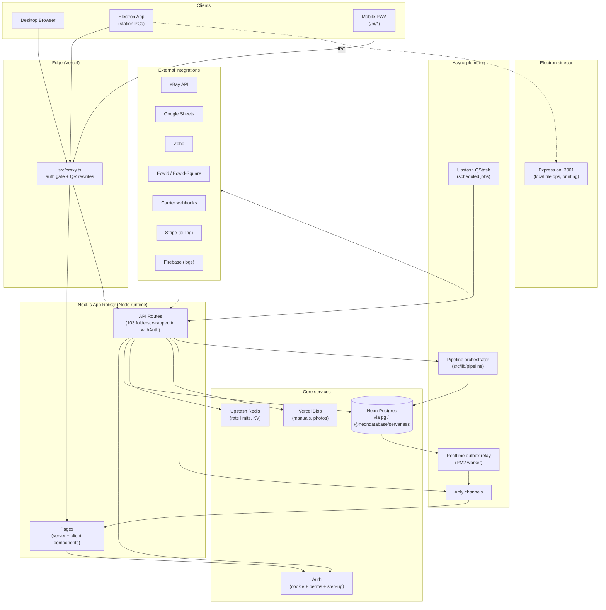
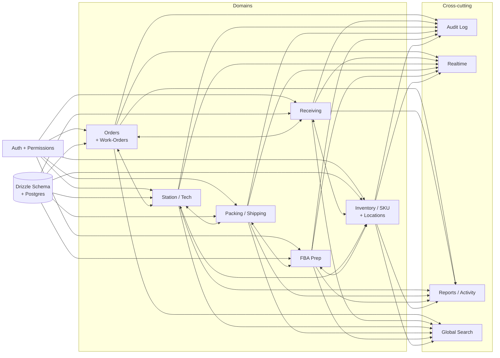
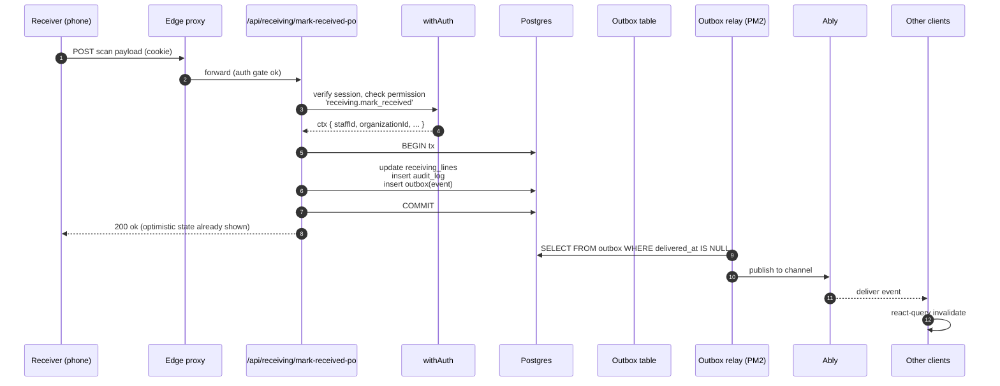

# Feature Interaction Map — USAV Orders Backend

> **Skill file.** Future Claude sessions: use this map to understand how a change in one feature might cascade into others. Don't refactor across boundaries without checking here first.

---

## Executive Summary

The system has six top-level domains: **Orders/Work-Orders**, **Receiving**, **Station/Tech**, **Packing/Shipping**, **FBA Prep**, and **Inventory/SKU/Locations**. They sit on a shared **Auth + Permissions** core, a shared **Postgres + Drizzle** schema, and a shared **Realtime (Ably) + Jobs (QStash) + Pipeline** plumbing layer. External integrations (eBay, Google Sheets, Zoho, Ecwid, carriers) feed in via webhooks and scheduled syncs. The desktop **Electron** wrapper adds local-printer IPC and a sidecar Express server on `localhost:3001`.

A change to the schema, the auth gate, or the realtime outbox affects all six domains; a change to a single domain rarely affects more than two neighbors.

---

## 1. High-level system map

---

## 2. Domain map

### Domain ownership table

| Domain | Lives in (UI) | Lives in (server) | Reads from | Writes to |
|---|---|---|---|---|
| **Orders / Work-Orders** | `src/components/{tech,packer,unshipped,shipped}/`, `src/app/work-orders/` | `src/app/api/{orders,work-orders}/`, `src/lib/neon/orders-queries.ts` | Customers, Ecwid, eBay | Audit, Realtime, Reports |
| **Receiving** | `src/components/receiving/`, `src/app/{receiving,m/r,m/u,m/b,m/l}/` | `src/app/api/{receiving,receiving-lines,receiving-tasks,receiving-photos,receiving-logs}/`, `src/lib/receiving/` | Zoho POs, Google Sheets | Inventory, Audit, Realtime |
| **Station / Tech** | `src/components/{station,tech}/`, `src/app/{tech,station/*}/`, `src/app/m/scan/` | `src/app/api/{tech,tech-logs,serial-units,scan,scan-tracking}/`, `src/lib/tech/`, `src/lib/station-*` | Orders, Inventory | Orders (status), Audit, Realtime |
| **Packing / Shipping** | `src/components/{packer,shipping,shipped}/`, `src/app/{packer,p,shipped}/` | `src/app/api/{pack,picking,shipping,shipped,packing-logs,packerlogs}/`, `src/lib/picking/`, `src/lib/shipping/` | Orders | Orders, Carrier APIs, Audit, Realtime |
| **FBA Prep** | `src/components/fba/`, `src/app/fba/` | `src/app/api/fba/` (look in `src/lib/fba/`) | Inventory, Orders | Amazon (planned/shipment refs), Audit, Realtime |
| **Inventory / SKU / Locations** | `src/components/{products,inventory,sku,warehouse,replenish}/`, `src/app/{products,inventory,warehouse,replenish}/` | `src/app/api/{products,inventory,sku,sku-catalog,sku-manager,sku-stock,locations,warehouses,units,serial-units}/`, `src/lib/neon/{location,sku-catalog}-queries.ts` | Google Sheets, Zoho | Audit, Realtime |

---

## 3. Cross-cutting concerns

### Auth + Permissions
- **Single gate**: `withAuth` (API) + `requirePermission` (pages) + `<Can>` (UI).
- **Manifest**: `docs/security/route-permissions.json`, regenerated by `npm run audit-route-auth:emit`, CI-verified by `:check`.
- A new permission costs: 1 registry entry, N route wires, 1 manifest regen.

### Realtime (Ably)
- Writes land in DB + outbox row.
- Outbox relay (`scripts/realtime-outbox-relay.js`, PM2-supervised via `ecosystem.config.cjs`) ships to Ably.
- Clients subscribe by channel (`org:<id>:orders`, etc. — verify in `src/lib/realtime/`).
- **Anti-pattern**: writing directly to Ably from API route. Always go through outbox so writes and events are atomic with the transaction.

### Jobs (QStash) + Pipeline
- **Recurring**: `scripts/qstash-sync.js`, `scripts/ensure-google-sheets-qstash-schedules.js` — define schedules in code, sync to Upstash.
- **Pipeline**: `src/lib/pipeline/orchestrator.ts` runs multi-step workflows (collect → discover → validate → score → agent).
- **One-off ops scripts**: `scripts/*.mjs|js|ts` (149 of them) — many are backfills or migrations; some are load-bearing (e.g. the e2e tests).

### Audit Log
- Every wrapped route can declare `audit: { action: '...' }` and gets a default row.
- Rich audit (before/after diffs) is written by the handler itself; it then calls `ctx.markAuditWritten()` so the wrapper doesn't double-write.
- Read UI lives at `src/app/audit-log/` and `src/components/audit-log/`.

### Global Search
- `src/lib/order-search-resolver.ts`, `src/lib/scan-resolver.ts`, `src/lib/search/`, `src/lib/detectSearchField.ts`.
- The scanner uses `barcode-routing.ts` to decide what to open from a raw scan.

### Offline / IDB
- `src/lib/offline/`, `src/lib/offlineQueue.ts`, `idb` lib.
- Mobile flows queue mutations; replay on reconnect. Server handlers must be idempotent.

---

## 4. Data flow: a receive event (worked example)

**Why this matters:** if the outbox row commits but Ably is down, the relay retries — no event is lost. If you write to Ably *inside* the request, a failure leaves the DB updated but no clients notified.

---

## 5. Surface map (where to put a change)

| If you're changing... | Touch these | Don't touch |
|---|---|---|
| What a permission protects | `permission-registry.ts` + `withAuth` calls + run manifest regen | The manifest JSON directly |
| What a route returns | `src/app/api/<x>/route.ts` + `src/lib/neon/<x>-queries.ts` | The page that consumes it (unless the shape changes) |
| What a screen looks like | `src/components/<feature>/` | Design-system primitives (unless adding a new token) |
| A primitive (shared visual) | `src/design-system/primitives/` + barrel `index.ts` | Feature components |
| A token | `src/design-system/tokens/` + any preset that consumes it | Feature components directly |
| The DB schema | `src/lib/drizzle/schema.ts` + a new file in `src/lib/migrations/` + run `db:migrate:dry` | Live data |
| Auth flow | `src/lib/auth/*` + `proxy.ts` + `AuthContext.tsx` (keep in sync) | Individual route handlers |
| A realtime event | The producing route + outbox row + subscribing client | Ably config (unless new channel) |
| A scheduled job | `scripts/*.{js,mjs}` + sync via `qstash:sync` | QStash UI by hand |
| Electron behavior | `electron/main.js`, `electron/preload.js`, `electron/printer.js` (if exists) | Web app code (unless it needs to detect electron) |

---

## 6. Modularity & maintainability recommendations

1. **Stop letting query files swell past 800 LOC.** Split `src/lib/neon/orders-queries.ts`, `location-queries.ts`, `sku-catalog-queries.ts` by use case (list, by-id, search, mutations).
2. **Stop letting feature components swell past 800 LOC.** See `UX_UI_Analysis_and_Improvement_Plan.md` §5 for the worst offenders.
3. **One home per provider.** Today there's `src/lib/zoho/`, `src/lib/zoho.ts`, `src/lib/zoho-kv.ts`, `src/lib/zoho-po-prefill.ts`, `src/lib/zoho-po-sync.ts`, `src/lib/zoho-receiving-sync.ts`. Move all under `src/lib/integrations/zoho/{client,po,receiving,kv}.ts`.
4. **Promote `src/lib/neon/` to be the only DB-access layer.** Deprecate `src/queries/` and `src/services/` if they're doing the same thing.
5. **Mark server-only modules.** Add `import 'server-only'` to `src/lib/auth/*`, `src/lib/neon/*`, `src/lib/integrations/*/server.ts`, every job/pipeline module. `dependency-cruiser` can enforce this.
6. **Per-domain schema files.** Split `src/lib/drizzle/schema.ts` into `schema/{orders,receiving,inventory,staff,audit,fba,...}.ts` re-exported from `schema/index.ts`. Lets diffs stay local to the domain that changed.
7. **A single `public-paths.ts`** consumed by both `proxy.ts` and `AuthContext.tsx` — today they hand-mirror.
8. **A single layout shell.** Consolidate `ResponsiveLayout` / `RouteShell` / `ResponsiveShell` / `m/layout.tsx`. Pick one.

---

## 7. Blast-radius reference

When evaluating a PR, use this as a sanity check on scope:

| Change | Blast radius |
|---|---|
| Add a new token | All design-system consumers (low risk, additive) |
| Change a token value | All consumers (visual regression risk) |
| Add a permission | New routes only (low risk) |
| Remove a permission | Every route using it (regen manifest, audit) |
| Schema column added | Drizzle generate + new migration + any query selecting `*` |
| Schema column removed | Every query reading that column + every type consumer |
| New outbox event type | New subscribers; existing clients ignore unknown types (safe) |
| Layout shell change | Every page using that shell (highest UI blast radius) |
| `withAuth` change | Every API route (highest backend blast radius) |
| `proxy.ts` change | Every request (highest overall blast radius) |

---

## See also
- `UX_UI_Analysis_and_Improvement_Plan.md`
- `Code_Architecture_Logic_Improvements.md`
- `Frontend_Modernization_Skills.md`
- Existing docs: `docs/architecture.md`, `docs/PIPELINE.md`, `docs/REALTIME-AND-CACHING.md`, `docs/STAFF-SYSTEM.md`, `docs/WORKFLOWS.md`, `docs/diagrams/`
