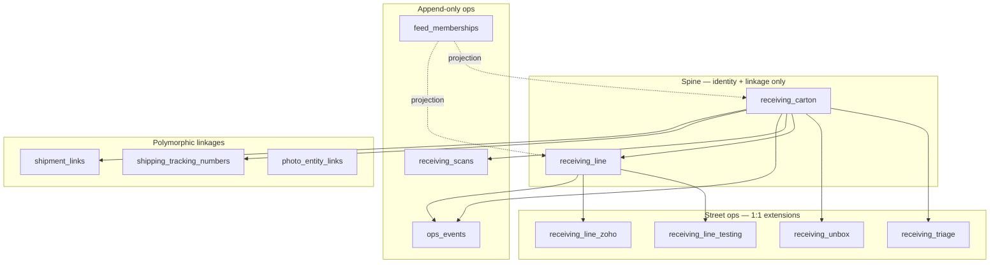

# Receiving → Polymorphic Streets — Deep Refactor Plan (receiving / receiving_line)

> **Status:** PLAN (2026-06-29 origin); **Phase 1 additive foundation SHIPPED** (2026-06-29);
> **carton street side-tables SHIPPED** (2026-07-05, `2026-07-05c`) — `receiving_triage` + `receiving_unbox`
> created, backfilled at 0-drift parity, kept live by the `trg_sync_receiving_street` dual-write trigger;
> `condition_set_at` promoted to `receiving_line_testing`.
> **SPINE RENAMED — SHIPPED** (2026-07-05, `2026-07-05d`): `receiving` → **`receiving_carton`**,
> `receiving_lines` → **`receiving_line`** (§7 Step F / §8 step 14, done EARLY). Because ~900 raw-SQL refs
> can't be safely mass-renamed on a live app, the old names remain as **`security_invoker=true` auto-updatable
> compat views** — the physical tables ARE renamed and stay renamed; the views keep legacy SQL + tenant RLS
> working verbatim. `ON CONFLICT` sites (lookup-po ×2, attach-box, zoho-receiving-sync) + the Drizzle models
> now target the base tables. Verified: RLS org-scoped through the views, triggers/FKs followed, writes-through-view
> fire the dual-write trigger, tsc clean, tests green.
> **Step E (vocab unification) SHIPPED** (2026-07-05): the server `RECEIVING_PRIORITY_RANK_SQL` /
> `RECEIVING_LANE_RANK_SQL` now derive from `display/precedence.ts` (`priorityRankSql`/`laneRankSql`),
> proven byte-identical — the last hardcoded copies are gone.
> **STILL GATED — Phase 2 reader/writer cutover (§8 steps 6–13) + Step D write-collapse:** these rewrite the live
> 2,075-line `?view=` multiplexer + the 5 write paths and, per §7/§9, MUST be verified per-PR against
> `tests/e2e/receive-to-zoho.spec.ts`. That e2e is currently RED (uncommitted receiving-UI WIP), and Step D would
> change state-machine-enforced transitions (e.g. `FAILED→PASSED` re-test, self-transitions currently allowed by the
> `lines/[id]/status` raw UPDATE but rejected by `INBOUND_TRANSITIONS`). Doing them blind would break the live tech/
> receive flow — deferred until the WIP is committed and the e2e is green. Column drops (§8 step 13) are gated behind
> the reader cutover AND require recreating the compat views (they are `SELECT *`).
>
> **Scope:** the `receiving` (carton) + `receiving_lines` (operational unit) spine **only**, plus every "street" that
> reads/writes it. The whole-schema view (serial_units, orders, FBA, warranty, listings, workflow config, Zoho mirrors)
> lives in the companion doc [`schema-wide-polymorphic-refactor-plan.md`](./schema-wide-polymorphic-refactor-plan.md);
> this doc is the detailed receiving cut that companion's "Tier-1 #1 / target-shape §1" only sketched. The reference
> contract, the existing-polymorphic-surface matrix (Appendix A), and the jsonb/discriminator inventories (Appendices
> C/D) in the companion apply here unchanged — read them for the cross-table rationale.
>
> **Companion ops doc (operator semantics):** [`context/WORKFLOW-RECEIVING.md`](../../context/WORKFLOW-RECEIVING.md) —
> triage vs unbox surfaces, independent timestamps, photo intent, soft recommendations.
>
> **Two stance differences from the companion (deliberate):**
> 1. **The codebase is NOT live.** There are no external tenants and no production data to protect, so this plan is a
>    **clean destructive cutover** (create the target shape, one-time backfill, drop the old wide columns, cut readers
>    over street-by-street) — *not* the companion's months-long additive / dual-write / Phase-0-4 strangler. Simplest &
>    cleanest wins because nothing is in flight.
> 2. **The thesis is application-architecture, not just schema.** The goal is that **each station / mode / page is its
>    own street with its own logic**, sharing only (a) the design-system display archetypes and (b) the backend
>    chokepoints — never the decision logic. **Station operations must not live on the spine tables** (`receiving`,
>    `receiving_lines`); they live on street side-tables + the polymorphic ops spine. The DB split is half the work;
>    the query/write-lane split is the other half.

---

## 0. TL;DR — the whole plan in one paragraph

The monolith tangles **three independent axes** into two wide tables and one mega-query: **intake-kind** (PO / RETURN /
TRADE_IN / PICKUP / sourcing-import / local-pickup → different *data*), **stage/station** (door → triage → unbox → test
→ received → history → the operator's *streets*, different *logic*), and **surface** (mobile / sidebar / workspace /
monitor → different *display*). The fix is a **four-layer model**: (1) a **thin relational spine** — `receiving_carton`
+ `receiving_line` holding only identity, linkage, and workflow facts true for *every* kind; (2) **street side-tables**
at carton grain (`receiving_triage`, `receiving_unbox`) and line grain (`receiving_line_*`) so station/mode operations
never mutate each other's columns; (3) a **polymorphic ops spine** — `ops_events` + `receiving_scans` + `feed_memberships`
for append-only station events and rail projections (not SoT for business facts); (4) **per-street code lanes** —
`src/lib/receiving/{spine,kinds,streets,display}` and per-street read/write endpoints, each owning its own query and
decisions, sharing only the chokepoints (`transition()`, `recordAudit`, `withTenantTransaction`, `clientEventId`) and
the already-shared display vocabulary.

---

## Build status — what landed 2026-06-29 (Phase 1: additive foundation)

The entire **additive, non-breaking foundation is built, compiling, and unit-tested** (32 DB-free tests). Nothing
below removes or rewires a live read/write path yet — the spine + the 2,075-line route still work unchanged.

**Shipped (code, `tsc`-clean):**
- **Layer 2 schema** — `src/lib/migrations/2026-06-29c_receiving_line_facts_tables.sql`: `receiving_line_zoho` /
  `_testing` / `_return` / `_putaway` (1:1) + `receiving_line_facts` registry, org-scoped from birth (RLS armed-not-forced
  per the `receiving_exceptions` precedent), org-led keys (closes the global Zoho-key cross-tenant gap). Drizzle models
  added to `src/lib/drizzle/schema.ts`.
- **Facts layer** — `src/lib/receiving/facts/`: `registry.ts` (code-validated `fact_kind` discriminator + Zod schemas +
  passthrough for org-custom kinds), `store.ts` (registry read/write/upsert), `narrow.ts` (typed partial-upsert/read for
  the four 1:1 tables), `index.ts`. Tests: registry/store/narrow.
- **Kinds layer** — `src/lib/receiving/kinds/registry.ts`: intake-kind discriminator → fact tables/schemas + `classify`/
  `effectiveIntakeKind` (the SoT for the duplicated `effectiveReceivingType`). Tested.
- **Precedence SoT** — `src/lib/receiving/display/precedence.ts`: priority-rank as rules-as-data; **WIRED** — the route's
  inline `RECEIVING_PRIORITY_RANK_SQL` and the client `receivingPriorityRank` now derive from it (3 copies → 1, proven
  byte-equivalent by test).
- **Spine glue** — `src/lib/receiving/spine/`: `facts-sync.ts` (one call persists a line's facts bundle) + `index.ts`
  (barrel re-exporting the real chokepoints + Layer-2 surface as the streets' single import). Tested.
- **Incoming `delivery_state` — extracted AND wired** — `src/lib/receiving/streets/incoming/delivery-state.ts`: the
  buckets as rules-as-data (kills the WHERE-vs-CASE 2× duplication), with the one documented PENDING_CARRIER asymmetry.
  **WIRED** — the route's inline CASE (33 lines) + WHERE ladder (71 lines) now derive from it; a regression test proves
  the generated SQL is semantically identical to the originals, so it's behavior-preserving. The route shrank ~95 lines.
- **Backfill** — `src/lib/migrations/2026-06-29d_receiving_facts_backfill.sql`: idempotent, org-explicit projection of the
  wide columns into the facts tables, with a count report.

**APPLIED + verified 2026-06-29** — `29c` + `29d` run against the live DB via `npm run db:migrate` (backfill landed:
1199 zoho / 1210 testing / 2 return / 0 putaway / 17 registry rows; RLS armed on all 5). Gates green: `tsc --noEmit`,
`next build`, 103 unit tests, and a live facts-CRUD smoke test (write→read→upsert→delete round-trip). One drift caught
mid-apply — the backfill referenced `zoho_reference_number`, which the **live `receiving_lines` no longer has** (the
Drizzle model still declares it; a pre-existing model-vs-DB drift from the schema-wide plan's data-integrity findings) —
dropped from the backfill and re-applied clean.

**Phase 2 — landed + verified 2026-06-29 (strangler: backfill → dual-write):**
- **Backfill** (`29d`) + **dual-write** (`29e`: trigger `trg_sync_receiving_line_facts` — AFTER INSERT/UPDATE OF the
  facts columns, exception-guarded so it can never abort a receiving write, scoped so a `workflow_status`-only
  transition doesn't fire it). Verified live: sync ✅ / scoping ✅ / non-blocking ✅.
- The facts tables are now **production-live at 0-drift parity** with the source columns — a full parity sweep
  (testing/zoho/putaway) returned 0 drift rows, so the **reader cutover is provably safe**. The receiving endpoint e2e
  (`receiving-lines-endpoints.spec.ts`) stayed green across every step.

**Phase 2 writer-cutover ATTEMPTED + REVERTED (2026-06-29) — concrete blockers found:**
The testing-column writer cutover (6 endpoint + lib writers, via agents + by hand) was attempted to enable dropping the
testing columns. It was **reverted** because the attempt surfaced concrete, un-verifiable-without-the-full-e2e blockers:
1. **Reader cutover moved only filters, not displayed values** — `SELECT *`/detail selects + PATCH re-fetch still read
   `rl.*`, so facts-only writers ⇒ **stale displayed values** immediately.
2. **Active facts-corruption vector** — the dual-write trigger fires on watched non-testing col updates (`zoho_*`,
   `unit_price`, `location_code`) and mirrors *all* of `rl`'s now-stale testing cols into `rlt`, **clobbering fresh facts**
   on any mixed edit.
3. **Non-convertible upsert** (`lookup-po` `ON CONFLICT … DO UPDATE SET needs_test`), **non-default INSERTs**
   (`condition_grade='USED_A'`, `needs_test=false`), **embedded readers** in writer files (`beforeRow`, `match`), and
   **atomicity gaps** (non-transactional split writes).
Closing all of that is a large bespoke effort that **cannot be comprehensively verified** while the full-flow
`receive-to-zoho` e2e is red (uncommitted receiving-UI WIP). Reverted to the verified-safe state (facts layer + the
non-route reader cutover + dual-write + parity, all green). **KEEP:** migrations `29c`/`29d`/`29e` applied, facts tables
live at 0-drift parity, the facts/kinds/precedence/delivery-state modules + 103 tests, reader cutover in
tech-queue/work-orders/pending-unboxing/receiving-[id]/po-[poId]/zendesk. **To finish the drop:** commit the receiving
WIP → `receive-to-zoho` green → redo the writer cutover + value-cutover + trigger rework, verified per-writer.

**Remaining — Phase 2 (invasive; needs a clean tree + the full-flow UI e2e, currently WIP-blocked):**
- Cut readers over to the facts tables (parity proves it's safe) — start with the read-only history/incoming surfaces.
- Extract each street's *full* read lane out of the `?view=` multiplexer (history → triage → test → unbox → door),
  deleting its arm + its `normalizeRow` fields each PR. *(§7 Step C / §8)* — the incoming `delivery_state` slice is
  already extracted+wired above; the rest of the incoming lane (its WHERE/JOIN/SELECT) is part of this sweep.
- Collapse the 5 write paths onto `transitionReceivingLine()` + `receiveLineUnits()` (delete `lines/[id]/status`'s
  inline map + `mark-received-po`'s inline UPDATEs). *(§7 Step D)*
- Move column writers to the facts tables, then drop the moved spine columns + rename `receiving`→`receiving_carton` /
  `receiving_lines`→`receiving_line`. *(§7 Step F / §8 steps 13-14)*

These are deferred deliberately: they rewrite a live 2,075-line route + 5 write routes and must be verified against
`tests/e2e/receive-to-zoho.spec.ts` per PR — not landed blind in one pass.

**Triage / Unbox station independence — landed 2026-07-05 (semantics + interim columns):**
- **Surfaces graduated:** `/triage` and `/unbox` (desktop); `/m/triage` and `/m/unbox` (mobile scan). Modes are
  **independent** — an unbox scan must not stamp triage door timestamps (`received_at`/`received_by`).
- **Scan writer:** `recordReceivingScan({ intakeSurface: 'triage' | 'unbox' })` — triage stamps door arrival on
  `receiving`; unbox stamps `unbox_opened_at` only via `recordUnboxScanOpened`. The **Unboxed** milestone
  (`unboxed_at`, line `UNBOXED`) is owned by the operator action (`mark-received-po`), not by either scan.
- **Interim denorm (tactical):** migration `2026-07-05_receiving_independent_mode_scans.sql` added
  `receiving_scans.intake_surface`, `receiving.unbox_only_intake`, `receiving_lines.condition_set_at` on the **wide
  spine** for fast rails. These are **projections**, not the destination — see §4.1–4.2 for target homes.
- **Soft recommendations:** `workflow-recommendations.ts` — industry-standard nudges, never hard gates (`triage_complete`
  is not a blocker for unbox).
- **Photo intent:** triage = package (`receiving_package`); unbox = item (`receiving_item`).
- **Schema step 3b — SHIPPED 2026-07-05 (migration `2026-07-05c_receiving_street_tables.sql`):**
  `receiving_triage` + `receiving_unbox` (carton 1:1, FK `receiving(id)`) created; `condition_set_at` added to
  `receiving_line_testing`. One-time backfill from the interim spine columns (1907 triage / 1840 unbox rows) verified at
  **0-drift parity**. Dual-write is a **trigger** (`trg_sync_receiving_street` on `receiving`), mirroring the 29e line-facts
  approach rather than editing the mid-WIP scan writers — it covers every `receiving.*` triage/unbox column writer
  (including the staging routes) in one exception-guarded, AFTER-row place. The 29e line-facts trigger was extended to
  also mirror `condition_set_at`. RLS **armed, not forced** (the owner-run backfill has no GUC, so FORCE would reject it —
  same precedent as 29c); `app_tenant` grants added. Drizzle models added in the same change. tsc-clean, 24 facts/spine
  unit tests green.
- **Still pending (§8 step 3b tail):** cut triage/unbox rails + workspace readers over to the street tables, then drop
  the interim spine columns (`receiving.received_at`/`unbox_*`/`triage_*`/`unbox_only_intake`, `receiving_lines.condition_set_at`)
  and remove the `trg_sync_receiving_street` trigger. Deferred until the reader cutover per §7/§8 (needs the receiving-UI
  WIP committed + `receive-to-zoho` e2e green).

---

## 1. The streets — the metaphor made literal

A "street" = one operator job with one input model and one display archetype. Today all nine drive through the **same**
`receiving`/`receiving_lines` tables and the **same** `/api/receiving-lines?view=` GET. Target: each owns its lane.

| Street | Job / input | Entry | Today's query | Display archetype (shared scaffold) | Owns (target lane) |
|---|---|---|---|---|---|
| **Door receive** | scan a carton in at the dock | `/m/triage`, `POST /receiving/lookup-po` | `POST /receiving/lookup-po` | **Station** | `streets/door` — classify intake-kind, create carton, link STN |
| **Triage** | classify, stage, pair before unbox | `/triage`, `/m/triage` | `view=scanned&sort=priority` ∪ unfound | **Workbench** | `streets/triage` → **`receiving_triage`** + `completeTriage` |
| **Unbox** | open carton, inspect, receive lines | `/unbox`, `/m/unbox` | `view=unbox_opened` + `mark-received-po` | **Station** | `streets/unbox` → **`receiving_unbox`** + `receiveLineUnits` |
| **Testing** | route + verdict needs-test units | `TestingSidebarPanel` / tech bench | `view=testing`/`needs-test` | **Station** | `streets/test` → `receiving_line_testing` |
| **Incoming** | watch the inbound delivery stream | `IncomingSidebarPanel` | `view=incoming` + `delivery_state` | **Monitor** | `streets/incoming` |
| **History (table)** | search what was received | `?mode=history` | `view=activity` + search/sort | **Monitor** | `streets/history` |
| **Monitor (audit)** | PO-anchored event trail | `audit-log/receiving/*` | `receiving-aggregator` + `ops_events` | **Monitor** | spine + `inventory_events` |
| **Mobile feeds** | phone mirror of triage/unbox | `/triage`, `/unbox` mobile feeds | same street endpoints as desktop | **Station** | same street lane — not a 10th data model |
| **Studio** | model/observe the receiving graph | `/studio` | `lines/[id]/advance` | **Canvas** | reads spine; advance via `transition()` |

**Anti-mix rule (from `.claude/rules/contextual-display.md`):** a page may *host* several streets (the receiving page
is a Workbench triage sidebar + a Station unbox workspace), but each **region** is exactly one archetype. The split below
makes that true at the data + logic layer too, not just the UI.

---

## 2. Precise diagnosis — what's already right vs the two real monoliths

This is the most important section: **we are not rewriting the parts that already work.** The agents confirmed the lib
and display layers are largely healthy; the rot is in two specific places.

### 2a. Already correct — DO NOT touch (the legitimately-shared layer)

These are the "shared display + chokepoints" the thesis says *should* be shared. They already are:

- **Display / vocabulary SoT** — `workflow-stages.ts` (`workflowStage*`, `WORKFLOW_TO_LINE_STATUS`, `deriveReceivingLineStatus`),
  `exception-codes.ts`, `intake-classification.ts`, `priority-override.ts`, `receiving-views.ts`, the
  `receiving-modes.ts` **descriptor registry** (each mode already a self-contained descriptor with its own
  `buildParams`/`queryKey`/`emptyMessage`), `triage-exception-context.ts`. This is exactly the "share the design
  system, not the logic" layer — it exists and works.
- **Backend chokepoints** — `state-machine.ts` `transitionReceivingLine()` + `INBOUND_TRANSITIONS` allow-list (the one
  guarded `workflow_status` writer), `record-scan.ts` `recordReceivingScan()` (the one dock-scan writer),
  `recordInventoryEvent` / `recordAudit` (the audit spine), `client_event_id` idempotency, `withTenantTransaction` org
  scoping, `recomputeCartonSourceLink` + the PATCH upgrade-only guard.
- **Rail / shell composition** — `RecentActivityRailBase` over `SidebarRailShell`; the six receiving rails are already
  thin wrappers. Compose, never fork — already the norm.
- **Already-decomposed lib writers** — `serial-attach.ts`, `attach-box.ts`, `unpair-po.ts`, `relink-po.ts`,
  `reconcile-unmatched.ts`, `resolve-shipment-for-scan.ts`, `exceptions.ts` — single-purpose, Deps-injected, DB-free
  testable. These are the *target* pattern; the streets just need to be organized around them.

### 2b. Monolith #1 — the DB (`receiving` 37 cols + `receiving_lines` 51 cols)

Evidence (schema agent): `receiving_lines` was born with **8 columns** (`0000_baseline:513`) and accreted **~40 more**
across ~50 migrations; `receiving` predates the migration era and has **no canonical CREATE** at all (its only
definition is the Drizzle model `schema.ts:1014-1077`). The column×surface matrix shows **most columns are used by ONE
street**:

- **Returns-only:** `return_platform`, `return_reason` (carton) — meaningful only when `is_return`.
- **Zoho-PO-only (~12 cols on the line):** `zoho_item_id/line_item_id/purchase_receive_id/purchaseorder_id/_number/_number_norm/_reference_number/_sync_source/_last_modified_time/_synced_at/_notes`, `unit_price`.
- **Marketplace/triage-only:** `source_platform`, `source_platform_pill`, `listing_url`, `listing_reference`, `source_system`, `source_order_id`.
- **Testing-only:** `needs_test`, `assigned_tech_id`, `qa_status`, `disposition_code`, `disposition_final`, `disposition_audit` (the one jsonb), `condition_grade`.
- **Putaway-only:** `location_code`. **Repair-only:** `is_repair_service`. **Dead:** `lpn` (1:1 alias of id), `quantity` (TEXT legacy).
- **Dual-grain duplication:** `received_by`, `scanned_at`, `unboxed_at`, `received_at`, `exception_code`, `intake_type`, `source_platform` exist on **both** carton and line.

Plus integrity gaps: the two `ux_receiving_lines_zoho_*` UNIQUE keys are **not org-scoped** (cross-tenant collision risk
under sharding).

### 2c. Monolith #2 — the query/write layer

Evidence (consumer + logic agents):

- **One 2,075-line GET** (`app/api/receiving-lines/route.ts`) branches internally on `view` (9 arms, `:552-803`),
  a nested `delivery_state` sub-branch (`:715-782`), a per-view `ORDER BY` ladder (`:818-876`), and **six
  conditionally-spliced SELECT fragments** + conditional JOINs. Testing / Incoming / Viewed / Scanned / History all read
  the *same SQL text* with different toggles. `normalizeRow` (`:1947`) emits **one DTO for all** — every street receives
  fields that are `null` on its own view (`delivery_state`, `tested_count`, `viewed_at`, `received_done_at`).
- **Five overlapping write paths** to `workflow_status`/`qa_status`/`disposition`: `mark-received` (per-line),
  `mark-received-po` (carton finalize), `lines/[id]/status` (testing — its **own** `WORKFLOW_FOR_EVENT` map, *bypasses*
  the state machine), `lines/[id]/advance` (studio — *uses* `transitionReceivingLine`), `serial-units/[id]/test`.
  `mark-received-po` even has inline `workflow_status` UPDATEs (`:675-696`) bypassing the chokepoint.
- **Duplicated precedence vocab:** priority rank exists **three times** (`priority-override.ts` lib, `RECEIVING_PRIORITY_RANK_SQL`
  in the route, `receiving-priority.ts` client); `delivery_state` buckets exist **twice** (route WHERE `:715` vs route
  SELECT CASE `:930`); `effectiveReceivingType` is re-inlined in `zendesk-claim-template.ts:232`.

> The diagnosis in one line: **the data model and the read/write model both multiplex N streets through 1 shape. Give
> each street its own data lane and its own query lane; keep one shared vocabulary and one shared chokepoint.**

---

## 3. Guiding invariants (non-negotiable — survive the cutover unchanged)

Inherited from `.claude/rules/backend-patterns.md` + the companion doc's reference contract. "Not live" relaxes the
*migration choreography*, never these:

- **Status only via the state machine** — `transitionReceivingLine()` / `transition()` / `applyTransition()`. The two
  bypass routes (`lines/[id]/status`, inline `mark-received-po` UPDATEs) are **defects to delete**, not patterns to keep.
- **Audit only via `recordAudit()`** with `AUDIT_ACTION`/`AUDIT_ENTITY`; lifecycle facts via `recordInventoryEvent`.
- **Tenant scope via `withTenantTransaction(orgId, …)`**; every spine + facts table `organization_id UUID NOT NULL` with
  `enforce_tenant_isolation()` **in the birth migration** (tenant-from-birth, per the companion's `part_links` template).
- **Idempotency via `clientEventId`** threaded into `inventory_events` (`UNIQUE(client_event_id)`).
- **Polymorphic reference contract** — typed discriminator (catalog FK or **named CHECK**, never free text) + id column
  + **org-led** partial/unique indexes + integrity (real FK on the non-polymorphic side, *or* a delete trigger). Match
  `shipment_links` / `part_links`.
- **Compose, don't fork** — at the data layer too: reuse `shipment_links` (`owner_type='RECEIVING_CARTON'`), the
  `types` catalog, the `reason_codes` flow-context pattern, the workflow `registry.ts` thin-adapter contract. Do not
  invent a new polymorphic mechanism.
- **Rules as data** — precedence (priority rank, delivery-state buckets, workflow→coarse) lives **once** as inspectable
  data (the `order-lifecycle.ts` `UNSHIPPED_LIFECYCLE_RULES` model), consumed by both the SQL builder and the client.
- **Degrade-not-fail** — a failing sub-resource (a kind-facts fetch) renders empty, never 500s the record (mirror
  `get-title-by-sku`).
- **Station independence (triage ↔ unbox)** — neither surface may require the other's milestones. Shared cross-mode
  facts are limited to: the carton spine row, `shipment_id` / STN, `receiving_lines` linkage, and pairing to PO/claim/order.
  A triage scan must not stamp unbox milestones; an unbox scan must not stamp door arrival. Serial capture is unbox-only.
- **Station ops off the spine** — timestamps, flags, and staging fields owned by one street live on that street's
  side-table (or `ops_events`), not as new nullable columns on `receiving` / `receiving_lines`. The spine holds identity
  + universal workflow; streets hold their operational state.

---

## 3.5 Stations, modes, and spine data — the separation contract

**Modes** (triage, unbox, test, incoming, …) are operator jobs. **Stations** are where those jobs run (dock scanner,
bench, tech bench). **Spine tables** (`receiving`, `receiving_lines`) are the shared *identity and linkage* layer —
they answer "what carton is this?" and "what lines belong to it?" — not "what did the triage operator do last?"

Today the rot is **multiplexing station operations into spine columns**: `received_at`, `unbox_opened_at`, `unboxed_at`,
`triage_complete`, `staging_location_id`, `condition_grade`, etc. all sit on `receiving` / `receiving_lines`, so one
street's writer accidentally becomes another street's gate.

### What belongs where

| Layer | Tables | Holds | Does NOT hold |
|-------|--------|-------|----------------|
| **Spine (identity)** | `receiving_carton`, `receiving_line` | org, intake kind, `shipment_id`, `carton_id` FK, `workflow_status`, qty, sku link | per-street timestamps, staging, triage flags, condition, Zoho cluster |
| **Carton street ops** | `receiving_triage`, `receiving_unbox` | each street's carton-grain milestones + staging | the other street's fields |
| **Line street ops** | `receiving_line_zoho`, `_testing`, `_return`, `_putaway`, `_facts` | line-grain facts per concern | carton-grain door/unbox stamps |
| **Event spine (append-only)** | `ops_events`, `receiving_scans` | who/when/what happened; `intake_surface` per scan | queryable business SoT (derive or project) |
| **Rail projection** | `feed_memberships` | which entities appear in which feed, sort keys | authoritative workflow state |
| **Linkage (polymorphic)** | `shipment_links`, `photo_entity_links`, pairing tables | cross-entity edges | street-specific operational fields |

### Cross-mode sharing rule (non-negotiable)

Only these cross from triage → unbox (or bypass triage entirely):

1. `receiving` / `receiving_carton` row (carton identity)
2. `shipping_tracking_numbers` via `shipment_id` / `receiving_scans.shipment_id`
3. `receiving_lines` rows + pairing to PO / claim / order (`receiving_line_zoho`, Zendesk link, etc.)
4. Photos (via `photo_entity_links`; intent = package vs item is a **display filter**, not a gate)

Everything else — door arrival, staging, triage complete, bench opened, unboxed milestone, condition grade — is
**street-local**. Soft recommendations may *suggest* triage before unbox; they must never *block* unbox.

### Mode → table → writer map (target)

| Mode / street | Read joins | Write chokepoints | Milestones owned |
|---------------|------------|-------------------|------------------|
| **Triage** | spine + `receiving_triage` + `receiving_scans` (surface=`triage`) | `recordReceivingScan(intakeSurface:'triage')`, `completeTriage()` | door received, staging, pairing, `triage_complete` |
| **Unbox** | spine + `receiving_unbox` + `receiving_line_testing` | `recordReceivingScan(intakeSurface:'unbox')`, `recordUnboxScanOpened()`, `receiveLineUnits()` / `mark-received-po` | bench opened, `unboxed_at`, line `UNBOXED`, condition |
| **Test** | spine + `receiving_line_testing` + `serial_units` | `transitionReceivingLine()`, `serial-units/[id]/test` | QA verdict, disposition |
| **Door** | spine + STN | `lookup-po`, `recordReceivingScan` | create/link carton |

`ops_events` receives a parallel append for every milestone (`TRACKING_SCANNED`, `UNBOX_SCAN_OPENED`, triage saved,
condition set, etc.) with `entity_type` + `entity_id` pointing at `receiving` or `receiving_line` as appropriate.



---

## 4. Target architecture — four layers

### Layer 1 — The thin relational spine (shared identity + linkage only)

Two tables, renamed to end the "the carton *is* a `receiving` row" confusion. Both hold **only columns every intake-kind
needs and every street must join** — identity, org, kind discriminator, shipment link, coarse workflow. **No per-station
timestamps or staging fields on the spine** (those move to Layer 2 street tables).

```sql
-- ── receiving_carton  (was: receiving) — identity + linkage hub ─────────────
CREATE TABLE receiving_carton (
  id               BIGSERIAL PRIMARY KEY,
  organization_id  UUID NOT NULL,
  intake_kind_id   BIGINT NOT NULL REFERENCES types(id),
  intake_kind_code TEXT NOT NULL,
  carrier          TEXT,
  handling_unit_id BIGINT REFERENCES handling_units(id),
  shipment_id      BIGINT REFERENCES shipping_tracking_numbers(id), -- cache; full set via shipment_links
  source           TEXT NOT NULL,          -- zoho_po | unmatched | … (until fully catalog-driven)
  priority_tier    SMALLINT CHECK (priority_tier IS NULL OR priority_tier BETWEEN 0 AND 3),
  coarse_status    TEXT NOT NULL DEFAULT 'OPEN',  -- rollup only: OPEN|IN_TRIAGE|IN_UNBOX|DONE (not street SoT)
  created_at       TIMESTAMPTZ NOT NULL DEFAULT now(),
  updated_at       TIMESTAMPTZ NOT NULL DEFAULT now()
);
-- NO received_at, unbox_opened_at, unboxed_at, triage_complete, staging_location_id on spine

-- ── receiving_line  (was: receiving_lines) — operational unit ─────────────
CREATE TABLE receiving_line (
  id               BIGSERIAL PRIMARY KEY,
  organization_id  UUID NOT NULL,
  carton_id        BIGINT REFERENCES receiving_carton(id) ON DELETE CASCADE,
  sku_catalog_id   INTEGER REFERENCES sku_catalog(id) ON DELETE SET NULL,
  intake_kind_id   BIGINT REFERENCES types(id),
  quantity_expected INTEGER,
  quantity_received INTEGER NOT NULL DEFAULT 0,
  workflow_status  inbound_workflow_status_enum NOT NULL DEFAULT 'EXPECTED',
  coarse_status    TEXT,                   -- trigger-derived rollup
  notes            TEXT,
  created_at       TIMESTAMPTZ NOT NULL DEFAULT now(),
  updated_at       TIMESTAMPTZ NOT NULL DEFAULT now()
);
-- NO per-line qa/condition/zoho cluster on spine — see Layer 2
```

What **leaves** the spine: everything in §2b that is one-street or one-concern, **including all triage/unbox carton
timestamps** currently on `receiving` (`received_at`, `unbox_opened_at`, `unboxed_at`, `triage_complete`,
`staging_location_id`, `unbox_only_intake`, …). They go to `receiving_triage` / `receiving_unbox` or line facts.

### Layer 2 — Street side-tables + typed line facts

**(a) Carton-grain street tables (1:1 with spine — NEW, 2026-07-05 spec)**

Mirror `receiving_line_testing` at **carton** grain so triage and unbox operations are fully separable:

```sql
-- Triage street — door / classify / stage / pair / save-for-unbox
CREATE TABLE receiving_triage (
  receiving_id           INTEGER PRIMARY KEY REFERENCES receiving_carton(id) ON DELETE CASCADE,
  organization_id        UUID NOT NULL,
  door_received_at       TIMESTAMPTZ,              -- first triage-surface scan (or mirror first triage scan row)
  door_received_by       INTEGER REFERENCES staff(id) ON DELETE SET NULL,
  staging_location_id    INTEGER REFERENCES locations(id),
  priority_lane          TEXT,                     -- lane chip (NORMAL|EXPEDITED|…)
  pairing_state          TEXT,                       -- paired | unmatched | …
  triage_complete        BOOLEAN NOT NULL DEFAULT FALSE,
  triage_completed_at    TIMESTAMPTZ,
  triage_completed_by    INTEGER REFERENCES staff(id) ON DELETE SET NULL,
  created_at             TIMESTAMPTZ NOT NULL DEFAULT now(),
  updated_at             TIMESTAMPTZ NOT NULL DEFAULT now()
);

-- Unbox street — bench open / inspect / unboxed milestone
CREATE TABLE receiving_unbox (
  receiving_id           INTEGER PRIMARY KEY REFERENCES receiving_carton(id) ON DELETE CASCADE,
  organization_id        UUID NOT NULL,
  opened_at              TIMESTAMPTZ,              -- first unbox-surface scan (bench queue entry)
  opened_by              INTEGER REFERENCES staff(id) ON DELETE SET NULL,
  unboxed_at             TIMESTAMPTZ,              -- operator "Unboxed" action (NOT scan-owned)
  unboxed_by             INTEGER REFERENCES staff(id) ON DELETE SET NULL,
  intake_path            TEXT NOT NULL DEFAULT 'unknown'
    CHECK (intake_path IN ('triage_first', 'unbox_only', 'unknown')),
  -- triage_first = door scan preceded bench; unbox_only = bench-first (no door_received_at)
  created_at             TIMESTAMPTZ NOT NULL DEFAULT now(),
  updated_at             TIMESTAMPTZ NOT NULL DEFAULT now()
);
CREATE INDEX idx_receiving_unbox_intake_path ON receiving_unbox(organization_id, intake_path)
  WHERE intake_path = 'unbox_only';
```

Writers: `recordReceivingScan` upserts `receiving_triage` on triage; `recordUnboxScanOpened` upserts `receiving_unbox`;
`completeTriage` → `receiving_triage`; `mark-received-po` / `receiveLineUnits` → `receiving_unbox.unboxed_*` + line
`workflow_status`. Readers: triage rails join `receiving_triage`; unbox rails join `receiving_unbox` — never the other
table's columns.

**(b) Line-grain concern tables (EXIST — 2026-06-29c)**

```sql
receiving_line_zoho     (line_id PK/FK, org, zoho_item_id, zoho_line_item_id, zoho_purchase_receive_id,
                         zoho_purchaseorder_id, zoho_purchaseorder_number, zoho_purchaseorder_number_norm GENERATED,
                         unit_price NUMERIC(12,2), zoho_sync_source, zoho_last_modified_time, zoho_synced_at, zoho_notes)
                        -- only Zoho-PO-origin lines; ~12 cols leave the spine. Org-led uniques on (org, zoho_po_id, zoho_line_item_id).
receiving_line_testing  (line_id PK/FK, org, needs_test, assigned_tech_id, qa_status qa_status_enum,
                         disposition_code disposition_enum, disposition_final TEXT, condition_grade condition_grade_enum,
                         condition_set_at TIMESTAMPTZ,  -- explicit operator pick (NOT the DB default)
                         disposition_audit JSONB)
receiving_line_return   (line_id PK/FK, org, return_platform return_platform_enum, return_reason, source_order_id, rma_ref)
receiving_line_putaway  (line_id PK/FK, org, location_code, bin, put_away_at)  -- or fold onto serial_units location
receiving_exceptions    (EXISTS — keep; per-line NO_PO|CARRIER_MISMATCH|SHORT|OVER|DAMAGED|WRONG_ITEM + status)
```

Each is 1:1 with `receiving_line` (PK = FK), `ON DELETE CASCADE`, org-scoped from birth. A street that doesn't care about
a concern simply never joins its table — the spine stays narrow, and **"give me all RETURN lines"** is a single indexed
join, not a `WHERE` over a nullable column on a 51-wide table.

**(c) Typed-facts registry** for the long tail + org-custom kinds (the `reason_codes` flow-context + workflow
`registry.ts` pattern):

```sql
receiving_line_facts (id BIGSERIAL PK, organization_id UUID NOT NULL,
                      line_id BIGINT NOT NULL REFERENCES receiving_line(id) ON DELETE CASCADE,
                      fact_kind TEXT NOT NULL,           -- 'marketplace_listing' | 'sourcing_import' | 'trade_in_valuation' | org-custom
                      payload   JSONB NOT NULL,          -- validated at write time by a per-fact_kind Zod schema in code
                      UNIQUE (organization_id, line_id, fact_kind));
-- enforce_tenant_isolation('receiving_line_facts')
```

`fact_kind` → schema map lives in `src/lib/receiving/facts/registry.ts` (mirrors `workflow/registry.ts`): the writer
validates `payload` against the registered schema, so `(fact_kind, payload)` is a **true tagged union**, not a
junk-drawer. Marketplace listing facts, sourcing-import provenance, trade-in valuation, and **any org-custom intake
kind** route here — no migration to add one.

**Why both?** Heavy, universally-queried concerns (Zoho, testing) earn a typed table with real columns + indexes; the
long tail and org-bespoke kinds earn the registry. This is the companion's "promote queryable facts to columns; keep
only true variant config in jsonb" rule, applied per concern.

### Layer 2½ — Polymorphic ops spine (append-only; not business SoT)

Station **events** stay out of the spine but also should not duplicate queryable facts without a projection path:

```sql
receiving_scans   -- per (tracking_number, receiving_id) scan row; intake_surface = triage|unbox
ops_events        -- entity_type + entity_id + event_type + payload (TRACKING_SCANNED, UNBOX_SCAN_OPENED, …)
feed_memberships  -- rail projection only (receiving_triage feed, unbox queue, …); rebuildable from street tables
inventory_events  -- cross-station lifecycle spine (RECEIVED, TEST_*, …) — already separate
```

**Rule:** `ops_events` is the audit/timeline SoT for "what happened when." `receiving_triage` / `receiving_unbox` /
`receiving_line_*` are the **queryable SoT** for rails and workspace UI. `feed_memberships` is a **cache** — never the
only place a milestone is written. Interim spine columns (`receiving.received_at`, `unbox_only_intake`, …) are
**denormalized projections** until the street tables cut over.

### Layer 3 — The streets (per-station code lanes + display archetypes)

Reorganize `src/lib/receiving/` and the API around the streets. **Shared at the bottom, forked at the lane.**

```
src/lib/receiving/
  spine/        ← genuinely-shared chokepoints (mostly EXISTS; just regroup)
    carton.ts          create/find carton, intake-kind resolve, shipment_links
    line.ts            create/find line
    transition.ts      = state-machine.ts (the ONE workflow_status writer)
    record-scan.ts     scan writer → receiving_scans + street table + ops_events
    triage.ts          NEW: receiving_triage read/write (completeTriage, staging)
    unbox.ts           NEW: receiving_unbox read/write (opened, unboxed milestone)
    facts.ts           typed-facts read/write + registry dispatch
    exceptions.ts      EXISTS
  kinds/        ← polymorphic-by-intake-kind (NEW grouping)
    registry.ts        intake_kind → { label, factTables, factSchemas, defaultWorkflow, classify() }
    po.ts return.ts trade-in.ts local-pickup.ts sourcing-import.ts
  streets/      ← per-station logic + its OWN query (NEW grouping; the avenues)
    door/      classify + create carton + STN link   (was: lookup-po 1,495 LOC)
    triage/    priority rank + unfound merge + pair    (was: view=scanned ∪ unfound-queue)
    unbox/     match + receive units                   (was: mark-received-po + receiveLineUnits)
    test/      needs-test queue + verdict + disposition (was: view=testing/needs-test + lines/[id]/status → fold to transition)
    incoming/  delivery-state buckets + ETA            (was: view=incoming + delivery_state CASE)
    history/   read-only activity projection           (was: view=activity)
  display/      ← already-shared vocabulary SoT (MOVE here unchanged, do not rewrite)
    workflow-stages.ts exception-codes.ts intake-classification.ts
    priority-override.ts receiving-views.ts receiving-modes.ts triage-exception-context.ts
    precedence.ts  NEW: the single rules-as-data SoT (priority rank + delivery_state buckets) — kills the 3×/2× copies
```

**API decomposition.** Replace the 2,075-line `view`-multiplexer with **per-street read endpoints** (or per-street
query *builders* behind one thin dispatcher), each owning its `WHERE`/`ORDER`/`SELECT` and returning only its own
fields. Shared: a `spineRow` projector for the universal columns + the `display/` vocab. **Collapse the 5 write paths
onto the chokepoint:** delete `lines/[id]/status`'s inline `WORKFLOW_FOR_EVENT` and `mark-received-po`'s inline UPDATEs;
everything that moves `workflow_status` calls `transitionReceivingLine()`; everything that receives units calls
`receiveLineUnits()`.

**Display = shared archetype, forked logic (the thesis, concretely).** Each street composes the *same* design-system
primitives but reads its *own* lane:

- Door / Unbox / Test → **Station** scaffold (`StationScanBar`, `OfflineBanner`, active-card crossfade) — different scan
  classification + writers per street.
- Triage → **Workbench** scaffold (`SidebarRailShell` / `RecentActivityRailBase` + right-pane crossfade) — its own
  scanned∪unfound query.
- Incoming / History / Monitor → **Monitor** scaffold (`EventTimeline` / facet tiles, stagger-reveal, no durable
  selection) — its own stream query.
- Studio → **Canvas** scaffold — reads the spine, advances via `transition()`.

"Share display, not logic" = **share the four archetype scaffolds and the vocab; never share the query or the
decision.** The `workspace-capabilities.ts` "one `LineEditPanel` branched unbox-vs-triage" stays a *shared component*,
but each street passes its own capability set — display shared, logic owned.

---

## 5. Polymorphism mechanics — the two payoffs the user asked for

### "All data relates, but sorts into categories directly"

Because intake-kind is a catalog FK + the kinds are narrow tables, a category query is a direct indexed join, not a
scan over nullable columns:

```sql
-- "all RETURN lines arriving today" — direct, indexed, no nullable-column archaeology
SELECT l.* FROM receiving_line l
  JOIN receiving_carton c ON c.id = l.carton_id
  JOIN receiving_line_return r ON r.line_id = l.id          -- the category IS a table
 WHERE c.organization_id = $org AND c.coarse_status <> 'DONE';

-- "needs-test queue" — the test street joins only its facts table
SELECT l.*, t.assigned_tech_id FROM receiving_line l
  JOIN receiving_line_testing t ON t.line_id = l.id
 WHERE l.organization_id = $org AND t.needs_test;
```

Everything still **relates** through the spine (`carton_id`, `sku_catalog_id`, `shipment_links`, `inventory_events`,
`serial_units.origin_receiving_line_id`) — the spine is the join hub; the facts tables are the categories.

### "Add an org-specific kind with zero schema change" (the SaaS / sharding payoff)

A new tenant with a bespoke intake flow ("consignment intake"):
1. Insert a `types` catalog row (`intake_kind='CONSIGNMENT'`) for that org — data, not DDL.
2. Register `kinds/registry.ts` entry: `{ classify, factTables: ['receiving_line_facts'], factSchemas: { consignment_terms: ZodSchema } }`.
3. Door street's `classify()` now resolves the carton to that kind; facts land in `receiving_line_facts` under
   `fact_kind='consignment_terms'`, validated.

No migration, no wider table, identical schema across every shard. That is the companion's stated SaaS goal, made real
for receiving.

---

## 6. Multi-org & sharding posture

- **Org-from-birth, everywhere.** Every new table (`receiving_carton`, `receiving_line`, all `receiving_line_*` facts)
  ships `organization_id UUID NOT NULL` + `enforce_tenant_isolation()` **in its create migration** — not a later backstop
  wave. Reuse `orgIdCol()` + the GUC default.
- **Org-led keys.** Every UNIQUE/partial index leads with `organization_id` — including the two Zoho keys that are
  currently global (the cross-tenant gap the schema agent found). Under sharding a tenant's receiving rows are a clean
  vertical slice; **no query joins across orgs.**
- **Catalog-driven kinds = schema-identical shards.** `intake_kind` is per-org catalog data, so two tenants with wildly
  different intake flows run the *same* DDL. Sharding by `organization_id` needs no per-tenant schema.
- **Polymorphic links stay in-org.** `shipment_links` (`owner_type='RECEIVING_CARTON'`) is already org-led partial-unique;
  the facts registry is org-scoped. No polymorphic id ever points across a tenant boundary.
- **RLS under `app_tenant`.** The enforcement only bites under the non-BYPASSRLS `app_tenant` role (companion's tenancy
  pattern); these tables are born conformant so the Phase-E repoint is a no-op for receiving.

---

## 7. The clean cutover (because the system is NOT live)

No production data, no external tenants → **skip the additive / dual-write / readers-migrate-later strangler.** Do a
clean, destructive, **per-street** cutover. Each step is still independently shippable and gated (tsc + build + tests),
but there is **no dual-write window** and **no read-through-cache columns**.

**Step A — Build the target shape (one migration arc).** Create `receiving_carton`, `receiving_line`, the
`receiving_line_*` facts tables, and `receiving_line_facts`, all org-scoped from birth, with the kept trigger + the
fixed org-led keys. Model them in Drizzle **in the same PR** (the companion's #8 lesson — don't leave them unmodeled).

**Step B — One-time backfill (idempotent, org-by-org via GUC).** Project the current wide tables into spine + facts:
carton-grain → `receiving_carton`; line operational facts → `receiving_line`; Zoho cluster → `receiving_line_zoho`;
testing cluster → `receiving_line_testing`; returns → `receiving_line_return`; the rest → `receiving_line_facts`.
Dry-run report: row counts + zero-silent-loss assertion per facts table. *(Because not-live, the fallback is even
simpler — drop dev cruft and re-seed PO lines from Zoho, which is SoR. Backfill is recommended to preserve dev
continuity; reseed is the escape hatch if backfill parity is noisy.)*

**Step C — Cut streets over, one PR per street.** For each street (start with the lowest-coupling: **history** read-only,
then **incoming**, **triage**, **test**, **unbox**, **door**): point its query lane + writers at the spine + its facts
table; delete its arm from the 2,075-line GET; delete any column that street exclusively owned **once its last reader is
gone** (grep-proven). The mega-GET shrinks street-by-street until it's empty.

**Step D — Collapse the write deviations.** Fold `lines/[id]/status` and the inline `mark-received-po` UPDATEs onto
`transitionReceivingLine()`; converge `mark-received` + `mark-received-po` on `receiveLineUnits()`. One transition
writer, one receive writer.

**Step E — Unify the duplicated vocab.** Move priority-rank + delivery-state buckets into `display/precedence.ts` as
rules-as-data; generate the SQL fragment and the client predicate from the same source (kills the 3× priority and 2×
delivery-state copies). Delete `effectiveReceivingType`'s inline twin in `zendesk-claim-template.ts`.

**Step F — Drop the corpses.** Once every street is cut over: drop the old wide columns, drop dead `lpn`/`quantity`,
rename `receiving`→`receiving_carton` / `receiving_lines`→`receiving_line` (cheap, not live). Final `\d` shows two thin
spines + N narrow facts tables.

**Gates at every PR:** `npx tsc --noEmit`, `next build`, full unit suite, and the receiving e2e specs
(`tests/e2e/receive-to-zoho.spec.ts`, `zendesk-claim.spec.ts`, `mobile-photos.spec.ts`). Invariants (transition, audit,
tenancy, idempotency) asserted unchanged.

---

## 8. Concrete migration + PR sequence (ordered, additive-create → destructive-drop)

> Filenames follow the repo's dated-immutable convention; author via the `db-migration-author` skill (idempotent DDL,
> tenant-from-birth). Apply via `/db-migrate`.

1. `…_receiving_carton_create.sql` — `receiving_carton` + `enforce_tenant_isolation` + shipment_links owner-type seed.
2. `…_receiving_line_create.sql` — `receiving_line` + kept coarse-status trigger + org-led keys.
3. `…_receiving_line_facts_tables.sql` — `receiving_line_zoho` / `_testing` / `_return` / `_putaway` + `receiving_line_facts` registry table.
3b. ✅ **DONE** — `2026-07-05c_receiving_street_tables.sql`: **`receiving_triage`** + **`receiving_unbox`** (carton 1:1);
    `condition_set_at` added to `receiving_line_testing`; backfilled from interim spine columns (0-drift parity);
    dual-write via `trg_sync_receiving_street` trigger (not writer edits — avoids the mid-WIP scan writers, mirrors 29e);
    29e line-facts trigger extended for `condition_set_at`. No further triage/unbox columns added to `receiving` /
    `receiving_lines`. (Reader cutover + interim-column drop remain — §8 step 3b tail.)
4. **PR:** Drizzle models for all of the above + `src/lib/receiving/facts/registry.ts` + per-kind Zod schemas.
5. `…_receiving_backfill.sql` (or a guarded backfill script) — one-time projection, dry-run report.
6. **PR:** `streets/history` lane + endpoint; remove `view=activity` arm. (lowest risk first)
7. **PR:** `streets/incoming` lane (delivery-state from `precedence.ts`) + endpoint; remove `view=incoming` + the CASE.
8. **PR:** `streets/triage` lane (priority rank from `precedence.ts`) + endpoint; remove `view=scanned`.
9. **PR:** `streets/test` lane; fold `lines/[id]/status` → `transitionReceivingLine`; remove `view=testing/needs-test`.
    - ✅ **Step D (partial, 2026-07-05) — the 2 plan-named bypass writers folded onto the chokepoint:**
      `lines/[id]/status` (its `WORKFLOW_FOR_EVENT` raw UPDATE) and `mark-received-po` (its 3 inline UPDATEs:
      zoho-pending→UNBOXED, local→DONE, confirm UNBOXED→DONE). Added `transitionReceivingLine({skipEvent})` so the
      routes keep emitting their single combined event (no double-write); `expectedFrom:'UNBOXED'` reproduces the
      confirm guard. Verified: `skipEvent` unit test + 103 receiving unit tests green, tsc clean.
    - ⛔ **Step D tail — 6 more raw `SET workflow_status` writers** found by grep (not in the plan's original Step D
      scope): `mark-received` (single DONE), `lookup-po` (adoption `EXPECTED→MATCHED` CASE, also sets receiving_id),
      `receiving-entry` (×2 bulk MATCHED), `zoho-receiving-sync` (sync CASE), `zoho-received-reconcile` (DONE),
      `tracking-match-reconcile` (MATCHED). These are bulk/linkage UPDATEs (write more than status) in less-tested
      sync/cron paths — fold each carefully per-site to meet the §10 "zero inline workflow_status" criterion.
10. **PR:** `streets/unbox` lane; converge `mark-received*` on `receiveLineUnits`; remove remaining `view=` arms.
11. **PR:** `streets/door` lane (decompose `lookup-po`); classify via `kinds/registry.ts`.
12. **PR:** delete the now-empty `/api/receiving-lines` multiplexer + `normalizeRow` DTO-for-all.
13. `…_receiving_drop_legacy_columns.sql` — drop the moved/dead columns from the (now-thin) spine.
    - ✅ **dead `lpn` DROPPED** (`2026-07-05e`) — established the drop mechanics: DROP the `SELECT *` compat view →
      DROP the column's index → recreate the entity-search-outbox `UPDATE OF` trigger minus the column → DROP COLUMN →
      recreate the view (`security_invoker`). Code refs removed (lookup-po writer, search-outbox SELECT + build-search-text
      token + test, Drizzle model). Verified: view reads 2057 rows, tsc clean, tests green. (`quantity` was already gone.)
    - ⛔ **Moved clusters GATED** (interim triage/unbox cols, testing cluster, zoho cluster): each needs its writers
      INVERTED to write the facts/street tables directly (they currently write the spine cols, mirrored by triggers) —
      and those writers live in files under active uncommitted WIP (`record-scan.ts`, `unbox-scan-opened.ts`,
      `mark-received-po`, `lines/[id]/status`) + the 2,075-line multiplexer. Doing that over in-flight edits, without the
      `receive-to-zoho` e2e (RED), risks corrupting the WIP and the live receive/test flow. Blocked on the WIP committing.
14. ✅ **DONE (early)** — `2026-07-05d_receiving_spine_rename.sql`: `receiving`→`receiving_carton`,
    `receiving_lines`→`receiving_line`, done ahead of the reader cutover via `security_invoker=true` auto-updatable
    compat views under the old names (safe for the ~900 live raw-SQL refs; RLS preserved). `ON CONFLICT` sites +
    Drizzle models repointed to the base tables. The views are the temporary shim removed once every raw ref is
    migrated to the canonical names (part of steps 6–12).

---

## 9. Risks & mitigations

- **Station column bleed.** Triage and unbox writers touching the same spine columns caused cross-mode gates
  (`unbox_only_intake`, shared `received_at`). *Mitigation:* street tables + writer audit; grep for `UPDATE receiving SET`
  outside `streets/{triage,unbox,door}`; dual-write parity before column drop.
- **Backfill parity** (51 wide cols → spine + street tables + line facts). *Mitigation:* idempotent, org-by-org, dry-run
  row-count + null-loss report before the drop; not-live means a reseed-from-Zoho fallback exists.
- **Hidden readers of dropped columns.** *Mitigation:* drop a column only after grep + tsc prove zero readers; the
  per-street PR order means each column dies with its last street.
- **Zoho sync writes the spine.** `zoho-receiving-sync` / `po-mirror-sync` seed EXPECTED lines + mirror PO fields.
  *Mitigation:* point them at `receiving_line` + `receiving_line_zoho` in the unbox/incoming PRs; `zoho_po_mirror` stays
  the external mirror (joined by normalized PO#, not FK) — unchanged.
- **Testing facts overlap `serial_units` / `testing_results`.** *Mitigation:* decide grain explicitly — line-level
  routing facts (`needs_test`, `assigned_tech_id`) on `receiving_line_testing`; per-unit verdicts stay on
  `serial_units`/`testing_results`. Don't duplicate the verdict.
- **The coarse-status trigger + `workflow_status` enum** are load-bearing. *Mitigation:* keep both verbatim; the enum is
  the spine state machine (`INBOUND_TRANSITIONS`), not a candidate for the facts split.
- **Mobile + desktop share endpoints.** *Mitigation:* the per-street endpoints keep the same query keys; mobile is the
  same street on `MobileShell`, so it follows its desktop street's PR for free.

---

## 10. Verification & success criteria

- `receiving_carton` ≤ ~12 cols, `receiving_line` ≤ ~12 cols; **zero per-street columns** on the spine.
- `receiving_triage` and `receiving_unbox` exist; triage writers never touch `receiving_unbox` and vice versa.
- Triage scan does not stamp unbox milestones; unbox scan does not stamp door arrival (`door_received_at`).
- `condition_set_at` lives on `receiving_line_testing`, not `receiving_lines`.
- "All `<KIND>` lines" and "needs-test queue" are single indexed joins; **no nullable-discriminator scans.**
- Exactly **one** `workflow_status` writer (`transitionReceivingLine`) and **one** receive writer (`receiveLineUnits`);
  the bypass routes are gone (grep: zero inline `UPDATE … workflow_status`).
- The `/api/receiving-lines` `view`-multiplexer and `normalizeRow`-for-all are **deleted**; each street has its own
  endpoint returning only its fields.
- Priority rank + delivery-state exist **once** (`display/precedence.ts`); grep finds no second copy.
- A new org intake kind is addable with **catalog rows + a registry entry, zero migration** (demonstrated by a test).
- Every new table is org-scoped + FORCE-RLS from its birth migration; org-led keys throughout (Zoho cross-tenant gap
  closed).
- `tsc --noEmit` + `next build` + unit + receiving e2e green at every PR; audit/timeline surfaces show identical history
  before/after.

---

## 11. Open questions

- **Rename vs keep names.** Recommend `receiving_carton` / `receiving_line` (ends the "carton *is* a receiving row"
  confusion; cheap because not-live). Acceptable lower-churn alternative: keep `receiving` / `receiving_lines`. Decide
  before Step A.
- **Testing facts home.** New `receiving_line_testing`, or push the whole testing cluster onto `serial_units` /
  `testing_results` and keep only `needs_test` routing on the line? (Leaning: thin routing on the line, verdicts on the
  unit.)
- **`receiving_line_facts` vs more narrow tables.** Where's the line between "earns a typed table" and "lives in the
  registry"? Proposed rule: a fact queried by a *whole street's* WHERE/ORDER earns a table; everything else is registry.
- **`coarse_status` on the carton** — derive via trigger (like the line) or write explicitly per street?
- **Exception home** — finish moving carton/line `exception_code` fully into `receiving_exceptions`, or keep a denormal
  `exception_code` on the line for cheap filtering?
- **Backfill vs reseed** — preserve dev rows via backfill, or take the not-live freedom to reseed PO lines from Zoho and
  start the facts tables clean?
- **Interim spine columns (2026-07-05).** Drop `receiving.received_at` / `unbox_*` / `triage_*` / `unbox_only_intake`
  only after `receiving_triage` + `receiving_unbox` readers are cut over and parity-tested. Until then, treat them as
  write-through projections from the street writers.
- **`intake_path` derivation.** Set `unbox_only` when first unbox scan occurs with no `receiving_triage.door_received_at`;
  flip to `triage_first` when a later triage scan arrives (rare) or at backfill time from history.

---

## 12. References

- Companion (whole-schema, reference contract, Appendices A–D): [`schema-wide-polymorphic-refactor-plan.md`](./schema-wide-polymorphic-refactor-plan.md).
- Display archetypes (the "share display not logic" backbone): `.claude/rules/contextual-display.md` +
  `.claude/rules/display/{station,workbench,monitor-and-canvas,motion-crossfade,reference-timeline}.md`.
- Backend invariants: `.claude/rules/backend-patterns.md`. SoT rules: `.claude/rules/source-of-truth.md`.
- Reusable polymorphic primitives: `src/lib/shipping/shipment-links.ts` (`2026-06-24_shipment_links.sql`),
  `src/lib/neon/reason-codes-queries.ts` (flow-context), `src/lib/workflow/registry.ts` + `contract.ts` (thin-adapter
  registry), `src/lib/inventory/state-machine.ts` (transition chokepoint), `src/lib/tenancy/db.ts` +
  `2026-06-14_rls_enforcement_infra.sql` (`enforce_tenant_isolation`), `2026-06-28g_part_links.sql` (tenant-from-birth
  template), `src/lib/order-lifecycle.ts` (rules-as-data model).
- Current-state spine: `src/lib/drizzle/schema.ts:1014` (`receiving`), `:1151` (`receiving_lines`), `:1256`
  (`receiving_exceptions`); triage/unbox semantics `context/WORKFLOW-RECEIVING.md`; interim migration
  `src/lib/migrations/2026-07-05_receiving_independent_mode_scans.sql`; scan writers `record-scan.ts`,
  `unbox-scan-opened.ts`, `complete-triage.ts`; the query monolith `src/app/api/receiving-lines/route.ts`; the lib in `src/lib/receiving/*`;
  the kept trigger `2026-06-25_receiving_line_coarse_status_trigger.sql`; the catalog FK `2026-06-14f_catalog_type_fk_accounts_seed.sql`.

---

## Appendix — current → target home for every spine column

Where each column lands. **Spine** = stays (universal). **→ table** = moves to a facts table. **drop** = dead.

### `receiving` (carton) → `receiving_carton` + street tables
| Column(s) | Target |
|---|---|
| `carrier`, `shipment_id`, `priority_tier`, `source`, intake kind | **Spine** (`receiving_carton`) |
| `received_at`, `received_by` | **→ receiving_triage** (`door_received_at`, `door_received_by`) |
| `staging_location_id`, `priority_lane`, `pairing_state`, `triage_complete`, `triage_completed_at`, `triage_completed_by` | **→ receiving_triage** |
| `unbox_opened_at`, `unbox_opened_by` | **→ receiving_unbox** (`opened_at`, `opened_by`) |
| `unboxed_at`, `unboxed_by` | **→ receiving_unbox** |
| `unbox_only_intake` | **→ receiving_unbox.intake_path** (`unbox_only` \| `triage_first`) |
| `intake_surface` on scans | **keep** on `receiving_scans` (+ mirror in `ops_events.payload`) |
| `lpn` | **drop** (dead 1:1 alias → `handling_unit_id`) |
| `quantity` (TEXT) | **drop** (legacy; per-line qty is SoT) |
| `is_return`, `return_platform`, `return_reason` | **→ receiving_line_return** (kind facts) |
| `source_platform`, `listing_url` | **→ kinds** (`receiving_line_facts` marketplace) / `intake_kind` |
| `zoho_*` cluster | **→ receiving_line_zoho** (or `zoho_po_mirror`) |
| `qa_status`, `disposition_code`, `condition_grade`, `needs_test`, `assigned_tech_id` | **→ receiving_line_testing** |
| `support_notes`, `zendesk_ticket`, `exception_code` | **→ receiving_exceptions** |
| `receiving_date_time` | **drop**/collapse into `receiving_triage.door_received_at` |

### `receiving_lines` → `receiving_line`
| Column(s) | Target |
|---|---|
| `receiving_id`→`carton_id`, `sku_catalog_id`, `quantity_expected`/`_received` | **Spine** |
| `workflow_status`, `receiving_line_status`→`coarse_status` | **Spine** (+ keep trigger) |
| `scanned_at`, `unboxed_at`, `received_at`, `received_by`, `received_done_at` | **Spine** (per-line stage rollup) or derive from line events |
| `condition_set_at` | **→ receiving_line_testing** (NOT spine) |
| `receiving_type`/`intake_type` | **Spine** as line-level `intake_kind_id` override |
| `zoho_item_id`, `zoho_line_item_id`, `zoho_purchase_receive_id`, `zoho_purchaseorder_id`/`_number`/`_number_norm`, `zoho_reference_number`, `zoho_sync_source`, `zoho_last_modified_time`, `zoho_synced_at`, `zoho_notes`, `unit_price` | **→ receiving_line_zoho** |
| `needs_test`, `assigned_tech_id`, `qa_status`, `disposition_code`, `disposition_final`, `condition_grade`, `condition_set_at`, `disposition_audit` | **→ receiving_line_testing** |
| `source_platform_pill`, `listing_url`, `listing_reference`, `source_system`, `source_order_id` | **→ receiving_line_facts** (marketplace/sourcing) or **receiving_line_return** |
| `is_repair_service` | **→ receiving_line_facts** (repair) / kind |
| `location_code` | **→ receiving_line_putaway** (or `serial_units` location) |
| `exception_code`, `zendesk_ticket` | **→ receiving_exceptions** |
| `notes` | **Spine** (operational) or `receiving_exceptions` |
| `quantity` (legacy), `sku`, `item_name` | **drop**/derive (`sku_catalog_id` is SoT; `items.name` is title SoT) |
| `sku_platform_id_row`, `manual_entry_at` | **→ receiving_line_facts** (triage provenance) |
