# SaaS Production-Readiness Audit — Cycle Forge Backend

**Date:** 2026-07-08  
**Scope:** Read-only, evidence-based scan of USAV-Orders-Backend (Next.js 16 + Neon Postgres + multi-tenant RLS + operator workflow engine)  
**Compared against:** House rules (`.claude/rules/*`, `CLAUDE.md`, `DISCOVERY.md`) + industry multi-tenant B2B SaaS practices (2025–2026)  
**Auditor stance:** Principal SaaS architect — inconsistencies, dog-food hardcoding, and ship-blockers only (not style nitpicks)

> **Product framing:** This is **Cycle Forge** — a multi-tenant reseller operations platform. USAV is the first dogfood tenant; legacy `USAV_*` strings are implementation debt, not product identity.

---

## 1. Executive summary

### Overall maturity: **Transitioning**

The platform has already crossed the hardest structural thresholds for a sellable warehouse SaaS: FORCE RLS + `app.current_org` GUC, a two-pool `app_tenant` / owner split, route-permission manifest + CI enforce, KMS-backed per-org integration vault, a live node-graph workflow engine with Studio publish gates, and a growing design-system / archetype contract. That is materially ahead of most internal tools at this stage.

It is **not production-ready for external tenants** yet. ~30 API routes and carrier webhooks still fall back to `USAV_ORG_ID` / `transitionalUsavOrgId()`, business rules (placement, pack tiers, cron schedules, NAS paths, spreadsheet IDs) remain dogfood-hardcoded, ~88% of mutation routes lack `clientEventId`, and several house invariants (`transition()`, `recordAudit()`, polymorphic `entity_*` naming, design-system guards) are documented but only partially enforced. In-flight 2026-07-08 work (ops-plans, pack profiles, org-aware stock) closes some gaps and introduces at least one new polymorphic contract violation (`pack_profile_links.owner_*`).

### Top 5 blockers to ship to external tenants

1. **P0 — Tenant mis-scoping via USAV fallbacks** — Mutations and webhooks that do `ctx.organizationId ?? USAV_ORG_ID` or `transitionalUsavOrgId()` will write Tenant B’s events into Tenant A’s org when session/org resolution fails.
2. **P0 — Carrier / marketplace webhooks are single-tenant** — USPS, FedEx, Square, and legacy Zoho order webhooks resolve org to USAV; a second tenant’s tracking/payment events land in the wrong ledger.
3. **P1 — Lifecycle writes bypass `transition()`** — Multiple production paths still raw-`UPDATE serial_units.current_status`, breaking the guarded graph, optimistic concurrency, and inventory-event atomicity.
4. **P1 — SKU identity string joins** — Widespread `sku_catalog.sku = …` joins collide two independent numbering schemes (house SoT forbids this).
5. **P1 — Configurability is still env/global** — Cron schedules, feature flags, NAS roots, spreadsheet IDs, and grade→bin routing are not tenant-owned; onboarding a second org requires code/env changes.

### Top 5 strengths already at industry bar

1. **Tenant isolation infrastructure** — `enforce_tenant_isolation()`, FORCE RLS, `withTenantTransaction` / `tenantQuery`, live canary + role-invariant CI gates (`tenancy:canary:check`, `tenancy:guard:check --live-only`).
2. **AuthZ surface** — `withAuth` + permission registry + `docs/security/route-permissions.json` with CI drift + enforce (`audit-route-auth:check` / `:enforce`).
3. **Integration credential vault** — Per-org `organization_integrations` + KMS (`INTEGRATION_KMS_KEY`), connector orchestrator, sync-hash idempotency tests.
4. **Workflow engine as config-as-data** — Versioned `workflow_definitions` / nodes / edges, Studio diagnostics-gated publish, `tapWorkflow` live on intake half — correct SaaS foundation (do **not** replace with XState).
5. **Invariant guard culture** — knip baseline ratchet, schema-drift guard, IDOR regression tests, design-system guard tests (even if not all are CI-blocking yet).

---

## Industry benchmark scorecard

| Dimension | Current | Industry standard (2025–2026) | Gap |
|-----------|---------|-------------------------------|-----|
| Tenant isolation | RLS + GUC live; ~30 USAV fallbacks + single-tenant webhooks | RLS + app-layer GUC; no cross-tenant reads; org in every unique index | **High** — infra yes, call-site debt no |
| Configurability | Org settings jsonb + vault; business rules still TS/env | Tenant-owned workflow/rules/integrations; no single-tenant branches | **High** |
| API design | Thin `withAuth` routes; inconsistent errors/idempotency; no OpenAPI | Consistent errors, idempotency keys, typed client, versioning | **Medium–High** |
| AuthZ | RBAC + route manifest + CI enforce | RBAC + audit on mutations + least privilege | **Low–Medium** (audit coverage incomplete) |
| Data integrity | `transition()` exists; many bypasses; append-only events | State machines for lifecycle; append-only logs; migration idempotency | **Medium** |
| Secrets | KMS vault + gitignored `.env`; hardcoded spreadsheet ID in source | Vault per org, KMS, no secrets in code/logs | **Low–Medium** |
| Feature delivery | 4 `resolveForOrg` flags; 16+ env-only | Per-org flags, staged rollout, env ≠ business config | **Medium** |
| UI system | Tokens + archetypes documented; hex/`title=` debt remains | Design tokens, a11y, reduced-motion, consistent archetypes | **Medium** |
| Testing | Strong unit + guard scripts; e2e sparse; static tenancy advisory | Guards for invariants, tenancy IDOR, integration tier | **Medium** |
| Observability | Structured logger exists; no request-id middleware; console.log sprawl | Correlation IDs, structured logs, cron/sync failure metrics | **High** |
| Compliance readiness | `recordAudit` + inventory_events; retention/PII incomplete | Audit trail, retention hooks, PII patterns | **Medium** |

---

## 2. Findings table

Severity: **P0** security/tenant leak · **P1** correctness/audit · **P2** inconsistency/tech debt · **P3** polish

| ID | Severity | Category | Location | Finding | House rule / Industry standard violated | Recommended fix | Effort |
|----|----------|----------|----------|---------|------------------------------------------|-----------------|--------|
| F01 | P0 | Multi-tenancy | `src/lib/tenancy/constants.ts:13` + ~31 API routes importing `USAV_ORG_ID` | Dogfood org UUID used as silent fallback when `ctx.organizationId` is missing | House: “New code MUST NOT import USAV_ORG_ID”; Industry: fail-closed tenant scope | Ban `?? USAV_ORG_ID` in routes; return 401/500; ESLint error (already advisory) → error on `src/app/api/**` | M |
| F02 | P0 | Multi-tenancy | `src/app/api/webhooks/usps/route.ts:119` | USPS webhook always uses `transitionalUsavOrgId()` | Industry: webhook → tenant via account mapping | Resolve org from carrier account / shipment row / vault mapping; reject if ambiguous | M |
| F03 | P0 | Multi-tenancy | `src/app/api/webhooks/fedex/route.ts:131` | FedEx webhook same USAV hardcode | Same as F02 | Same pattern as USPS | M |
| F04 | P0 | Multi-tenancy | `src/app/api/webhooks/square/route.ts:98–105` | Square webhook explicitly “TRANSITIONAL: Single-tenant (USAV)” | Industry: merchant_id → org map | Map Square merchant/location → `organization_integrations` | M |
| F05 | P0 | Multi-tenancy | `src/app/api/webhooks/zoho/orders/route.ts` (legacy) + `transitionalUsavOrgId()` | Legacy Zoho webhook scopes to USAV | House tenancy; Industry multi-tenant webhooks | Prefer tokenized `/api/zoho/webhooks/[token]` path; delete or hard-fail legacy | S |
| F06 | P0 | Multi-tenancy | `src/app/api/sku-stock/[sku]/route.ts:72,278,471` | Stock ledger mutations fall back to USAV | House: org from ctx only | Require `ctx.organizationId`; no fallback | S |
| F07 | P0 | Multi-tenancy | `src/app/api/orders/assign/route.ts:179`, `orders/add/route.ts:46` | Order create/assign can stamp USAV | Same | Same | S |
| F08 | P0 | Multi-tenancy | `src/app/api/shipped/scan-out/route.ts:109,251` | Ship-out inventory writes under USAV fallback | Same | Same | S |
| F09 | P0 | Multi-tenancy | `src/lib/shipping/shipstation/webhook.ts:33–48` | ShipStation token miss falls back to `USAV_ORG_ID` | Industry: unknown token = 401 | Fail closed on unknown token | S |
| F10 | P0 | Multi-tenancy | `src/lib/zoho/tenant-context.ts:41` | `currentZohoOrgId()` unbound → USAV | House transitional debt | Throw / return null; callers must pass org | S |
| F11 | P1 | Data integrity | `src/app/api/returns/undo/route.ts:95` | Raw `UPDATE serial_units SET current_status` | House: status only via `transition()` | Route through `transition()` / `applyTransition()` | S |
| F12 | P1 | Data integrity | `src/app/api/receiving/lines/[id]/status/route.ts:226–234` | Chokepoint decline → raw status UPDATE fallback | House `transition()`; DISCOVERY dual-spine risk | Remove fallback; return 409 from chokepoint | M |
| F13 | P1 | Data integrity | `src/app/api/pick/scan/route.ts:186–193` | Force-pick override raw `SET current_status='PICKED'` | House `transition()` | Dedicated force-pick transition with audit reason | S |
| F14 | P1 | Data integrity | `src/lib/tech/recordTestVerdict.ts:224–234` | Legacy branch raw UPDATE when unified flag off | House; DISCOVERY strangler target | Delete legacy branch once flag GA | S |
| F15 | P1 | Data integrity | `src/app/api/receiving/mark-received/route.ts:196` | Upsert conflict path sets `current_status='RECEIVED'` raw | House `transition()` | Use `transition()` after insert | S |
| F16 | P1 | Data integrity | `src/lib/neon/serial-units-queries.ts:808–812` | `upsertSerialUnit` writes `current_status` directly | House `transition()` | Split create vs transition | M |
| F17 | P1 | Audit | `src/app/api/packerlogs/route.ts:90` | Direct `createAuditLog(` | House: only `recordAudit()` | Switch to `recordAudit` | S |
| F18 | P1 | Audit | `src/app/api/packing-logs/update/route.ts:188` | Direct `createAuditLog(` | Same | Same | S |
| F19 | P1 | Audit | `src/app/api/orders/assign/route.ts:372,395` | Direct `createAuditLog(` (manual requestId) | Same | Same | S |
| F20 | P1 | Audit | `src/app/api/shipped/scan-out/route.ts:211` | Direct `createAuditLog(` | Same | Same | S |
| F21 | P1 | Audit | `src/app/api/receiving-lines/incoming/todo/route.ts:169` | Direct `createAuditLog(` | Same | Same | S |
| F22 | P1 | Audit | `src/lib/receiving/zoho-received-reconcile.ts:115` | Direct `createAuditLog(` in domain | Same | Same | S |
| F23 | P1 | SKU identity | `src/lib/picking/sessions.ts:201,248` | `LEFT JOIN sku_catalog sc ON sc.sku = su.sku` | SoT: never join on SKU string | Join `su.sku_catalog_id = sc.id` only | M |
| F24 | P1 | SKU identity | `src/app/api/inventory/units/route.ts:82,91` | `sc.id = su.sku_catalog_id OR sc.sku = su.sku` | Same | Drop string OR branch | S |
| F25 | P1 | SKU identity | `src/app/api/sku-catalog/search/route.ts:215` | `sc.sku = BTRIM(i.sku)` joins Zoho items ↔ catalog | Same | Use explicit pairing table / platform ids | M |
| F26 | P1 | SKU identity | Multiple receiving routes (`receiving-lines/route.ts:386+`, `lookup-po`, `po/[poId]`) | `sc.sku = rl.sku` | Same | Prefer `sku_catalog_id` FK | M |
| F27 | P1 | Idempotency | ~395 mutation routes; ~47 thread `clientEventId` (~12%) | Most mutations not retry-safe | House: thread `clientEventId` → UNIQUE | Mandate on station/inventory mutations; lint | L |
| F28 | P1 | Webhooks | USPS/FedEx/Square/ShipStation/Zoho webhook routes | No `checkRateLimit*` | Industry: abuse protection on public endpoints | Redis sliding window per IP + signature | M |
| F29 | P1 | Config | `src/app/api/sync-sheets/route.ts:25,51` | Hardcoded `DEFAULT_SPREADSHEET_ID` in source | Industry: no tenant secrets/IDs in code | Org setting / vault only; delete default | S |
| F30 | P1 | Config | `src/app/api/google-sheets/execute-script/route.ts:20,84` | Same spreadsheet ID default | Same | Same | S |
| F31 | P1 | Schema | `src/lib/migrations/2026-07-08e_pack_profiles_polymorphic.sql:50–51` | **New** table uses `owner_type`/`owner_id` | `.claude/rules/polymorphic-tables.md`: use `entity_type`/`entity_id`; don’t copy `shipment_links` legacy | Rename before external tenants (strangler view OK) | M |
| F32 | P1 | Multi-tenancy | CI `tenancy:guard:check --static-only` is `continue-on-error: true` | Documented over-count (~230) leaves static leaks advisory | Industry: blocking isolation gates | Improve helper-aware audit; then promote to hard fail | L |
| F33 | P2 | Feature flags | `src/lib/feature-flags.ts` — 4 `resolveForOrg` vs 16+ `readBoolEnv` | Most product flags are env-global | House: prefer `resolveForOrg` for staged rollout | Migrate receiving/fulfillment/ops-plans flags | M |
| F34 | P2 | Feature flags | `src/lib/ops-plans/flags.ts:5–8` | `OPS_PLANS_UNIFIED_INBOX` env-only | Same | `resolveForOrg(orgId, 'ops_plans_unified_inbox', …)` | S |
| F35 | P2 | Config | `vercel.json` crons (global schedules) | All orgs share one cron cadence | Industry: per-tenant sync windows / quiet hours | Keep platform cron; gate work via org settings + `forEachOrg` | M |
| F36 | P2 | Config | `src/lib/tenancy/settings.ts:50–63` | Default NAS roots are USAV volume paths | Dog-food defaults leak into new orgs | Empty defaults; require onboarding | S |
| F37 | P2 | Config | `src/lib/nas-local-mount.ts:6` | `DEFAULT_ROOT = '/Volumes/USAV Media/…'` | Same | Env-only; no USAV path literal | S |
| F38 | P2 | Workflow | `DISCOVERY.md` §5 — 22 hardcoded placement/routing sites | Grade/channel/disposition → bin/table still in TS | Ratified: decision node / ZEN strangler | Continue placement-policy strangler (`placement-policy.ts`) | L |
| F39 | P2 | Workflow | Engine tail: `list_ebay`/`pack`/`ship` lack taps | Units pool at list_ebay; pack/ship not engine-observed | DISCOVERY liveness gap | Wire `listed`/`packed` taps; ship last behind flag | L |
| F40 | P2 | Workflow | `NULL_LOCK` / incomplete recovery (DISCOVERY §2) | Double-scan races; blocked items hard to unpark | House recovery via `recoverItem()` | Real lock + Studio recovery UI (partially started) | M |
| F41 | P2 | Search SoT | `src/app/api/sku-catalog/search/route.ts`, `ebay/search`, `fba/fnskus/search`, etc. | Parallel ILIKE search surfaces | SoT: new consumers call `hybridSearch` | Keep exact-ID fast paths; route fuzzy UX through AI retrieve | L |
| F42 | P2 | API | No OpenAPI / typed client | Hand-rolled fetch shapes drift | Industry: OpenAPI or generated client | Emit OpenAPI from Zod route schemas (incremental) | L |
| F43 | P2 | Observability | `src/lib/observability/logger.ts` — no request-id binding; `proxy.ts` does not set `x-request-id` | Correlation IDs not generated | Industry: request-id on every log/audit | Middleware generate + AsyncLocalStorage | M |
| F44 | P2 | Observability | Hundreds of `console.log/warn/error` across `src/app/api` | Unstructured logs | Industry: structured JSON logs | ESLint ban `console.*` in api/ except logger | M |
| F45 | P2 | Rate limit | `src/lib/api-guard.ts` — in-memory fallback without Upstash | Ineffective on Vercel autoscale | Industry: distributed rate limits | Require Upstash in prod; fail-closed for public routes | S |
| F46 | P2 | Rate limit | Only ~15 routes call `checkRateLimit*` | Most mutations/webhooks unprotected | Same | Expand to auth + webhooks + AI + scan | M |
| F47 | P2 | UI / DS | CI does **not** run `test:ds-guards` | Typography/color/button/title guards exist but not gated | House UI rules | Add `npm run test:ds-guards` to CI `ci` job | S |
| F48 | P2 | UI / DS | Widespread `title=` (native-title guard exists) | House: `HoverTooltip`, not `title=` | Same | Fix offenders; keep guard in CI | M |
| F49 | P2 | UI / DS | Hardcoded hex in operations KPI components (`KpiDetailsModal`, charts, etc.) | House: semantic tokens only | Migrate to `semantic.ts` / chart-theme tokens | M |
| F50 | P2 | UI / DS | Residual `z-[NNN]` (e.g. `card-fan-carousel`, `DataTable`, `StaffPickerList`) | SoT z-index tokens | Replace with `z-panel` / named tokens | S |
| F51 | P2 | Polymorphic | `src/lib/neon/pack-profile-links.ts:12–14,24` | New code documents/extends `owner_type` | Polymorphic contract: don’t reuse `owner_*` | Rename with migration | M |
| F52 | P2 | Schema drift | `scripts/schema-drift-manifest.json` — 1 entry only | Guard incomplete vs 365 migrations | Expand manifest for dropped cols / renamed polymorphic fields | M |
| F53 | P2 | Lifecycle fragmentation | ~12 independent status representations (DISCOVERY §3) | Industry: one lifecycle vocabulary per aggregate | Continue unified-engine strangler; don’t add new axes | L |
| F54 | P2 | Auth | `src/app/api/auth/pin/create/route.ts:45–50` | Apex host → USAV org (transitional) | Multi-tenant host routing | Require org slug / membership; no apex default | S |
| F55 | P2 | Integrations | Env credential fallbacks still present for Zoho/eBay (USAV) | Vault-first; env = bootstrap only | Document + CI assert no env read when vault row exists | M |
| F56 | P3 | UI | Poll intervals hardcoded (`60_000`, `120_000`, `180_000`) across rails | Industry: shared constants / org settings | Central `POLL_MS` registry | S |
| F57 | P3 | Magic limits | Cron query `limit=150`, `limit=200` in `vercel.json` | Opaque capacity knobs | Named constants + org overrides | S |
| F58 | P3 | Dead code | `knip-baseline.json` absorbs ~2.3k findings | Industry: ratchet down continuously | Quarterly baseline burn-down | L |
| F59 | P3 | Docs | Product still named `usav-orders` in `package.json` | Cycle Forge branding | Rename package when safe | S |
| F60 | P3 | In-flight | Untracked `2026-07-08*` migrations (ops-plans, pack profiles, stock org-aware) | Mixed: closes stock multi-tenant gaps; introduces F31 | Land migrations + rename pack_profile_links before GA | M |
| F61 | P1 | Domain | `src/lib/warranty/mutations.ts` defaults `orgId = USAV_ORG_ID` | Silent wrong-tenant warranty writes | Require explicit orgId | S |
| F62 | P1 | Domain | `src/lib/po-gmail/messages.ts` / `reconcile-run.ts` default USAV | PO email reconcile wrong tenant | Require orgId from caller | S |
| F63 | P2 | API errors | Inconsistent 500 bodies / `console.error` without shared error mapper | Industry: stable error envelope | Adopt shared `apiError()` helper everywhere | M |
| F64 | P2 | jsonb config | `workflow_nodes.config` etc. — validation still open (polymorphic-tables.md §) | Industry: schema at write boundary | Zod per node type on Studio save (partially via diagnostics) | M |
| F65 | P3 | Archetypes | Contextual-display open questions (Monitor↔Workbench boundary, URL-as-state partial) | House archetype anti-mix | Enforce via Studio publish diagnostics | M |

**Finding count:** 65 (well above the 40 minimum; all cited).

---

## 3. Hardcoded values register

| Value | Location | Should become | Notes |
|-------|----------|---------------|-------|
| `00000000-0000-0000-0000-000000000001` (`USAV_ORG_ID`) | `src/lib/tenancy/constants.ts:13`; ~31 API routes; ~24 `transitionalUsavOrgId` files | Session/ctx org only; delete fallbacks | Dogfood constant OK for migrations/seeds only |
| `00000000-0000-0000-0000-000000000002` (`QA_ORG_ID`) | `constants.ts:20` | Keep for QA harness | Do not use as production fallback |
| Spreadsheet `1fM9t4iw_6UeGfNbKZaKA7puEFfWqOiNtITGDVSgApCE` | `sync-sheets/route.ts:25`; `google-sheets/execute-script/route.ts:20` | `organizations.settings` / vault | Live Google Sheet ID in repo |
| `/Volumes/USAV Media/Puchasing photos/2026` | `nas-local-mount.ts:6`; `settings.ts:52,60` | Per-org NAS targets (empty default) | Typo “Puchasing” preserved in dogfood path |
| `/Volumes/Shipping/2026` | `settings.ts:56` | Per-org | |
| Return platforms `EBAY_USAV`, `EBAY_DRAGONH`, … | `receiving-entry/route.ts:48`; `intake-classification.ts` | Org platform-account catalog | Partially addressed by platform-account-type plan |
| Cron schedules (`*/15`, `7,22,37,52`, …) | `vercel.json` | Platform cadence + per-org enable/window | `forEachOrg` already fans out |
| `limit=150` / `limit=200` / `concurrency=8` | `vercel.json` shipping crons | Named ops constants | |
| Poll `60_000` / `120_000` / `180_000` | FBA table, incoming rails, EmailTriagePanel, PipelineRow | Shared `src/lib/ui/poll-intervals.ts` | Neon CU cost risk if left aggressive |
| Pack tiers `SMALL\|MEDIUM\|LARGE` | `2026-07-08e` CHECK + `pack-tier-classifier.ts` | Org-configurable tiers (later) | OK as v1 enum if documented |
| Grade→bin / channel→table maps | DISCOVERY 22 sites; `parts-sort.ts`, FBA libs, `receive-line.ts` | Decision-node / ZEN tables | Strangler in progress |
| `America/Los_Angeles` default TZ | `settings.ts:66` | Onboarding-required or detect | Reasonable default; document |
| `emailFirstSignin: false` | `settings.ts:76` | Per-org (already) | Default preserves USAV UX |
| Feature flags env names (`MOBILE_RECEIVING_PIPELINE_V2`, …) | `feature-flags.ts` | `organization_feature_flags` rows | 4 already per-org |
| `OPS_PLANS_UNIFIED_INBOX` | `ops-plans/flags.ts` | Per-org flag | New feature |
| Hex colors in KPI/ops charts | `features/operations/components/*`, `chart-theme.ts` | Semantic / chart tokens | DS debt |
| `z-[NNN]` | Few UI files | `z-index.ts` tokens | Nearly cleaned |
| Amazon UA `USAV-Orders/1.0` | `src/lib/amazon/client.ts:144` | `CycleForge/1.0` | Branding |
| Event name `USAV_REFRESH_DATA` | FBA sidebar hooks | `CF_REFRESH_DATA` or generic | Client event bus naming |

---

## 4. Internal inconsistency matrix

| Standard (doc) | Says | Code does | # violations (approx.) | Example locations |
|----------------|------|-----------|------------------------|-------------------|
| `backend-patterns.md` — `transition()` | Never raw `UPDATE … current_status` | Multiple raw writers + explicit fallbacks | ≥6 write sites | `returns/undo`, `receiving/lines/status`, `pick/scan`, `recordTestVerdict` legacy, `mark-received`, `serial-units-queries` |
| `backend-patterns.md` — `recordAudit()` | Never call `createAuditLog` directly | 6 direct call sites | 6 | `packerlogs`, `packing-logs/update`, `orders/assign`, `shipped/scan-out`, `incoming/todo`, `zoho-received-reconcile` |
| `backend-patterns.md` — org from ctx | Never body/fallback org | `?? USAV_ORG_ID` / `transitionalUsavOrgId()` | ~31 API + ~24 lib | `sku-stock`, webhooks, `orders/add`, Zoho tenant-context |
| `backend-patterns.md` — `clientEventId` | Thread on mutations | ~12% of mutation routes | ~350 missing | Most admin/ops-plans/import routes |
| `backend-patterns.md` — `resolveForOrg` | Per-tenant staged rollout | Majority `readBoolEnv` | 16+ env-only flags | `feature-flags.ts`, `ops-plans/flags.ts` |
| `source-of-truth.md` — SKU identity | Never join items ↔ sku_catalog on SKU string | Many `sc.sku =` joins | ≥15 | picking sessions, inventory units, receiving-lines, sku-catalog/search |
| `source-of-truth.md` — search | New search → `hybridSearch` | Parallel ILIKE endpoints | ≥8 | sku-catalog/search, ebay/search, fba/fnskus/search, orders ILIKE |
| `source-of-truth.md` — z-index | Named tokens only | Residual `z-[n]` | ~3 files | `card-fan-carousel`, `DataTable`, `StaffPickerList` |
| `source-of-truth.md` — condition labels | Only `conditionLabel()` | Mostly compliant; some parallel “New/Used” maps | Few | `part-sku.ts` letter codes; shipped intake ids |
| `ui-design-system.md` — no hex / HoverTooltip | Semantic colors; no `title=` | Hex in ops KPI; many `title=` | Dozens | `KpiDetailsModal`, rails, admin panels |
| `polymorphic-tables.md` — `entity_*` | New tables use `entity_type`/`entity_id` | `pack_profile_links` uses `owner_*` | 1 new table | `2026-07-08e_pack_profiles_polymorphic.sql` |
| `polymorphic-tables.md` — model in Drizzle same PR | Drizzle alongside migration | ops_plans + pack_profiles **are** in `schema.ts` | 0 (good) | `schema.ts:2129+`, `4115+` |
| `contextual-display.md` — archetype purity | No mix in one region | Open gaps documented in rules file | Ongoing | Monitor insights / URL state partial |
| `build-gotchas.md` — z-index `.ts` import | Explicit extension | Assumed OK if tokens work in prod | Verify on change | `tailwind.config.ts` |
| `DISCOVERY.md` — engine taps | Pack/ship should eventually tap | Pack/ship still outside engine | Tail gap | `pack/ship/route.ts` |
| CI vs `package.json` | `test:ds-guards` exists | Not in `.github/workflows/ci.yml` | 1 gap | ci.yml vs package.json:79 |

---

## 5. Dog-food → SaaS migration backlog (epics)

### Epic A — Kill USAV fallbacks (P0)
- **Why dog-food:** `USAV_ORG_ID` / `transitionalUsavOrgId()` encode “there is only one customer.”
- **Industry pattern:** Fail-closed tenant context; webhook account→org directory.
- **Scope:** `src/lib/tenancy/**`, all `USAV_ORG_ID` importers under `src/app/api`, carrier webhooks, Zoho/Square/ShipStation resolvers, `eslint.config.mjs` ban → error.
- **Strategy:** Flag-gate nothing — **one-shot** remove fallbacks behind CI grep gate; ship webhook org maps first.
- **Risks:** Local/dev scripts that relied on apex→USAV; document QA_ORG for tests.

### Epic B — Webhook multi-tenancy + abuse controls (P0/P1)
- **Why dog-food:** Public carrier endpoints assume one merchant.
- **Industry pattern:** Per-tenant webhook tokens / merchant_id maps; signature verify; rate limit; idempotent event upsert.
- **Scope:** `src/app/api/webhooks/**`, `src/lib/shipping/**`, Square/Zoho webhook processors, `api-guard.ts`.
- **Strategy:** Strangler — tokenized paths already exist for ShipStation/Zoho; migrate USPS/FedEx/Square similarly.
- **Risks:** Carrier portal reconfiguration; dual-write during cutover.

### Epic C — Single status writer (`transition` / `applyTransition`) (P1)
- **Why dog-food:** Shotgun status updates; dual spines (receiving_lines + serial_units).
- **Industry pattern:** One state machine chokepoint + append-only events.
- **Scope:** Sites in F11–F16; `applyTransition.ts`; receiving line status route; DISCOVERY strangler phases 1–3.
- **Strategy:** Flag-gated strangler (already started with `UNIFIED_ENGINE_*`); delete raw fallbacks.
- **Risks:** Force-pick / undo semantics need explicit transition edges.

### Epic D — SKU identity hygiene (P1)
- **Why dog-food:** Zoho `items` and warehouse `sku_catalog` collided in one shop’s head.
- **Industry pattern:** Surrogate keys only; external ids in mapping tables.
- **Scope:** All `sc.sku =` joins; pairing/platform-id tables; search suggest endpoints.
- **Strategy:** Strangler — require `sku_catalog_id` on new writes; backfill; then ban string joins via SQL lint/CI.
- **Risks:** Historical rows with null `sku_catalog_id`.

### Epic E — Tenant-owned configuration (P1/P2)
- **Why dog-food:** Spreadsheet IDs, NAS paths, platform enums, cron behavior, pack rules live in code/env.
- **Industry pattern:** Org settings + integration vault + rules-as-data (decision tables).
- **Scope:** `tenancy/settings.ts`, Google Sheets routes, intake-classification, placement-policy, `vercel.json` + `forEachOrg`, feature-flags.
- **Strategy:** Settings-first for paths/IDs; decision-node strangler for placement (per DISCOVERY/ZEN plan); keep global cron runner.
- **Risks:** Onboarding UX must collect settings before go-live.

### Epic F — Idempotency & audit completeness (P1/P2)
- **Why dog-food:** Station retries matter; many admin routes never needed them in a 5-person shop.
- **Industry pattern:** Idempotency-Key / `clientEventId` on all mutating APIs; audit every mutation.
- **Scope:** Mutation routes lacking `clientEventId`; 6 `createAuditLog` sites; ops-plans mutations.
- **Strategy:** Lint + route skeleton checklist in `new-route` skill; fix inventory/station first.
- **Risks:** UNIQUE conflicts need clear 200 idempotent responses.

### Epic G — Polymorphic contract enforcement (P2)
- **Why dog-food:** New `pack_profile_links` copied `shipment_links` naming.
- **Industry pattern:** Stable discriminator vocabulary; org-led unique indexes; delete triggers.
- **Scope:** Rename `pack_profile_links` columns; CI check for `owner_type` in new migrations; schema-drift manifest expansion.
- **Strategy:** One-shot rename before GA; grandfather `shipment_links`.
- **Risks:** In-flight KPI code depends on `owner_*`.

### Epic H — Observability & public API maturity (P2)
- **Why dog-food:** Logs are for the team that knows the codepaths.
- **Industry pattern:** Request IDs, structured logs, metrics on cron/sync failures, OpenAPI.
- **Scope:** `proxy.ts` / logger ALS, cron run metrics, Zod→OpenAPI incremental emit.
- **Strategy:** Request-id middleware first (quick win); OpenAPI strangler per domain.
- **Risks:** Log volume / PII redaction.

### Epic I — Design-system CI ratchet (P2/P3)
- **Why dog-food:** Guards written after the fact; not blocking.
- **Industry pattern:** Token + a11y gates in CI.
- **Scope:** Wire `test:ds-guards` into CI; burn down `title=` / hex baselines.
- **Strategy:** Add to CI immediately (fail on new); baseline existing if needed.
- **Risks:** Noisy first PR.

### Epic J — Workflow engine completion (strategic, not rewrite)
- **Why dog-food:** Intake half live; outbound half invisible to engine.
- **Industry pattern:** Config-as-data orchestration across full lifecycle.
- **Scope:** Per `UNIFIED-ENGINE-MASTER-PLAN.md` + DISCOVERY phases 4–5; placement decision layer.
- **Strategy:** Strangler + flags; **do not** introduce XState.
- **Risks:** Ship seam irreversibility — observe-only first.

---

## 6. CI & guard gaps

| Invariant (documented) | Enforced in CI today? | Gap / proposal |
|------------------------|----------------------|----------------|
| Route auth gate present | Yes — `audit-route-auth:enforce` | Keep |
| Route permission manifest drift | Yes — `audit-route-auth:check` | Keep |
| Live tenant role non-BYPASSRLS | Yes — if `TENANT_APP_DATABASE_URL` set | Ensure secret always present on main |
| Cross-org canary | Yes — `tenancy:canary:check` | Same |
| Static tenancy guard | **Advisory** (`continue-on-error: true`) | Helper-aware analysis → hard gate |
| Schema dropped-column drift | Yes — but manifest has **1** entry | Expand manifest generation from migrations |
| Design-system guards | **No** — scripts exist, not in `ci.yml` | Add `npm run test:ds-guards` |
| `USAV_ORG_ID` in new API routes | ESLint advisory only | CI `rg` fail on `src/app/api/**` imports |
| Raw `current_status` UPDATE | Not gated | `rg`/custom lint excluding `state-machine.ts` |
| `createAuditLog(` outside wrapper | Not gated | Same |
| `owner_type` in new migrations | Not gated | Fail if new SQL under `migrations/` adds `owner_type` (allowlist `shipment_links`) |
| SKU string join to `sku_catalog` | Not gated | Semgrep/rg CI rule |
| `clientEventId` on station mutations | Not gated | Allowlist critical routes first |
| OpenAPI drift | N/A | Future |
| E2E smoke on preview | Partial / manual scripts | Playwright smoke on critical paths |
| knip dead-code | Yes — baseline ratchet | Schedule baseline burn-down |

### Proposed concrete guards

1. **`scripts/usav-fallback-guard.mjs`** — fail if `USAV_ORG_ID` / `transitionalUsavOrgId` appear under `src/app/api` (allowlist empty).
2. **`scripts/transition-bypass-guard.mjs`** — fail on `SET current_status` outside `state-machine.ts` + allowlist file.
3. **`scripts/polymorphic-naming-guard.mjs`** — fail new migrations creating `owner_type` columns.
4. **CI step:** `npm run test:ds-guards`.
5. **CI step:** `npm run test:tenancy-idor` (exists; confirm always in unit glob — `src/**/*.test.ts` already picks it up).

---

## 7. Quick wins (≤1 day each)

1. **Add `test:ds-guards` to CI** — zero product risk; locks UI invariants.
2. **Delete spreadsheet `DEFAULT_SPREADSHEET_ID` literals** — require env/org setting; fail closed.
3. **Replace 6 `createAuditLog` call sites with `recordAudit`** — restores audit SoT.
4. **Fail-closed ShipStation unknown token** — remove `USAV_ORG_ID` fallback in `shipstation/webhook.ts`.
5. **Remove `?? USAV_ORG_ID` from top mutation routes** (`sku-stock`, `orders/add`, `orders/assign`, `shipped/scan-out`) — return 401 if org missing.
6. **Rename plan for `pack_profile_links` → `entity_*`** before more writers land (migration draft).
7. **Move `OPS_PLANS_UNIFIED_INBOX` to `resolveForOrg`** — one flag, pattern for others.
8. **Generate `x-request-id` in `proxy.ts`** if absent; pass into logger/audit.
9. **Rate-limit webhook POSTs** via `checkRateLimitAsync` (IP + route key).
10. **CI grep gate** for `USAV_ORG_ID` under `src/app/api` — prevents new dogfood routes.

---

## In-flight work note (2026-07-08*)

| Migration / module | Closes gap? | Introduces gap? |
|--------------------|-------------|-----------------|
| `2026-07-08*_sku_stock_*` org-aware / composite unique | Yes — multi-tenant stock correctness | Watch Drizzle + query call sites |
| `2026-07-08c/d` ops_plans + task links (`link_entity_*`) | Yes — polymorphic naming correct; tenant-from-birth | Env-only feature flag; weak `clientEventId` on some routes |
| `2026-07-08e` pack_profiles polymorphic | Yes — KPI configurability | **`owner_*` naming violates house contract** |
| `2026-07-08f/g` capacity + backfill | Yes — packing SaaS metrics | Depends on e |
| Ops-plans API routes | Yes — withAuth + tenant queries + audit side-effects | Audit via `after()` only; inbox flag env-global |

---

## Maturity progression

```mermaid
flowchart LR
  subgraph current [Current State — Transitioning]
    A1[FORCE RLS + GUC]
    A2[USAV fallbacks ~30 routes]
    A3[Single-tenant webhooks]
    A4[transition bypasses]
    A5[Env-global flags / crons]
    A6[Engine live on intake only]
  end

  subgraph d90 [90-day Target]
    B1[Zero USAV fallbacks in API]
    B2[Tokenized multi-tenant webhooks]
    B3[All unit status via transition]
    B4[resolveForOrg for product flags]
    B5[SKU joins on catalog id only]
    B6[DS + USAV + transition CI gates]
    B7[Request-id + webhook rate limits]
  end

  subgraph bar [Industry Bar]
    C1[Tenant-owned rules / decision tables]
    C2[OpenAPI + idempotency everywhere]
    C3[Full lifecycle engine taps]
    C4[Retention / PII / compliance hooks]
    C5[Per-org sync windows + SLO alerts]
  end

  current --> d90 --> bar
```

---

## Appendix A — Inventory snapshot (2026-07-08)

| Surface | Count / note |
|---------|----------------|
| API `route.ts` files | ~790 |
| HTTP handlers (GET/POST/…) | ~777 |
| `withAuth(` usages in API | ~778 (near-universal) |
| SQL migrations | ~365 |
| `enforce_tenant_isolation` migrations | ~72 files |
| `USAV_ORG_ID` API route files | ~31 |
| `transitionalUsavOrgId` files | ~24 |
| Routes with `checkRateLimit*` | ~15 |
| Routes with `recordAudit(` | ~149 |
| Routes with direct `createAuditLog(` | ~5 |
| Mutation routes with `clientEventId` | ~47 / ~395 (~12%) |
| Per-org feature flags (`resolveForOrg`) | 4 |
| Env-only product flags | 16+ |
| Vercel crons | ~30 entries in `vercel.json` |

## Appendix B — Mandatory standards read

- `CLAUDE.md`
- `.claude/rules/source-of-truth.md`
- `.claude/rules/backend-patterns.md`
- `.claude/rules/ui-design-system.md`
- `.claude/rules/contextual-display.md`
- `.claude/rules/polymorphic-tables.md`
- `.claude/rules/build-gotchas.md`
- `DISCOVERY.md`
- `docs/security/route-permissions.json` (manifest; CI-checked)
- `src/lib/auth/permission-registry.ts`

## Appendix C — How to use this doc

A staff engineer should:

1. Schedule **Epics A–B** immediately (external-tenant blockers).
2. Parallelize **Epic C + D** with the unified-engine strangler (already ratified — no XState).
3. Convert §7 quick wins into a single “SaaS hardening week” PR train on `main`.
4. Re-run this audit’s search patterns after 90 days; maturity should read **Production-ready** on dimensions Tenant isolation, AuthZ, Secrets, and Data integrity — with Configurability / Observability still climbing toward Industry Bar via Epics E/H/J.

---

*End of audit. Evidence collected from repository source, CI config, migrations, and house rule docs on 2026-07-08. No production systems were modified.*
