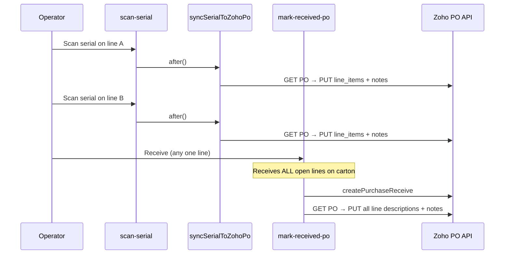

# Zoho sync issues — duplicate description / notes inserts

Investigation into multiple text inserts appearing in Zoho PO **line descriptions** and **header notes** when a purchase order has multiple line items.

**Status:** Documented — not yet fixed  
**Last updated:** 2026-06-14

---

## Symptom

Operators see **multiple stacked text entries** in Zoho for a single PO, especially when:

- The PO has **multiple line items**
- Serials are scanned per line, then **Receive** is clicked
- Receive is clicked more than once, or mobile receives lines one-by-one

Unclear which code path wrote each insert.

---

## Where Zoho gets patched

Three independent code paths call `updatePurchaseOrder` with line-item descriptions and/or PO notes:

| Path | Trigger | Files |
|------|---------|-------|
| **Serial scan** | `POST /api/receiving/scan-serial` → `syncSerialToZohoPo` | `src/app/api/receiving/scan-serial/route.ts`, `src/lib/receiving/zoho-serial-sync.ts` |
| **Carton receive** | `POST /api/receiving/mark-received-po` (background `after()`) | `src/app/api/receiving/mark-received-po/route.ts` |
| **Single-line receive (mobile)** | `POST /api/receiving/mark-received` | `src/app/api/receiving/mark-received/route.ts` |

Shared merge helper:

- `buildPurchaseOrderLineItemsForDescriptionPut` — `src/lib/zoho.ts` (duplicate in `src/lib/zoho/index.ts`)
- `mergeSerialNoteIntoLineDescription` — appends ` \| SN: …` only when serial tokens are not already present

---

## Flow diagram



---

## Root causes

### 1. Scan + Receive both write (most common)

**Scan path** (`syncSerialToZohoPo`):

- Merges serial into the matching `zoho_line_item_id` **description**
- Prepends a PO **notes** line: `{Staff} {timestamp} · SN: {serial}`

**Receive path** (`mark-received-po` background):

- Builds `serialNotesByPo` from all `serial_units` on updated lines → one description merge per Zoho line item
- Prepends a PO **notes** line with **all** carton serials: `{Staff} {timestamp} · SNs: A, B, C`

Typical multi-item flow:

1. Scan serial on line A → description + notes
2. Scan serial on line B → description + notes
3. Click Receive → description merge again + **another** notes line with all SNs

Line descriptions are mostly idempotent; **PO notes stack visibly**.

### 2. PO notes dedupe is timestamp-sensitive

`mark-received-po` only skips a notes append when the **exact** new line already exists:

```ts
const newLine = noteTail ? `${noteHead} · ${noteTail}` : noteHead;
if (!currentNotes.includes(newLine)) {
  patch.notes = currentNotes ? `${newLine}\n${currentNotes}` : newLine;
}
```

`noteHead` includes `${staffName} ${now}` — a **new timestamp on every Receive**. A second Receive always produces a new notes line even when serials are unchanged.

`syncSerialToZohoPo` uses a weaker dedupe (`staffName` + `· SN: {serial}` in an existing line) but still adds **one notes line per scan**.

### 3. One Receive affects the whole carton

`useReceiveAction` sends `receiving_line_id` for the **selected** line, but `mark-received-po` loops **all open lines** on `receiving_id`:

```ts
for (const lineRow of openForReceive) {
  await receiveLineUnits({ receiving_line_id: lineRow.id, ... });
}
```

Zoho receive + description/notes run for every linked line on the carton, not only the line the operator had open.

### 4. Concurrent GET → PUT races (multi-line same PO)

Each scan does its own `GET` → merge → `PUT` of the **full** `line_items` array. Parallel scans on different lines of the same PO can:

- Build patches from stale PO snapshots
- Lose another line’s prior merge on PUT
- Re-apply merges and produce duplicate-looking description segments under race

### 5. Mobile path: one POST per line

`ReceivingQaActionSheet` calls `POST /api/receiving/mark-received` **once per line**. Each call can PATCH description + notes for the same Zoho PO when multiple lines share one PO.

### 6. Minor: serial note format inconsistency

- `syncSerialToZohoPo` passes raw serial into `lineItemIdToSerialNote` (e.g. `ABC123`)
- `mark-received-po` passes `SN: ABC123` or `SNs: A, B`

`mergeSerialNoteIntoLineDescription` strips `SN:` / `SNs:` before token checks, so this is usually harmless but adds noise when debugging.

---

## Related (local only, not duplicate Zoho writes)

- `zoho-receiving-sync` copies Zoho line `description` → `receiving_lines.notes` on import (`src/lib/zoho-receiving-sync.ts`)
- `useZohoLinePrefill` reads local `row.notes` for serial prefill (`src/components/receiving/workspace/line-edit/hooks/useZohoLinePrefill.ts`)

These do not POST back to Zoho.

---

## How to trace in logs

| Log fragment | Source |
|--------------|--------|
| `[zoho-serial-sync] updatePurchaseOrder` | Scan → `syncSerialToZohoPo` |
| `mark-received-po: createPurchaseOrderReceive ok` | Receive background |
| `mark-received-po: updatePurchaseOrder failed` | Receive description/notes PUT |
| `mark-received: updatePurchaseOrder` | Mobile / single-line receive |

---

## Recommended fix directions

Pick **one source of truth** for when Zoho is updated. Do not patch from both scan and receive without coordination.

### Option A — Receive-only Zoho writes (recommended for consistency)

- Remove or gate `syncSerialToZohoPo` in `scan-serial` `after()` block
- Keep all description + notes updates in `mark-received-po` (and `mark-received` for mobile if still needed)
- **Pros:** One batch per carton; serials already in `serial_units` before receive
- **Cons:** Zoho lags until Receive; operators who scan but never receive see no Zoho update

### Option B — Scan-only Zoho writes

- Stop description/notes PUT in `mark-received-po` `after()`; only run `createPurchaseReceive` there
- **Pros:** Real-time Zoho visibility per serial
- **Cons:** Receive no longer backfills; must ensure every serial path calls sync

### Option C — Keep both paths, harden idempotency

If both paths must remain:

1. **Notes dedupe:** Match on serial set / `zoho_line_item_id`, ignore timestamp in `noteHead`
2. **Description dedupe:** Already token-based; add per-PO mutex or queue for `updatePurchaseOrder` to prevent GET/PUT races
3. **Align format:** Always use `SN: {serial}` in `syncSerialToZohoPo` (match `mark-received-po`)
4. **Receive scope:** Consider receiving only `receiving_line_id` hint when operator clicks Receive on one line (product decision)

### Option D — Per-PO write queue

- Serialize all Zoho PO PATCHes (scan + receive) through a single worker keyed by `zoho_purchaseorder_id`
- **Pros:** Fixes races without changing UX
- **Cons:** More infrastructure; still need notes dedupe for scan + receive overlap

---

## Suggested implementation order

1. **Confirm with ops** — Should Zoho update on scan, on receive, or both?
2. **Quick win** — Fix notes dedupe in `mark-received-po` (and `mark-received`) to key off serials, not full timestamped line
3. **Structural** — Disable duplicate writer (Option A or B)
4. **Hardening** — Per-PO mutex or queue if concurrent scans stay
5. **Tests** — E2E or integration: multi-line PO, scan A + scan B + receive → assert single notes append per serial set and idempotent description

---

## Key file reference

| Concern | Path |
|---------|------|
| Scan → Zoho | `src/lib/receiving/zoho-serial-sync.ts` |
| Receive → Zoho (batch) | `src/app/api/receiving/mark-received-po/route.ts` (~679–898) |
| Mobile receive → Zoho | `src/app/api/receiving/mark-received/route.ts` (~680–724) |
| Description merge | `src/lib/zoho.ts` → `mergeSerialNoteIntoLineDescription`, `buildPurchaseOrderLineItemsForDescriptionPut` |
| Receive UI entry | `src/components/receiving/workspace/line-edit/hooks/useReceiveAction.tsx` |
| Scan API entry | `src/app/api/receiving/scan-serial/route.ts` |

---

## Open questions

- [ ] Should Receive on one line receive **all** carton lines in Zoho, or only the selected line?
- [ ] Is mobile `mark-received` still in active use for multi-item POs?
- [ ] Do we need Zoho notes **and** line descriptions, or can one surface be dropped?
- [ ] Should closed/received POs skip description PUT entirely (already guarded by `assertPurchaseOrderLineItemsEditable`)?
